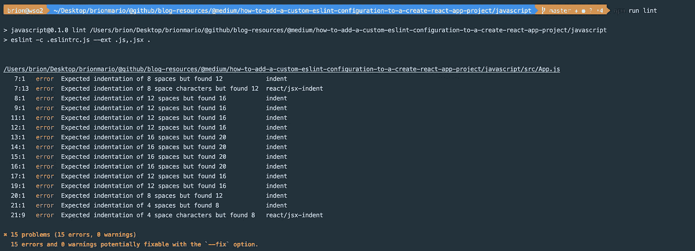
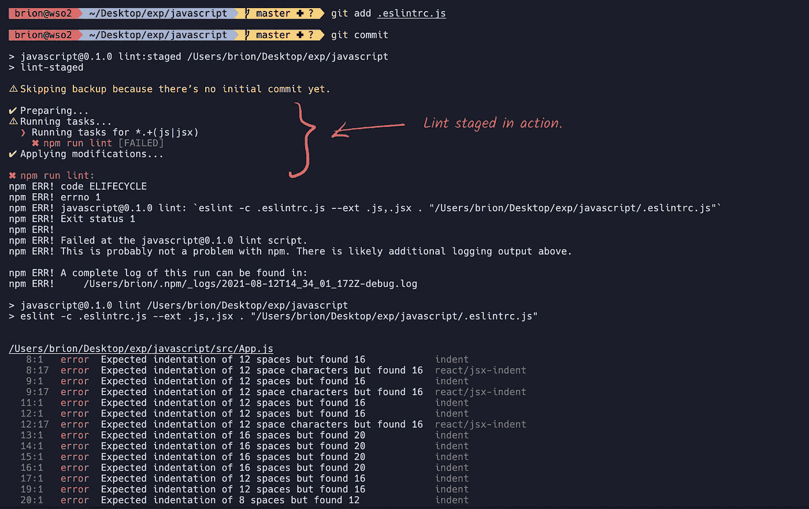

# 如何向 Create React 应用程序项目添加自定义 ESLint 配置

> 原文：<https://levelup.gitconnected.com/how-to-add-a-custom-eslint-configuration-to-a-create-react-app-project-aea3f7c1d7af>


# 背景

每个前端项目都应该有某种静态代码分析工具。这将确保您的团队坚持一种编码风格，并在开发中避免已知的反模式。

可以说，JavaScript 项目最好的 lint 工具之一是 [ESLint](https://eslint.org/) 。它支持各种插件来扩展功能，并有丰富的易于使用的文档。ESLint 也可以被配置为使用 TypeScript 项目，因此以前占主导地位的 [TSLint](https://palantir.github.io/tslint/) 被弃用，取而代之的是 ESLint。

在这篇文章中，我们将看看 ESLint 在基于 JavaScript 和 TypeScript 的 React 项目上的集成，这些项目是用 [Create React App](https://create-react-app.dev/) (CRA)样板创建的。

**我需要定制 ESLint 配置吗？**

大概不会。因为 Create React App 自带 ESLint 已经集成。他们使用自己的[可共享 ESLint 配置](https://github.com/facebook/create-react-app/tree/v4.0.3/packages/eslint-config-react-app)，这可以在`package.json`中的 **eslintConfig** 对象下找到。

package.json

如果您喜欢使用样板文件中提供的配置，现在可以跳过阅读🙃。

> 要检查 **react-app** ESLint 配置中使用的规则和插件，请点击[此处](https://github.com/facebook/create-react-app/blob/v4.0.3/packages/eslint-config-react-app/index.js)。

**为什么要使用定制配置？**

请注意，大多数 ESLint 规则是为特定的个人或团队量身定制的。例如，使用*单引号*而不是*双引号*将取决于偏好。

如果你在做一个长期项目，最好根据你/团队的偏好来定义你自己的规则。

# 先决条件

1.  [NodeJS](https://nodejs.org/en/)T29[NPM](https://www.npmjs.com/)。
2.  用 [Create React App](https://create-react-app.dev/) 样板文件创建的应用。
3.  在 IDE/编辑器中配置的 ESLint 插件。( [VSCode 插件](https://marketplace.visualstudio.com/items?itemName=dbaeumer.vscode-eslint) | [WebStorm 插件](https://www.jetbrains.com/help/webstorm/eslint.html))

# 我们开始吧

## 移除现有配置

转到项目根目录下的`package.json`，移除 **eslintConfig** 对象**。**

## 添加 ESLint 配置

在根目录内，让我们创建一个`.eslintrc.js` 文件。还有其他格式，但我个人更喜欢 JS 格式。

```
# from the root directory
touch .eslintrc.js
```

先说下面的基本配置。

基本 ESLint 配置

这将基本上定义环境和解析器选项。

现在，我们将通过添加一些有用的可共享配置和插件来改进配置。

**添加可共享的配置(预设)**

✅·伊斯林:推荐

启用 [ESLint 规则手册](https://eslint.org/docs/rules/)中的一些关键规则。

✅插件:反应/推荐

启用 [eslint-plugin-react](https://www.npmjs.com/package/eslint-plugin-react) 中[推荐的](https://www.npmjs.com/package/eslint-plugin-react#recommended) React 规则集。

✅插件:jsx-a11y/推荐

启用 [eslint-plugin-jsx-a11y](https://www.npmjs.com/package/eslint-plugin-jsx-a11y) 中推荐的可访问性规则。

✅插件:react-hooks/推荐

启用在[eslint-plugin-React-Hooks](https://www.npmjs.com/package/eslint-plugin-react-hooks)中设置的 React Hooks 最佳实践规则。

✅插件:jest/推荐

启用 [eslint-plugin-jest](https://www.npmjs.com/package/eslint-plugin-jest) 中的推荐规则

✅插件:测试-库/反应

启用[eslint-plugin-testing-library](https://www.npmjs.com/package/eslint-plugin-testing-library)中的推荐设置

ESLint 预设

**添加插件**

✅电子商务-插件-导入

此插件旨在支持 ES2015+ (ES6+)导入/导出语法的林挺，并防止文件路径和导入名称拼写错误的问题。

ESLint 插件

**添加规则**

您可以根据自己的喜好覆盖预设中定义的规则。我喜欢使用 **4** 空格缩进、**双引号、**等等。我现在可以在**规则对象**中指定，如下所示。

缩进和报价规则

此外，我将定义导入的排序顺序。这条规则由我们在上一步中添加的`eslint-plugin-import`插件提供。

导入规则

> 也可以使用**插件:导入/推荐** 作为预置但是我喜欢自己定义排序方式。查看[文档](https://www.npmjs.com/package/eslint-plugin-import)了解更多信息。

**可选的**:如果您在项目中使用 [lodash](https://lodash.com/) 并且您的构建系统支持树抖动，那么您可以使用下面的规则来限制 CommonJS 导入和非树抖动模块的使用。

限制进口

以下是最终配置🎉。我根据自己的喜好启用了更多的规则，并且可以根据您的需求随意修改它们。

最终 JavaScript ESLint 配置

## TypeScript 项目的配置

如果您使用 CRA 类型脚本模板创建了类型脚本项目，请使用配置中的[覆盖](https://eslint.org/docs/user-guide/configuring/configuration-files#how-do-overrides-work)对象将规则应用于类型脚本文件。

类型脚本配置

> 如果基本 ESLint 规则不支持 TypeScript，或者您只想将某个规则添加到 TypeScript 文件中，则只需将规则添加到此部分。大多数规则对 TypeScript 和 JavaScript 都适用。

## 添加 ESLint 忽略文件

创建一个`.eslintignore`文件来忽略来自林挺的某些文件/文件夹。您可以忽略 node_modules、分发文件夹、缓存文件夹等。

```
# from the root directory
touch .eslintignore
```

ESLint 忽略文件

## 添加帮助程序 npm 脚本

当你运行应用程序时，CRA 通常会在终端显示 Lint 警告/错误。

此外，如果您在编辑器或 IDE 中正确配置了 ESLint 插件，错误/警告将会以内联方式显示。

但是最好还是创建 npm 脚本，这样您也可以在 CI 系统中使用它们。

对于 JavaScript 项目，使用下面的 npm 脚本。

JavaScript 项目的 npm 脚本。

对于 TypeScript 项目，请使用以下 npm 脚本。

TypeScript 项目的 npm 脚本。

**运行脚本**

以下命令将运行项目的 linter，并报告是否有任何问题。

```
npm run lint
```



终端上的 ESLint 错误

下面的脚本将[自动修复](https://eslint.org/docs/user-guide/command-line-interface#fixing-problems)可能出现的错误。

```
npm run lint:fix
```

现在您已经有了一个带有 ESLint 配置的工作应用程序。如果需要，请查看以下可选步骤来进一步配置您的设置。

# 可选步骤

作为一个额外的步骤，我喜欢确保任何违反我们的 ESLint 配置的代码不会被推到代码库。所以基本上，我需要在 Git 提交之前强制运行 ESLint。

我们可以使用 [husky](https://www.npmjs.com/package/husky) 和 [lint-staged](https://www.npmjs.com/package/lint-staged) 轻松完成要求。

**什么是哈士奇？**

Husky 可用于在执行某些 Git 挂钩之前运行脚本。阅读[文档](https://typicode.github.io/husky/#/)。

**什么是 Lint Staged？**

对暂存的 git 文件运行 linters。

## 安装

1.  安装 Husky

```
npx husky-init && npm install
```

2.安装 lint-staged。

```
npm install --save-dev lint-staged
```

3.创建 lint 暂存的配置文件。

```
touch lint-staged.config.js
```

> 有许多方法可以添加配置文件。我更喜欢 JS 配置。查看[文档](https://github.com/okonet/lint-staged#configuration)以了解替代方案。

4.添加 lint 暂存配置。

Lint 分级配置

对于 TypeScript 项目，添加`ts`和`tsx` 以及 blob 模式**。**

```
“*.+(js|jsx|ts|tsx)”
```

5.添加 npm 脚本以运行 lint staged。

在`package.json`的**脚本**部分添加以下脚本。

```
"lint:staged": "lint-staged",
```

> 否则，husky 会抱怨 lint 暂存命令丢失。我猜您可以使用 npx 来运行 lint staged，但在我看来这种方法更简洁😉。

6.添加一个提交前挂钩。

```
npx husky add .husky/pre-commit "npm run lint:staged"
```

## 测试流量

我在`App.js`中故意犯了 lint 违例，并试图提交一个文件。

我得到了预期的错误，不允许我提交到存储库。



哈士奇和林特上演行动

# 结论

希望这篇博文对你有用。请随意尝试，如果你对博客有任何建议，你可以在[这个报告](https://github.com/brionmario/blog-resources/issues)中记录问题。

## 链接

*   [JavaScript 配置](https://github.com/brionmario/blog-resources/blob/master/technical/how-to-add-a-custom-eslint-configuration-to-a-create-react-app-project/code/javascript/.eslintrc.js)
*   [打字稿配置](https://github.com/brionmario/blog-resources/blob/master/technical/how-to-add-a-custom-eslint-configuration-to-a-create-react-app-project/code/typescript/.eslintrc.js)
*   [JavaScript 演示 App 源代码](https://github.com/brionmario/blog-resources/tree/master/technical/how-to-add-a-custom-eslint-configuration-to-a-create-react-app-project/code/javascript)
*   [打字稿演示 App 源代码](https://github.com/brionmario/blog-resources/tree/master/technical/how-to-add-a-custom-eslint-configuration-to-a-create-react-app-project/code/typescript)

结束……✌️❤️