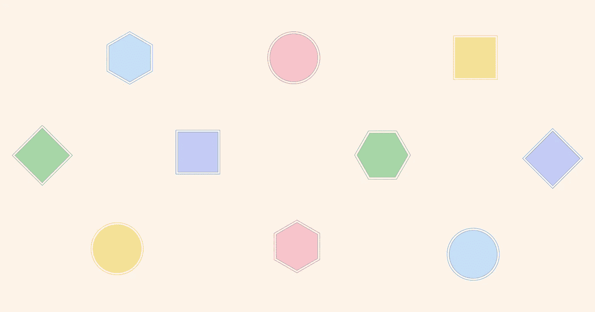

# 如何给 SVG 形状添加双边框

> 原文：<https://levelup.gitconnected.com/how-to-add-a-double-border-to-svg-shapes-d525c522cfde>

假设有人要求您为一些随机的几何 SVG 形状添加一个双**边框。出于某种原因，您不能使用任何图形编辑器——它们需要在运行时生成——所以您必须使用 CSS 或 SVG 语法来解决它。**

你的第一个问题可能是:SVG 中有类似于`stroke-style: double`的东西吗？嗯，答案是[还没有](https://dev.w3.org/SVG/modules/vectoreffects/master/SVGVectorEffectsPrimer.html#VectorEffects)而且[没那么容易](http://tavmjong.free.fr/blog/?p=1257)。但无论如何我会尝试看看我能发现什么方法。我将探索三种不同基本形状的可能性:圆形、矩形和多边形。指着两条线中间能保持透明颜色的。

> **剧透警告:**所有的结果都有缺点，至少对于 CSS 和 SVG 是这样，但是让我来告诉你我的意图。

# 简单的解决方案

这些方法并不适用于所有形状，但它们是最简单的解决方案。

## `outline`和`box-shadow`

CSS 属性`outline`和`box-shadow`只适用于形状或 SVG 的边界框，所以两者都是很好的解决方案**只适用于正方形和矩形**。它们还允许使用自定义属性的灵活颜色。

只用了两行带`outline`的 CSS，加上通过形状保持背景色可见。

*   🙁仅一种形状的解决方案。
*   ✅简单代码
*   ✅的边界是平滑的
*   ✅透明背景

`box-shadow`只需要一行 CSS，但是我们必须**确保每个形状都有自己的 SVG** ，因为我们不能直接将`box-shadow`应用到形状上。另一件要考虑的事情是，我们必须在声明中应用背景的颜色。

*   🙁仅一种形状的解决方案
*   ✅简单代码
*   ✅的边界是平滑的
*   🙁没有透明背景

## SVG 渐变

SVG 径向渐变仅适用于圆形☺️.我们可以直接在笔画上应用渐变，但是最好使用变量，因为我们必须在代码中多次声明颜色。

*   🙁仅一种形状的解决方案
*   ✅简单代码
*   🙁边框是平滑的
*   🙁没有透明背景

# 所有形状的解决方案

这些将适用于所有形状，但代码可能会变得臃肿或复杂。

## `filter:`

最后，所有形状的一个解决方案！我们必须让每个形状都有自己的`<svg>`，因为`filter`不会直接应用到形状上。我们在 CSS 中使用了一个声明，并且使用了可变的颜色。坏处呢？边界看起来不太平滑。

*   ✅为所有形状提供一个解决方案
*   ✅简单代码
*   🙁边框看起来像素化
*   🙁没有透明背景

## SVG 过滤器

这是一个非常灵活的解决方案。我们可以创建一个过滤器，并通过 SVG 的`filter`属性将其添加到形状中。这里复杂的部分是过滤器本身。我们需要三幅画，一幅画外边框，一幅画背景色，最后一幅画正面的形状。结果看起来比使用`drop-shadow`要好，但是边界仍然是像素化的。

*   ✅为所有形状提供一个解决方案
*   🙁复杂代码
*   🙁边框看起来像素化
*   🙁没有透明背景

## 重用形状

这里有几个可能的选择。

**选项 1:转换**

这个解决方案需要转换。我们将一个图形放在另一个图形上，其中主图形有一种填充颜色和一种描边颜色，而另一个图形没有填充颜色，一种红色描边，并且被缩放和重新定位到中心。我们在`<defs>`上定义了我们的形状。诀窍是**将** `viewBox` **的一半平移到负空间**，这样，当我们缩放它们时，我们可以从图形的中心开始。

*   ✅为所有形状提供一个解决方案
*   🙁重复代码
*   ✅的边界是平滑的
*   ✅透明背景

**选项二:** `**<use>**`

我在 Doug Schepers 的 www-svg 邮件列表中找到了一个聪明的解决方案。同样，它需要定义形状一次，并使用<使用>引用两次。这次主造型笔画更大。第二个形状的描边是主形状的一半，没有填充，描边与背景色匹配。

*   ✅为所有形状提供一个解决方案
*   🙁重复代码
*   ✅的边界是平滑的
*   🙁没有透明背景

# 以下是完整的结果！

这样你就可以把它们都放在一个地方。如果你能想到其他可能的解决方案，请告诉我！

> 这篇文章最初发表在 [CSS-Tricks](https://css-tricks.com/how-to-add-a-double-border-to-svg-shapes/) 上。感谢[克里斯·科伊尔](https://chriscoyier.net/)和[杰夫·格拉汉姆](https://geoffgraham.me/) ♥的编辑