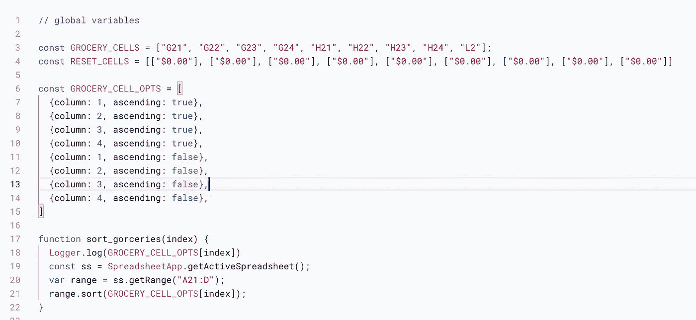
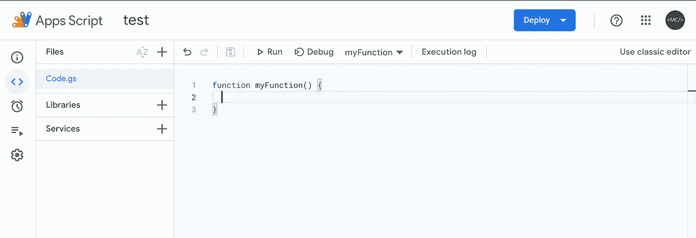
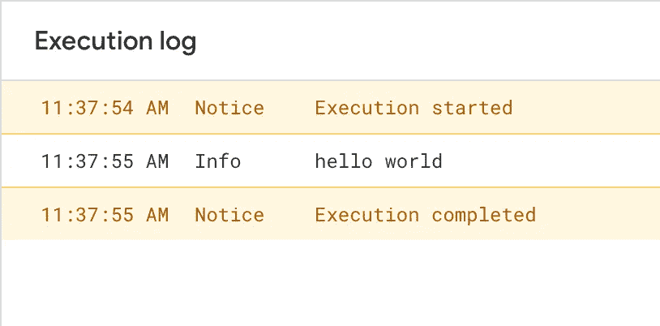
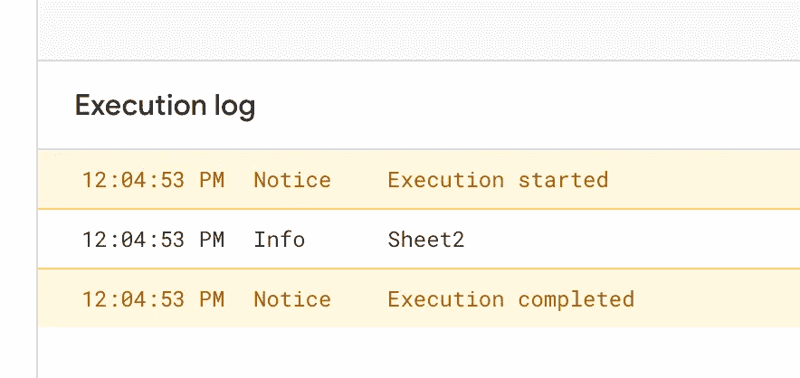
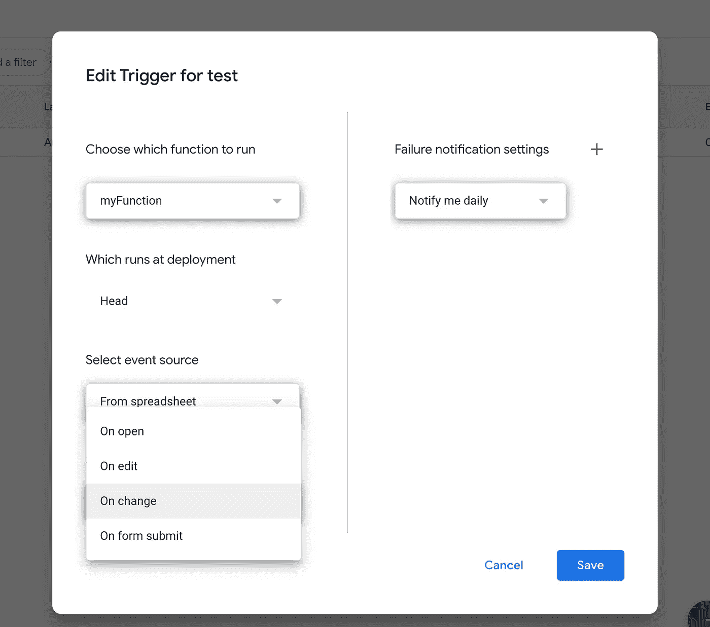
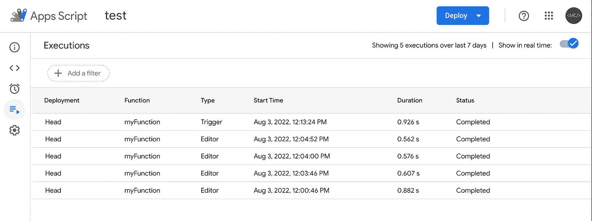
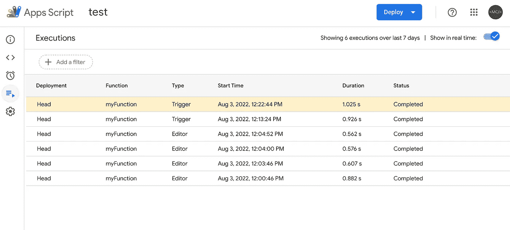
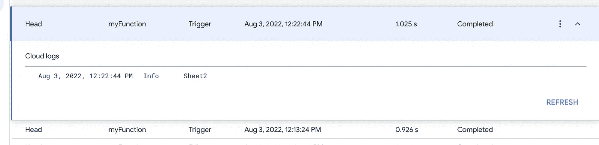
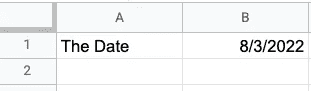
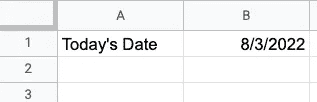

# 如何在 Google Sheets 中使用 JavaScript

> 原文：<https://levelup.gitconnected.com/how-to-add-a-google-apps-script-to-your-google-sheet-a1262ed86d5>

## 使用 Google Apps 脚本获得高级功能


照片由 [Rajeshwar Bachu](https://unsplash.com/@rajeshwerbatchu7?utm_source=unsplash&utm_medium=referral&utm_content=creditCopyText) 在 [Unsplash](https://unsplash.com/s/photos/google?utm_source=unsplash&utm_medium=referral&utm_content=creditCopyText)

这是对我正在做的另一个帖子的补充，我需要在我正在制作的费用谷歌表单模板中添加自定义功能。我想添加一些功能，需要我加入一个谷歌应用套件脚本表。在这篇文章中，我将快速介绍什么是应用程序脚本，以及如何在 Google Sheets 中使用它！

# 什么是 Google Apps 脚本？

一个 [Google Apps 脚本](https://developers.google.com/apps-script)是一个基于云的 *JavaScript* 平台，可以让你与另一个 Google 产品集成并自动完成任务。这对我特别有用，因为我有丰富的 JavaScript 经验，所以入门很容易。



我的费用模板中的一些 JavaScript 代码；即将推出

可以写变量，函数等。并让他们与您的 Google 产品交互——在本例中是 Google Sheet。我们如何将这些脚本中的一个添加到工作表中呢？

# 添加应用程序脚本

首先，转到你正在做的谷歌工作表。在顶部，点击*扩展*。这应该会显示一个带有几个选项的菜单。点击选项*应用程序脚本*。这将在另一个窗口中打开一个空的应用程序脚本页面。该页面包括一个编辑器，您可以在其中编写代码、查看文件、查看日志等。



新的 Google 企业应用套件脚本

让我们看看能否让`myFunction`记录一条消息。这就是我们利用 Apps 脚本 API 提供的`Logger`类的地方。在`myFunction`的体内，我们可以加上`Logger.log('hello world')`。现在我们已经添加了这个，让我们测试它！

要测试它，只需从`Debug`右侧的下拉菜单中选择`myFunction`。选中后，您可以点击`Run`。要查看它是否正确运行，您可以通过点击`Execution Log`来检查记录的结果。

> 现在，您可能会遇到这样的情况，您需要给应用程序脚本权限来访问您的电子表格。只需按照出现的步骤进行操作。一旦你这样做了，你应该能够相应地运行你的脚本。

我们来看看下面的结果。



完美！现在，让我们让`myFunction`做一些不仅仅是记录`hello world`的事情。让它与我们的工作表进行交互！要访问我们的工作表，我们可以使用`[SpreadsheetApp](https://developers.google.com/apps-script/reference/spreadsheet/spreadsheet-app)`类。

# SpreadsheetApp

在`myFunction`中，我们可以通过使用`SpreadsheetApp.getActiveSpreadsheet()`来访问当前的电子表格。这将使我们能够检索脚本所连接的活动 Google Sheets 项目。一旦我们检索到它，我们就获取并操作电子表格的值和格式。

现在，如果您的 Google Sheets 项目有多个工作表，您可以通过使用`[getActiveSheet](https://developers.google.com/apps-script/reference/spreadsheet/spreadsheet-app#getactivesheet)()`进一步指定您想要使用哪个工作表。

## getActiveSheet

使用这种方法，我们可以更具体地进入我们的电子表格。`getActiveSheet`将返回我们项目中当前打开的工作表。如果您想要检索打开的工作表的名称，您可以使用`getName()`来访问它。让我们将这些步骤添加到`myFunction`中，并测试它是否有效！

```
function myFunction() {
  var ss = SpreadsheetApp.getActiveSpreadsheet()
  var name = ss.getActiveSheet().getName()
  Logger.log(name)
}
```

现在，在您的电子表格中，创建第二个*工作表(如果您还没有创建的话)。然后选择你的第一张表，然后回到你的应用程序脚本点击运行。下面是您的执行日志应该是什么样子的(取决于您对第一个工作表的命名)。*


现在，返回到您的电子表格，选择您的第二个*工作表，然后返回到您的应用程序脚本并再次单击 run。它应该看起来像下面这样。*



完美！`myFunction`现在可以区分电子表格中的两个工作表。如果我们想在打开项目时自动记录当前工作表的名称，该怎么办？我们可以通过使用`onOpen`触发器来实现这一点。

## 奥诺彭

一个[触发器](https://developers.google.com/apps-script/guides/triggers)可以让你的应用程序脚本在某个事件发生时自动运行一个功能，比如打开一个电子表格。当文档打开时，触发`onOpen`事件。要添加这个触发器，请查看编辑器的左侧栏。点击时钟图标。

这是您可以添加触发器的地方。

然后点击右下角的*添加触发器*可以添加一个**新的**触发器。在这里您可以选择您的函数以及事件源(现在不要担心在部署时运行的*)。保持*故障通知*每日通知我。见下文。*



对于我们的例子，我们将在打开时选择

**添加和/或编辑触发器后，您可以在触发器列表中看到它。**

****

**太好了。现在我们可以测试一下，看看它是否有效。在返回电子表格之前，请先单击触发器图标下面的图标。你应该会看到你的*执行*列表。**

****

**我喜欢让这个标签单独打开，这样我就可以看到执行情况，并实时测试我的代码。现在您已经打开了这个页面，请返回到您的电子表格并重新加载页面。过了一会儿，您应该会看到一个新的执行出现在您的列表中。**

****

**如果你展开它，你应该能看到`myFunction`的结果。**

****

**厉害！但是让我们更有创意一点。在第一张工作表中，在单元格 A1 中添加日期，在单元格 B1 中添加日期*=今天()。你的细胞应该是这样的…***

****

**我写这篇文章的时间是 2022 年 8 月 3 日**

## **读取单元格的内容**

**现在，在`myFunction`中，让我们尝试在我们的应用程序脚本中读取 A1 的值。我们可以用`getRange()`做这个 can，并为它提供一个`"A1"`参数。这样，我们可以捕获所提供范围内的所有单元格。因为我们只为该范围提供了一个单元格，所以它将只读取该单元格。**

> **如果你想要更大的范围，你可以做类似`x.getRange(“A1:B5”)`的事情。**

**一旦我们可以读取该单元格，我们就可以访问该单元格的各种属性。现在，让我们尝试访问单元格中的*，也称为单元格的*值*。结合使用`getValue`和`getRange`可以发现这一点。参见下面的代码。***

```
function myFunction() {
  var ss = SpreadsheetApp.getActiveSpreadsheet()
  var x = ss.getActiveSheet()
  var cell = x.getRange("A1").getValue()
  Logger.log(cell)
}
```

**如果您单击 run，我们的执行日志应该记录`The Date`。**

## **设置单元格的内容**

**我们现在可以读取给定单元格的内容。太好了！**

**但是我们怎样才能*改变*那个单元格的值，比方说从`The Date`到`Today’s Date`？我们可以通过使用`setValue`而不是`getValue`来实现。对于`setValue`，我们只需传递它`"Today's Date"`，它应该会处理其余的。见下文。**

```
function myFunction() {
  var ss = SpreadsheetApp.getActiveSpreadsheet()
  var x = ss.getActiveSheet()
  x.getRange("A1").setValue("Today's Date")
  var cell = x.getRange("A1").getValue()
  Logger.log(cell)
}
```

**在日志中，您应该看到`Today’s Date`正在被记录。不仅如此，在电子表格的第一个工作表中，您应该会看到单元格 A1 的新值为`Today's Date`。**

****

# **摘要**

**看完这篇文章，你应该知道如何…**

*   **创建一个应用程序脚本，并将其连接到 Google Sheets 项目。**
*   **编写一个函数在运行时记录数据。**
*   **设置一个`onOpen`脚本触发器，这样当你打开电子表格时该函数会自动执行。**
*   **通过`SpreadsheetApp`访问电子表格。**
*   **获取电子表格中打开的工作表的名称。**
*   **从工作表中访问提供范围。**
*   **从提供的单元格中获取值。**
*   **设置所提供单元格的值。**

**想要深入了解应用程序脚本吗？让我在评论中知道我接下来应该涵盖什么！**

**[***升级您的免费 Medium 会员资格***](https://matt-croak.medium.com/membership) *并接收来自各种出版物上数千名作家的无限量、无广告的故事。这是一个附属链接，你的会员资格的一部分帮助我为我创造的内容获得奖励。***

***您也可以通过电子邮件* [***订阅，每当我发布新内容时，您都会收到通知！***](https://matt-croak.medium.com/subscribe)**

# **参考**

**[](https://developers.google.com/apps-script) [## 应用脚本|谷歌开发者

### 轻松开发高质量、基于云的解决方案。

developers.google.com](https://developers.google.com/apps-script) [](https://developers.google.com/apps-script/reference/spreadsheet/spreadsheet-app) [## 类 SpreadsheetApp |应用程序脚本| Google 开发人员

### 发送反馈访问和创建谷歌工作表文件。这个类是电子表格服务的父类…

developers.google.com](https://developers.google.com/apps-script/reference/spreadsheet/spreadsheet-app) [](https://developers.google.com/apps-script/reference/spreadsheet/spreadsheet-app#getactivesheet) [## 类 SpreadsheetApp |应用程序脚本| Google 开发人员

### 发送反馈访问和创建谷歌工作表文件。这个类是电子表格服务的父类…

developers.google.com](https://developers.google.com/apps-script/reference/spreadsheet/spreadsheet-app#getactivesheet) [](https://developers.google.com/apps-script/guides/triggers) [## 简单触发器|应用程序脚本| Google 开发者

### 触发器让应用程序脚本在某个事件(如打开文档)发生时自动运行某个功能。简单…

developers.google.com](https://developers.google.com/apps-script/guides/triggers) 

# 分级编码

感谢您成为我们社区的一员！在你离开之前:

*   👏为故事鼓掌，跟着作者走👉
*   📰查看[升级编码出版物](https://levelup.gitconnected.com/?utm_source=pub&utm_medium=post)中的更多内容
*   🔔关注我们:[Twitter](https://twitter.com/gitconnected)|[LinkedIn](https://www.linkedin.com/company/gitconnected)|[时事通讯](https://newsletter.levelup.dev)

🚀👉 [**加入升级人才集体，找到一份神奇的工作**](https://jobs.levelup.dev/talent/welcome?referral=true)**