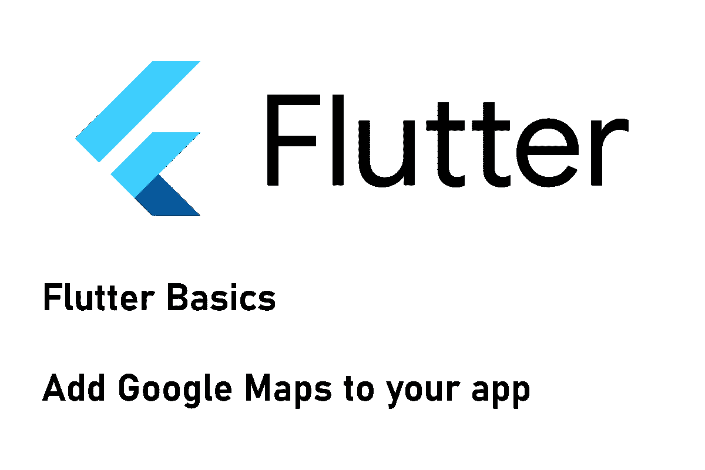
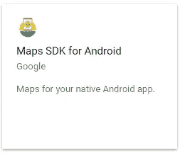
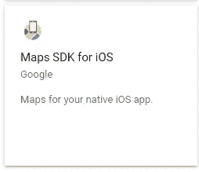
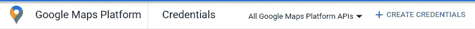
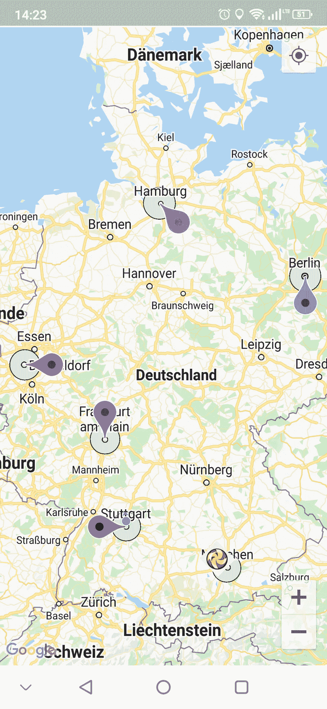

# 如何将谷歌地图添加到你的 Flutter 应用中

> 原文：<https://levelup.gitconnected.com/how-to-add-a-google-map-to-your-flutter-app-e75a1a99a0c2>

## 我在哪里？！

## 在本文中，我们将在应用程序中添加一个 Google Maps 小部件，并使用定位服务来显示我们的当前位置。



如果你的应用依赖于位置数据和地图，你可以很容易地集成谷歌地图。我将指导你完成设置过程，并向你展示如何定制你想要的地图。

## 安装软件包

运行命令`flutter pub add google_maps_flutter`安装软件包。这个包已经存在一段时间了，并且由于它经常更新，所以状态很好。如果您不熟悉安装包，请查看下面的文章了解详细信息。

[](https://xeladu.medium.com/how-to-install-packages-in-your-flutter-app-e7f7e62711ee) [## 如何在你的 Flutter 应用中安装包

### 这篇短文展示了如何将包添加到一个 Flutter 应用程序中，这样你就可以使用现有的代码并加速…

xeladu.medium.com](https://xeladu.medium.com/how-to-install-packages-in-your-flutter-app-e7f7e62711ee) 

## 获取 API 密钥

要使用这个小部件，您需要请求一个 API 密钥。

🔹前往[https://console.cloud.google.com/](https://console.cloud.google.com/)选择你的项目。如果您没有设置帐户或项目，请按照说明进行设置

🔹使用搜索栏并进入**谷歌地图平台**

🔹转到**API**子菜单

🔹选择**地图 SDK for Android** 并激活它



🔹选择**iOS 版地图 SDK**并激活它



🔹启用 SDK 后，转到**凭证**并使用顶部栏中的按钮创建新凭证



🎉恭喜🎉

你的 API 密匙已经可以在我们的 Flutter 应用中使用了！

❗在一个生产应用程序中，你应该了解你的 API 密匙的访问限制。对于这个演示，这是没有必要的。详情可以在这里找到[。](https://cloud.google.com/docs/authentication/api-keys#securing_an_api_key)

## 配置应用程序

根据您想要支持的平台，需要额外的配置步骤。

✅ ( **Android** )你的最低 Android SDK 版本必须设置为 20 或更高

💡在你的 Flutter 项目目录中，转到`android/app/build.gradle`并在`defaultConfig`部分中搜索`minSdkVersion`。将该值(或颤振变量)替换为 20。

✅ ( **Android** )您的 API 密钥必须添加到应用程序清单中

💡在你的 Flutter 项目目录中，转到`android/app/src/main/AndroidManifest.xml`并找到`<application...`节点。在节点中添加以下代码，并用您创建的 API 键替换该值。

```
<meta-data android:name="com.google.android.geo.API_KEY"
            android:value="YOUR_API_KEY"/>
```

✅ ( **iOS** )你的最低 iOS 版本必须是 9.0 或更高

💡这应该已经是事实了，因为 Flutter 本身就需要那个版本。否则，在步骤 **iOS 部署目标**检查[这篇文章](https://docs.flutter.dev/deployment/ios#review-xcode-project-settings)。

✅ ( **iOS** )您的 API 密钥必须添加到应用程序委托中

💡在您的 Flutter 项目目录中，转到 ios/Runner/AppDelegate.swift 并调整代码，如下所示

```
import UIKit
import Flutter
import GoogleMaps

@UIApplicationMain@objcclassAppDelegate:FlutterAppDelegate {
overridefuncapplication(
_ application:UIApplication,
    didFinishLaunchingWithOptions launchOptions: [UIApplication.LaunchOptionsKey:Any]?
  ) ->Bool {
    GMSServices.provideAPIKey("YOUR_API_KEY")
    GeneratedPluginRegistrant.register(with:self)
    return super.application(application, didFinishLaunchingWithOptions: launchOptions)
  }
}
```

现在，您的应用程序已正确配置。让我们继续集成一个 Google Maps 小部件。

❗较新版本的软件包可能需要不同的设置。确保检查[设置指南](https://pub.dev/packages/google_maps_flutter)并相应调整您的代码。

## 添加小部件

要添加地图，可以使用下面的代码。它将显示以欧洲柏林为中心的地图。如果需要更复杂的版本，请参考 GitHub 资源库中的代码示例。

有很多属性可以配置地图，如`rotateGesturesEnabled`、`zoomGesturesEnabled`、`trafficEnabled`或`liteModeEnabled`(仅适用于 Android)。完全按照您的方式定制！

## 处理事件

该小部件提供了您可以处理的各种事件

🔹`onTap`
🔹`onLongPress`
🔹`onCameraMove`
🔹`onMapCreated`

`onMapCreated`事件返回一个`GoogleMapController`，让你完全控制地图。一些公开的方法有

🔹`getLatLng` -返回屏幕位置的纬度/经度组合
🔹`takeSnapshot` -返回当前地图图像的字节数组
🔹`moveCamera` -跳到给定位置(参见“移动摄像机”一节)
🔹`animateCamera` -移动到给定位置(参见“移动摄像机”一节)
🔹`showMarkerInfoWindow` -显示给定标记的信息窗口(参见“添加标记”一节)

## 添加标记

以下示例将在柏林/欧洲显示旋转的蓝色标记大头针。

默认情况下，点击标记会使地图居中。如果定义了一个`InfoWindow`，它将被显示。只有当`consumeTapEvents`设置为真时，才会处理`onTap`事件。在这种情况下，`InfoWindow`被忽略。你也可以使用 GoogleMapController 来触发`InfoWindow`。

## 添加圆

以下示例将围绕柏林/欧洲的中心显示一个圆。

`radius`以米为单位。您可以使用`fillColor`、`strokeColor`和`strokeWidth`调整样式，并根据需要处理`onTap`事件。

## 设置自定标记图像

以下代码通过使用慕尼黑/欧洲的资产图像“icon.png”来设置自定义标记图像。

确保在您的`pubspec.yaml`文件中引用资产图像。

## 移动摄像机

`GoogleMapController`(参见“处理事件”一节)可用于移动摄像机，以便向用户显示特定位置。它将跳转(`moveCamera`)或滚动(`animateCamera`)到目标位置。一个例子是这样的:

```
// jumps to Berlin/Europe
await controller.moveCamera(
CameraUpdate.newLatLng(LatLng(52.52309894124325, 13.413122125924026)));
// scrolls to Berlin/Europe
await controller.animateCamera(
CameraUpdate.newLatLng(LatLng(52.52309894124325, 13.413122125924026)));
```

## 显示当前设备位置

google maps 小部件具有属性`myLocationEnabled`。如果设置为 true，您的当前位置将在地图上标记为蓝点。要实现这一点，你的应用需要请求使用定位服务的许可。如果启用了定位服务并授予了权限，将自动显示位置。我单独写了一篇关于这个话题的文章。

[](/how-to-use-location-services-in-your-flutter-application-582189b2cae7) [## 如何在你的 Flutter 应用中使用定位服务

### 在本文中，我们将了解定位服务，以及如何获取设备在我们的……

levelup.gitconnected.com](/how-to-use-location-services-in-your-flutter-application-582189b2cae7) 

❗:你不需要安装软件包，但你需要添加 Android 和 iOS 的功能。谷歌地图小部件有内置的位置支持，没有任何进一步的要求。

## 源代码

源代码可在 [GitHub](https://github.com/xeladu/flutter_google_maps) 上获得。请注意，您需要用自己的 API 键替换代码中的 API 键，以使演示代码能够在❗下工作

下面可以看到 app 的截图。



GitHub 上演示应用程序的地图小部件

## 结论

在本文中，我们讨论了向 Flutter 应用程序添加地图。虽然设置可能有点耗时，但这是值得的。谷歌地图小工具非常强大，可以让你以一种非常独特的方式丰富你的应用程序。

如果你喜欢这篇文章，我会很高兴得到掌声👏(你知道可以拍几次吗？😎)另外，如果你还没有跟上我，我也很感激。

🌲 [linktr.ee](https://linktr.ee/xeladu) | ☕ [咖啡](https://www.buymeacoffee.com/xeladu) |🎁[捐赠](https://www.paypal.com/donate/?hosted_button_id=JPWK39GGPAAFQ) |💻GitHub |🔔[订阅](https://xeladu.medium.com/subscribe)

顺便说一下:如果你还没有 Medium 会员，我推荐你使用[│我的推荐链接◀](https://medium.com/@xeladu/membership) ,因为它可以让你访问 Medium 上的所有内容，并以一小部分费用支持我，而不需要你支付任何额外费用。谢谢大家！✨

## 相关故事

[](/flutter-app-from-scratch-part-5-make-ui-great-again-a489b969d86c) [## Flutter app 从头开始第 5 部分—让 UI 再次变得伟大！

### 如何从头开始构建 Flutter 应用程序系列的第 5 部分。这篇文章介绍了如何设计你的应用程序，以及在哪里…

levelup.gitconnected.com](/flutter-app-from-scratch-part-5-make-ui-great-again-a489b969d86c) [](/how-to-make-http-requests-with-flutter-and-parse-json-result-data-ae1f5794f53) [## 如何用 Flutter 发出 HTTP 请求并解析 JSON 结果数据

### 这篇短文展示了如何从 Flutter 应用程序中执行 HTTP 请求。我们来看看最常见的…

levelup.gitconnected.com](/how-to-make-http-requests-with-flutter-and-parse-json-result-data-ae1f5794f53) [](https://xeladu.medium.com/flutter-unit-test-basics-a8c6815f7712) [## 颤振单元测试基础

### 我们涵盖了一个基本的例子，单元测试在一个颤振项目中会是什么样子。包括解释的代码示例。

xeladu.medium.com](https://xeladu.medium.com/flutter-unit-test-basics-a8c6815f7712)