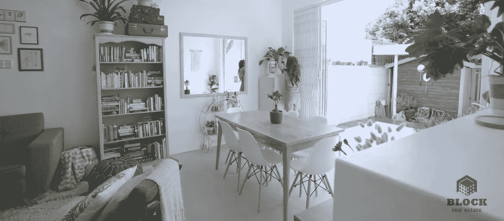

# 使用代码为您的视频添加水印

> 原文：<https://levelup.gitconnected.com/how-to-add-a-watermark-to-your-video-using-code-b138312d587c>

*对于任何人***不感兴趣学习如何建立一个应用程序，水印您的视频，只是想一个简单的方法来添加水印到视频；* [*这个实用工具*](https://shotstack.io/demo/watermarker/?utm_source=Medium&utm_medium=tutorial&utm_campaign=2020_11_tutorial_watermark) *就能做到这一点！**

*[水印](https://en.wikipedia.org/wiki/Watermark)第一次出现在 13 世纪的意大利，当时造纸商在纸还是湿的时候改变它的厚度。纸的水印部分让更多的光通过，导致一个标记，让读者能够识别纸的生产地。*

*今天，我们将水印用于各种各样的应用，现在大多数水印都不属于数字类型。它提供了一种清晰而相对不显眼的方式来展示原创作者。这一点在互联网时代尤为重要，在这个时代，未经许可复制和盗用媒体很容易。*

*本指南旨在展示一种快速简单的方法来开发一个应用程序，使用 [Shotstack API](https://shotstack.io/?utm_source=Medium&utm_medium=tutorial&utm_campaign=2020_11_tutorial_watermark) 为您的视频添加水印。这个 API 允许你用 JSON 描述一个视频编辑，然后使用你最喜欢的编程语言在云中同时渲染数千个视频。*

# *我们开始吧*

## *注册一个 API 密钥*

*你需要注册一个[免费的 Shotstack 开发者账户](https://dashboard.shotstack.io/register?utm_source=Medium&utm_medium=tutorial&utm_campaign=2020_11_tutorial_watermark)。注册后，只需登录接收您的 API 密钥。*

*免费版为你提供 API 的免费使用，但是会在你的视频中嵌入一个小水印。您可以通过添加您的付款信息并使用您的生产密钥来消除这种情况。*

## *节点. js*

*我们将使用 [Node.js](https://nodejs.org/en/) 来构建我们的应用程序。没有花哨的路线，只是基本的。*

# *设置场景*

*对于这个例子，我们将假装我们拍摄了一些开放房屋的精彩镜头，并热衷于将这些加水印，以便潜在的买家知道去哪里看。*

*我们将使用 Pexels 的三个视频剪辑，共同描绘出待售商品的美丽画面:*

*Pexels 的这三个视频将构成我们房地产视频的基础*

*作为我们的水印，我们将使用我们的房地产公司的标志；大宗房地产:*

**

# *代码*

*对于本指南，我不会深入探讨 API 到底是如何工作的，以及有哪些不同的效果和过渡可用，但如果你需要一本入门书，请快速浏览一下本指南。*

## *JSON*

*Shotstack API 通过向 API 端点发送一个 JSON 字符串来工作。JSON 提供了剪辑、过渡和效果的时间线，它们被转换成输出文件，如 MP4 或 GIF。*

*在下面的例子中，我们将水印(一个 PNG 文件)合成在三个视频的顶部。然后，缩放、不透明度、位置和偏移属性允许我们将水印准确地放置在我们想要放置的位置。*

## *节点应用程序*

*下面的 Node.js 脚本获取 JSON，并将其发送给 API。然后，它轮询 API 以检索渲染状态。大约 30 秒后，它会记录视频网址供您使用。*

# *初步结果*

*一旦我们运行节点应用程序，渲染完成，我们应该留下以下视频:*

*我们使用一个 JSON 文件在视频的右下角添加一个黑色水印*

*这看起来已经很不错了，但是第一个场景中的黑色水印不是很清晰。如果我们可以根据场景改变我们使用的水印，那将会很有帮助。*

# *最后润色*

*我们将添加一些最后的润色，如过渡，标题，一些曲调，并根据场景切换我们的水印图像颜色。*

# *决赛成绩*

*请看下面我们的最终结果——一个专业编辑的带有水印的房地产视频，展示您的创作！*

*具有不断变化的水印和高级过渡的最终视频*

# *结论*

*本指南中的代码提供了一种构建应用程序的简单方法，该应用程序将图像作为水印，并将其合成到视频之上。*

*我们已经建立了一个更全面的[开源水印应用](https://shotstack.io/demo/watermarker/?utm_source=Medium&utm_medium=tutorial&utm_campaign=2020_11_tutorial_watermark)，你可以用它来给你的视频加水印，Github 上有[完整的源代码](https://github.com/shotstack/watermark-demo?utm_source=Medium&utm_medium=tutorial&utm_campaign=2020_11_tutorial_watermark)。*

*希望这篇文章已经启发你开始使用代码来操作视频。这段代码可以很容易地进一步修改为使用视频水印而不是静态图像，[使用 HTML](https://www.youtube.com/watch?v=RUxpAnaUTh4) 使其更加个性化，还有许多其他大规模的操作，使用老式的视频编辑器是不可能的。*

*我们总是很想看看人们能想出什么，所以如果你已经设法创造了一些很酷的东西，请分享！*