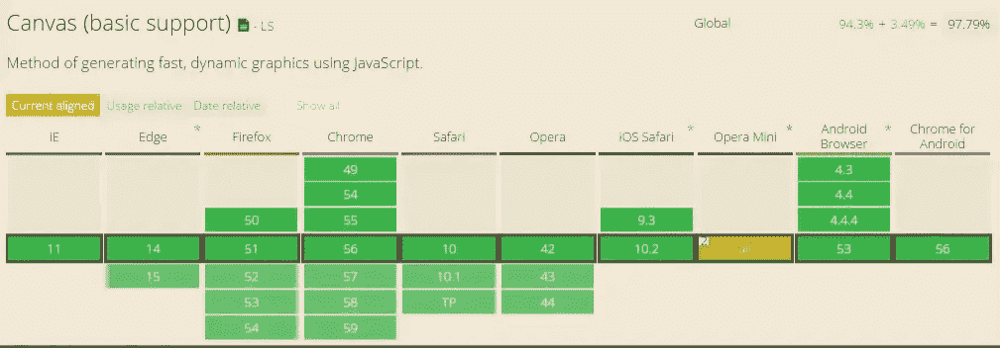
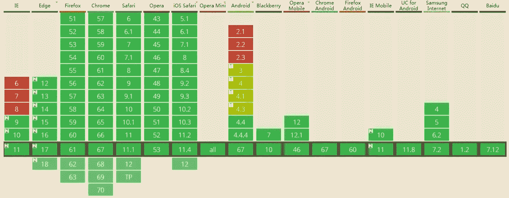

# 如何用 HTML 画布给你的网站添加水印

> 原文：<https://levelup.gitconnected.com/how-to-add-a-watermark-to-your-website-with-html-canvas-f2c39474308a>

## Web 水印生成解决方案

## 通过画布生成水印

画布兼容性

这里我们使用 canvas 生成 base64 图像，并通过 CanIUse 网站检查兼容性，如果在移动以及一些管理系统中使用，兼容性问题可以完全忽略。

`HTMLCanvasElement.toDataURL`方法返回包含图像显示的数据 URI。您可以为其类型使用 type 参数，默认为 PNG 格式。图像的分辨率为 96dpi。
如果画布的高度或宽度为 0，则返回字符串“data:”。如果传入类型不是“image/png”，但返回值以“data:image/png”开头，则不支持传入类型。

具体代码实现如下:

效果如下:

## 通过 SVG 生成水印

SVG:(可缩放矢量图形)是一种基于可扩展标记语言(XML)描述二维矢量图形的图形格式。SVG 由 W3C 开发，是一个开放标准。

SVG 浏览器兼容性

相比 Canvas，SVG 具有更好的浏览器兼容性，使用 SVG 生成水印的方式与 Canvas 类似，只是 base64Url 生成方式被 SVG 取代。如下所示:

效果如下:

## 摘要

安全问题不能马虎，对于一些敏感的网页，我们可以给浏览者添加水印，起到警告的作用，减少泄密，即使泄密，也有可能追踪到泄密者。

如果你对我的文章感兴趣，可以关注我的[媒体](https://hyhwell.medium.com/)或[推特](https://twitter.com/Maxwell_hyh)。

 [## 用于开发的 10 个高级打字技巧

### 高级打字技巧

用于开发高级打字稿 Tipslevelup.gitconnected.com](/10-advanced-typescript-tips-for-development-2666298d50f)  [## JavaScript 设计模式:单例模式

### Singleton 模式:将类实例化的次数限制为一次，一个类只有一个实例，并且…

levelup.gitconnected.com](/javascript-design-patterns-singleton-pattern-7ada98be9a10)  [## JavaScript 中常用的 8 种工具和方法

### 8 工作中经常用到的 Javascript 方法，记住这些方法，避免多此一举。

levelup.gitconnected.com](/8-tools-and-methods-often-used-in-javascript-6fcebaf339ce)  [## 12 行 JavaScript 让你看起来像个专家

### Javascript 可以做很多神奇的事情，而且有很多东西要学，今天我简单扼要的介绍几个…

levelup.gitconnected.com](/12-lines-of-javascript-to-make-you-look-like-a-pro-f11437df6965)  [## 8 个常用 JavaScript 库，成为真正的高手

### 掌握这些 JavaScript 工具库，让你的项目看起来很棒。

levelup.gitconnected.com](/8-commonly-used-javascript-libraries-become-a-real-master-6d8a4e98eb89)