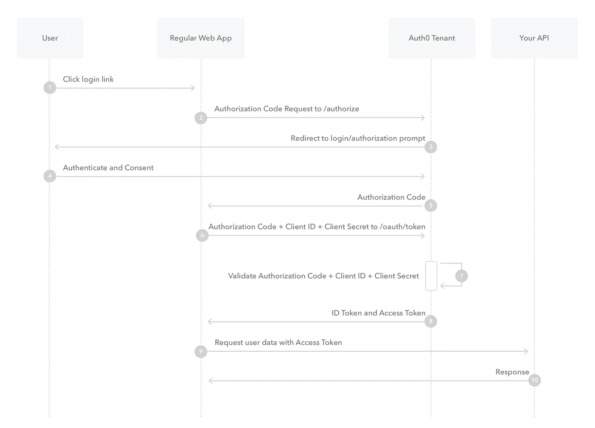
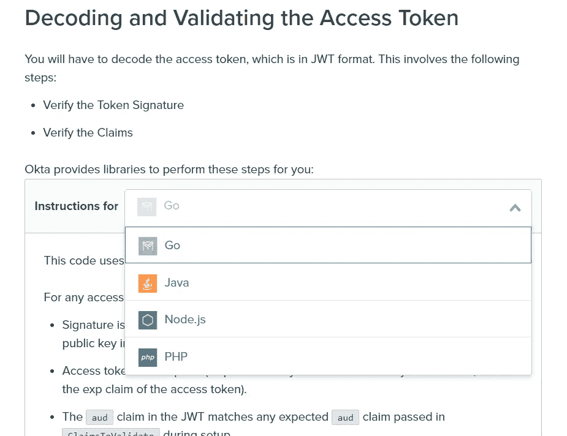

# 如何快速向您的应用添加身份验证和授权

> 原文：<https://levelup.gitconnected.com/how-to-add-authentication-authorization-to-your-app-quickly-48afa2afa534>

利亚姆·塔克在 [Unsplash](https://unsplash.com/s/photos/security?utm_source=unsplash&utm_medium=referral&utm_content=creditCopyText) 上拍摄的照片

认证和授权用户进入您的 web 应用程序并不一定是[死亡之星](https://starwars.fandom.com/wiki/Death_Star)的科学，但是很容易遗漏您的实现中的一个漏洞，并被“流氓”分子利用。使用一些更简单的过时的安全协议将毫不费力地被绕过(有点像一个孤独的冲锋队员)。

实现您自己的 [OAuth 2.0](https://oauth.net/2/) 流程也非常耗时，这就是为什么我不愿意为我正在开发的应用程序重新发明轮子。让我们来看看如何将第三方解决方案集成到我们的应用程序中。

# 1.等等，不要用 OAuth 2.0 术语:

如果你不熟悉 OAuth 2.0 框架，我强烈推荐你看看下面的视频。

# **2。了解集成第三方解决方案时的授权代码流(ACF):**

摘自公开发布的 [Auth0 文档](https://auth0.com/docs/flows/authorization-code-flow)

在本文的其余部分，我们将上面的图称为 **ACF** 图。

# **3。选择合适的第三方解决方案:**

我发现了两个令人难以置信的解决方案，可以帮助你将 OAuth 2.0 框架集成到你的应用程序中(并且还有一个自由层): [Okta](https://www.okta.com/) 和 [Auth0](https://auth0.com/) 。

与 ACF 图相比，我的应用程序使用 Angular SPA 作为“常规 Web 应用程序”，并在后端使用 Python Flask 服务器来提供“API”。

根据您的架构和框架，确保您的第三方解决方案提供库/SDK 来简化集成。

在将 Okta 与我的 Angular 应用程序集成之后，我意识到他们没有任何库来解码和验证 Python 3 中的访问令牌(在 ACF 图中的步骤 9 & 10 之间)。

摘自公开发布的 [Okta 指南](https://developer.okta.com/docs/guides/validate-access-tokens/go/overview/#what-to-check-when-validating-an-access-token)

就是在那个时候，我决定改用 Auth0。

# **4。使用 Auth0 保护 Python Flask API:**

就像我之前说的，我不想重新发明轮子。用 Auth0 保护 Flask API 在下面的文章“用 Auth0 保护 Flask 应用程序”一节中有很好的记录。

注意:我使用了‘python-Jose’库，而不是文中提到的‘python-Jose-crypto dome’。

 [## 使用 Python、Flask 和 Angular 构建现代 Web 应用程序—第 2 部分

### 在本系列的这一部分中，首先将 Auth0 配置为应用程序的身份管理系统。你会…

medium.com](https://medium.com/@auth0/using-python-flask-and-angular-to-build-modern-web-apps-part-2-3baf4330606a) 

python API 端点现在是安全的，并且只有在提供了正确的访问令牌时才会给出有效的输出。

# **5。使用 Auth0 保护 Angular SPA:**

上一节中的链接提供了一个使用 [auth0-web](https://auth0.com/docs/libraries/auth0js?_ga=2.133333515.46076697.1611484358-1083246999.1606830885) 的 Angular 实现，它比 [auth-spa-js](https://auth0.com/docs/libraries/auth0-single-page-app-sdk?_ga=2.199862187.46076697.1611484358-1083246999.1606830885) SDK 稍微复杂一些，也更重一些。

Auth0 为我使用的这个 SDK 提供了很好的文档。它可以在下面链接的“使用 Auth0 保护应用程序”部分找到。这将满足 ACF 图的步骤 1 至 8。

 [## 使用 Auth0 保护 Angular 应用程序并部署到 Netlify

### TL；DR:许多 Angular 应用程序需要某种形式的认证来保护应用程序的不同部分。Auth0 是…

auth0.com](https://auth0.com/blog/securing-angular-applications-with-auth0-and-deploying-to-netlify/#Secure-the-Application-with-Auth0) 

angular 应用程序现在是安全的，将确保用户无法访问要求他们登录应用程序的页面。

# **6。保护应用程序和 API 之间的通信:**

app 和 API 现在是安全的，但是它们不会通信，因为您的 app 对 API 的调用没有有效的访问令牌(ACF 图的步骤 9 和 10)。

从上一节修改 createAuth0Client 函数的参数，您可以将它链接到您的 API。这存在于 auth.service.ts 文件中。

替换所有以 _

要获取有效令牌以与 API 通信，请将以下方法添加到 auth.service.ts 文件中

为了使用这些令牌，您需要将它们附加到 API 调用中。我选择创建一个通用实现，以便更容易地从应用程序的不同部分调用 API。您可以随意制作自己的实现！

替换所有以 _

# 7.这就是所有的乡亲:

您的应用程序现在有了更好的安全性。不要相信我的话，你自己看吧:

布莱恩·麦高恩在 [Unsplash](https://unsplash.com/s/photos/star-wars?utm_source=unsplash&utm_medium=referral&utm_content=creditCopyText) 上的照片

看看我的其他一些帖子:

 [## 如何为您的应用程序实现用户友好的分页

### 关于如何根据应用程序的用例实现用户友好分页的提示

uxdesign.cc](https://uxdesign.cc/how-to-implement-user-friendly-pagination-for-your-application-6700987bd8c8)  [## 如何使用 Python 3 从 Quora 中抓取统计数据

### 从 Quora Stats(统计)图中提取数据的指南。

levelup.gitconnected.com](/scraping-your-statistics-from-quora-using-python-3-74d33413cae6)