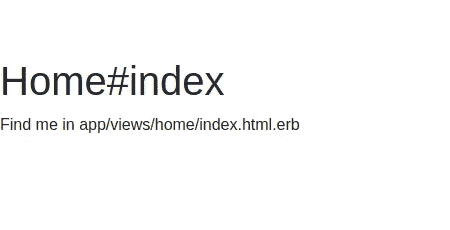
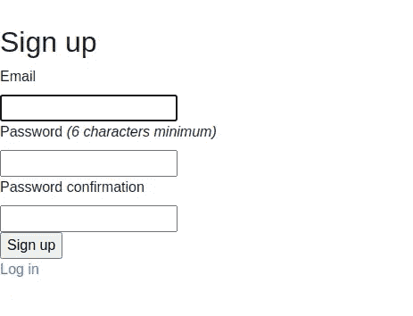
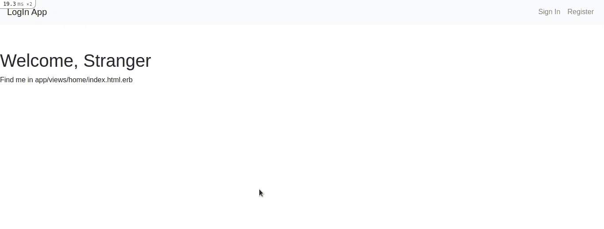

# 如何使用 Devise 向 Rails Web 应用程序添加身份验证

> 原文：<https://levelup.gitconnected.com/how-to-add-authentication-to-rails-web-app-using-devise-a5caedbbc093>

如何集成 Devise，这是一个灵活的基于 Warden 的 Rails 认证解决方案。

照片由[迈卡·威廉姆斯](https://unsplash.com/@mr_williams_photography?utm_source=medium&utm_medium=referral)在 [Unsplash](https://unsplash.com?utm_source=medium&utm_medium=referral) 上拍摄

在本教程中，我们将学习如何向我们的 Rails Web 应用程序添加基于登录的身份验证。为了添加这个认证特性，我们将使用一个名为**device**的 gem(包)和我们的 Rails Web 应用程序。

# 先决条件

本教程假设您熟悉

1.  Ruby 和 Rails 的基础知识
2.  MVC 框架
3.  蜜蜂

此外，您必须在电脑上安装以下软件

1.  红宝石
2.  轨道
3.  一个好的文本编辑器(例如 Visual Studio 代码)
4.  一个好的浏览器(例如谷歌浏览器)

我们还将在教程的后面使用 CSS 的引导

# 什么是设计？

Devise 是一个基于 Warden 的灵活的 Rails 认证解决方案。It :-

*   基于机架；
*   是基于 Rails 引擎的完整 MVC 解决方案；
*   允许您同时登录多个模型；
*   基于模块化概念:只使用你真正需要的东西。

[device 的 README](https://github.com/heartcombo/devise#getting-started) 包含了你入门所需的所有信息，还涉及到了它更高级的特性。

现在让我们动手开始编写代码

# 让我们编码

**步骤 1——创建一个 Rails 应用**

*   打开新的终端
*   执行命令— `rails new loginApp`。这将创建一个新的 rails 应用程序。您将在打开终端的目录中看到一个新文件夹`loginApp`。这个目录是我们项目的根目录。

**步骤 2——将设备添加到轨道上**

*   现在，我们将向 rails 添加设备。为此，打开位于`loginApp`目录中的名为`Gemfile`的文件。如图所示添加一行`gem 'devise'`。

*   现在，在我们项目的根目录中打开终端，并执行下面的命令— `bundle install`。这将下载我们应用程序中的`Devise` gem(包)。
*   现在，我们必须开动发电机。执行以下命令`rails generate devise:install`。此时，**控制台**中会出现一些指令。这些说明包含配置 rails 应用程序的步骤，以便 Devise 可以轻松地与 Rails Web 应用程序集成。
*   根据第一条指令，我们必须将代码— `config.action_mailer.default_url_options = { host: ‘localhost’, port: 3000 }`粘贴到文件`config/environments/development.rb`中，如下所示

*   第二条指令要求我们向我们的`config/routes.rb`文件添加一个根 url。打开该文件，并将以下代码粘贴到其中

*   第三个指令要求我们在网页中添加一些 HTML 标签，以便 Devise 可以显示成功登录等通知。对用户来说。将下面两个段落标记粘贴到 body 标记中，如代码片段所示。

*   现在，我们必须为我们的应用程序添加一些设计特定的视图。第四个指令告诉我们如何做。只需在我们项目根目录下打开的终端上执行以下命令即可— `rails g devise views`

**步骤 3 —添加控制器**

*   既然我们已经在 Rails 应用程序中添加了 Devise，现在我们将创建一个控制器来处理各种路由。
*   我们在设置 devise 时添加了一个根 url。让我们首先创建一个控制器。在终端中执行以下命令，生成一个名为`home`的控制器，其路径名为`index`

`rails g controller home index`

注意:-建议您使用以下命令启动服务器— `rails s`并在浏览器中访问`localhost:3000`。如果你看到下面的页面，这意味着到目前为止一切都设置妥当。

索引. html.erb

如果你看不到上面的页面，一定是有问题。检查错误日志或重复上述所有步骤。

**步骤 4 —创建用户模型**

*   现在，让我们创建一个用户模型以及登录、注销和注册的各种路径。虽然这听起来很多，但 devise 让它变得超级简单。只需在终端上执行以下命令— `rails g devise User`
*   因为上面的命令为用户创建了一个模型类和一个表的模式，所以我们必须将表加载到数据库中。为此，我们将执行以下命令— `rails db:migrate`
*   要了解前面的命令创建的路由，请在终端上执行以下命令— `rails routes | grep user`。您会看到各种路线，如`sign_in`、`sign_out`、`sign_up`等。被创造出来。
*   现在再次使用`rails s`运行服务器并访问`localhost:3000`。您将看到相同的索引页面。如果你访问`localhost:3000/users/sign_up`，你应该看到下面的页面。如果你填了表格，你将自己注册。

本地主机:3000/用户/注册

*   如果您没有看到上述网页，请检查错误日志或再次重复上述步骤。
*   同样，如果你参观了`localhost:3000/users/sign_out`，你自己也会`sign_out`。如果您访问`localhost:3000/users/sign_in`，您将看到一个登录表单。如果您登录，您将被重定向到索引路由。
*   因此，**这就是 Devise 如何帮助我们在 web 应用程序中实现身份验证的**。您一定注意到了，我们只需执行一些命令就可以在 web 应用程序中添加身份验证功能。如果一切从头开始，添加相同的身份验证功能将需要大量时间。但是用 design，只是一些命令的问题！！！
*   Devise 提供了一个名为`current_user`的对象，包含当前登录用户的信息。在下一节中，我们将使用该对象在索引页面上显示用户的电子邮件 id。

# 让我们链接

在接下来的步骤中，我们将只添加一些 CSS 并为各种路由创建按钮，这样我们就可以使用按钮来访问这些 URL，而不是在浏览器中键入 URL。我们将使用引导程序 4.5

**步骤 1 —添加引导程序和导航条**

*   复制并粘贴下面的代码到`app/views/layout/application.html.erb`

**步骤 2 —创建** `**navbar partial**`

*   在`app/views/shared/_navbar.html.erb`中复制并粘贴以下代码

**第三步——在索引页面显示用户电子邮件**

*   Devise 提供了一个名为`current_user`对象的变量，包含当前登录用户的信息。
*   复制并粘贴以下代码到`app/views/home/index.html.erb`

现在，转到浏览器上的`localhost:3000`。您应该会看到以下内容

本地主机:3000

您可以使用导航条访问`Sign In`和`Register`。

# **恭喜！！**

现在，您已经使用 Devise 很快成功地向 Rails 应用程序添加了一个身份验证特性。

你可以在这个 [GitHub Repo](https://github.com/webtutsplus/DeviseRails) 中找到完整的代码