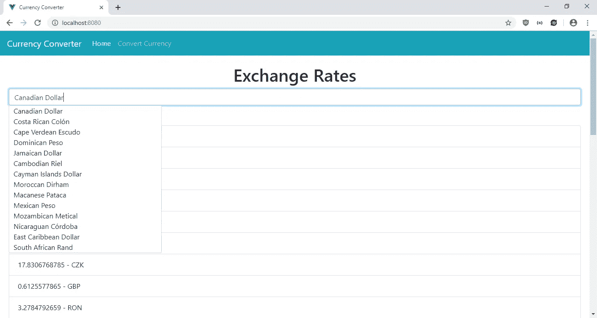

# 如何将自动完成输入添加到 Vue.js 应用程序中

> 原文：<https://levelup.gitconnected.com/how-to-add-auto-complete-input-to-your-vue-js-app-f313401e35af>


[赫塞·科林斯](https://unsplash.com/@jtc?utm_source=medium&utm_medium=referral)在 [Unsplash](https://unsplash.com?utm_source=medium&utm_medium=referral) 上的照片

为了让用户容易地从长列表中选择，使用自动完成功能的输入比简单的下拉选择更好，因为它允许用户搜索他们想要的条目，而不是从列表中选择。这是 web 应用程序的一个常见功能，因此开发人员开发了自动完成组件，我们可以轻松地添加该功能。

在本文中，我们将制作一个货币转换器，让用户选择要转换的货币，并按基础货币列出汇率。我们将使用 Vue.js 来构建应用程序，使用位于[https://exchangeratesapi.io/](https://exchangeratesapi.io/)的外汇汇率 API 来获取我们的汇率，使用位于[http://openexchangerates.org](http://openexchangerates.org)的公开汇率 API 来获取我们的货币列表。

要开始构建应用程序，我们将运行 Vue CLI 来创建项目。运行`npx @vue/cli create currency-converter`来创建项目。在向导中，我们选择“手动选择功能”并从列表中选择 Babel、CSS 预处理器、Vuex 和 Vue 路由器。

接下来，我们安装一些库。我们将使用 Axios 进行 HTTP 请求，使用 BootstrapVue 进行样式设置，使用 Vee-Validate 进行表单验证，使用 Vue-Autosuggest 进行自动完成输入。Vue-Autosuggest 允许我们定制组件的所有部分。它对样式没有任何意见，这意味着它非常适合 Bootstrap 样式。

我们通过运行`npm i axios bootstrap-vue vee-validate vue-autosuggest`安装所有的库来安装所有的包。

接下来，我们编写应用程序的代码。我们首先添加一个 mixin，用于向 API 发送 HTTP 请求以获取数据。在`src`文件夹中创建一个`mixins`文件夹，然后在`src`文件夹中添加`requestsMixin.js`，然后在文件中添加以下代码:

```
const APIURL = "[https://api.exchangeratesapi.io](https://api.exchangeratesapi.io)";
const OPEN_EXCHANGE_RATES_URL =
  "[http://openexchangerates.org/api/currencies.json](http://openexchangerates.org/api/currencies.json)";
const axios = require("axios");export const requestsMixin = {
  methods: {
    getCurrenciesList() {
      return axios.get(OPEN_EXCHANGE_RATES_URL);
    }, getExchangeRates(baseCurrency) {
      return axios.get(`${APIURL}/latest?base=${baseCurrency}`);
    }
  }
};
```

我们使用 Axios 向 API 发出请求。

接下来，我们构建一个页面让用户转换货币。在`views`文件夹中创建`ConvertCurrency.vue`并添加:

```
<template>
  <div class="page">
    <h1 class="text-center">Convert Currency</h1>
    <ValidationObserver ref="observer" v-slot="{ invalid }">
      <b-form [@submit](http://twitter.com/submit).prevent="onSubmit" novalidate>
        <b-form-group label="Amount" label-for="title">
          <ValidationProvider name="amount" rules="required|min_value:0" v-slot="{ errors }">
            <b-form-input
              v-model="form.amount"
              type="text"
              required
              placeholder="Amount"
              name="amount"
            ></b-form-input>
            <b-form-invalid-feedback :state="errors.length == 0">Amount is required</b-form-invalid-feedback>
          </ValidationProvider>
        </b-form-group><b-form-group label="Currency to Convert From" label-for="start">
          <ValidationProvider name="fromCurrency" rules="required" v-slot="{ errors }">
            <vue-autosuggest
              :suggestions="filteredFromCurrencies"
              :input-props="{id:'autosuggest__input', placeholder:'Select Currency to Convert From', class: 'form-control'}"
              v-model="form.fromCurrency"
              :get-suggestion-value="getSuggestionValue"
              :render-suggestion="renderSuggestion"
              component-attr-class-autosuggest-results-container="result"
              [@selected](http://twitter.com/selected)="onSelectedFromCurrency"
            ></vue-autosuggest>
            <b-form-invalid-feedback
              :state="errors.length == 0"
            >Currency to Convert From is required</b-form-invalid-feedback>
          </ValidationProvider>
        </b-form-group><b-form-group label="Currency to Convert To" label-for="end">
          <ValidationProvider name="toCurrency" rules="required" v-slot="{ errors }">
            <vue-autosuggest
              :suggestions="filteredToCurrencies"
              :input-props="{id:'autosuggest__input', placeholder:'Select Currency to Convert To', class: 'form-control'}"
              v-model="form.toCurrency"
              :get-suggestion-value="getSuggestionValue"
              :render-suggestion="renderSuggestion"
              component-attr-class-autosuggest-results-container="result"
              [@selected](http://twitter.com/selected)="onSelectedToCurrency"
            ></vue-autosuggest>
            <b-form-invalid-feedback :state="errors.length == 0">Currency to Convert To is required</b-form-invalid-feedback>
          </ValidationProvider>
        </b-form-group><b-button type="submit" variant="primary">Convert</b-button>
      </b-form>
    </ValidationObserver><div v-if="convertedAmount" class="text-center">
      <h2>Converted Amount</h2>
      <p>{{form.amount}} {{selectedFromCurrencyCode}} is equal to {{convertedAmount}} {{selectedToCurrencyCode}}</p>
    </div>
  </div>
</template><script>
import { requestsMixin } from "@/mixins/requestsMixin";export default {
  name: "ConvertCurrency",
  mixins: [requestsMixin],
  computed: {
    currencies() {
      return Object.keys(this.$store.state.currencies).map(key => ({
        value: key,
        name: this.$store.state.currencies[key]
      }));
    },
    filteredFromCurrencies() {
      const filtered =
        this.currencies.filter(
          c =>
            (c.value || "").toLowerCase() !=
              (this.selectedToCurrencyCode || "").toLowerCase() &&
            (c.value || "")
              .toLowerCase()
              .includes((this.form.fromCurrency || "").toLowerCase())
        ) ||
        (c.name || "")
          .toLowerCase()
          .includes((this.form.fromCurrency || "").toLowerCase());
      return [
        {
          data: filtered || []
        }
      ];
    },
    filteredToCurrencies() {
      const filtered =
        this.currencies.filter(
          c =>
            (c.value || "").toLowerCase() !=
              (this.selectedFromCurrencyCode || "").toLowerCase() &&
            (c.value || "")
              .toLowerCase()
              .includes((this.form.toCurrency || "").toLowerCase())
        ) ||
        (c.name || "")
          .toLowerCase()
          .includes((this.form.toCurrency || "").toLowerCase());
      return [
        {
          data: filtered || []
        }
      ];
    }
  },
  data() {
    return {
      form: {
        currency: ""
      },
      exchangeRates: {},
      ratesFound: false,
      selectedFromCurrencyCode: "",
      selectedToCurrencyCode: "",
      convertedAmount: 0
    };
  },
  methods: {
    getSuggestionValue(suggestion) {
      return suggestion && suggestion.item.name;
    },
    renderSuggestion(suggestion) {
      return suggestion && suggestion.item.name;
    },
    onSelectedFromCurrency(item) {
      this.selectedFromCurrencyCode = item && item.item.value;
    },
    onSelectedToCurrency(item) {
      this.selectedToCurrencyCode = item && item.item.value;
    },
    async onSubmit() {
      const isValid = await this.$refs.observer.validate();
      if (!isValid) {
        return;
      }
      try {
        const { data } = await this.getExchangeRates(
          this.selectedFromCurrencyCode
        );
        const rate = data.rates[this.selectedToCurrencyCode];
        this.convertedAmount = this.form.amount * rate;
      } catch (error) {}
    }
  }
};
</script>
```

当`App.vue`加载并存储在 Vuex 存储中时，货币列表被检索，因此我们可以在所有页面中使用它，而无需重新加载获取货币列表的请求。

我们使用 Vee-Validate 来验证我们的输入。我们使用`ValidationObserver`组件来观察组件内部表单的有效性，使用`ValidationProvider`来检查组件内部输入值的有效性规则。在`ValidationProvider`中，我们为`amount`字段提供了 BootstrapVue 输入。

Vue-Autosuggest 组件允许用户选择他们想要转换的货币。`suggestions`属性包含由用户输入过滤的货币列表，还过滤出其他字段设置的货币。`input-props` prop 包含一个带有输入占位符的对象。`v-model`已经设置了用户到目前为止输入的内容，我们将在`scripts`部分使用这些内容来过滤货币。`get-suggestion-value` prop 采用一个函数，以您喜欢的方式返回建议的项目。`render-suggestion` prop 通过向 prop 传递函数，以您喜欢的方式显示选择。`component-attr-class-autosuggest-results-container`让我们设置结果下拉列表的类，而`selected`事件处理程序让我们设置最终选择的值。

在`filteredFromCurrencies` 和`filteredToCurrencies`函数中，我们通过排除已经输入到另一个下拉菜单中的货币来过滤货币，并且以不区分大小写的方式根据用户到目前为止输入的内容进行过滤。

一旦用户点击保存，则调用`onSubmit`功能。在函数内部，调用`this.$refs.observer.validate();`来检查表单验证。`observer`是`ValidationObserver`的 ref。观察到的表单验证值在这里。如果它解析为`true`，我们通过调用从 mixin 添加的`getExchangeRates`函数获得基础货币的汇率，然后将其转换为最终的转换金额，并显示在表单下方的模板中。

接下来在`Home.vue`中，将现有代码替换为:

```
<template>
  <div class="page">
    <h1 class="text-center">Exchange Rates</h1> <vue-autosuggest
      :suggestions="filteredCurrencies"
      :input-props="{id:'autosuggest__input', placeholder:'Select Currency', class: 'form-control'}"
      v-model="form.currency"
      :get-suggestion-value="getSuggestionValue"
      :render-suggestion="renderSuggestion"
      component-attr-class-autosuggest-results-container="result"
      [@selected](http://twitter.com/selected)="onSelected"
    >
      <div slot-scope="{suggestion}">
        <span class="my-suggestion-item">{{suggestion.item.name}}</span>
      </div>
    </vue-autosuggest> <h2>Rates</h2> <b-list-group v-if="ratesFound">
      <b-list-group-item v-for="(key, value) in exchangeRates.rates" :key="key">{{key}} - {{value}}</b-list-group-item>
    </b-list-group> <b-list-group v-else>
      <b-list-group-item>Rate not found.</b-list-group-item>
    </b-list-group>
  </div>
</template><script>
import { requestsMixin } from "@/mixins/requestsMixin";export default {
  name: "home",
  mixins: [requestsMixin],
  computed: {
    currencies() {
      return Object.keys(this.$store.state.currencies).map(key => ({
        value: key,
        name: this.$store.state.currencies[key]
      }));
    },
    filteredCurrencies() {
      const filtered = this.currencies.filter(
        c =>
          (c.value || "")
            .toLowerCase()
            .includes(this.form.currency.toLowerCase()) ||
          (c.name || "")
            .toLowerCase()
            .includes(this.form.currency.toLowerCase())
      );
      return [
        {
          data: filtered
        }
      ];
    }
  },
  data() {
    return {
      form: {
        currency: ""
      },
      exchangeRates: {},
      ratesFound: false
    };
  },
  methods: {
    getSuggestionValue(suggestion) {
      return suggestion.item.name;
    },
    renderSuggestion(suggestion) {
      return suggestion.item.name;
    },
    async onSelected(item) {
      try {
        const { data } = await this.getExchangeRates(item.item.value);
        this.exchangeRates = data;
        this.ratesFound = true;
      } catch (error) {
        this.ratesFound = false;
      }
    }
  }
};
</script><style lang="scss" scoped>
</style>
```

这是我们应用程序的主页。在顶部，我们有 Vue-Autosuggest 组件来过滤货币列表中的用户输入。货币列表来自 Vuex 商店。一旦用户选择了他们的最终值，我们运行来自`requestsMixin`的`this.getExchangeRates`，加载所选货币的最新汇率(如果找到的话)。

接下来在`App.vue`中，将现有代码替换为:

```
<template>
  <div id="app">
    <b-navbar toggleable="lg" type="dark" variant="info">
      <b-navbar-brand to="/">Currency Converter</b-navbar-brand> <b-navbar-toggle target="nav-collapse"></b-navbar-toggle> <b-collapse id="nav-collapse" is-nav>
        <b-navbar-nav>
          <b-nav-item to="/" :active="path  == '/'">Home</b-nav-item>
          <b-nav-item to="/convertcurrency" :active="path  == '/convertcurrency'">Convert Currency</b-nav-item>
        </b-navbar-nav>
      </b-collapse>
    </b-navbar>
    <router-view />
  </div>
</template><style lang="scss">
.page {
  padding: 20px;
}.result {
  position: absolute;
  background-color: white;
  min-width: 350px;
  z-index: 1000;
  ul {
    margin: 0;
    padding: 0;
    border: 1px solid #ced4da;
    border-radius: 3px;
    li {
      list-style-type: none;
      padding-left: 10px;
    }
  }
}
</style><script>
import { requestsMixin } from "@/mixins/requestsMixin";export default {
  mixins: [requestsMixin],
  data() {
    return {
      path: this.$route && this.$route.path
    };
  },
  watch: {
    $route(route) {
      this.path = route.path;
    }
  },
  beforeMount() {
    this.getCurrencies();
  },
  methods: {
    async getCurrencies() {
      const { data } = await this.getCurrenciesList();
      this.$store.commit("setCurrencies", data);
    }
  }
};
</script>
```

这里我们添加了 BootstrapVue 导航栏。我们还有显示路线的`router-view`。在`scripts`部分，我们观察`$route`变量来获取用户导航的当前路线，以设置`b-nav-item`的`active`属性。此外，当这个组件加载时，我们获取货币并将其放入我们的 Vuex 存储中，这样我们就可以获取所有组件中的数据。我们在这里加载它，因为这是应用程序的入口组件。

这个组件还保存了我们应用程序的全局样式。`result`类用于设计自动完成下拉菜单的样式。我们将`position`设置为`absolute`,使其显示在其他项目之上，并允许其与其他项目重叠。我们还设置了下拉菜单的颜色，并为其添加了边框。当`list-style-type`设置为`none`时，列表项目的点被移除。我们有`page`类来给页面添加一些填充。

接下来在`main.js`中，将现有代码替换为:

```
import Vue from "vue";
import App from "./App.vue";
import router from "./router";
import store from "./store";
import BootstrapVue from "bootstrap-vue";
import "bootstrap/dist/css/bootstrap.css";
import "bootstrap-vue/dist/bootstrap-vue.css";
import VueAutosuggest from "vue-autosuggest";
import { ValidationProvider, extend, ValidationObserver } from "vee-validate";
import { required, min_value } from "vee-validate/dist/rules";
extend("required", required);
extend("min_value", min_value);
Vue.component("ValidationProvider", ValidationProvider);
Vue.component("ValidationObserver", ValidationObserver);
Vue.use(VueAutosuggest);
Vue.use(BootstrapVue);Vue.config.productionTip = false;new Vue({
  router,
  store,
  render: h => h(App)
}).$mount("#app");
```

我们在这里添加了 BootstrapVue、Vue-Autosuggest 和 Vee-Validate 到我们的应用程序中。此外，我们添加了我们在这里使用的 Vee-Validate 验证规则，其中包括用于确保所有内容都被填充的`required`规则，以及用于金额的`min_value`规则。这里还包含了引导 CSS 来设计我们所有组件的样式。

然后在`router.js`中，将现有代码替换为:

```
import Vue from "vue";
import Router from "vue-router";
import Home from "./views/Home.vue";
import ConvertCurrency from "./views/ConvertCurrency.vue";Vue.use(Router);export default new Router({
  mode: "history",
  base: process.env.BASE_URL,
  routes: [
    {
      path: "/",
      name: "home",
      component: Home
    },
    {
      path: "/convertcurrency",
      name: "convertcurrency",
      component: ConvertCurrency
    }
  ]
});
```

添加我们的路线，以便用户可以看到我们的页面。

在`store.js`中，将现有代码替换为:

```
import Vue from "vue";
import Vuex from "vuex";Vue.use(Vuex);export default new Vuex.Store({
  state: {
    currencies: {}
  },
  mutations: {
    setCurrencies(state, payload) {
      state.currencies = payload;
    }
  },
  actions: {}
});
```

存储我们在所有组件中使用的货币列表。我们在`mutation`对象和由组件观察的`currencies`状态中有 setter 函数。

然后在`index.html`中，我们将现有代码替换为:

```
<!DOCTYPE html>
<html lang="en">
  <head>
    <meta charset="utf-8" />
    <meta http-equiv="X-UA-Compatible" content="IE=edge" />
    <meta name="viewport" content="width=device-width,initial-scale=1.0" />
    <link rel="icon" href="<%= BASE_URL %>favicon.ico" />
    <title>Currency Converter</title>
  </head>
  <body>
    <noscript>
      <strong
        >We're sorry but vue-autocomplete-tutorial-app doesn't work properly
        without JavaScript enabled. Please enable it to continue.</strong
      >
    </noscript>
    <div id="app"></div>
    <!-- built files will be auto injected -->
  </body>
</html>
```

改一下标题。

最后，当我们运行`npm run serve`时，我们得到如下结果:

