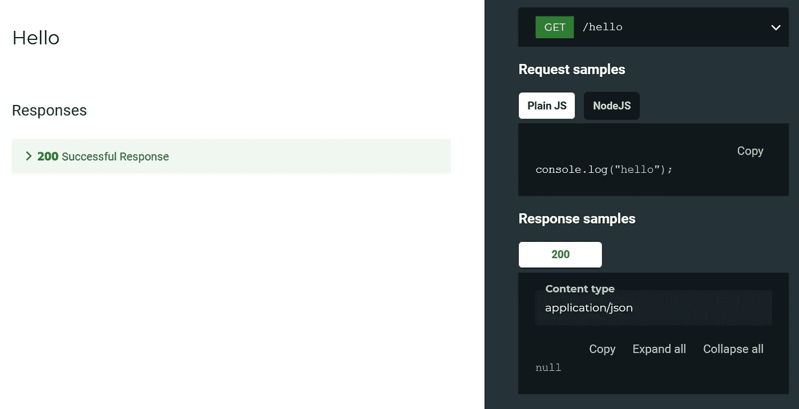
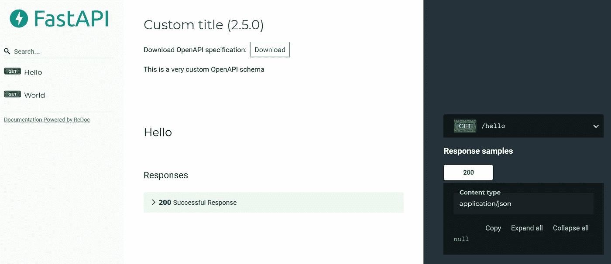
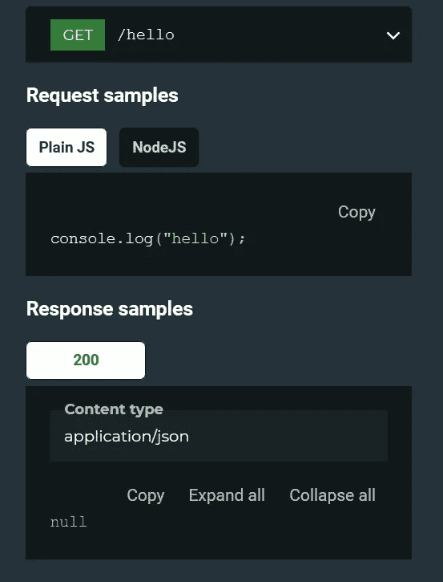
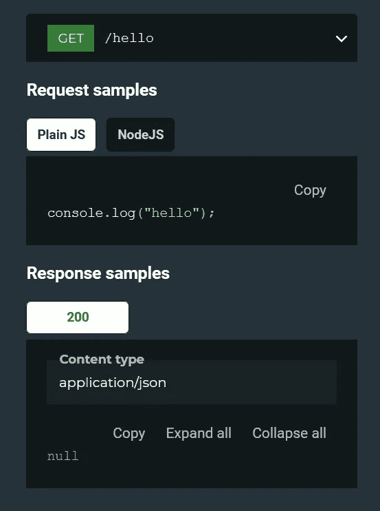

# 如何在 FastAPI 中向 ReDoc 添加代码示例

> 原文：<https://levelup.gitconnected.com/how-to-add-code-samples-to-redoc-in-fastapi-1e7af847c4ef>

扩展 OpenAPI 模式以获得更好的文档



作者图片

通过阅读本文，您将了解如何更改生成的 OpenAPI 模式，并在 FastAPI 应用程序中向`ReDoc`端点添加代码示例。本教程还包括从文本文件中动态添加代码示例，而不是在 FastAPI 脚本中定义代码。

从 2.0 版本开始，ReDoc 通过[供应商扩展](https://github.com/Redocly/redoc/blob/master/docs/redoc-vendor-extensions.md)为代码样本提供了强大的支持。您所需要做的就是为您拥有的每条路由声明一个名为`x-codeSamples`的新条目。`x-codeSamples`应该包含一个代码示例对象列表，可以表示如下:

*   语言
*   标签
*   来源

## 语言

表示代码示例语言的字符串。它会影响代码示例的渲染和颜色。该值必须是下列之一的[:](https://github.com/github/linguist/blob/master/lib/linguist/popular.yml)

*   C
*   C#
*   C++
*   咖啡脚本
*   半铸钢ˌ钢性铸铁(Cast Semi-Steel)
*   镖
*   分米
*   长生不老药
*   去
*   绝妙的
*   超文本标记语言
*   Java 语言(一种计算机语言，尤用于创建网站)
*   Java Script 语言
*   科特林
*   目标-C
*   Perl 语言
*   服务器端编程语言（Professional Hypertext Preprocessor 的缩写）
*   PowerShell
*   计算机编程语言
*   红宝石
*   锈
*   斯卡拉
*   壳
*   迅速发生的
*   以打字打的文件

## 标签

代码示例的可选字符串`label`。该标签将显示在文档上。如果标签不存在，它将使用`lang`作为默认值。

## 来源

您的代码示例的源代码。它被表示为单个字符串。请注意，不会对语法进行任何检查。您有责任确保代码运行无误。

让我们继续下一部分，开始安装必要的模块。

# 设置

强烈建议您在继续安装之前创建一个新的虚拟环境。

## FastAPI

激活它并运行以下命令来安装 FastAPI:

```
pip install fastapi
```

## 紫玉米

为了服务 FastAPI 服务器，需要一个 ASGI 服务器。您可以选择通过以下方式安装最低限度依赖项:

```
pip install uvicorn
```

或者标准安装，其中包含附加的有用包，如 WebSockets 支持。

```
pip install uvicorn[standard]
```

## 需求文件

或者，您可以通过以下需求文件安装所有必需的软件包:

```
click             7.1.2
dataclasses       0.8
fastapi           0.63.0
h11               0.12.0
httptools         0.1.1
pip               21.0.1
pkg-resources     0.0.0
pydantic          1.8.1
python-dotenv     0.15.0
PyYAML            5.4.1
setuptools        54.1.1
starlette         0.13.6
typing-extensions 3.7.4.3
uvicorn           0.13.4
uvloop            0.14.0
watchgod          0.7
websockets        8.1
```

将其保存在与`requirements.txt`相同的工作目录中并运行:

```
pip install -r requirements.txt
```

# 用徽标自定义文档

在本节中，您将实现 FastAPI 服务器脚本并扩展底层 OpenAPI 规范。让我们从测试带有徽标的定制文档开始。创建一个名为`myapp.py`的新 Python 文件。

## 导入

在文件顶部添加以下导入语句。

```
from fastapi import FastAPI
from fastapi.openapi.utils import get_openapi
```

## 路线

初始化 FastAPI 实例，并向其中添加两条新路由。

```
app = FastAPI()@app.get("/hello")
async def hello():
    return [{"message": "hello"}]@app.get("/world")
async def world():
    return [{"message": "world"}]
```

## 自定义 OpenAPI

接下来，声明一个覆盖默认 OpenAPI 模式的新函数。它将缓存生成的模式，并在下一个请求中重用它。

另一方面，您需要确保

```
app.openapi = custom_openapi
```

在指定了所有路由后调用，以防止在修改架构时因缺少键而出错。

## 运行服务器

保存 Python 文件，并在终端中运行以下命令:

```
uvicorn myapp:app
```

打开浏览器，转到以下 URL:

```
http://localhost:8000/redoc
```

您应该会看到以下用户界面:



作者图片

# 使用代码示例自定义文档

您应该注意到，添加徽标就像更改模式内容一样简单:

```
openapi_schema["info"]["x-logo"] = {                                 "url": "https://fastapi.tiangolo.com/img/logo-margin/logo-teal.png"                           }
```

## 添加单一代码示例

为了将代码示例添加到`hello`端点，您应该修改模式，如下所示:

```
openapi_schema["paths"]["/hello"]["get"]["x-codeSamples"] = [{
    'lang': 'JavaScript',
    'source': 'console.log("hello");',
    'label': 'Plain JS'
}]
```

在路由前面加上`/`符号并指定正确的 HTTP 方法(get、post 等)非常重要。).如果您在运行服务器时遇到了`KeyError`，请仔细检查脚本中使用的路线和方法。

## 添加多个代码示例

假设您想要支持几种不同编程语言的代码示例。只需将更多项目添加到列表中，如下所示:

```
openapi_schema["paths"]["/hello"]["get"]["x-codeSamples"] = [
    {
        'lang': 'JavaScript',
        'source': 'console.log("hello");',
        'label': 'Plain JS'
    },
    {
        'lang': 'JavaScript',
        'source': 'console.log("hello node");',
        'label': 'NodeJS'
    },
]
```

重新运行 FastAPI 服务器，您应该会看到下面的代码示例



作者图片

## 从文本文件中动态加载代码示例

在 Python 文件中直接添加代码样本的过程非常繁琐，尤其是当您打算为多条路线支持不同的编程语言时。

## 创建文件夹

让我们更进一步，实现一个新函数，它加载 all 文件并动态地将其添加到模式中。创建一个名为 docs 的新文件夹。在文件夹内，添加两个文件夹，如下所示:

*   普通 JS
*   NodeJS

## 创建文本文件

请注意，文件夹的名称将用作显示在文档中的标签。在每个文件夹中，创建两个新的文本文件:

*   hello-get.js
*   world-get.js

命名约定受[后面的代码片段](https://github.com/tiangolo/fastapi/issues/2111)的启发，该代码片段使用由连字符分隔的路由和 HTTP 方法的名称。如果您有如下 GET 路线:

```
v1/hello
```

您应该按如下方式命名该文件:

```
v1-hello-get.js
```

文件扩展名并不重要，您可以使用您喜欢的任何文件(例如 txt)。建议使用正确的文件扩展名，因为您可以立即测试它来验证代码是否正常工作。

完成后，让我们在 Python 文件中实现剩余的代码。

## 导入

添加以下导入和映射字典

```
...
import oslable_lang_mapping = {"Plain JS": "JavaScript", "NodeJS": "JavaScript"}
...
```

## 实现自定义功能

创建一个名为`add_examples`的新函数，它搜索`docs`文件夹，并将文本文件的内容作为代码样本加载到 OpenAPI 模式中。

然后，修改下面一行:

```
app.openapi_schema = openapi_schema
```

到

```
app.openapi_schema = add_examples(openapi_schema, 'docs')
```

## 证明文件

保存文件并重新运行服务器。您应该会看到以下用户界面



作者图片

你可以在要点后面的[找到完整的代码。](https://gist.github.com/wfng92/8d459df8d60fe72c3e2b21a3458defa1)

# 结论

让我们回顾一下你今天所学的内容。

本教程首先简要解释了通过供应商扩展对 ReDoc 的代码示例支持。

接下来，它涵盖了通过直接 pip 安装或需求文件的安装过程。

之后，它专注于定制 OpenAPI 模式，以便在文档中包含定制的徽标。随后，它解释了如何在 Python 文件中直接向文档添加定制代码示例。

最后但并非最不重要的一点是，本文最后介绍了如何从文本文件中动态添加代码示例。

感谢你阅读这篇文章。希望你回来看下一篇文章！

# 参考

1.  [FastAPI —扩展 OpenAPI](https://fastapi.tiangolo.com/advanced/extending-openapi/)
2.  [FastAPI Github 问题—支持 x-codeSamples](https://github.com/tiangolo/fastapi/issues/2111)
3.  [ReDoc —供应商扩展](https://github.com/Redocly/redoc/blob/master/docs/redoc-vendor-extensions.md)