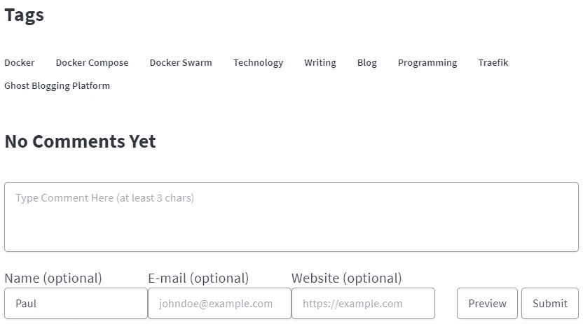
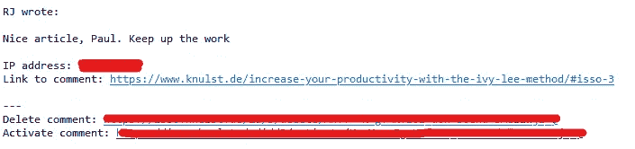
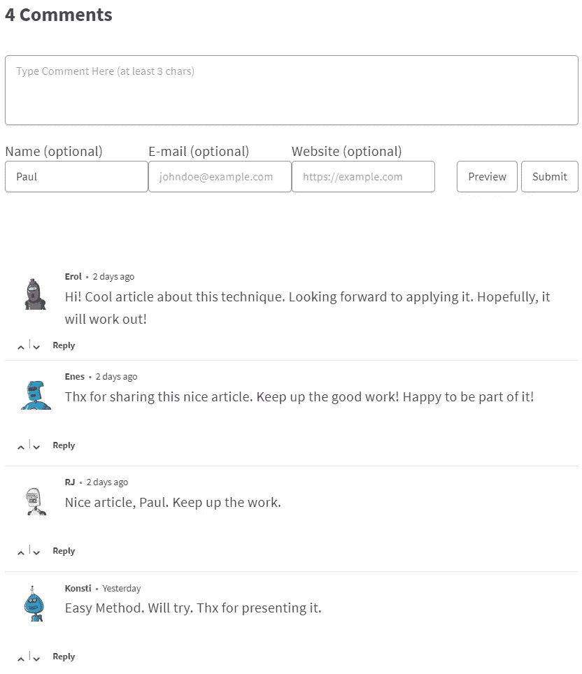

# 如何给你的博客添加评论

> 原文：<https://levelup.gitconnected.com/how-to-add-comments-to-your-blog-bc91a324d245>

## 在自己的博客上发表评论是最吸引人的功能之一。了解如何整合 Isso 评论，在你的博客中加入关注隐私的评论功能。


沃洛季米尔·赫里先科在 [Unsplash](https://unsplash.com/s/photos/discussion?utm_source=unsplash&utm_medium=referral&utm_content=creditCopyText) 上的照片

在你的博客上发表评论是最吸引人的功能之一！不幸的是，Ghost 博客服务不支持任何现成的评论。虽然它们是许多不同的服务，比如 Disqus 或 Discourse，都是“免费”的(它们在“免费”版本中有内置广告。广告是**邪恶的**)也存在一些真正免费的服务，如 [Commento](https://github.com/adtac/commento) 、 [Schnack](https://github.com/schn4ck/schnack) 、 [CoralProject Talk](https://github.com/coralproject/talk) 和 [Isso](https://github.com/posativ/isso/) 。

我测试了我博客的所有免费服务，得出的结论是 Isso 是在幽灵博客中使用的最好的服务。在这篇文章中，我将描述为什么 Isso 是最好的软件，如何将其安装在 Docker 环境中，以及如何将 Isso 评论集成到任何博客中(不仅仅是 Ghost 博客软件)。

# 为什么是 Isso？

Isso 是一个用 Python 和 JavaScript 编写的评论服务器，旨在替代 Disqus 或 Discourse。

它有几个特点:

*   这是一个非常轻量级的评论系统
*   **与 Docker Compose 一起工作**
*   用 SQLite 是因为评论不是大数据！
*   一个非常简单的评论系统和一个简单的审核系统
*   **隐私优先评论系统**
*   支持降价
*   **免费的**
*   类似于原生 WordPress 评论
*   你可以导入 WordPress 或者 Disqus
*   将它嵌入到单个 JS 文件中的任何地方；65kB (20kB 压缩文件)

所有这些特性都是选择 Isso 作为你的后台评论系统而不是其他系统的好理由。如果你想在 Docker(或 Docker Swarm)环境中安装它，你可以遵循我的个人指南。

# 用 Docker 安装 Isso 注释

## 先决条件

*   **Docker(可选 Docker Swarm):** 要完全按照这个教程为你的博客安装 Isso，你需要有一个运行 Docker 的环境。我还会在最后提供一个 Docker Swarm 文件。
*   **Traefik** : Traefik 是负载均衡器，它将我的请求转发给 Docker 容器。您需要安装一个来访问带有 URL 的评论。如果你没有正在运行的 Traefik，你将在本教程中学习[如何设置一个。](https://www.paulsblog.dev/how-to-setup-traefik-with-automatic-letsencrypt-certificate-resolver/)

如果您不想使用 Docker 和 Traefik，请遵循 Isso 网站上的官方安装指南。

## 设置 Docker 合成文件

如果你准备好了一切，你开始安装 Isso。首先，你必须从 GitHub 页面下载 Isso 的最新版本:[https://github.com/posativ/isso/](https://github.com/posativ/isso/)。您可以下载包含主分支的 zip 文件并提取它，或者克隆它:

```
git clone [git@github.com](mailto:git@github.com):posativ/isso.git
```

然后切换到`isso`文件夹，删除 docker-compose.yml，新建一个 docker-compose.yml，将下面的代码片段粘贴进去:

在**第 5–8 行**中，您可以在这个合成文件中看到，Isso 映像将根据您从官方 GitHub 资源库下载的 Dockerfile 文件构建，并将被命名为`isso`。

在**第 12–13 行(和 34–35 行)**中，我定义了一个卷，所有的注释都将保存在这个卷中的 SQLite DB 中。

**第 16–27 行**中的标签部分包含 Traefik 的重要信息。将 YOUR_DOMAIN 替换为可以访问 Isso 后端的域。这对评论的适度性很重要。

在**第 28–33 行**中，我还添加了一个健康检查，将每 5s 检查一次 Isso 后端是否正常运行。要了解更多关于 Docker 健康检查的信息，您应该阅读本教程:

[](https://www.paulsblog.dev/how-to-successfully-implement-a-healthcheck-in-docker-compose/) [## 如何在 Docker Compose 中成功实现健康检查

### 知道你的 Docker 服务是否运行正常是很重要的。不运行的服务可能会导致大事故…

www.paulsblog.dev](https://www.paulsblog.dev/how-to-successfully-implement-a-healthcheck-in-docker-compose/) 

## Isso 后端的配置

在运行 Isso 后端之前，您必须根据您的需要调整 Isso 配置文件。

下面的文件显示了为了有一个工作的 Isso 后端，你必须更新的最重要的设置。我稍后会解释。

**【常规】:**设置 dbpath，即您博客的 URL，以及您希望在新评论提交时收到的电子邮件

**【管理员】:**启用管理并设置您的管理员密码。这是登录管理界面所必需的。

**【审核】:**启用新评论审核。如果设置为 false，每个评论将立即显示。不推荐！

**【服务器】:**为 Isso 后端设置公共端点。应该等于合成文件中的值。

**【SMTP】:**设置您的电子邮件服务器设置和您的电子邮件的帐户数据。

## 运行 Isso 后端

根据您的需要调整 Compose 和`isso.cfg`文件后，您可以通过执行以下命令来启动 Isso 后端:

```
docker-compose up -d --build
```

几秒钟后，您的 Isso 后端应该在指定的域中运行。你可以去[**https://your-chosen-domain.com/info**查看。](https://your-chosen-domain.com/info.)

# 将 Isso 集成到 Ghost CMS(或任何等效的博客)中

## 调整源代码片段

现在你已经安装了 Isso 后端，你可以将评论整合到你的博客中了。为此，您只需在源代码中插入以下代码片段。之后我会解释在 Ghost 博客软件中是如何做到的。

首先用域名替换`isso.knulst.de`，你用你的 Isso 后端。此外，您应该仔细阅读源代码片段，因为有两个重要的设置:

1.  data-isso 中的 URL 以两个`/`开头。
2.  src 中的 URL 也是以两个`/`开头。

如果你根据自己的需要更改 URL，请在 Isso 后端 URL 前保留两个`/`。这是必要的，因为 Isso 后端部署在不同于博客的主机上。

# 将代码片段添加到页面

有了调整后的源代码片段，您现在可以向您的博客添加评论了。如果你使用 Ghost 博客平台，你应该首先下载你正在实例中使用的设计，并将其解压到一个文件夹中。

找到`post.hbs`文件并检查文章的结尾。评论最好放在标签列表的下面，标签列表通常显示在文章的末尾。找到结束的`</div>`后，在`</div>`前插入代码片段。

压缩你的主题，重新上传到你的 Ghost 博客软件，并在设计界面中激活它。

*如果你使用另一个博客软件，你也应该能够编辑* `*post*` *html/php/js 文件，并在你希望看到评论的地方添加代码片段。*

现在，切换到你博客上的任何一篇文章，你应该会看到评论部分:



如果你按照我在上一节中解释的那样设置了 Isso 后端，任何人现在都可以对每篇帖子发表评论，你会收到关于新评论的电子邮件通知，并可以在电子邮件中立即激活或删除它:



在得到一些很酷的评论后，它们会显示在你的帖子下面。因为激活了 Gravatar 特性并将类型设置为`robohash`，我为每个创建评论的用户准备了很酷的机器人图片:



# 部署在码头群中

要将 Isso 部署到您的 Docker 群中，您可以使用 [my Isso Docker Compose file](https://ftp.f1nalboss.de/data/docker-compose.isso.yml) ，它的设置与普通的 Compose file 相同。但是，只有当你按照我在本教程中描述的那样设置了你的 Docker Swarm 时，这才会起作用。

[](https://www.paulsblog.dev/docker-swarm-in-a-nutshell/) [## 码头工人蜂拥而至

### 这个简单的教程展示了如何在大约 15 分钟内创建一个正在运行的 docker swarm 集群。这个简单的教程展示了…

www.paulsblog.dev](https://www.paulsblog.dev/docker-swarm-in-a-nutshell/) 

此外，您的 Docker Swarm 中需要一个 Traefik 负载平衡器，它将被 Compose 文件使用。我在本教程中解释了如何用 Traefik 增强 Docker Swarm:

[](https://www.paulsblog.dev/services-you-want-to-have-in-a-swarm-environment/#traefik) [## 每个人都应该在 Docker 群中部署的 4 项重要服务

### 用四个你会喜欢的重要服务增强你的 Docker Swarm:Traefik，Portainer，Registry，FTP In my last…

www.paulsblog.dev](https://www.paulsblog.dev/services-you-want-to-have-in-a-swarm-environment/#traefik) 

# 结束语

虽然许多作者认为你不需要在你的博客中集成评论系统，但我完全否认这个观点！我个人认为，评论是与你的用户互动、回答问题和建立你的社区的一个很好的方式。此外，如果用户评论你的文章，你可以利用这种互动来改善你的内容。

你可以在我的博客上看到我实现 Isso 的评论:[https://www . paulsblog . dev](https://www.paulsblog.dev)。请随意在我的任何文章中使用评论部分。我将不胜感激！

如果你喜欢读这篇文章，考虑在评论区发表你的宝贵意见。我很想听到你对我的教程的反馈。此外，与其他博主分享这篇文章，帮助他们在博客上获得评论。

在 [LinkedIn](https://www.linkedin.com/in/paulknulst/) 、 [Twitter](https://twitter.com/paulknulst) 和 [GitHub](https://github.com/paulknulst) 上与我联系。

*本文最初发表在我的博客上*[*https://www.paulsblog.dev/how-to-add-comments-to-your-blog/*](https://www.paulsblog.dev/how-to-add-comments-to-your-blog/)

# 分级编码

感谢您成为我们社区的一员！更多内容见[级编码出版物](https://levelup.gitconnected.com/)。
跟随:[推特](https://twitter.com/gitconnected)，[领英](https://www.linkedin.com/company/gitconnected)，[通迅](https://newsletter.levelup.dev/)
**升一级正在改造理工大招聘➡️** [**加入我们的人才集体**](https://jobs.levelup.dev/talent/welcome?referral=true)