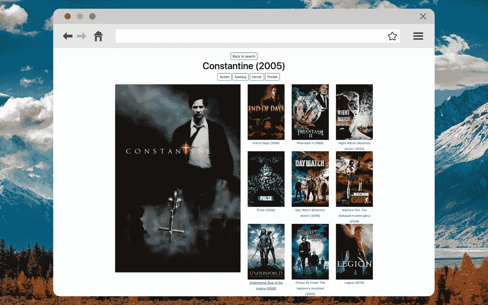
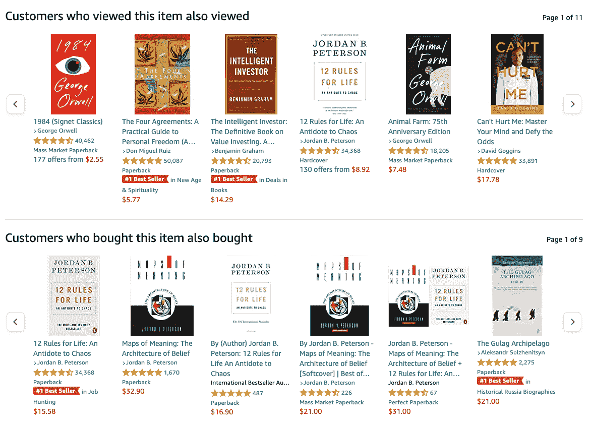
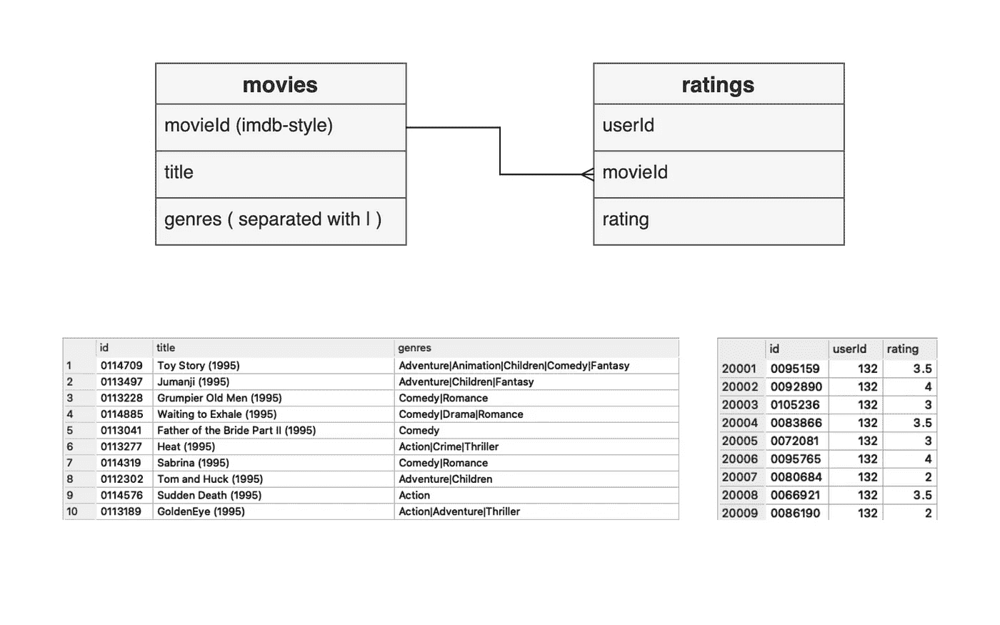
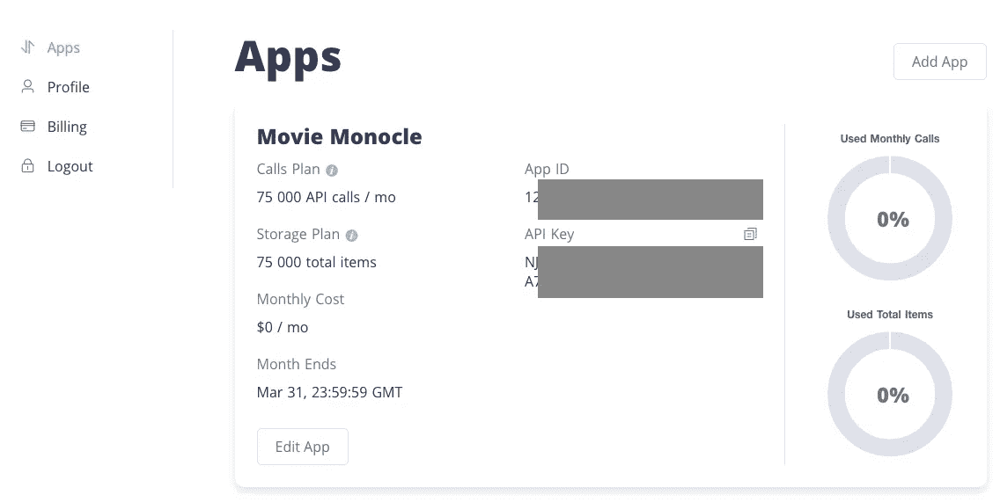
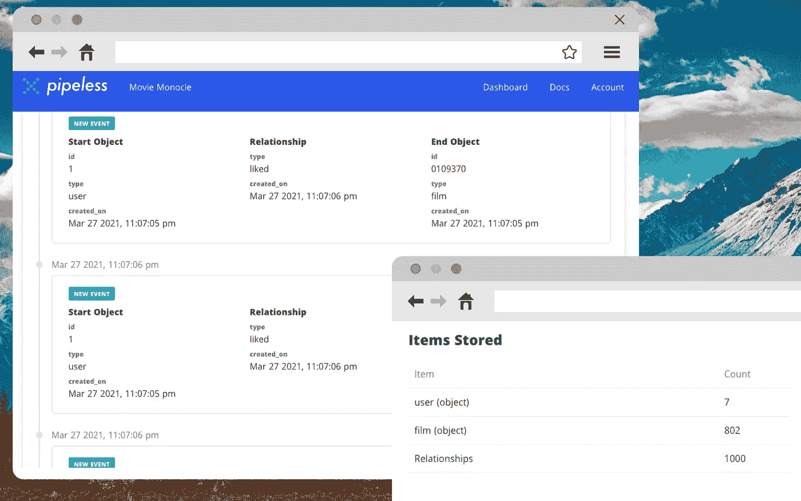
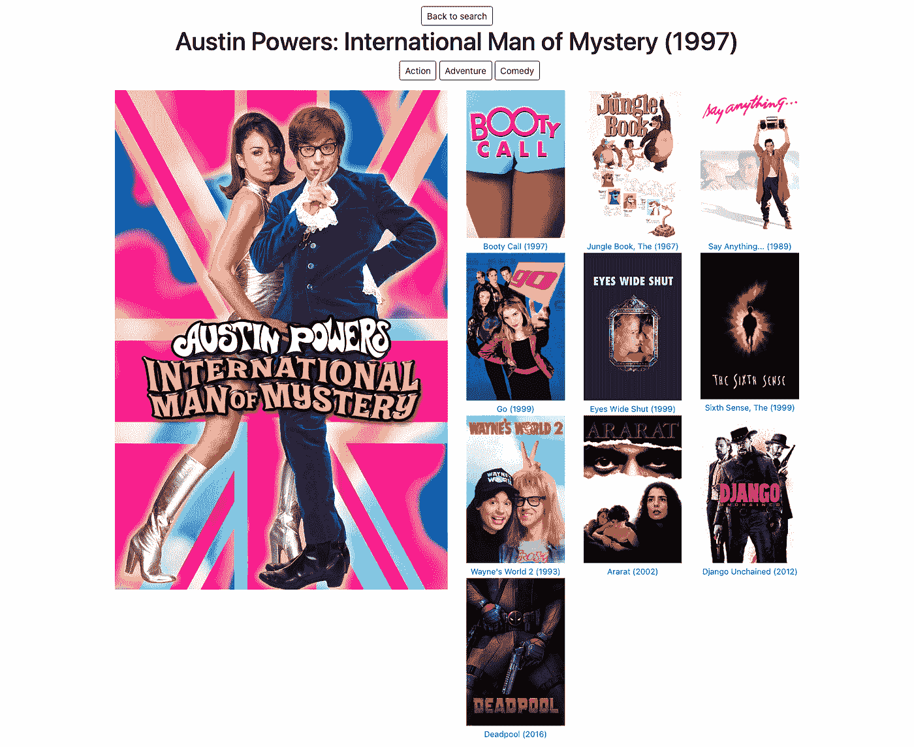

# 如何向网站添加内容推荐

> 原文：<https://levelup.gitconnected.com/how-to-add-content-recommendations-to-a-website-be107c336117>

## 向用户展示他们想要的东西(即使他们甚至不知道他们想要什么)

*(图片。按作者。所有标识和海报属于其各自的所有者，用于信息或编辑目的，以识别特定的产品和服务。)*

个性化内容提案现在已经成为网络的一个既定元素。大多数社交媒体基于用户与平台交互的多个接触点向用户提供内容。(他们中的一些人还在他们的页面之外跟踪用户，这引起了关于隐私和[阻止跨域跟踪](https://medium.datadriveninvestor.com/alternatives-to-third-party-cookies-in-2020-857609f8f2bb)的整个讨论。)通常，目的是增加一些交互率(即通过每个用户的访问、购买或其他行为的数量来衡量)。

*亚马逊利用顾客的行为来预测相似的顾客会喜欢什么。你能猜出这些推荐出现在哪本书上吗？(来源:Amazon.com)*

在线商店通过在销售漏斗的每个阶段巧妙推荐产品来增加收入。但是非零售网站也可以从推荐系统的优势中获益。如果你运营一个提供内容的网站，你可以利用内容推荐来维持用户关注度，增加访问量。

在本文中，我将使用一个电影数据库网站的示例，向您展示如何向您的网站添加内容推荐。我们将讨论实现这一点的基本方法，然后使用一个名为“无管道”的 SaaS，它允许您创建一个带有内置推荐算法的数据库。

[🔔想要更多这样的文章？在这里签名。](https://fischerbach.medium.com/membership)

# 🧐电影单片眼镜——可能是最差的电影搜索引擎

让我们来解决一个常见的情况:一个已建立的网站想要通过添加个性化推荐来定制用户体验。由于测试推荐引擎的经典数据集是 [MovieLens](https://grouplens.org/datasets/movielens/) movie rating 数据集，我创建了一个电影搜索引擎页面——Movie Monocle。

(作者视频)

这个网站上的电影数据库是从 [ml-latest](https://files.grouplens.org/datasets/movielens/ml-latest-small-README.html) 子集创建的。基本功能包括按标题搜索和显示电影信息(封面、年份、流派)，没有智能功能，所以它无法与 IMDb 等网站相比。是时候改变了。

# 网站架构和目标

该应用程序是使用 Python (Flask framework + Sqlite 数据库)和一点 jQuery 生成的前端开发的。

包含与用户行为相关的对象和事件的典型数据库结构。(作者图)

该网站实现了一个流行的方案，即通过功能(类型)和用户交互(观看，喜欢)相互关联的一些实体的集合。我们的目标是添加类似电影的列表建议，这些建议将显示在给定电影的页面上。

我们的解决方案必须满足的条件:

*   它必须根据全球用户行为模式给出建议。
*   它必须准备好插入，即在不过度干扰现有代码库的情况下插入网页元素。
*   如果不需要向堆栈中添加新技术就好了。
*   由于我们是一家网站出版商，而不是一家数据科学公司，我们希望在这方面投入尽可能少的资源。

# 推荐引擎

在这种情况下，我的首选解决方案是将处理建议的逻辑分离到一个单独的 API 中。这使我们能够在许多环境中使用我们的数据(网站、移动应用程序、广告)。我们有两个选择自己创建或使用现成的解决方案。使用 Python 和机器学习库准备一个简单的内容推荐引擎是一个下午的任务。

当我们修改业务逻辑时，或者当流量增加时，问题就出现了，我们需要以某种方式处理不断增长的用户群和他们的点击流。如果你是一个网站所有者，你不太可能想玩机器学习模型调整和评估。因此，我们将尽可能多地委托外部解决方案。

# 推荐 API

[pipelless](https://pipeless.io/)是社交网络、电子商务和媒体平台的基础设施提供商。他们提供实时个性化推荐的 API。要生成内容推荐，你所需要的只是数据库中关于用户行为的信息。内置的算法可以让你根据自己的需求接收内容推荐、用户和其他对象。

*请注意，在处理用户数据时，您必须考虑当地隐私立法下的数据保护。*

乍一看，很有希望。我们来验证一下！

# 冷启动问题

pipelless 有一个免费计划，因此在创建帐户并向其中添加应用程序后，我们需要将事件数据上传到 pipelless。当然，在我们的情况下，没有问题。我们在 MovieLens 数据集中收集了用户对电影的评级。但是如果你的网站或应用还没有收集这些信息呢？

数据库中有大约 10，000 部电影，但加上收视率，我们将超过免费计划。幸运的是，我们将限制数据量。(来源:无管道)

如果您使用 Google Analytics、Matomo 或其他类似的解决方案，您可以提取每个用户访问特定子页面的数据(例如，通过 IP 地址识别)。您也可以从头开始收集数据，并实时上传到 Pipeless。

# 上传数据

使用 Pipeless 的主要思想是将事件(例如，喜欢一个帖子)发送到图形数据库，让运行推荐算法并实时返回结果。准备好映射到图形数据库的数据要求事件是与另一个对象有关系的对象。

> 在图形数据库术语中，这将是与另一个实体/节点有关系/边的实体/节点— [无管道](https://docs.pipeless.io/docs/uploading-data)

让我们首先创建一个 API 客户端:

它获取数据，将其分成块(以节省请求限制)并将其发送到无管道。现在让我们转换数据并上传到 Pipeless。

我们将包含数字评级的 CSV 文件转换为喜欢/不喜欢事件。(图由作者提供)

请查看[文档](https://docs.pipeless.io/reference/general#create-event)了解更多关于支持的数据结构的信息。

请注意数字评级是如何映射到喜欢和不喜欢的。在我的第一次测试中，我使用了这样一个查询:

但委婉地说，结果并不令人满意。记住，垃圾进，垃圾出😅。现在，让我们来看看无管道模式下的应用仪表板。

(来源:无管道)

请记住，事件(对象之间的关系)包含在存储限制中，因此值得控制。

# 获取相关内容

上传完数据后，我们就可以下载推荐了。让我们向 API 客户端添加一个方法:

*Web 开发超出了本文的范围，所以我在这里跳过前端修改的问题。还有“***”和“***”后附* [*【库】*](https://github.com/fischerbach/moviemonocle/tree/final) *中的分支。***

**电影推荐*奥斯汀·鲍尔斯:国际神秘人*:**

****

**(图由作者提供)**

**非常好。虽然有些标题似乎很突出。另一方面，考虑到两部电影的风格，《死侍》是一个非常出色的推荐。除了用户的选择，我们还可以考虑电影类型来提高推荐的准确性。**

# **磨尖**

**这就是图形数据库和无管道显示其灵活性的地方。对于标记，我们可以使用与上传用户兴趣相似的抽象。**

****

**(图由作者提供)**

**根据文档，我们只需要稍微修改一下对相关内容的请求。**

# **最终评估**

****

**(图由作者提供)**

**好多了。**

**(作者视频)**

**电影 Monocle 在网上可以买到，所以你可以测试推荐你最喜欢的电影。**

> **[MOVIEMONOCLE.HEROKUAPP.COM](https://moviemonocle.herokuapp.com)**

# **外卖食品**

**正如你所看到的，使用 Pipeless 向现有网站添加一个简单的推荐引擎并不需要太多的努力。我有意省略了推荐引擎中出现的标准主题的讨论(如协同过滤和基于内容的过滤)，以反映网站所有者的情况，他们希望利用数据科学的优势，但不一定希望获得 it 博士学位。**

**相比之下，使用各种 API 在大多数 web 开发人员的能力范围之内，本文中介绍的方法给了*足够好的*结果。**

**还有一些领域扩展了类似电影单片眼镜的网站，增加了社交功能，比如 feeds 或相关的用户推荐。**

****

# **参考**

**【https://pipeless.io/ **

**[https://files . group lens . org/datasets/movie lens/ml-latest-small-readme . html](https://files.grouplens.org/datasets/movielens/ml-latest-small-README.html)**

**[https://woo commerce . com/posts/personalized-product-recommendations/#](https://woocommerce.com/posts/personalized-product-recommendations/#)**

**[https://www.themoviedb.org/](https://www.themoviedb.org/)(海报)**