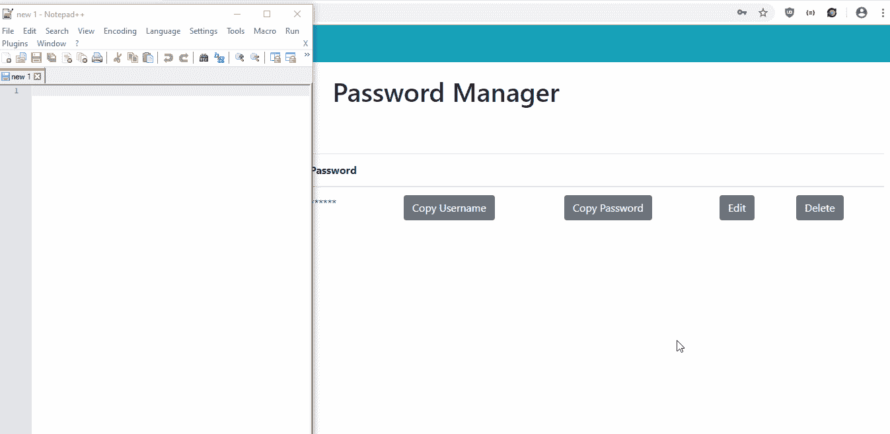
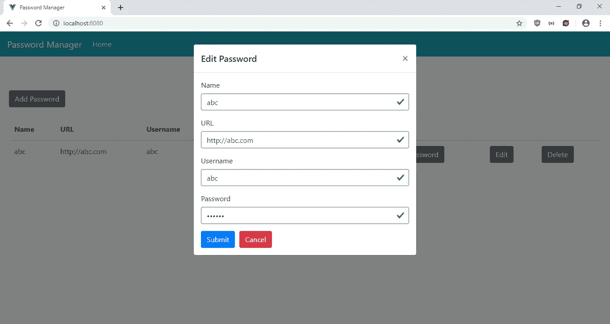
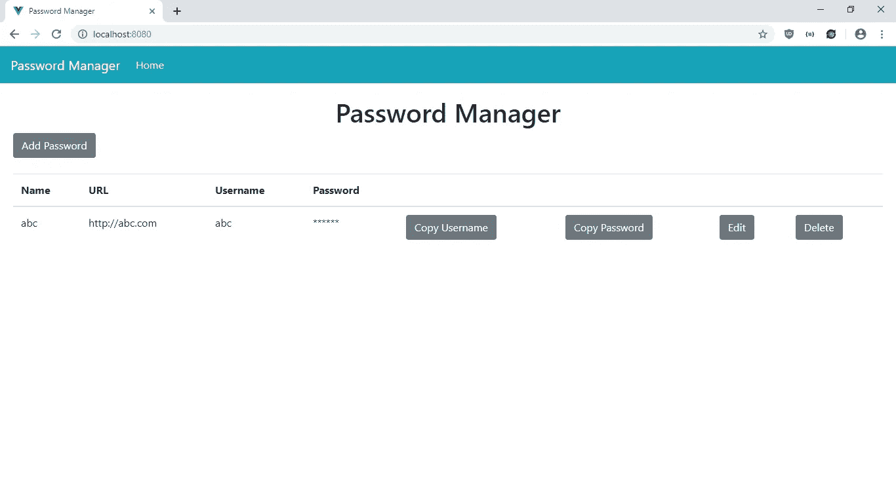

# 如何将复制到剪贴板功能添加到 Vue.js 应用程序

> 原文：<https://levelup.gitconnected.com/how-to-add-copy-to-clipboard-feature-to-your-vue-js-app-ff4b22406e15>


复制到剪贴板功能是像密码管理器这样的 web 应用程序的一个受欢迎的功能，在这里人们不方便高亮显示文本然后复制它。这是一个添加到您自己的 web 应用程序的简单功能。

在本文中，我们将构建一个密码管理器，让您输入、编辑和删除密码，并让他们将自己的用户名和密码复制到剪贴板，以便在他们喜欢的任何地方使用。我们将使用 Vue.js 来构建应用程序。

# 入门指南

首先，我们通过运行`npx @vue/cli create password-manager`来创建项目。在向导中，选择“手动选择功能”，并选择在我们的应用程序中包括 Babel、Vue 路由器和 Vuex。

接下来，我们安装一些我们需要的库。我们需要 Axios 进行 HTTP 请求，Bootstrap Vue 进行样式设计，V-Clipboard 用于复制到剪贴板功能，Vee-Validate 用于表单验证。我们通过运行以下命令来安装它们:

```
npm i axios bootstrap-vue v-clipboard vee-validate
```

安装完库之后，我们就可以开始构建应用程序了。首先，在`components`文件夹中，为我们的密码表单创建一个名为`PasswordForm.vue`的文件。然后在那里，我们加上:

```
<template>
  <ValidationObserver ref="observer" v-slot="{ invalid }">
    <b-form [@submit](http://twitter.com/submit).prevent="onSubmit" novalidate>
      <b-form-group label="Name">
        <ValidationProvider name="name" rules="required" v-slot="{ errors }">
          <b-form-input
            type="text"
            :state="errors.length == 0"
            v-model="form.name"
            required
            placeholder="Name"
            name="name"
          ></b-form-input>
          <b-form-invalid-feedback :state="errors.length == 0">Name is requied.</b-form-invalid-feedback>
        </ValidationProvider>
      </b-form-group> <b-form-group label="URL">
        <ValidationProvider name="url" rules="required|url" v-slot="{ errors }">
          <b-form-input
            type="text"
            :state="errors.length == 0"
            v-model="form.url"
            required
            placeholder="URL"
            name="url"
          ></b-form-input>
          <b-form-invalid-feedback :state="errors.length == 0">{{errors.join('. ')}}</b-form-invalid-feedback>
        </ValidationProvider>
      </b-form-group> <b-form-group label="Username">
        <ValidationProvider name="username" rules="required" v-slot="{ errors }">
          <b-form-input
            type="text"
            :state="errors.length == 0"
            v-model="form.username"
            required
            placeholder="Username"
            name="username"
          ></b-form-input>
          <b-form-invalid-feedback :state="errors.length == 0">Username is requied.</b-form-invalid-feedback>
        </ValidationProvider>
      </b-form-group> <b-form-group label="Password">
        <ValidationProvider name="password" rules="required" v-slot="{ errors }">
          <b-form-input
            type="password"
            :state="errors.length == 0"
            v-model="form.password"
            required
            placeholder="Password"
            name="password"
          ></b-form-input>
          <b-form-invalid-feedback :state="errors.length == 0">Password is requied.</b-form-invalid-feedback>
        </ValidationProvider>
      </b-form-group> <b-button type="submit" variant="primary" style="margin-right: 10px">Submit</b-button>
      <b-button type="reset" variant="danger" [@click](http://twitter.com/click)="cancel()">Cancel</b-button>
    </b-form>
  </ValidationObserver>
</template><script>
import { requestsMixin } from "@/mixins/requestsMixin";export default {
  name: "PasswordForm",
  mixins: [requestsMixin],
  props: {
    edit: Boolean,
    password: Object
  },
  methods: {
    async onSubmit() {
      const isValid = await this.$refs.observer.validate();
      if (!isValid) {
        return;
      }if (this.edit) {
        await this.editPassword(this.form);
      } else {
        await this.addPassword(this.form);
      }
      const response = await this.getPasswords();
      this.$store.commit("setPasswords", response.data);
      this.$emit("saved");
    },
    cancel() {
      this.$emit("cancelled");
    }
  },
  data() {
    return {
      form: {}
    };
  },
  watch: {
    password: {
      handler(p) {
        this.form = JSON.parse(JSON.stringify(p || {}));
      },
      deep: true,
      immediate: true
    }
  }
};
</script>
```

我们在这个组件中有密码表单。该表单包括名称、URL、用户名和密码字段。都是必须的。我们使用 Vee-Validate 来验证表单字段。`ValidationObserver`组件用于验证整个表单，而`ValidationProvider`组件用于验证它包装的表单字段。

验证规则由每个字段的`rule`属性指定。我们对 URL 字段有一个特殊的`url`规则。当作用域槽中的`errors`对象具有非零长度时，我们显示验证错误消息。`state`道具用于设置验证状态，当`errors`长度为 0 时显示绿色，否则显示红色。错误信息显示在`b-form-invalid-feedback`组件中。

当用户点击保存按钮时，调用`onSubmit`函数。我们通过使用 `this.$refs.observer.validate();`获得表单的验证状态。ref 是指`ValidationObserver`的 ref。如果它解析为`true`，那么我们根据`edit`属性调用`addPassword`或`editPassword`来保存条目。然后我们通过调用`getPasswords`获得密码，然后通过调度`setPasswords`变异将密码放入我们的 Vuex 存储中。然后我们发出`saved`事件来关闭主页上的模态。

我们有一个主要在编辑现有条目时使用的`watch`块，我们获得`password`属性并通过复制属性将其设置为`this.form`，这样我们只更新`form`对象，而在绑定数据时不更新任何内容。

接下来，我们创建一个`mixins`文件夹，并在其中添加`requestsMixin.js`。在文件中，添加:

```
const APIURL = "[http://localhost:3000](http://localhost:3000)";
const axios = require("axios");export const requestsMixin = {
  methods: {
    getPasswords() {
      return axios.get(`${APIURL}/passwords`);
    }, addPassword(data) {
      return axios.post(`${APIURL}/passwords`, data);
    }, editPassword(data) {
      return axios.put(`${APIURL}/passwords/${data.id}`, data);
    }, deletePassword(id) {
      return axios.delete(`${APIURL}/passwords/${id}`);
    }
  }
};
```

这包含在后端发出 HTTP 请求的代码。我们将这个 mixin 包含在我们的组件中，这样我们就可以从它们发出后端请求。

# 复制到剪贴板功能

为了复制用户名和密码按钮，我们使用了`v-clipboard`指令，让我们在单击按钮时将用户名和密码分别复制到剪贴板。

在`Home.vue`中，我们将现有代码替换为:

```
<template>
  <div class="page">
    <h1 class="text-center">Password Manager</h1>
    <b-button-toolbar>
      <b-button [@click](http://twitter.com/click)="openAddModal()">Add Password</b-button>
    </b-button-toolbar>
    <br />
    <b-table-simple responsive>
      <b-thead>
        <b-tr>
          <b-th>Name</b-th>
          <b-th>URL</b-th>
          <b-th>Username</b-th>
          <b-th>Password</b-th>
          <b-th></b-th>
          <b-th></b-th>
          <b-th></b-th>
          <b-th></b-th>
        </b-tr>
      </b-thead>
      <b-tbody>
        <b-tr v-for="p in passwords" :key="p.id">
          <b-td>{{p.name}}</b-td>
          <b-td>{{p.url}}</b-td>
          <b-td>{{p.username}}</b-td>
          <b-td>******</b-td>
          <b-td>
            <b-button v-clipboard="() => p.username">Copy Username</b-button>
          </b-td>
          <b-td>
            <b-button v-clipboard="() => p.password">Copy Password</b-button>
          </b-td>
          <b-td>
            <b-button [@click](http://twitter.com/click)="openEditModal(p)">Edit</b-button>
          </b-td>
          <b-td>
            <b-button [@click](http://twitter.com/click)="deleteOnePassword(p.id)">Delete</b-button>
          </b-td>
        </b-tr>
      </b-tbody>
    </b-table-simple><b-modal id="add-modal" title="Add Password" hide-footer>
      <PasswordForm [@saved](http://twitter.com/saved)="closeModal()" [@cancelled](http://twitter.com/cancelled)="closeModal()" :edit="false"></PasswordForm>
    </b-modal><b-modal id="edit-modal" title="Edit Password" hide-footer>
      <PasswordForm
        [@saved](http://twitter.com/saved)="closeModal()"
        [@cancelled](http://twitter.com/cancelled)="closeModal()"
        :edit="true"
        :password="selectedPassword"
      ></PasswordForm>
    </b-modal>
  </div>
</template><script>
import { requestsMixin } from "@/mixins/requestsMixin";
import PasswordForm from "@/components/PasswordForm";export default {
  name: "home",
  components: {
    PasswordForm
  },
  mixins: [requestsMixin],
  computed: {
    passwords() {
      return this.$store.state.passwords;
    }
  },
  beforeMount() {
    this.getAllPasswords();
  },
  data() {
    return {
      selectedPassword: {}
    };
  },
  methods: {
    openAddModal() {
      this.$bvModal.show("add-modal");
    },
    openEditModal(password) {
      this.$bvModal.show("edit-modal");
      this.selectedPassword = password;
    },
    closeModal() {
      this.$bvModal.hide("add-modal");
      this.$bvModal.hide("edit-modal");
      this.selectedPassword = {};
    },
    async deleteOnePassword(id) {
      await this.deletePassword(id);
      this.getAllPasswords();
    },
    async getAllPasswords() {
      const response = await this.getPasswords();
      this.$store.commit("setPasswords", response.data);
    }
  }
};
</script>
```

在这个文件中，我们有一个表来显示密码条目的列表，并让用户打开和关闭添加/编辑模式。我们在每一行都有按钮来复制用户名和密码，还可以让用户编辑或删除每个条目。

在`scripts`部分，我们用`beforeMount`钩子在页面加载期间用我们在 mixin 中编写的`getPasswords`函数获取所有密码条目。当编辑按钮被点击时，`selectedPassword`变量被设置，我们将它传递给`PasswordForm`进行编辑。

要删除密码，我们在 mixin 中调用`deletePassword`向后端发出请求。

# 完成应用程序

接下来在`App.vue`中，我们将现有代码替换为:

```
<template>
  <div id="app">
    <b-navbar toggleable="lg" type="dark" variant="info">
      <b-navbar-brand href="#">Password Manager</b-navbar-brand> <b-navbar-toggle target="nav-collapse"></b-navbar-toggle> <b-collapse id="nav-collapse" is-nav>
        <b-navbar-nav>
          <b-nav-item to="/" :active="path  == '/'">Home</b-nav-item>
        </b-navbar-nav>
      </b-collapse>
    </b-navbar>
    <router-view />
  </div>
</template><script>
export default {
  data() {
    return {
      path: this.$route && this.$route.path
    };
  },
  watch: {
    $route(route) {
      this.path = route.path;
    }
  }
};
</script><style lang="scss">
.page {
  padding: 20px;
}button {
  margin-right: 10px;
}
</style>
```

这将在页面顶部添加一个引导导航条，以及一个显示我们定义的路线的`router-view`。

接下来在`main.js`中，将代码替换为:

```
import Vue from "vue";
import App from "./App.vue";
import router from "./router";
import store from "./store";
import BootstrapVue from "bootstrap-vue";
import { ValidationProvider, extend, ValidationObserver } from "vee-validate";
import Clipboard from "v-clipboard";
import { required } from "vee-validate/dist/rules";
import "bootstrap/dist/css/bootstrap.css";
import "bootstrap-vue/dist/bootstrap-vue.css";extend("required", required);
extend("url", {
  validate: value => {
    return /^(http:\/\/www\.|https:\/\/www\.|http:\/\/|https:\/\/)?[a-z0-9]+([\-\.]{1}[a-z0-9]+)*\.[a-z]{2,5}(:[0-9]{1,5})?(\/.*)?$/.test(
      value
    );
  },
  message: "URL is invalid."
});
Vue.use(BootstrapVue);
Vue.use(Clipboard);
Vue.component("ValidationProvider", ValidationProvider);
Vue.component("ValidationObserver", ValidationObserver);Vue.config.productionTip = false;new Vue({
  router,
  store,
  render: h => h(App)
}).$mount("#app");
```

将我们安装的库添加到我们的应用程序中，以便我们可以在组件中使用它。我们在这里添加了 V-Clipboard 库，这样我们就可以在我们的主页中使用它。我们从 Vee-Validate 调用`extend`来添加我们想要使用的表单验证规则。此外，我们在这个文件中导入了引导 CSS 来获取样式。

在`router.js`中，我们将现有代码替换为:

```
import Vue from 'vue'
import Router from 'vue-router'
import Home from './views/Home.vue'Vue.use(Router)export default new Router({
  mode: 'history',
  base: process.env.BASE_URL,
  routes: [
    {
      path: '/',
      name: 'home',
      component: Home
    }
  ]
})
```

只包含我们的主页。

然后在`store.js`中，我们将现有代码替换为:

```
import Vue from "vue";
import Vuex from "vuex";Vue.use(Vuex);export default new Vuex.Store({
  state: {
    passwords: []
  },
  mutations: {
    setPasswords(state, payload) {
      state.passwords = payload;
    }
  },
  actions: {}
});
```

这将我们的`passwords`状态添加到存储中，因此我们可以在`PasswordForm`和`HomePage`组件的`computed`块中观察到它。我们有`setPasswords`函数来更新`passwords`状态，我们通过调用`this.$store.commit(“setPasswords”, response.data);`在组件中使用它，就像我们在`PasswordForm`中做的那样。

经过所有的努力，我们可以通过运行`npm run serve`来启动我们的应用程序。

# 演示后端

为了启动后端，我们首先通过运行`npm i json-server`来安装`json-server`包。然后，转到我们的项目文件夹并运行:

```
json-server --watch db.json
```

在`db.json`中，将文本改为:

```
{
  "passwords": [
  ]
}
```

所以我们有了定义在可用的`requests.js`中的`passwords`端点。

经过所有的努力，我们得到了:

