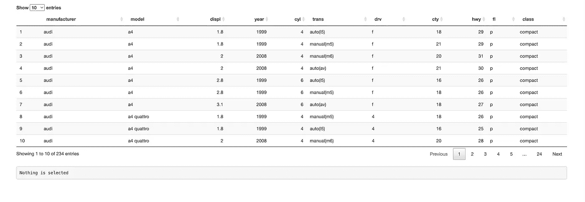
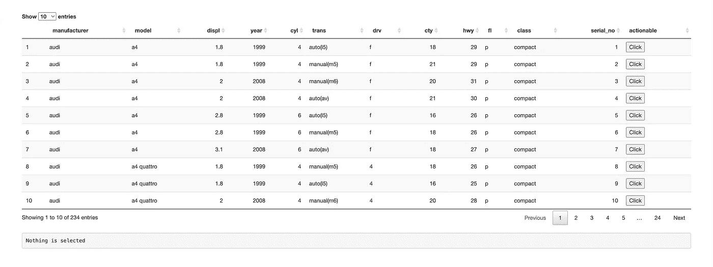
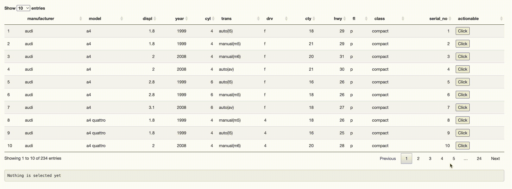

# 如何向闪亮的数据表添加自定义可操作的

> 原文：<https://levelup.gitconnected.com/how-to-add-custom-actionable-to-a-shiny-datatable-ffe26e22747b>

Shiny 是一个有用的 R 框架，可以快速制作漂亮的仪表板，并作为 Web 应用程序托管数据分析。今天我们将在闪亮的数据表中看到如何添加一些可操作的(像一个按钮)和按下特定的行动可以执行。

应用程序以数据表的形式显示预定义的[数据集](https://ggplot2.tidyverse.org/reference/mpg.html)(包含汽车信息，带有 R 库， [tidyverse](https://www.tidyverse.org/) )。假设我们必须在表格的每一行添加按钮。按下按钮后，必须执行特定的操作，比如显示关于所选行的更多信息。

针对上述问题语句的强制方法将为表中的 N 行添加 N 个 observeEvent，其中每个 observe event 将为单行中的每个按钮设置一个观察者。但这是一个糟糕的解决方案。相反，我们能做的是，同时观察所有的按钮。让我们看看如何做到这一点。我们将首先在下面的代码中将按钮添加到表格中。

此时，应用程序应该是这样的。

现在我们必须在所有的按钮上设置可操作的，我们已经介绍过了。是的，有一种巧妙的方法可以做到这一点，让所有的按钮都有不同的 id，按下任何一个按钮，Javascript 的 onclick 事件都会用不同的值更新同样闪亮的输入变量(比如说 *input$btn* )。这样，只需在*输入$btn* 上的一个 observeEvent 就可以完成这项工作。让我们看看代码。

选择任何按钮的整个动作都可以在视频中看到。

类似地，我们可以执行任何其他动作，比如在选择一行(或按钮)时启动弹出模式，还可能有更多的用例。

有关其他数据表定制选项的更多信息，请参考[文档](https://datatables.net/manual/options)。谢谢大家，编码快乐！！