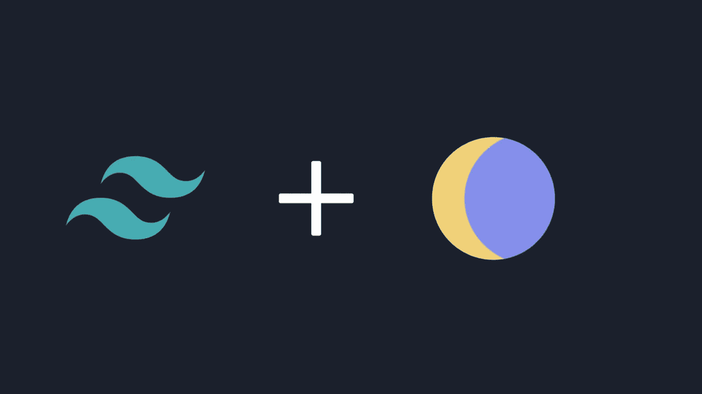

# 如何在你的 NuxtJS 项目中加入黑暗模式

> 原文：<https://levelup.gitconnected.com/how-to-add-dark-mode-to-your-nuxtjs-project-d8f016c2211f>

## 如何用@nuxtjs/color-mode 和 tailwindCSS 给一个 Nuxt.js 网站添加黑暗模式



图片来自@avneeshagarwal

利用暗光模式的应用出现了迅猛增长。大多数现代应用程序都实现了黑暗模式。更进一步来说，黑暗模式是非常漂亮的，当正确实施时，它是容易和美丽的眼睛。

在这篇文章中，我们将看到如何在你的 Nuxtjs 项目中创建一个黑暗模式。我们还将在亮暗模式之间切换。

## **入门**

我们将利用一个名为 ***@nuxt/color-mode*** 的包。这个包将使我们更容易在亮暗模式之间切换。

它还将使我们能够定位和检测系统主题，并将其呈现在我们的项目中。

## **安装@nuxt/color-mode**

我们可以使用 NPM 或纱安装它，这取决于您的首选包管理器。

**NPM**

```
npm i @nuxtjs/color-mode
```

**纱线**

```
yarn add @nuxtjs/color-mode
```

## **将包添加到 NuxtJS 实例**

现在我们需要将包添加到我们的 NuxtJS 实例中，并让 NuxtJS 将它包含在构建过程中。导航到***nuxt . config . js***文件，并将以下内容添加到您的 ***buildModules*** 中。

如果您使用的是较低版本的 NuxtJS，那么您需要将它包含在您的模块中。

现在，您还需要添加一个 CSS 文件，最好是在 assets 目录中，并将其命名为 main.css。

这将把 CSS 样式加载到应用程序的 main.css 文件中。

添加 CSS 样式

现在，在 main.css 文件中，我们将为暗模式和亮模式添加应用程序主题。

我的 ***main.css*** 文件包含以下样式。

根造型代表我们项目的灯光模式 ***颜色/主题*** 。dark-mode 类表示黑暗模式切换时使用的黑暗模式主题。

根据你对颜色的喜好，你可以给它添加不同的主题，并进行调整。

## **创建明暗模式切换按钮**

在这种情况下，我们将显示一些 SVG 来表示暗模式和亮模式选择。在这种情况下，我们将有两个按钮，根据用户的选择有条件地呈现。

我们还将利用***@ nuxt/color-mode***包的更大部分来识别和表示亮暗模式切换。

在下面提供的代码片段中，你可以看到我们如何利用 ***toggleSwitch*** 方法中的颜色模式包。

现在，如果用户点击按钮，它将在亮暗模式之间切换。另外，需要注意的是，我使用了 tailwindCSS 进行额外的样式和主题化。

## **结论**

将黑暗模式添加到你的投资组合或项目中会令人惊奇，你可以在旅途中学到一些新东西。

感谢您花时间阅读这篇文章。

## **更读着**

[](/the-new-programming-approach-i-am-adopting-d0e532f786e2) [## 我采用的新编程方法

### 我把这个概念融入到我的项目中，我很喜欢它

levelup.gitconnected.com](/the-new-programming-approach-i-am-adopting-d0e532f786e2) [](/my-struggles-as-a-programmer-7bf1e1bf344d) [## 我作为程序员的奋斗。

### 一个程序员的日常生活奋斗。

levelup.gitconnected.com](/my-struggles-as-a-programmer-7bf1e1bf344d)