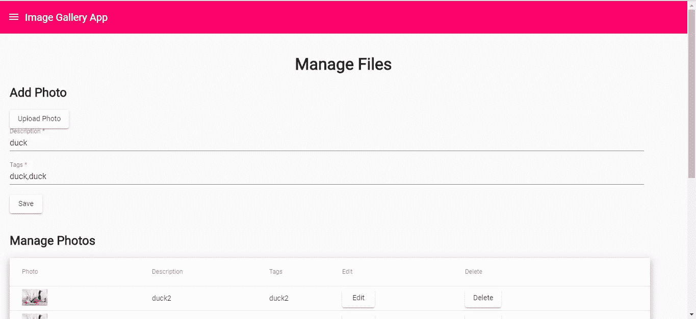
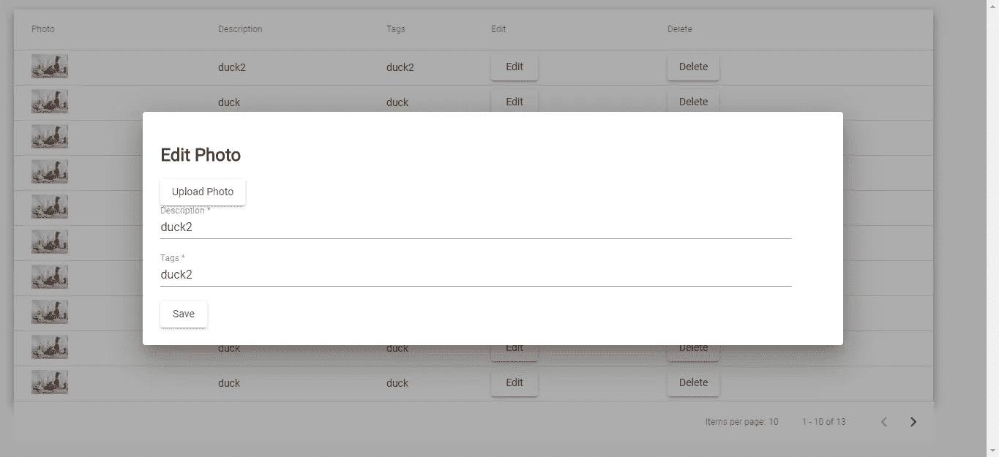
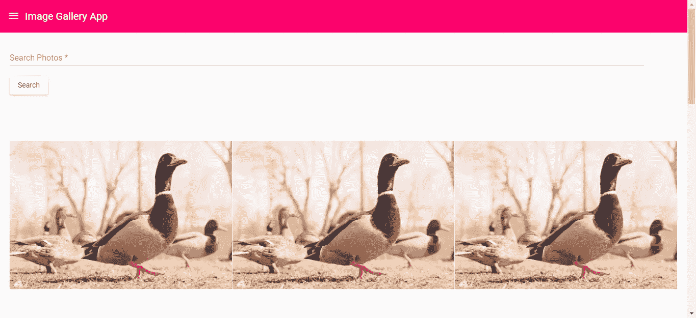
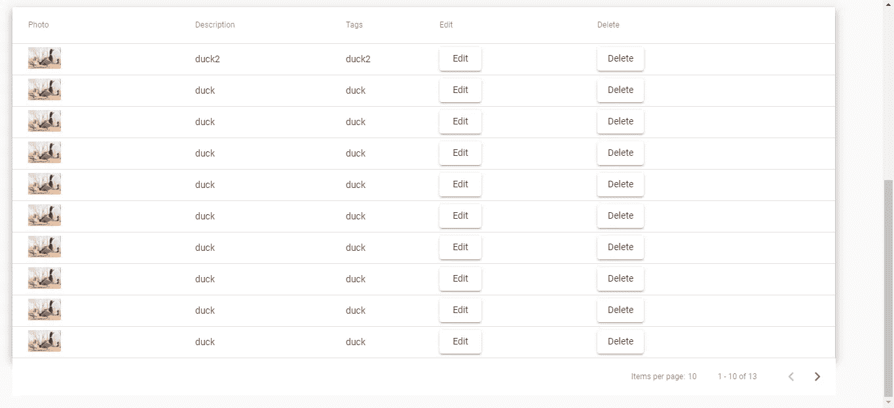

# 如何将文件上传添加到您的 GraphQL API

> 原文：<https://levelup.gitconnected.com/how-to-add-file-upload-to-your-graphql-api-34d51e341f38>



GraphQL 是一种由脸书开发的 API 查询语言，用于向服务器发送/接收数据。它使用自己的查询语法，但仍然通过 HTTP 发送数据，并且只使用一个端点来发送数据(通常是`POST` `/graphql`)。使用 GraphQL 的好处包括为发送的数据字段指定数据类型，并且可以指定返回的数据字段的类型。语法简单易懂。数据仍然以 JSON 的形式返回，以便于访问和操作。由于这些特性，开发人员迅速采用 GraphQL 来构建他们的 API。

文件上传是 GraphQL 最近通过库增加的功能。除了发送文本数据，它还允许我们直接用 GraphQL APIs 上传文件。它对许多应用程序非常有用，扩展了 GraphQL 的用例，使之包括任何需要文件上传和操作的内容。

GraphQL 请求仍然是 HTTP 请求。但是，您总是通过一个端点发送和接收数据。通常，这是`graphql`端点。所有请求都是 POST 请求，无论您是获取、操作还是删除数据。为了区分获取和操作数据，GraphQL 请求可以分为“查询”和“突变”。以下是 GraphQL 请求的一个示例:

```
{
  getPhotos(page: 1) {
    photos {
      id
      fileLocation
      description
      tags
    }
    page
    totalPhotos
  }
}
```

通过这个请求，我们指示服务器调用`getPhotos`解析器，这个函数将返回参数`page`设置为 1 的数据，然后我们想要取回`photos`数组的`id`、`fileLocation`、`description`和`tags`字段，还想要得到`page`和`totalPhotos`字段。

GraphQL APIs 可以使用任何数据库系统，因为它只改变了 API 层。底层的逻辑仍然和 REST API 一样。

Node.js with Express 对制作 GraphQL APIs 有很大的支持。我们可以使用`express-graphql`库来构建我们的 GraphQL API。它是一个中间件，允许您在快速后端应用程序中获得 GraphQL 功能。

# 构建后端

我们将使用 GraphQL API 构建一个图库应用程序，该应用程序使用 Express 和一个使用带角度材料的材料设计的角度前端来接受文件上传以及一些文本数据。我们从图片库应用的后端部分开始。

为了开始构建应用程序，我们创建一个新的项目文件夹，其中包含一个`backend`文件夹来存储后端文件。然后我们进入文件夹并运行`npx express-generator`来为应用程序生成文件。

之后，我们需要安装一些文件，让我们在应用程序中使用 JavaScript 的最新功能。首先，我们为运行`npm i`生成的框架应用程序安装软件包。然后我们运行`npm i @babel/cli @babel/core @babel/node @babel/preset-env`来安装最新的 Babel 包，将最新的 JavaScript 特性加入到我们的应用中。接下来，我们需要在全球范围内安装`nodemon`,让我们在开发过程中随着代码文件的变化自动重启应用程序。在后端应用程序的项目文件夹的根级别中创建一个名为`.babelrc`的文件，并添加以下内容:

```
{
    "presets": [
        "[@babel/preset-env](http://twitter.com/babel/preset-env)"
    ],}
```

然后在`package.json`的`scripts`部分，我们放入:

```
"babel-node": "babel-node",
"start": "nodemon --exec npm run babel-node -- ./bin/www"
```

这使得我们可以用最新的 JavaScript 特性运行我们的应用程序。如果您得到错误，卸载以前版本的 Babel CLI 和 Babel 核心软件包，并再次尝试上述步骤。`./bin/www`是后端 app 的入口。

接下来，我们需要使用 Sequelize CLI 将初始 ORM 代码添加到我们的后端应用程序中。为此，我们运行`npx sequelize-cli init`将 ORM 代码添加到我们的应用程序中。您应该已经创建了`config/config.json`和`models`文件夹。然后我们运行`npm i sequelize`来安装 Sequelize 库。

然后，我们可以通过运行以下命令来构建我们的模型:

```
npx sequelize-cli model:generate --name Photo --attributes fileLocation:string,description:string,tags:string
```

当我们运行使用该命令创建的迁移时，这将在我们的数据库中创建`Photo`模型和`Photos`表。现在我们将`config.json`重命名为`config.js`，并通过运行`npm i pg pg-hstore`安装`dotenv`和 Postgres 包。

然后在`config/config.js`中，我们放入:

```
require('dotenv').config();
const dbHost = process.env.DB_HOST;
const dbName = process.env.DB_NAME;
const dbUsername = process.env.DB_USERNAME;
const dbPassword = process.env.DB_PASSWORD;
const dbPort = process.env.DB_PORT || 5432;module.exports = {
    development: {
        username: dbUsername,
        password: dbPassword,
        database: dbName,
        host: dbHost,
        port: dbPort,
        dialect: 'postgres'
    },
    test: {
        username: dbUsername,
        password: dbPassword,
        database: 'graphql_app_test',
        host: dbHost,
        port: dbPort,
        dialect: 'postgres'
    },
    production: {
        use_env_variable: 'DATABASE_URL',
        username: dbUsername,
        password: dbPassword,
        database: dbName,
        host: dbHost,
        port: dbPort,
        dialect: 'postgres'
    }
};
```

这让我们可以从后端应用程序项目文件夹的根目录中创建的`.env`文件中获取数据库凭证和名称。在运行迁移之前，我们必须创建一个空数据库。使用您选择的名称创建一个空数据库，并在`.env`文件中设置值`DB_NAME`键的名称，并使用数据库密码进行同样的操作。

现在我们有了运行迁移的一切。我们通过执行`npx sequelize-cli db:migrate`来运行它。您应该有一个包含照片表的空表。

接下来，我们创建`files`文件夹，并将一个空的`.gitkeep`文件放入其中，这样我们就可以提交它了。

建立数据库连接后，我们可以开始构建逻辑。因为我们正在构建一个 GraphQL API，所以我们需要为 Express 安装 GraphQL 库。为此，我们运行`npm i cors express-graphql graphql graphql-tools graphql-upload`。我们需要`cors`库，这样我们就可以与我们的前端应用程序进行通信，这将在不同的领域托管。其他的是 GraphQL 库。`graphql-upload`将允许我们在 GraphQL 端点中轻松接受文件。您可以直接传入一个 JavaScript 文件对象，在转换成读流后，它可以保存到磁盘。

安装完库之后，我们需要为我们的应用程序编写逻辑。我们在后端应用程序的根文件夹中创建了一个名为`graphql`的文件夹，其中包含了应用程序的逻辑文件。接下来，我们创建一个名为`resolvers.js`的文件，并添加以下内容:

```
const Op = require('sequelize').Op;const models = require('../models');
const fs = require('fs');const storeFS = ({ stream, filename }) => {
    const uploadDir = '../backend/photos';
    const path = `${uploadDir}/${filename}`;
    return new Promise((resolve, reject) =>
        stream
            .on('error', error => {
                if (stream.truncated)
                    // delete the truncated file
                    fs.unlinkSync(path);
                reject(error);
            })
            .pipe(fs.createWriteStream(path))
            .on('error', error => reject(error))
            .on('finish', () => resolve({ path }))
    );
}export const getPhotos = async (args) => {
    const page = args.page;
    const photos = await models.Photo.findAll({
        offset: (page - 1) * 10,
        limit: 10
    });
    const totalPhotos = await models.Photo.count();
    return {
        photos,
        page,
        totalPhotos
    };
}export const addPhoto = async (args) => {
    const { description, tags } = args;
    const { filename, mimetype, createReadStream } = await args.file;
    const stream = createReadStream();
    const pathObj = await storeFS({ stream, filename });
    const fileLocation = pathObj.path;
    const photo = await models.Photo.create({
        fileLocation,
        description,
        tags
    })
    return photo;
}export const editPhoto = async (args) => {
    const { id, description, tags } = args;
    const { filename, mimetype, createReadStream } = await args.file;
    const stream = createReadStream();
    const pathObj = await storeFS({ stream, filename });
    const fileLocation = pathObj.path;
    const photo = await models.Photo.update({
        fileLocation,
        description,
        tags
    }, {
            where: {
                id
            }
        })
    return photo;
}export const deletePhoto = async (args) => {
    const { id } = args;
    await models.Photo.destroy({
        where: {
            id
        }
    })
    return id;
}export const searchPhotos = async (args) => {
    const searchQuery = args.searchQuery;
    const photos = await models.Photo.findAll({
        where: {
            [Op.or]: [
                {
                    description: {
                        [Op.like]: `%${searchQuery}%`
                    }
                },
                {
                    tags: {
                        [Op.like]: `%${searchQuery}%`
                    }
                }
            ]
        }});
    const totalPhotos = await models.Photo.count();
    return {
        photos,
        totalPhotos
    };
}
```

在上面的代码中，我们有 GraphQL 请求最终指向的解析器。我们有通过接受文件及其描述和标签字符串来添加照片的解析器。`edit`端点与此类似，只是它也接受一个整数 ID，并允许用户保存他们的照片。`delete`解析器获取一个 ID，让人们删除他们的照片表条目。注意，请求的所有参数都在`args`参数中。

我们上传的文件最终作为承诺出现在`args`对象中。我们可以很容易地获取它，将其转换成流，并像使用`storeFS`函数那样保存它。我们承诺轻松保存数据，然后将文本数据顺序保存到数据库中。

`searchPhotos`解析器获取搜索查询的字符串，然后使用以下对象在数据库中执行`where`or 查询:

```
where: {
   [Op.or]: [
     {
       description: {
         [Op.like]: `%${searchQuery}%`
       }
     },
     {
      tags: {
          [Op.like]: `%${searchQuery}%`
      }
    }
  ]
}
```

这将在描述和标签列中搜索搜索查询。

接下来，我们在`graphql`文件夹中创建一个名为`schema.js`的文件，并添加以下内容:

```
const { buildSchema } = require('graphql');export const schema = buildSchema( `
    scalar Uploadtype Photo {
        id: Int,
        fileLocation: String,
        description: String,
        tags: String
    }type PhotoData {
        photos: [Photo],
        page: Int,
        totalPhotos: Int
    }type Query {
        getPhotos(page: Int): PhotoData,
        searchPhotos(searchQuery: String): PhotoData
    }type Mutation {
        addPhoto(file: Upload!, description: String, tags: String): Photo
        editPhoto(id: Int, file: Upload!, description: String, tags: String): Photo
        deletePhoto(id: Int): Int
    }
`);
```

我们为我们的查询和突变定义数据类型。注意，我们还在文件中定义了一个名为`Upload`的新标量类型，使我们能够通过`graphql-upload`库获取文件数据。类型`Query`包括所有的查询，冒号左边的代码是解析器的函数签名，右边是它返回的数据类型。

类型`Photo`和`PhotoData`是我们通过添加标量类型的字段定义的类型。`Int`和`String`是`express-graphql`包中包含的基本类型。任何带有感叹号的内容都是必需的。`buildSchema`函数构建我们将与 Express GraphQL 中间件一起使用的模式。`getPhotos`和`searchPhotos`是查询端点。`addPhoto`、`editPhoto`和`deletePhoto`。我们在请求中调用这些端点，就像我们在故事开始的例子中所做的那样。

接下来在`app.js`中，我们输入以下内容:

```
const createError = require('http-errors');
const express = require('express');
const path = require('path');
const cookieParser = require('cookie-parser');
const logger = require('morgan');
const expressGraphql = require('express-graphql');
const cors = require('cors');
const app = express();
import { GraphQLUpload } from 'graphql-upload'
import { schema } from './graphql/schema'
import {
  getPhotos,
  addPhoto,
  editPhoto,
  deletePhoto,
  searchPhotos
} from './graphql/resolvers'
import { graphqlUploadExpress } from 'graphql-upload'const root = {
  Upload: GraphQLUpload,
  getPhotos,
  addPhoto,
  editPhoto,
  deletePhoto,
  searchPhotos
}// view engine setup
app.set('views', path.join(__dirname, 'views'));
app.set('view engine', 'jade');
app.use(cors());
app.use(logger('dev'));
app.use(express.json());
app.use(express.urlencoded({ extended: false }));
app.use(cookieParser());
app.use(express.static(path.join(__dirname, 'public')));
app.use('/photos', express.static(path.join(__dirname, 'photos')));app.use(
  '/graphql',
  graphqlUploadExpress({ maxFileSize: 10000000, maxFiles: 10 }),
  expressGraphql({
    schema,
    rootValue: root,
    graphiql: true
  })
)// catch 404 and forward to error handler
app.use(function (req, res, next) {
  next(createError(404));
});// error handler
app.use(function (err, req, res, next) {
  // set locals, only providing error in development
  res.locals.message = err.message;
  res.locals.error = req.app.get('env') === 'development' ? err : {};// render the error page
  res.status(err.status || 500);
  res.render('error');
});module.exports = app;
```

我们包含了用于跨域通信的 CORS 中间件，我们拥有的唯一端点是`/graphql`端点。我们在参数中有`graphqlUploadExpress({ maxFileSize: 10000000, maxFiles: 10 })`来启用文件上传，我们有:

```
const root = {
  Upload: GraphQLUpload,
  getPhotos,
  addPhoto,
  editPhoto,
  deletePhoto,
  searchPhotos
}
```

和

```
expressGraphql({
  schema,
  rootValue: root,
  graphiql: true
})
```

我们将模式和解析器连接在一起，并启用我们的 GraphQL 端点。`graphiql: true`启用一个交互式沙箱，我们可以在其中测试我们的 GraphQL 请求。

最后，在`bin/www`中，我们有:

```
#!/usr/bin/env node
require('dotenv').config();
/**
 * Module dependencies.
 */var app = require('../app');
var debug = require('debug')('backend:server');
var http = require('http');/**
 * Get port from environment and store in Express.
 */var port = normalizePort(process.env.PORT || '3000');
app.set('port', port);/**
 * Create HTTP server.
 */var server = http.createServer(app);/**
 * Listen on provided port, on all network interfaces.
 */server.listen(port);
server.on('error', onError);
server.on('listening', onListening);/**
 * Normalize a port into a number, string, or false.
 */function normalizePort(val) {
  var port = parseInt(val, 10);if (isNaN(port)) {
    // named pipe
    return val;
  }if (port >= 0) {
    // port number
    return port;
  }return false;
}/**
 * Event listener for HTTP server "error" event.
 */function onError(error) {
  if (error.syscall !== 'listen') {
    throw error;
  }var bind = typeof port === 'string'
    ? 'Pipe ' + port
    : 'Port ' + port;// handle specific listen errors with friendly messages
  switch (error.code) {
    case 'EACCES':
      console.error(bind + ' requires elevated privileges');
      process.exit(1);
      break;
    case 'EADDRINUSE':
      console.error(bind + ' is already in use');
      process.exit(1);
      break;
    default:
      throw error;
  }
}/**
 * Event listener for HTTP server "listening" event.
 */function onListening() {
  var addr = server.address();
  var bind = typeof addr === 'string'
    ? 'pipe ' + addr
    : 'port ' + addr.port;
  debug('Listening on ' + bind);
}
```

总之，这些代码文件将使我们能够使用`npm start`运行我们的 GraphQL API。

# 构建前端

现在我们可以构建前端应用程序。首先通过运行`npm i -g @angular/cli`安装 Angular CLI。然后转到项目文件夹的根目录，运行`ng new frontend`来搭建前端 app。当系统询问您是否希望分别包含路由和样式选项时，请确保选择了路由和 SCSS。

我们需要安装我们的库。我们需要一个 GraphQL 客户端、Angular Material 和一个 flux 库来存储我们的应用程序的状态。我们通过运行`npm i @ngrx/store @angular/cdk @angular/material`来安装它们。该命令将分别安装通量库和角度材料。接下来我们运行`ng add @ngrx/store`来运行 NGRX Store 的框架代码。为了安装 Angular Apollo，它是 Angular 的 GraphQL 客户端，我们运行`ng add apollo-angular`。这将添加一个新模块和其他代码，使我们能够在 Angular 应用程序中使用 GraphQL。

前端应用程序将包括一个页面，用户可以获得和搜索他们的照片，另一个页面，他们可以上传新照片，编辑或删除现有的照片。他们可以获取或搜索照片的页面将成为主页。它将有一个导航左侧菜单。

现在我们准备写代码了。我们首先运行命令来创建新文件:

```
ng g component editPhotoDialog --module app
ng g component homePage --module app
ng g component topBar --module app
ng g component uploadPage --module app
ng g service photo --module app
```

注意，我们必须通过添加`--module app`选项来指定我们想要添加代码的模块，以便它们可以在我们的主`app`模块中使用。

在应该从这些命令创建的`photo.service.ts`中，我们输入:

```
import { Injectable } from '[@angular/core](http://twitter.com/angular/core)';
import { Apollo } from 'apollo-angular';
import gql from 'graphql-tag';[@Injectable](http://twitter.com/Injectable)({
  providedIn: 'root'
})
export class PhotoService {constructor(
    private apollo: Apollo
  ) { }addPhoto(file: File, description: string, tags: string) {
    const addPhoto = gql`
      mutation addPhoto(
        $file: Upload!,
        $description: String,
        $tags: String
      ){
        addPhoto(
          file: $file,
          description: $description,
          tags: $tags
        ) {
          id,
          fileLocation,
          description,
          tags
        }
      }
    `;
    return this.apollo.mutate({
      mutation: addPhoto,
      variables: {
        file,
        description,
        tags
      },
      context: {
        useMultipart: true
      }
    })
  }editPhoto(id: number, file: File, description: string, tags: string) {
    const editPhoto = gql`
      mutation editPhoto(
        $id: Int!,
        $file: Upload!,
        $description: String,
        $tags: String
      ){
        editPhoto(
          id: $id,
          file: $file,
          description: $description,
          tags: $tags
        ) {
          id,
          fileLocation,
          description,
          tags
        }
      }
    `;
    return this.apollo.mutate({
      mutation: editPhoto,
      variables: {
        id,
        file,
        description,
        tags
      },
      context: {
        useMultipart: true
      }
    })
  }getPhotos(page: number = 1) {
    const getPhotos = gql`
      query getPhotos(
        $page: Int,
      ){
        getPhotos(
          page: $page
        ) {
          photos {
            id,
            fileLocation,
            description,
            tags
          },
          page,
          totalPhotos
        }
      }
    `;
    return this.apollo.mutate({
      mutation: getPhotos,
      variables: {
        page,
      }
    })
  }deletePhoto(id: number) {
    const deletePhoto = gql`
      mutation deletePhoto(
        $id: Int,
      ){
        deletePhoto(
          id: $id
        )
      }
    `;
    return this.apollo.mutate({
      mutation: deletePhoto,
      variables: {
        id,
      }
    })
  }searchPhotos(searchQuery: string) {
    const getPhotos = gql`
      query searchPhotos(
        $searchQuery: String,
      ){
        searchPhotos(
          searchQuery: $searchQuery
        ) {
          photos {
            id,
            fileLocation,
            description,
            tags
          },
          page,
          totalPhotos
        }
      }
    `;
    return this.apollo.mutate({
      mutation: getPhotos,
      variables: {
        searchQuery,
      }
    })
  }
}
```

这利用了我们刚刚添加的 Apollo 客户端。查询字符串前的`gql`是一个标签，它被`gql`标签解析成 Apollo 可以使用的查询。语法非常接近上面的请求示例，除了您传入的是变量而不是数字或字符串。文件也作为变量直接传入。`context`对象中的`useMultipart: true`选项让我们用 Angular Apollo 上传文件。

然后在`edit-photo-dialog.component.ts`中，我们放入:

```
import { Component, OnInit, Inject, ViewChild } from '[@angular/core](http://twitter.com/angular/core)';
import { MatDialogRef, MAT_DIALOG_DATA } from '[@angular/material](http://twitter.com/angular/material)';
import { PhotoService } from '../photo.service';
import { environment } from 'src/environments/environment';
import { Store, select } from '[@ngrx/store](http://twitter.com/ngrx/store)';
import { SET_PHOTOS } from '../reducers/photos-reducer';
import { NgForm } from '[@angular/forms](http://twitter.com/angular/forms)';[@Component](http://twitter.com/Component)({
  selector: 'app-edit-photo-dialog',
  templateUrl: './edit-photo-dialog.component.html',
  styleUrls: ['./edit-photo-dialog.component.scss']
})
export class EditPhotoDialogComponent implements OnInit {
  [@ViewChild](http://twitter.com/ViewChild)('photoUpload', null) photoUpload: any;
  photoArrayData: any[] = [];constructor(
    public dialogRef: MatDialogRef<EditPhotoDialogComponent>,
    [@Inject](http://twitter.com/Inject)(MAT_DIALOG_DATA) public photoData: any,
    private photoService: PhotoService,
    private store: Store<any>
  ) {
    store.pipe(select('photos'))
      .subscribe(photos => {
        this.photoArrayData = photos;
      })
  }ngOnInit() {
  }clickUpload() {
    this.photoUpload.nativeElement.click();
  }handleFileInput(files) {
    console.log(files);
    this.photoData.file = files[0];
  }save(uploadForm: NgForm) {
    if (uploadForm.invalid || !this.photoData.file) {
      return;
    }
    const {
      id,
      file,
      description,
      tags
    } = this.photoData;
    this.photoService.editPhoto(id, file, description, tags)
      .subscribe(es => {
        this.getPhotos();
      })
  }getPhotos() {
      this.photoService.getPhotos()
      .subscribe(res => {
        const photoArrayData = (res as any).data.getPhotos.photos.map(p => {
          const { id, description, tags } = p;
          const pathParts = p.fileLocation.split('/');
          const photoPath = pathParts[pathParts.length - 1];
          return {
            id,
            description,
            tags,
            photoUrl: `${environment.photosUrl}/${photoPath}`
          }
        });
        this.store.dispatch({ type: SET_PHOTOS, payload: photoArrayData });
        this.dialogRef.close()
      })
  }
}
```

这是当用户在一行照片上点击编辑时我们创建的对话框的代码。照片数据从主页传入，可以在这里编辑。一旦用户点击保存按钮，就会调用`save`函数，如果成功，就会调用`getPhotos`函数来获取最新的照片并存储到商店中。

接下来在`edit-photo-dialog.component.html`中，我们放入:

```
<h2>Edit Photo</h2>
<form #photoForm='ngForm' (ngSubmit)='save(photoForm)'>
    <div>
        <input type="file" id="file" (change)="handleFileInput($event.target.files)" #photoUpload>
        <button mat-raised-button (click)='clickUpload()' type='button'>
            Upload Photo
        </button>
        {{photoData?.file?.name}}
    </div>
    <mat-form-field>
        <input matInput placeholder="Description" required #description='ngModel' name='description'
            #description='ngModel' [(ngModel)]='photoData.description'>
        <mat-error *ngIf="description.invalid && (description.dirty || description.touched)">
            <div *ngIf="description.errors.required">
                Description is required.
            </div>
        </mat-error>
    </mat-form-field>
    <br>
    <mat-form-field>
        <input matInput placeholder="Tags" required #tags='ngModel' name='tags' [(ngModel)]='photoData.tags'
            #tags='ngModel'>
        <mat-error *ngIf="tags.invalid && (tags.dirty || tags.touched)">
            <div *ngIf="tags.errors.required">
                Tags is required.
            </div>
        </mat-error>
    </mat-form-field>
    <br>
    <button mat-raised-button type='submit'>Save</button>
</form>
```

这允许用户上传新照片，并编辑描述和标签字段。在`edit-photo-dialog.component.scss`中，我们添加:

```
#file {
  display: none;
}
```

这使得文件上传输入隐藏。我们通过点击按钮调用上传对话框，并用`handleFileInput`处理程序获取文件。

现在我们可以创建主页了。在`home-page.component.ts`中，我们输入:

```
import { Component, OnInit, ViewChild } from '[@angular/core](http://twitter.com/angular/core)';
import { PhotoService } from '../photo.service';
import { environment } from 'src/environments/environment';
import { NgForm } from '[@angular/forms](http://twitter.com/angular/forms)';[@Component](http://twitter.com/Component)({
  selector: 'app-home-page',
  templateUrl: './home-page.component.html',
  styleUrls: ['./home-page.component.scss']
})
export class HomePageComponent implements OnInit {
  photoUrls: string[] = [];
  query: any = <any>{};constructor(
    private photoService: PhotoService
  ) { }ngOnInit() {
    this.getPhotos();
  }getPhotos() {
    this.photoService.getPhotos()
      .subscribe(res => {
        this.photoUrls = (res as any).data.getPhotos.photos.map(p => {
          const pathParts = p.fileLocation.split('/');
          const photoPath = pathParts[pathParts.length - 1];
          return `${environment.photosUrl}/${photoPath}`;
        });
      })
  }searchPhotos(searchForm: NgForm) {
    if (searchForm.invalid) {
      return;
    }
    this.searchPhotosQuery();
  }searchPhotosQuery() {
    this.photoService.searchPhotos(this.query.search)
      .subscribe(res => {
        this.photoUrls = (res as any).data.searchPhotos.photos.map(p => {
          const pathParts = p.fileLocation.split('/');
          const photoPath = pathParts[pathParts.length - 1];
          return `${environment.photosUrl}/${photoPath}`;
        });
      })
  }
}
```

这让我们可以获得用户保存的照片，并允许用户使用`searchPhotosQuery`功能进行搜索。我们将调用`photoService`，我们将使用 Apollo 客户机发出请求。

在`home-page.component.html`中，我们把:

```
<form #searchForm='ngForm' (ngSubmit)='searchPhotos(searchForm)'>
    <mat-form-field>
        <input matInput placeholder="Search Photos" required #search='ngModel' name='search' [(ngModel)]='query.search'>
        <mat-error *ngIf="search.invalid && (search.dirty || search.touched)">
            <div *ngIf="search.errors.required">
                Search query is required.
            </div>
        </mat-error>
    </mat-form-field>
    <br>
    <button mat-raised-button type='submit'>Search</button>
</form>
<br>
<mat-grid-list cols="3" rowHeight="1:1">
    <mat-grid-tile *ngFor='let p of photoUrls'>
        
    </mat-grid-tile>
</mat-grid-list>
```

这将在网格中显示照片，并允许用户通过文本输入来搜索照片。

在`home-page.component.scss`中，我们添加:

```
.tile-image {
  width: 100%;
  height: auto;
}
```

这会拉伸图像以适合网格。

接下来，在`reducer`文件夹中，我们创建了两个文件，`menu-reducer.ts`和`photos-reducer.ts`，让 reducers 存储我们应用程序的状态。在`menu-reducer.ts`中我们放入:

```
const TOGGLE_MENU = 'TOGGLE_MENU';function menuReducer(state, action) {
    switch (action.type) {
        case TOGGLE_MENU:
            state = action.payload;
            return state;
        default:
            return state
    }
}export { menuReducer, TOGGLE_MENU };
```

同样，在`photos-reducer.ts`中，我们添加:

```
const SET_PHOTOS = 'SET_PHOTOS';function photosReducer(state, action) {
    switch (action.type) {
        case SET_PHOTOS:
            state = action.payload;
            return state;
        default:
            return state
    }
}export { photosReducer, SET_PHOTOS };
```

这将存储左侧菜单和照片的状态。在`reducers/index.ts`中，我们把:

```
import { menuReducer } from './menu-reducer';
import { photosReducer } from './photos-reducer';export const reducers = {
  menu: menuReducer,
  photos: photosReducer
};
```

这确保了减速器可以包含在我们的`app`模块中，允许我们操纵状态。

接下来在`top-bar.component.ts`中，我们把:

```
import { Component, OnInit } from '[@angular/core](http://twitter.com/angular/core)';
import { Store, select } from '[@ngrx/store](http://twitter.com/ngrx/store)';
import { TOGGLE_MENU } from '../reducers/menu-reducer';[@Component](http://twitter.com/Component)({
  selector: 'app-top-bar',
  templateUrl: './top-bar.component.html',
  styleUrls: ['./top-bar.component.scss']
})
export class TopBarComponent implements OnInit {
  menuOpen: boolean;constructor(
    private store: Store<any>
  ) {
    store.pipe(select('menu'))
      .subscribe(menuOpen => {
        this.menuOpen = menuOpen;
      })
  }ngOnInit() {
  }toggleMenu() {
    this.store.dispatch({ type: TOGGLE_MENU, payload: !this.menuOpen });
  }
}
```

它有一个`toggleMenu`功能，用于切换菜单状态并将状态保存在存储器中。

在`top-bar.component.html`中，我们输入:

```
<mat-toolbar>
    <a (click)='toggleMenu()' class="menu-button">
        <i class="material-icons">
            menu
        </i>
    </a>
    Image Gallery App
</mat-toolbar>
```

其中显示了工具栏。

在`top-bar.component.scss`中，我们添加:

```
.menu-button {
  margin-top: 6px;
  margin-right: 10px;
  cursor: pointer;
}.menu-button {
  color: white;
}.mat-toolbar-row,
.mat-toolbar-single-row {
  height: 64px;
  background-color: #fc036b;
  color: white;
}
```

这使得间距看起来更好。

在`upload-page.component.ts`中，我们输入:

```
import { Component, OnInit, ViewChild } from '[@angular/core](http://twitter.com/angular/core)';
import { PhotoService } from '../photo.service';
import { environment } from 'src/environments/environment';
import { MatDialog } from '[@angular/material](http://twitter.com/angular/material)';
import { EditPhotoDialogComponent } from '../edit-photo-dialog/edit-photo-dialog.component';
import { Store, select } from '[@ngrx/store](http://twitter.com/ngrx/store)';
import { SET_PHOTOS } from '../reducers/photos-reducer';
import { NgForm } from '[@angular/forms](http://twitter.com/angular/forms)';[@Component](http://twitter.com/Component)({
  selector: 'app-upload-page',
  templateUrl: './upload-page.component.html',
  styleUrls: ['./upload-page.component.scss']
})
export class UploadPageComponent implements OnInit {
  photoData: any = <any>{};
  photoArrayData: any[] = [];
  page: number = 1;
  totalPhotos: number = 0;
  [@ViewChild](http://twitter.com/ViewChild)('photoUpload', null) photoUpload: any;
  displayedColumns: string[] = [
    'photoUrl',
    'description',
    'tags',
    'edit',
    'delete'
  ]constructor(
    private photoService: PhotoService,
    public dialog: MatDialog,
    private store: Store<any>
  ) {
    store.pipe(select('photos'))
      .subscribe(photos => {
        this.photoArrayData = photos;
      })
  }ngOnInit() {
    this.getPhotos();
  }clickUpload() {
    this.photoUpload.nativeElement.click();
  }handleFileInput(files) {
    console.log(files);
    this.photoData.file = files[0];
  }save(uploadForm: NgForm) {
    if (uploadForm.invalid || !this.photoData.file) {
      return;
    }
    const {
      file,
      description,
      tags
    } = this.photoData;
    this.photoService.addPhoto(file, description, tags)
      .subscribe(res => {
        this.getPhotos();
      })
  }getPhotos() {
    this.photoService.getPhotos(this.page)
      .subscribe(res => {
        const photoArrayData = (res as any).data.getPhotos.photos.map(p => {
          const { id, description, tags } = p;
          const pathParts = p.fileLocation.split('/');
          const photoPath = pathParts[pathParts.length - 1];
          return {
            id,
            description,
            tags,
            photoUrl: `${environment.photosUrl}/${photoPath}`
          }
        });
        this.page = (res as any).data.getPhotos.page;
        this.totalPhotos = (res as any).data.getPhotos.totalPhotos;
        this.store.dispatch({ type: SET_PHOTOS, payload: photoArrayData });
      })
  }openEditDialog(index: number) {
    const dialogRef = this.dialog.open(EditPhotoDialogComponent, {
      width: '70vw',
      data: this.photoArrayData[index] || {}
    })dialogRef.afterClosed().subscribe(result => {
      console.log('The dialog was closed');
    });
  }deletePhoto(index: number) {
    const { id } = this.photoArrayData[index];
    this.photoService.deletePhoto(id)
      .subscribe(res => {
        this.getPhotos();
      })
  }
}
```

这允许人们上传他们的照片，打开一个对话框进行编辑，或者删除照片。

它有一个文件输入来获取一个文件对象，并调用`photoService`向 API 发出 GraphQL 请求来操作照片表条目。在`upload-page.component.html`中，我们把:

```
<div class="center">
    <h1>Manage Files</h1>
</div>
<h2>Add Photo</h2>
<form #photoForm='ngForm' (ngSubmit)='save(photoForm)'>
    <div>
        <input type="file" id="file" (change)="handleFileInput($event.target.files)" #photoUpload>
        <button mat-raised-button (click)='clickUpload()' type='button'>
            Upload Photo
        </button>
        {{photoData?.file?.name}}
    </div>
    <mat-form-field>
        <input matInput placeholder="Description" required #description='ngModel' name='description'
            #description='ngModel' [(ngModel)]='photoData.description'>
        <mat-error *ngIf="description.invalid && (description.dirty || description.touched)">
            <div *ngIf="description.errors.required">
                Description is required.
            </div>
        </mat-error>
    </mat-form-field>
    <br>
    <mat-form-field>
        <input matInput placeholder="Tags" required #tags='ngModel' name='tags' [(ngModel)]='photoData.tags'
            #tags='ngModel'>
        <mat-error *ngIf="tags.invalid && (tags.dirty || tags.touched)">
            <div *ngIf="tags.errors.required">
                Tags is required.
            </div>
        </mat-error>
    </mat-form-field>
    <br>
    <button mat-raised-button type='submit'>Save</button>
</form><br>
<h2>Manage Photos</h2><table mat-table [dataSource]="photoArrayData" class="mat-elevation-z8">
    <ng-container matColumnDef="photoUrl">
        <th mat-header-cell *matHeaderCellDef> Photo </th>
        <td mat-cell *matCellDef="let photo">
            
        </td>
    </ng-container><ng-container matColumnDef="description">
        <th mat-header-cell *matHeaderCellDef> Description </th>
        <td mat-cell *matCellDef="let photo"> {{photo.description}} </td>
    </ng-container><ng-container matColumnDef="tags">
        <th mat-header-cell *matHeaderCellDef> Tags </th>
        <td mat-cell *matCellDef="let photo"> {{photo.tags}} </td>
    </ng-container><ng-container matColumnDef="edit">
        <th mat-header-cell *matHeaderCellDef> Edit </th>
        <td mat-cell *matCellDef="let photo; let i = index">
            <button mat-raised-button (click)='openEditDialog(i)'>Edit</button>
        </td>
    </ng-container><ng-container matColumnDef="delete">
        <th mat-header-cell *matHeaderCellDef> Delete </th>
        <td mat-cell *matCellDef="let photo; let i = index">
            <button mat-raised-button (click)='deletePhoto(i)'>Delete</button>
        </td>
    </ng-container><tr mat-header-row *matHeaderRowDef="displayedColumns"></tr>
    <tr mat-row *matRowDef="let row; columns: displayedColumns;"></tr>
</table><mat-paginator [length]="totalPhotos" [pageSize]="10" [pageSizeOptions]="[10]"
    (page)="page = $event.pageIndex + 1; getPhotos()">
</mat-paginator>
```

这显示了一个上传照片并输入描述和标签的表单，还显示了照片数据的表格行，每行都有编辑和删除按钮。用户可以通过底部的分页组件浏览每页 10 张照片。

在`upload-page.component.scss`中，我们输入:

```
#file {
  display: none;
}table.mat-table,
.mat-paginator {
  width: 92vw;
}.photo {
  width: 50px;
}
```

这将隐藏文件上传输入，并将表格和分页器组件的宽度更改为相同。

接下来在`app-routing.module.ts`中，我们放入:

```
import { NgModule } from '[@angular/core](http://twitter.com/angular/core)';
import { Routes, RouterModule } from '[@angular/router](http://twitter.com/angular/router)';
import { HomePageComponent } from './home-page/home-page.component';
import { UploadPageComponent } from './upload-page/upload-page.component';const routes: Routes = [
  { path: '', component: HomePageComponent },
  { path: 'upload', component: UploadPageComponent },
];[@NgModule](http://twitter.com/NgModule)({
  imports: [RouterModule.forRoot(routes)],
  exports: [RouterModule]
})
export class AppRoutingModule { }
```

这会将 URL 路由到我们创建的页面。

在`app.component.ts`中，我们把:

```
import { Component, HostListener } from '[@angular/core](http://twitter.com/angular/core)';
import { Store, select } from '[@ngrx/store](http://twitter.com/ngrx/store)';
import { TOGGLE_MENU } from './reducers/menu-reducer';[@Component](http://twitter.com/Component)({
  selector: 'app-root',
  templateUrl: './app.component.html',
  styleUrls: ['./app.component.scss']
})
export class AppComponent {
  menuOpen: boolean;constructor(
    private store: Store<any>,
  ) {
    store.pipe(select('menu'))
      .subscribe(menuOpen => {
        this.menuOpen = menuOpen;
      })
  }[@HostListener](http://twitter.com/HostListener)('document:click', ['$event'])
  public onClick(event) {
    const isOutside = !event.target.className.includes("menu-button") &&
      !event.target.className.includes("material-icons") &&
      !event.target.className.includes("mat-drawer-inner-container")
    if (isOutside) {
      this.menuOpen = false;
      this.store.dispatch({ type: TOGGLE_MENU, payload: this.menuOpen });
    }
  }}
```

这将添加菜单和`router-outlet`元素来显示我们在`app-routing.module.ts`中指定的路线。

在`styles.scss`中，我们把:

```
/* You can add global styles to this file, and also import other style files */
[@import](http://twitter.com/import) "~[@angular/material](http://twitter.com/angular/material)/prebuilt-themes/indigo-pink.css";body {
  font-family: "Roboto", sans-serif;
  margin: 0;
}form {
  mat-form-field {
    width: 95%;
    margin: 0 auto;
  }
}.center {
  text-align: center;
}
```

这包括我们代码中的角形材质 CSS。

在`index.html`中，我们把:

```
<!doctype html>
<html lang="en"><head>
  <meta charset="utf-8">
  <title>Frontend</title>
  <base href="/">
  <link href="[https://fonts.googleapis.com/css?family=Roboto&display=swap](https://fonts.googleapis.com/css?family=Roboto&display=swap)" rel="stylesheet">
  <link href="[https://fonts.googleapis.com/icon?family=Material+Icons](https://fonts.googleapis.com/icon?family=Material+Icons)" rel="stylesheet">
  <meta name="viewport" content="width=device-width, initial-scale=1">
  <link rel="icon" type="image/x-icon" href="favicon.ico">
</head><body>
  <app-root></app-root>
</body></html>
```

这改变了标题，并在我们的应用程序中包括 Roboto 字体和材料图标，以显示图标。

最后，在`app.module.ts`中我们放入:

```
import { BrowserModule } from '[@angular/platform-browser](http://twitter.com/angular/platform-browser)';
import { NgModule } from '[@angular/core](http://twitter.com/angular/core)';
import {
  MatButtonModule,
  MatCheckboxModule,
  MatInputModule,
  MatMenuModule,
  MatSidenavModule,
  MatToolbarModule,
  MatTableModule,
  MatDialogModule,
  MatDatepickerModule,
  MatSelectModule,
  MatCardModule,
  MatFormFieldModule,
  MatGridListModule
} from '[@angular/material](http://twitter.com/angular/material)';
import { BrowserAnimationsModule } from '[@angular/platform-browser](http://twitter.com/angular/platform-browser)/animations';
import { AppRoutingModule } from './app-routing.module';
import { AppComponent } from './app.component';
import { StoreModule } from '[@ngrx/store](http://twitter.com/ngrx/store)';
import { reducers } from './reducers';
import { TopBarComponent } from './top-bar/top-bar.component';
import { FormsModule } from '[@angular/forms](http://twitter.com/angular/forms)';
import { HttpClientModule, HTTP_INTERCEPTORS } from '[@angular/common](http://twitter.com/angular/common)/http';
import { HomePageComponent } from './home-page/home-page.component';
import { PhotoService } from './photo.service';
import { GraphQLModule } from './graphql.module';
import { UploadPageComponent } from './upload-page/upload-page.component';
import { MatPaginatorModule } from '[@angular/material](http://twitter.com/angular/material)/paginator';
import { EditPhotoDialogComponent } from './edit-photo-dialog/edit-photo-dialog.component';[@NgModule](http://twitter.com/NgModule)({
  declarations: [
    AppComponent,
    TopBarComponent,
    HomePageComponent,
    UploadPageComponent,
    EditPhotoDialogComponent,
  ],
  imports: [
    BrowserModule,
    AppRoutingModule,
    FormsModule,
    MatButtonModule,
    StoreModule.forRoot(reducers),
    BrowserAnimationsModule,
    MatButtonModule,
    MatCheckboxModule,
    MatFormFieldModule,
    MatInputModule,
    MatMenuModule,
    MatSidenavModule,
    MatToolbarModule,
    MatTableModule,
    HttpClientModule,
    MatDialogModule,
    MatDatepickerModule,
    MatSelectModule,
    MatCardModule,
    MatGridListModule,
    GraphQLModule,
    MatPaginatorModule
  ],
  providers: [
    PhotoService
  ],
  bootstrap: [AppComponent],
  entryComponents: [
    EditPhotoDialogComponent
  ]
})
export class AppModule { }
```

这段代码包含了我们运行应用程序模块所需的一切。请注意，我们在`entryComponents`中有`EditPhotoDialogComponent`。这是在另一个元素中显示对话框所必需的。

在所有这些工作之后，我们得到了以下结果:

