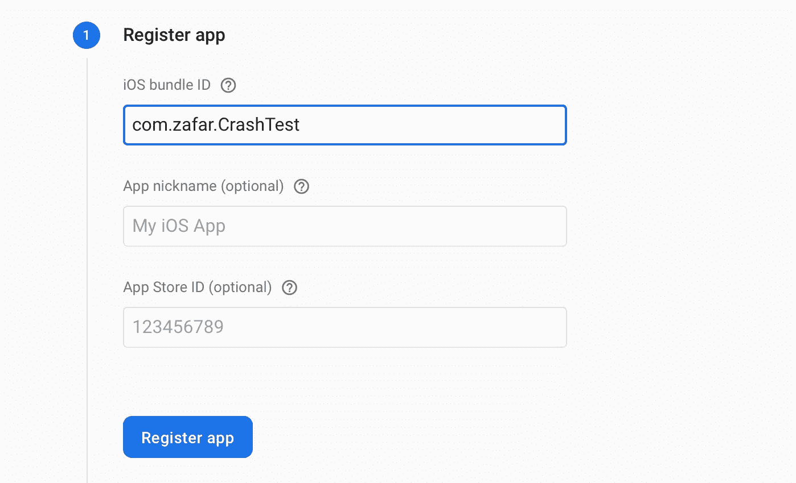
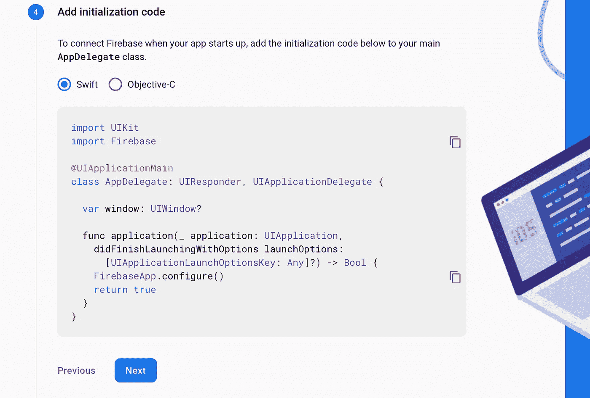

# 如何将 Firebase Crashlytics 添加到您的 iOS 应用程序中

> 原文：<https://levelup.gitconnected.com/how-to-add-firebase-crashlytics-to-your-ios-app-e1bdef983297>

## 使发现意外崩溃及其根源变得容易

今天，我们将逐步学习如何将 Firebase Crashlytics 添加到我们的 iOS 应用程序中。我们还将通过创建一个故意的崩溃来测试我们的应用程序，并在 Firebase 控制台中查看结果。

[Firebase Crashlytics](https://firebase.google.com/docs/crashlytics) 是一个观察崩溃和寻找这些崩溃来源的伟大工具。

该项目的源代码可以在文章的底部找到。

# 我们开始吧

首先，让我们创建一个项目，并为其命名:

现在我们需要将 [CocoaPods](https://cocoapods.org) 添加到我们的项目中。导航到项目目录，并在终端中运行以下命令:

`pod init` —在我们的项目中创建一个 Podfile。

`open Podfile -a Xcode` —在 Xcode 中打开 Podfile。

添加`Firebase/Analytics`、`Crashlytics`和`Fabric`吊舱:

现在让我们回到终端并运行`pod install`:

从现在开始，我们将使用`.xcworkspace`文件代替`.xcodeproj`:

# 设置 Firebase 应用程序

让我们打开 [Firebase 控制台](https://console.firebase.google.com)并创建一个新项目:

然后同意将分析添加到我们的项目中:

并选择 Firebase 的默认帐户:

现在打开新项目并添加选择' *iOS'* 以添加新应用程序:

现在从 Xcode 复制包标识符并粘贴到字段:

复制此标识符

将其粘贴到 iOS 捆绑包 ID 下

按下'*注册 app'* ，然后下载`GoogleService-Info.plist`文件并将其添加到您的 Xcode 项目中:

按下'*下一步'*。因为我们已经安装了 CocoaPods，再次按下' *Next'* 。

现在我们需要在我们的`AppDelegate.swift`中添加初始化代码:

现在我们需要构建并运行我们的应用程序，所有的错误(如果有的话)都应该消失了。

让我们在 Firebase 控制台中点击“*下一步”*，现在我们看到 Firebase 已成功添加到我们的应用程序中:

现在按下“*继续控制台*”，让我们开始添加 Firebase Crashlytics 到我们的应用程序

# 设置 Firebase 碰撞分析

让我们展开“*质量*”选项卡并选择 Crashlytics:

选择“否，设置新的 Firebase 应用程序”。现在，我们需要按照以下步骤安装 SDK:

*   打开 Xcode 项目中的 Build Settings 选项卡，找到'*调试信息格式*，选择' *DWARF with dSYM 文件*':

用 dSYM 文件选择矮人

结果看起来像这样

现在是最后一步:打开构建阶段选项卡并添加一个新的运行脚本阶段:

在脚本中添加`“${PODS_ROOT}/Fabric/run”`:

我们已经成功地将 Firebase Crashlytics 添加到我们的应用程序中。

# 测试碰撞

让我们快速测试一下 Crashlytics 是否如预期的那样工作。更改`ViewController`以匹配以下内容:

并在`AppDelegate.swift`中的`didFinishLaunchingWithOptions()`内添加这行代码:

`Fabric.sharedSDK().debug = true`

现在，这些步骤对于在 Firebase 控制台中生成和查看崩溃非常重要:

*   构建并运行您的应用程序
*   从 Xcode 停止应用程序
*   从您的设备或模拟器手动打开应用程序
*   点击“让应用崩溃！”按钮，看到应用程序如预期的那样崩溃
*   再次运行应用程序

现在，我们将在控制台中看到以下内容:

这意味着崩溃报告已成功发送到 Firebase，现在我们可以在 Crashlytics 中看到它:

如果我们点击<compiler-generated>，我们将看到崩溃的详细信息:</compiler-generated>

让我们选择 Keys 选项卡，现在我们可以看到发生崩溃的实际代码行:

我们已经成功地在我们的应用程序中添加并测试了 Firebase Crashlytics。

感谢阅读！

# 资源

该项目的源代码可以在 GitHub 上获得(您需要添加自己的`GoogleService-Info.plist`文件):

 [## zafarivaev/firebasecralytics-演示

### 展示 Firebase Crashlytics 实现的简单应用程序。为中等教程写的…

github.com](https://github.com/zafarivaev/FirebaseCrashlytics-Demo) 

# 包扎

想了解更多关于 Firebase Crashlytics 的信息吗？请访问官方文档:

 [## 燃烧基分解剂

### 借助这款适用于 iOS、Android 和 Unity 的强大崩溃报告解决方案，获得对应用问题的清晰、可行的洞察…

firebase.google.com](https://firebase.google.com/docs/crashlytics)