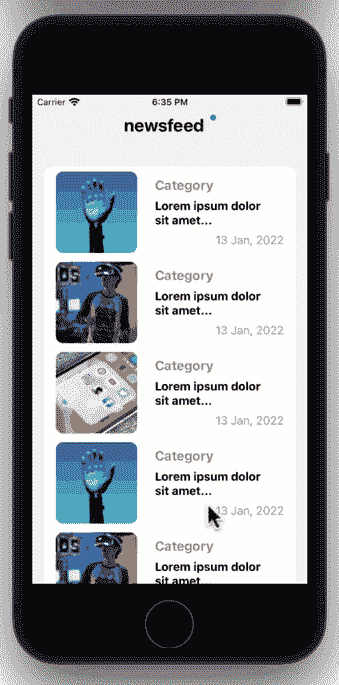
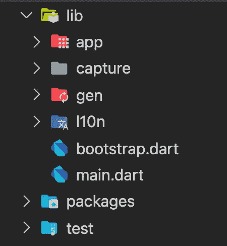
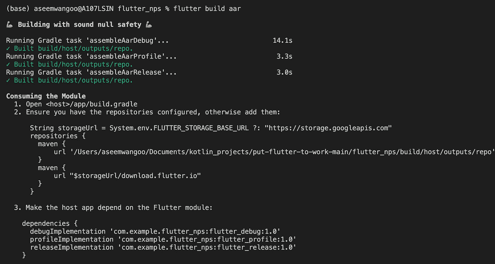
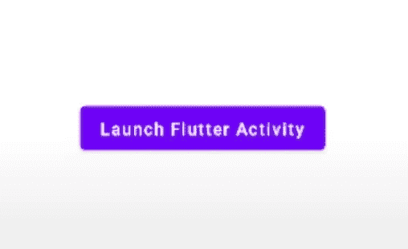

# 如何给安卓 App 添加 Flutter

> 原文：<https://levelup.gitconnected.com/how-to-add-flutter-to-android-app-4d80d9820686>

*如何给安卓 App 添加 Flutter*

*文章在此:*[*https://flattered with flutter . com/how-to-add-flutter-to-Android-app/*](https://flatteredwithflutter.com/how-to-add-flutter-to-android-app/)

如何给安卓 App 添加 Flutter

我们将简要介绍:

1.  将 flutter 添加到现有的 android 应用中
2.  向新的 android 应用程序添加 flutter(Compose)

> 注意:本文假设读者了解 android


如何给安卓 App 添加 Flutter

## 添加到应用程序

在 Flutter 中重写整个应用程序有时是不实际的。对于这些情况，Flutter 可以作为一个库或模块，一点一点地集成到您现有的应用程序中。然后，可以将该模块导入到您的 Android 或 iOS 应用程序中，以便在 Flutter 中呈现应用程序 UI 的一部分。

`add-to-app`特性支持集成任意屏幕尺寸的多个实例。拥有多个 Flutter 实例允许每个实例维护独立的应用程序和 UI 状态，同时使用最少的内存资源。更多信息请参见[多波动](https://docs.flutter.dev/development/add-to-app/multiple-flutters)页面。

## 将 flutter 添加到现有的 android 应用中

颤振 3 于 2022 年 5 月 11 日公布。有一个名为[Flutter 的新功能](https://youtu.be/w_ezWG1yKQQ?t=874)的演讲，演讲者展示了一个名为[的应用程序让 Flutter 工作](https://github.com/flutter/put-flutter-to-work)。



让 Flutter 开始工作

我们将把[颤动反馈屏幕](https://github.com/flutter/put-flutter-to-work/tree/main/flutter_nps)添加到[安卓应用](https://github.com/flutter/put-flutter-to-work/tree/main/newsfeed_android)

## 开始

让我们打开应用程序的`[build.gradle](https://github.com/flutter/put-flutter-to-work/blob/main/newsfeed_android/app/build.gradle)`，看看`repositories`下面的部分

```
repositories {
    google()
    mavenCentral() String storageUrl = "https://storage.googleapis.com"
    maven {
        url '../../flutter_nps/build/host/outputs/repo'
    }
    maven {
        url "$storageUrl/download.flutter.io"
    }
}
```

*   我们看到这个项目依赖于 **flutter_nps** 里面的一个局部路径
*   如果我们打开项目的`[build.gradle](https://github.com/flutter/put-flutter-to-work/blob/main/newsfeed_android/build.gradle)`，也会观察到同样的情况
*   该项目还依赖于以下颤振特性

```
debugImplementation 'com.example.flutter_nps:flutter_debug:1.0'
profileImplementation 'com.example.flutter_nps:flutter_profile:1.0'
   releaseImplementation'com.example.flutter_nps:flutter_release:1.0'
```

到目前为止，路径`flutter_nps/build/host/outputs/repo`在我们的机器中不存在，现在让我们研究一下 **flutter_nps** 项目

## **添加颤振模块作为依赖项**

有两种方法可以将 Flutter 模块添加为现有应用程序的依赖项。我们将使用 **AAR (Android 存档)**

AAR 机制创建通用的 Android AARs 作为中介来打包您的 Flutter 模块。

*   这会将您的 Flutter 库打包成一个通用的本地 Maven 存储库，由 AARs 和 POMs 工件组成。
*   对于 **flutter_nps** 应用程序，我们有以下文件夹结构



颤振 _nps 项目

*   我们使用以下命令来生成 AAR

```
flutter build aar
```

这也向我们展示了整合的屏幕指示



颤振 AAR 集成步骤

现在，如果我们运行我们的 android 应用程序，它应该可以工作…🎉🎉🎉🎉

> **注意**:上节使用的 android 应用不使用 Compose。在下一节中，我们将在 Compose 应用程序中集成 Flutter

## 向新的 android 应用程序添加 flutter(Compose)

在本节中，我们将创建一个[新的 android 应用程序](https://github.com/AseemWangoo/AddFlutter)，但带有撰写活动。

## 开始

*   创建`New Project`并选择`EmptyComposeActivity`，这将创建一个合成项目
*   我们在主屏幕上创建一个[按钮组件](https://github.com/AseemWangoo/AddFlutter/blob/master/app/src/main/java/com/example/addflutter/components/SimpleButtonComponent.kt)



撰写按钮

*   让我们打开应用程序的`[build.gradle](https://github.com/AseemWangoo/AddFlutter/blob/master/app/build.gradle)`，在`repositories`下添加以下内容

```
repositories {
    google()
    mavenCentral() String storageUrl = "https://storage.googleapis.com"
    maven {
        url '../../flutter_nps/build/host/outputs/repo'
    }
    maven {
        url "$storageUrl/download.flutter.io"
    }
}
```

并将以上内容添加到项目的`[build.gradle](https://github.com/AseemWangoo/AddFlutter/blob/master/build.gradle)`

*   在应用程序`[build.gradle](https://github.com/AseemWangoo/AddFlutter/blob/master/app/build.gradle)`的`dependencies`中添加以下内容

```
debugImplementation 'com.example.flutter_nps:flutter_debug:1.0'
profileImplementation 'com.example.flutter_nps:flutter_profile:1.0'
   releaseImplementation'com.example.flutter_nps:flutter_release:1.0'
```

> 注意:试着移除`profileImplementation`以防标尺出现任何错误

*   上述步骤意味着我们的新项目需要来自 [flutter_nps](https://github.com/flutter/put-flutter-to-work/tree/main/flutter_nps) 的 AAR(因为我们正在重用同一个 flutter 项目)。
*   构建 AAR 的步骤与我们在上一节中看到的步骤相同。

接下来，我们创建扩展了`Application`的[应用程序类](https://github.com/AseemWangoo/AddFlutter/blob/master/app/src/main/java/com/example/addflutter/Application.kt)，并将其注册到`android:name="<YOUR APPLICATION CLASS>"`下的 [Manifest.xml](https://github.com/AseemWangoo/AddFlutter/blob/master/app/src/main/AndroidManifest.xml) 中

```
class AddFlutterApplication : Application() {
    lateinit var flutterEngine: FlutterEngine companion object {
        const val FLUTTER_ENGINE_NAME = "nps_flutter_engine_name"
    } override fun onCreate() {
        super.onCreate()
        flutterEngine = FlutterEngine(this)

        flutterEngine.dartExecutor.executeDartEntrypoint(
            DartExecutor.DartEntrypoint.createDefault()
        )

        FlutterEngineCache
            .getInstance()
            .put(FLUTTER_ENGINE_NAME, flutterEngine)
    }
}
```

*   我们初始化了`[FlutterEngine](https://api.flutter.dev/javadoc/io/flutter/embedding/engine/FlutterEngine.html)`,它是一个容器，通过它 Dart 代码可以在 Android 应用程序中运行
*   为了在这个`FlutterEngine`内开始运行飞镖和/或颤动，我们得到这个引擎的`[DartExecutor](https://api.flutter.dev/javadoc/io/flutter/embedding/engine/dart/DartExecutor.html)`的参考，然后使用`[DartExecutor.executeDartEntrypoint(DartExecutor.DartEntrypoint)](https://api.flutter.dev/javadoc/io/flutter/embedding/engine/dart/DartExecutor.html#executeDartEntrypoint(io.flutter.embedding.engine.dart.DartExecutor.DartEntrypoint))`
*   最后，我们缓存 FlutterActivity 使用的 flutter 引擎
*   `FlutterEngineCache`对于存储预热的`[FlutterEngine](https://api.flutter.dev/javadoc/io/flutter/embedding/engine/FlutterEngine.html)`实例很有用。给定的`[FlutterEngine](https://api.flutter.dev/javadoc/io/flutter/embedding/engine/FlutterEngine.html)`的 ID 可以是任何字符串

由于我们要启动一个 Flutter 活动，我们需要将其注册为 [Manifest.xml](https://github.com/AseemWangoo/AddFlutter/blob/master/app/src/main/AndroidManifest.xml) 下的一个活动(否则它会给出一个错误……)

```
<activity
  android:name="io.flutter.embedding.android.FlutterActivity"
          android:configChanges="orientation|keyboardHidden|keyboard|screenSize|locale|layoutDirection|fontScale|s creenLayout"
  android:hardwareAccelerated="true"
  android:windowSoftInputMode="adjustResize"
/>
```

最后，我们需要开展长笛活动。

*   我们通过从`context`调用`startActivity`来实现

```
context.startActivity(
  FlutterActivity
       .withCachedEngine(AddFlutterApplication.FLUTTER_ENGINE_NAME)
  .build(context)
)
```

*   此`withCachedEngine`可用于配置启动 FlutterActivity 的意图，该活动在内部使用缓存的现有 FlutterEngine，并使用缓存的引擎 ID(与我们在应用程序内部注册时使用的相同)进行标识。

现在，如果我们运行新的 android 应用程序，我们会看到它正在工作…🎉🎉🎉🎉

其他文章:

[](https://medium.com/flutter-community/using-mockito-in-flutter-cd015d338277) [## 在 Flutter 中使用 Mockito

### 在 Flutter 中使用 Mockito

在 Fluttermedium.com 使用 Mockito](https://medium.com/flutter-community/using-mockito-in-flutter-cd015d338277) [](https://medium.com/flutter-community/dart-on-aws-lambda-3a46aad38335) [## AWS Lambda 上的 Dart

### AWS Lambda 上的 Dart

AWS Lambdamedium.com 上的 Dart](https://medium.com/flutter-community/dart-on-aws-lambda-3a46aad38335) [](https://medium.com/flutter-community/integration-testing-in-flutter-b25c62ec287c) [## 颤振的综合试验

### 颤振的综合试验

Fluttermedium.com 的集成测试](https://medium.com/flutter-community/integration-testing-in-flutter-b25c62ec287c) 

```
[Source Code](https://github.com/AseemWangoo/AddFlutter)
```