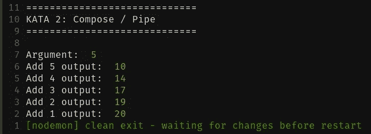

# 如何向任何 JavaScript 项目添加函数式编程

> 原文：<https://levelup.gitconnected.com/how-to-add-functional-programming-to-any-javascript-project-f4e1783a3a07>

# FP 和 JavaScript

我非常喜欢函数式编程(FP)。对我来说，它就像 Vim——一旦我致力于学习它，很难想象生活会有什么不同。然而，许多人采取要么全有要么全无的观点，这对初学者来说既困惑又不知所措。

历史上，FP 社区分成了两个阵营。**纯语言**:如 Miranda、Haskell 这些是 lambda 演算的纯实现；以及**不纯语言**:比如 Scheme 和标准 ML，它们用包括赋值、异常和延续的各种效果来扩充 lambda 演算( [Walder 1995](https://link.springer.com/chapter/10.1007/3-540-59451-5_2) )。如果你熟悉 FP 的话，这听起来可能会令人困惑甚至亵渎神明；然而，我认为这主要是因为 FP 的典型教学方式。

在每一个研究领域，事物的发展和实现之间都存在脱节，计算机编程也不例外。作为人类，细微差别是一个困难的障碍，因为我们试图划分信息的方式，所以以一种新的方式思考一个老问题的最简单的方法是采取极端的立场，我认为这是许多 FP 信息落地的地方。这种两极分化让学习 FP 在很多方面变得更容易，但它也带来了失去一种重要的实用主义的双刃剑。

说到底，编程语言是计算机逻辑的人类语义，而 FP 是程序员做出的选择，当你使用不纯的语言时，它可以扩展应用程序的全部或一部分。认为 FP 只能用纯语言来正确地完成，就像认为一台机器只能用公制螺母和螺栓来正确地制造一样。

这并不是说，如果你尝试用函数式的方式编写语言，有些语言不会让你的生活变成地狱，或者有些语言没有你无法避免的直接限制。然而，我们不应该把婴儿和洗澡水一起扔掉，如果你已经是一个中级到高级的 JavaScript 开发人员，JavaScript(基于 Scheme)是学习 FP 概念的极好语言。事实上，JavaScript 可以提供一些纯 FP 语言难以提供的效率优势。例如，在 JavaScript 中编写无要点的组合是很容易的，但是在一些纯 FP 语言中，这可能就像理解骑在速度快得可笑的机械公牛背上的尤利西斯一样困难。可以说，JavaScript 是一种很好的功能性语言，如果你不喜欢，那是你的特权。

# 反思公用事业

真正开始修补和发展 FP 的最简单的方法是通过构造实用函数。当我们处于多变的思维框架时，我们养成的习惯之一就是编写代码来更新函数体之外的某种状态。另一方面，实用程序通常被编写为在任何地方都可以使用，对自身之外的状态没有概念——因此，通过将您的精力集中在这里，您将不必担心副作用。

许多 JavaScript 开发人员在开始任何新项目时都会安装一个像 *Lodash* 这样的库，以便编写、测试和准备好开箱即用的实用程序。一旦一个项目开始增加复杂性，通常会在创建新的实用程序时使用这些库驱动的实用程序来处理常见但特定于项目的功能(例如， *getUserEmail* 或 *isApplicationValid* 等)。).

Lodash 是一个很棒的库，但问题是所有函数的参数都是反向的。例如，map 将一个列表作为它的第一个参数，将一个函数作为它的第二个参数，但是函数总是保证在它将操作的列表之前是已知的，因为函数必须在程序运行之前定义——从而防止我们使用任何局部应用程序。因此，如果你被一个使用 *Lodash* 或另一个也使用向后参数的库的项目所束缚，你可能不得不为自己创建一个 FP 兼容的等效文件。随着时间的推移， *Ramda* 是一个备用库，它可以提供许多相同的现成实用程序，但以正确的顺序编写参数。现在，我会鼓励你不要过度依赖 Ramda，直到你对后台的奉承和构图非常有信心。

就这样，让我们开始吧。代码和练习可在本 [**repo**](https://github.com/prescottbreeden/fp_practice) 中找到。

# **初学者工具包**

要开始重新连接你的命令式大脑，采纳并掌握这三个功能:

*   **咖喱**
*   **构成和/或管道**
*   **地图**

理解这三个函数会让你的旅途轻松很多，因为在一天结束的时候，你的大部分代码基本上都是基于它们构建的，所以我们的练习将集中在这里。

重要的是，如果你还不明白这些函数是如何工作的，那是正常的，绝对没问题！你现在正在学习如何驾驶一辆汽车，而不是从零开始建造一辆汽车——随着时间的推移和使用，它将变得更有意义，并且有成千上万的博客和资源来深入研究其中的任何一个。

# 咖喱菜肴

> **Curry** 是一个函数，它将一个函数作为它的参数，并返回一个新函数，这个新函数允许你给出调用它所需的部分或全部参数。

让我们来看一个非常简单的函数:

***add*** 取两个参数，然后把它们加在一起，很自然地，我们要带着所有参数调用它来得到结果。如果我们调用这个函数，它将返回一个新的函数，允许我们说“嘿，我想我现在只想给 add 一个参数，而不是两个。”这样，该函数将返回一个采用最后一个参数的新函数。

奉承的“为什么”有一个简单而不那么简单的解释。简单的解释就是，有时候你还不知道所有的论点。不太简单的解释是，FP 模式擅长通过使用部分应用和组合逻辑来重用和抽象代码。随着时间的推移，这将更有意义，但现在，你不需要了解活塞是如何工作的，你只需要踩下油门，加油。

(注意: *printResult* 基本上只是一个 console.log，但是有点特色)

通常，你会看到 curry 包装了一个函数定义(即第 6 行)，但是你也可以把任何你想要的函数传递给 curry(即第 2 行)，瞧，你有一个函数可以被分割成许多函数。我们可以调用 add(2 ),它返回一个将 2 加到参数上的新函数，然后用 add2(1)调用该函数，它返回 3。

对象对 FP 和 OO 一样重要，所以 curry 的一个非常有用的应用是使用 ***prop*** 函数:

尝试使用各种使用字符串、数字、布尔、对象、列表和任意数量的参数的函数。发挥创造力，让它崩溃，并找出它崩溃的原因。

**建议做法:**

*   *减法*，*除法*，*乘法*，*平方* (math-y stuff)
*   getPropertyPerson :将一个属性作为第一个参数，将一个人作为第二个参数，并从 Person 对象返回属性。
*   *getPersonProperty* :同上，但第一个参数是 person 对象，第二个参数是属性名。试着改变部分应用于对象而不是属性的结果。

在许多函数式语言中，默认情况下所有的函数都是自动生成的，这非常酷，但是如果你还没有真正理解它是如何工作的，这也会非常令人困惑。有趣的是，currying 是以 Haskell Curry T1 命名的，这也是 Haskell 得名的原因。事实上，Haskell 的创造者投票决定将这种语言命名为“Curry ”,但由于演员蒂姆·克里在当时很受欢迎，他们搁置了这个问题，决定将其命名为 Haskell。

当你对 currying 函数感到满意时，就可以使用 Compose / Pipe 了。

# 撰写/管道

> Compose / Pipe 是接受任意数量的函数作为参数并返回一个新函数的函数，该函数将每个函数的结果传递给下一个函数。


Compose 和 Pipe 本质上是同一个函数，一个从右向左读，另一个从左向右读。我更喜欢 compose，从右到左的版本，但我也更喜欢玩反转控制的视频游戏，所以选择哪个对你来说最有意义。

要开始使用 compose 或 pipe，请确保组合在一起的所有函数都只有一个参数。当你弄清楚如何使用 compose 或 pipe 时，这实际上是所有准备和思考工作发生的地方。我们设置了一系列像多米诺骨牌一样的函数，参数是我们的手指按在第一个上，第一个就会倒下，把第一个函数的输出作为第二个函数的参数，以此类推。

在这里， ***add15*** 是一个单一的函数，它是 5 个 add 函数的合并，将从右到左(或从下到上)依次触发，相当于在第 11 行将函数作为参数互相传递。除非你是外国人，否则写出嵌套的函数调用读起来很可怕，但是希望能提供一些关于 compose 如何工作的见解。管道完全相同，但将从左到右/从上到下执行:

印刷品

众所周知，对于初学者来说，Compose / pipe 调试起来非常棘手，因为很难控制台记录该过程的各个步骤。调试组合函数的一个有效策略是将日志语句放在被调用的函数中。如果函数没有被频繁调用，这种方法非常有效，但是，如果它在一系列数据上被调用了数百次，那么我们将不得不试图找出哪个日志语句是运行时崩溃的相关元凶。另一种方法是使用 ***跟踪*** 功能:

***trace*** 将允许我们检查每个 domino 之间的输出:

当用 **add15(5)** 调用时，这将产生以下输出:



摆弄它，创作/演奏一些咖喱减法、除法、乘法，并在混合中加入一些物体:

当你使用 curry 和 compose 时，最重要的概念是，本质上“未知的”参数是函数将要操作的数据。看上面的 ***printAge*** ，这个人就是未知的数据，所以我们的构图被设置成接收数据作为翻倒第一张多米诺骨牌的论据。当你使用 ***映射*** 时，这将变得更加自然，但另一种思考方式是，来自数据库或 API 的数据通常是最后定义的参数。

# 地图

> Map 是一个函数，它将一个函数和一个列表作为参数，遍历该列表，并执行每个项目上提供的函数。


到目前为止，我们一直在学习生成函数的新方法，要么是通过部分地将参数应用于定制函数，要么是通过将多个函数组合在一起创建一个新函数。我们要打破的下一个障碍是循环，这是 ***贴图*** 、 ***减少*** 和 ***过滤器*** 发挥作用的地方——但是，我们暂时只关注贴图。

假设我们正在使用一个 API 或 DB，我们将返回一个用户列表:

我们可以通过定义需要在每个用户上执行的函数，然后将它传递到 map 中，从而将这个数组转换成一个新的数组。

**JavaScript 内置图**

由于 ***prop('name')*** 返回一个部分应用的函数，该函数只将单个对象作为其剩余的参数，我们现在可以将用户从用户数组转换为字符串数组。这相当于:

```
users.map(user => user.name);
```

虽然内置的 JavaScript 非常方便，但它是一个附属于列表本身的方法，这意味着在定义数据之前不能调用它，这将有很多限制。我们想要的是一个独立版本的 map，它可以部分应用，并与最终要操作的数据断开连接:

```
const map = curry((f, list) => list.map(f));
```

现在， ***地图*** 可以部分应用并与其他功能组合:

这里有一个更复杂的转换，它将要使用两个常用的工具，*和*:**

**我们不仅更容易重用代码，而且我们的代码现在是声明性的，而不是命令性的——这意味着代码用简单的语言表达了它要做的事情，它们就像乐高积木一样容易玩。**

**现在，如果你需要创建一个超出你舒适程度的功能，不要灰心丧气。假设我想创建一个函数来检查电子邮件是否存在，如果存在，返回 true，否则返回 false。以下是完成工作的三种不同版本:**

**因为这个函数是纯函数，相同的输入将总是得到相同的输出，并且不影响自身以外的任何状态，所以我现在仍然可以将这个函数与其他函数组合在一起:**

**在一天结束时，如果它有效，就发货——然而我们也可以重新思考一下 ***hasEmail*** 的逻辑。本质上，电子邮件是一个字符串，因此如果我们的目标是找出每个用户是否有一个带长度的电子邮件字符串，那么 ***hasEmail*** 实际上是其他更小函数的组合:**

**有很多方法可以以更可重用的 FP 方式安全地构建更复杂的控制流逻辑，但这并不意味着最初版本的 ***hasEmail*** 是“糟糕的”——事实上，这些小步骤将帮助您开始通向单子、幺半群、函子、序列器和各种既富有想象力又(最重要的)**有趣**的旅程！**

**如果 JavaScript 中的 FP 是您希望进一步探索的一个途径，那么您应该查看非凡的“[Frisby 教授的函数式编程指南](https://github.com/MostlyAdequate/mostly-adequate-guide)”。如果它变得令人沮丧和困惑，那就把它放下，以后再回来。FP 的思维方式需要时间来巩固到一个经过严格训练的大脑中，以循环和突变的方式思考和写作——然而，对大多数人来说，回报是值得的。**

**所以如果你正在寻找尝试并开始使用 FP 的方法，尝试一下 [**回购**](https://github.com/prescottbreeden/fp_practice) 并尝试重写一些基本的实用程序，否则，**继续继续！****

****