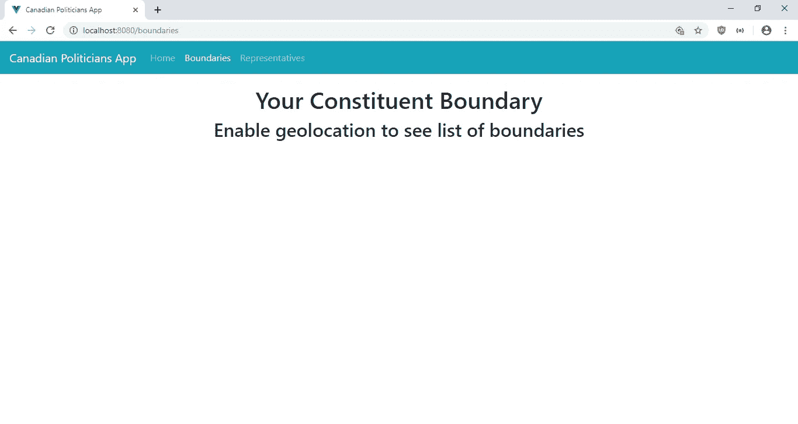
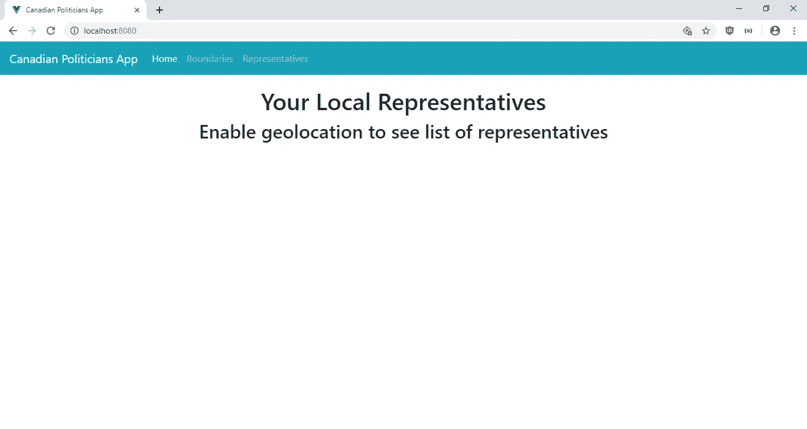
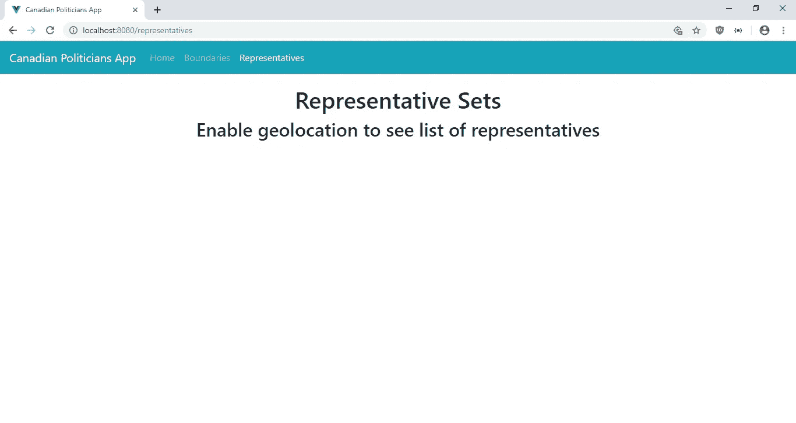
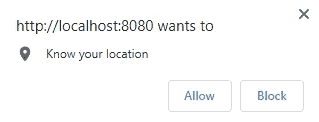
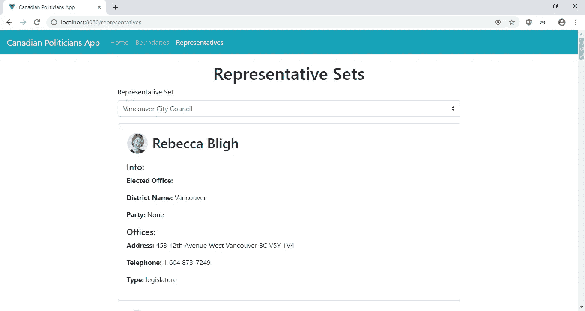
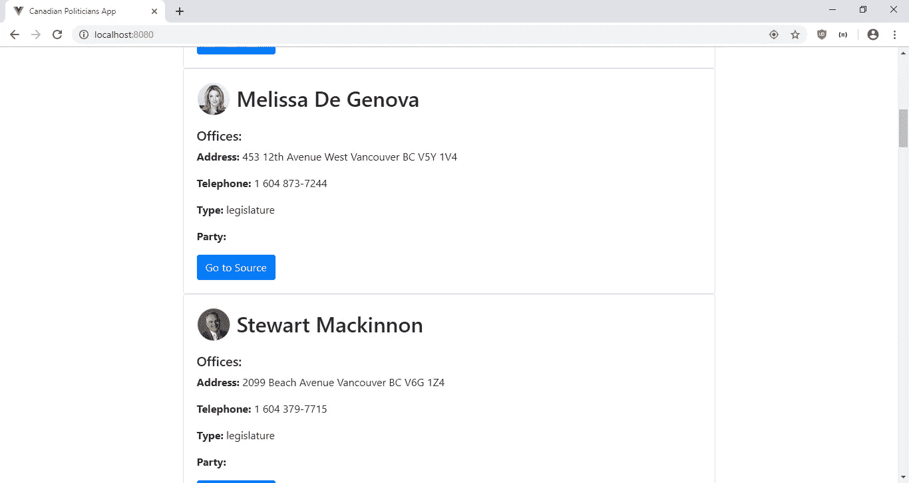

# 如何将地理定位添加到 Vue.js 应用程序

> 原文：<https://levelup.gitconnected.com/how-to-add-geolocation-to-a-vue-js-app-14716b90d87b>

## 使用地理定位浏览器 API 和 Vue 在您的应用程序中获取用户位置


许多应用程序希望提供基于用户位置的体验。这就是 HTML 地理定位 API 的用武之地。您可以很容易地使用它来获取当前设备的位置。

为了使用普通的 JavaScript 在浏览器中获得设备的位置，我们编写:

```
if (navigator.geolocation) {
  navigator.geolocation.getCurrentPosition(getPosition);
}function getPosition(position) {
  console.log(position.coords.latitude, position.coords.longitude);
}
```

如您所见，获取纬度和经度非常容易。

我们还可以轻松地将地理定位添加到任何 Vue.js 应用程序中。 [vue-browser-geolocation](https://www.npmjs.com/package/vue-browser-geolocation) 包是一个很好的插件，可以为您的应用程序添加地理定位功能。它提供了一个基于 promise 的 API 来获取设备的位置，所以我们可以很容易地使用`async`和`await`来获取这个包的位置。

## 入门指南

在本文中，我们将构建一个应用程序，从[代表公民信息 API](https://represent.opennorth.ca/) 获取您所在地区的加拿大政治家列表。

我们将使用 vue-browser-geolocation 包来获取位置，然后使用 API 从 API 获取项目列表。我们将获得本地区的政治家列表、本地区的选区边界，以及从列表中选择的给定立法机构的代表列表。

首先，我们运行 Vue CLI 来创建项目。运行`npx @vue/cli create politicians-app`创建应用程序。在向导中，我们选择“手动选择功能”，然后选择包括 Babel 和 Vue 路由器。

接下来，我们安装一些构建应用程序所需的包。我们将使用 Axios 进行 HTTP 请求，使用 BootstrapVue 进行样式设计，使用 Vue Avatar 显示政治家的头像图片，使用 vue-browser-geolocation 获取设备的位置。运行`npm i axios bootstrap-vue vue-avatar vue-browser-geolocation`安装所有软件包。

## 发出 API 请求

现在我们可以开始编写应用程序了。我们首先创建一个 mixin，用于发出在组件中使用的 HTTP 请求。在`src`文件夹中创建一个`mixins`文件夹，在`mixins`文件夹中创建`requestsMixin.js`。然后，我们将以下内容添加到文件中:

```
const axios = require("axios");
const APIURL = "[https://represent.opennorth.ca](https://represent.opennorth.ca)";export const requestsMixin = {
  methods: {
    getRepresentatives(lat, lng) {
      return axios.get(`${APIURL}/representatives/?point=${lat},${lng}`);
    }, getBoundaries(lat, lng) {
      return axios.get(`${APIURL}/boundaries/?contains=${lat},${lng}`);
    }, getRepresentativeSetsRepresentatives(set, lat, lng) {
      return axios.get(
        `${APIURL}/representatives/${set}/?point=${lat},${lng}`
      );
    }, getRepresentativeSets() {
      return axios.get(`${APIURL}/representative-sets/?offset=0&limit=200`);
    }
  }
};
```

我们使用代表公民信息 API 来按位置获取代表和边界，还可以获取加拿大立法机构的列表。终点的完整列表在[https://represent.opennorth.ca/api/#representativeset](https://represent.opennorth.ca/api/#representativeset)。

## 获取地理位置

接下来创建显示数据的页面。在`views`文件夹中，创建`Boundaries.vue`并添加:

```
<template>
  <div class="page">
    <h1 class="text-center">Your Constituent Boundary</h1>
    <template v-if="noLocation">
      <h2 class="text-center">Enable geolocation to see list of boundaries</h2>
    </template>
    <template v-if="!noLocation">
      <b-card v-for="(b, i) in boundaries" :key="i" class="card">
        <b-card-title>
          <h2>{{b.name}}</h2>
        </b-card-title> <b-card-text>
          <p>
            <b>Boundary Set Name:</b>
            {{b.boundary_set_name}}
          </p>
        </b-card-text>
      </b-card>
    </template>
  </div>
</template><script>
import { requestsMixin } from "@/mixins/requestsMixin";export default {
  name: "boundaries",
  mixins: [requestsMixin],
  data() {
    return {
      boundaries: [],
      noLocation: true
    };
  },
  beforeMount() {
    this.getBounds();
  },
  methods: {
    async getBounds() {
      try {
        const coordinates = await this.$getLocation({
          enableHighAccuracy: true
        });
        const { lat, lng } = coordinates;
        const response = await this.getBoundaries(lat, lng);
        this.boundaries = response.data.objects;
        this.noLocation = false;
      } catch (error) {
        this.noLocation = true;
      }
    }
  }
};
</script></script>
```

在该页面中，我们通过 vue 浏览器地理定位包获得了用户设备当前所在位置的选区边界。`this.$getLocation`中的`getBounds`功能由软件包提供。当用户启用地理定位时，promise 解析为具有纬度和经度的对象。我们用一个`try...catch`包装代码，以防它被禁用。如果地理定位被禁用，我们会显示一条消息，让用户知道他们必须启用地理定位才能看到数据。

如果地理定位被启用，那么`this.getBoundaries`将被调用。该函数由我们之前创建的`requestsMixin`提供。我们将它包含在这个组件的`mixin`属性中。这些物品显示在 BootstrapVue 卡中。

接下来，我们用以下代码替换`Home.vue`中的代码:

```
<template>
  <div class="page">
    <h1 class="text-center">Your Local Representatives</h1>
    <template v-if="noLocation">
      <h2 class="text-center">Enable geolocation to see list of representatives</h2>
    </template>
    <template v-if="!noLocation">
      <b-card v-for="(r, i) in reps" :key="i" class="card">
        <b-card-title>
          <h2>
            <avatar :src="r.photo_url" :inline="true"></avatar>
            <span class="title">{{r.name}}</span>
          </h2>
        </b-card-title> <b-card-text>
          <h5>Offices:</h5>
          <div v-for="(o,i) in r.offices" :key="i">
            <p>
              <b>Address:</b>
              {{o.postal}}
            </p>
            <p>
              <b>Telephone:</b>
              {{o.tel}}
            </p>
            <p>
              <b>Type:</b>
              {{o.type}}
            </p>
          </div>
          <p>
            <b>Party:</b>
            {{r.party_name}}
          </p>
        </b-card-text> <b-button :href="r.url" variant="primary" target="_blank">Go to Source</b-button>
      </b-card>
    </template>
  </div>
</template><script>
import { requestsMixin } from "@/mixins/requestsMixin";
import Avatar from "vue-avatar";export default {
  name: "home",
  mixins: [requestsMixin],
  data() {
    return {
      reps: [],
      noLocation: true
    };
  },
  components: {
    Avatar
  },beforeMount() {
    this.getAllRepresentatives();
  },
  methods: {
    async getAllRepresentatives() {
      try {
        const coordinates = await this.$getLocation({
          enableHighAccuracy: true
        });
        const { lat, lng } = coordinates;
        const response = await this.getRepresentatives(lat, lng);
        this.reps = response.data.objects;
        this.noLocation = false;
      } catch (error) {
        this.noLocation = true;
      }
    }
  }
};
</script>
```

我们使用与`Boundaries.vue`相同的`this.$geoLocation`功能。在该页面中，我们获得用户设备当前所在位置的代表列表。地理定位功能与`Boundaries.vue`相同。我们运行`beforeMount`中的`getAllRepresentatives`函数，以便它在页面加载时加载。

API 中的项目显示在 BootstrapVue 卡中。我们用 vue-avatar 包在 avatar 中显示图片。

接下来，我们在`views`文件夹中创建`Representatives.vue`。我们将以下代码添加到文件中:

```
<template>
  <div class="page">
    <h1 class="text-center">Representative Sets</h1>
    <template v-if="noLocation">
      <h2 class="text-center">Enable geolocation to see list of representatives</h2>
    </template>
    <template v-if="!noLocation">
      <b-form>
        <b-form-group label="Representative Set" label-for="repSet">
          <b-form-select
            name="repSet"
            v-model="form.repSet"
            :options="repSets"
            required
            [@change](http://twitter.com/change)="getRepSetReps()"
          ></b-form-select>
        </b-form-group>
      </b-form>
      <b-card v-for="(r, i) in reps" :key="i" class="card">
        <b-card-title>
          <h2>
            <avatar :src="r.photo_url" :inline="true"></avatar>
            <span class="title">{{r.name}}</span>
          </h2>
        </b-card-title> <b-card-text>
          <h5>Info:</h5>
          <p>
            <b>Elected Office:</b>
            {{r.office}}
          </p>
          <p>
            <b>District Name:</b>
            {{r.district_name}}
          </p>
          <p>
            <b>Party:</b>
            {{r.party_name || 'None'}}
          </p>
          <h5>Offices:</h5>
          <div v-for="(o,i) in r.offices" :key="i">
            <p>
              <b>Address:</b>
              {{o.postal}}
            </p>
            <p>
              <b>Telephone:</b>
              {{o.tel}}
            </p>
            <p>
              <b>Type:</b>
              {{o.type}}
            </p>
          </div>
        </b-card-text>
      </b-card>
    </template>
  </div>
</template><script>
import { requestsMixin } from "@/mixins/requestsMixin";
import Avatar from "vue-avatar";export default {
  name: "boundaries",
  mixins: [requestsMixin],
  data() {
    return {
      repSets: [],
      reps: [],
      form: {
        repSet: "strathcona-county-council"
      },
      noLocation: true,
      coordinates: {}
    };
  },
  components: {
    Avatar
  },
  beforeMount() {
    this.getRepSets();
    this.getLocation();
  },
  methods: {
    async getRepSets() {
      const response = await this.getRepresentativeSets();
      this.repSets = response.data.objects.map(s => {
        const [part1, part2, value] = s.url.split("/");
        return {
          text: s.name,
          value
        };
      });
    }, async getLocation() {
      try {
        const coordinates = await this.$getLocation({
          enableHighAccuracy: true
        });
        this.coordinates = coordinates;
        this.noLocation = false;
      } catch (error) {
        this.noLocation = true;
      }
    }, async getRepSetReps() {
      const { lat, lng } = this.coordinates;
      const response = await this.getRepresentativeSetsRepresentatives(
        this.form.repSet,
        lat,
        lng
      );
      this.reps = response.data.objects;
    }
  }
};
</script>
```

当页面加载时，我们调用`this.getRepSets`和`this.getLocation`用加拿大的立法机构填充下拉列表，并分别获取位置。当下拉选择改变并且地理位置 API 启用时，我们用提供的坐标在`this.getRepSetReps`函数中获得项目。我们只在地理定位启用时显示下拉列表，这样我们就不会让用户在没有启用的情况下选择任何内容。

这些物品也会显示在此页面的 BootstrapVue 卡中。

然后我们将`App.vue`中的现有代码改为:

```
<template>
  <div>
    <b-navbar toggleable="lg" type="dark" variant="info">
      <b-navbar-brand href="#">Canadian Politicians App</b-navbar-brand><b-navbar-toggle target="nav-collapse"></b-navbar-toggle><b-collapse id="nav-collapse" is-nav>
        <b-navbar-nav>
          <b-nav-item to="/" :active="path == '/'">Home</b-nav-item>
          <b-nav-item to="/boundaries" :active="path == '/boundaries'">Boundaries</b-nav-item>
          <b-nav-item to="/representatives" :active="path == '/representatives'">Representatives</b-nav-item>
        </b-navbar-nav>
      </b-collapse>
    </b-navbar>
    <router-view />
  </div>
</template><script>
export default {
  data() {
    return {
      path: this.$route && this.$route.path
    };
  },
  watch: {
    $route(route) {
      this.path = route.path;
    }
  }
};
</script><style>
.page {
  padding: 20px;
  margin: 0 auto;
}.card,
form {
  max-width: 800px;
  margin: 0 auto;
}.title {
  position: relative;
  top: -13px;
  left: 10px;
}
</style>
```

我们添加了 BootstrapVue 工具栏和每个页面的链接。在顶栏中，我们为链接设置了`active`属性，这样我们就可以突出显示当前页面的链接。在`scripts`部分，我们观察 Vue Router 为 app 当前路径提供的`$route`对象，并将其赋给`this.path`，这样我们就可以用它来设置`active`道具。

在`style`块中，我们用`page`类给页面添加填充和边距。我们设置了表单和卡片的宽度，这样它们就不会太宽，我们还添加了`title`类，这样卡片中的标题就可以和头像对齐了。

在`main.js`中，我们将现有代码替换为:

```
import Vue from 'vue'
import App from './App.vue'
import router from './router'
import store from './store'
import VueGeolocation from 'vue-browser-geolocation';
import BootstrapVue from 'bootstrap-vue'
import 'bootstrap/dist/css/bootstrap.css'
import 'bootstrap-vue/dist/bootstrap-vue.css'Vue.use(BootstrapVue)
Vue.use(VueGeolocation);Vue.config.productionTip = falsenew Vue({
  router,
  store,
  render: h => h(App)
}).$mount('#app')
```

这为我们的应用程序添加了 BootstrapVue 库和样式，以及 vue-browser-geolocation 包。

在`router.js`中，我们将现有代码替换为:

```
import Vue from "vue";
import Router from "vue-router";
import Home from "./views/Home.vue";
import Boundaries from "./views/Boundaries.vue";
import Representatives from "./views/Representatives.vue";Vue.use(Router);export default new Router({
  mode: "history",
  base: process.env.BASE_URL,
  routes: [
    {
      path: "/",
      name: "home",
      component: Home
    },
    {
      path: "/boundaries",
      name: "boundaries",
      component: Boundaries
    },
    {
      path: "/representatives",
      name: "representatives",
      component: Representatives
    }
  ]
});
```

现在，用户可以在顶栏中找到我们链接的包，也可以直接输入 URL。

现在我们通过运行`npm run serve`来运行 app。然后我们得到:



如果您在上面的确认对话框中单击“允许”,我们会得到:

