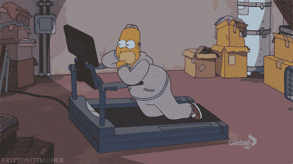
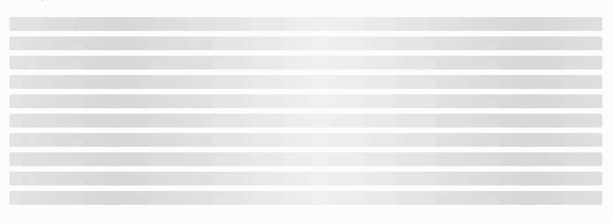
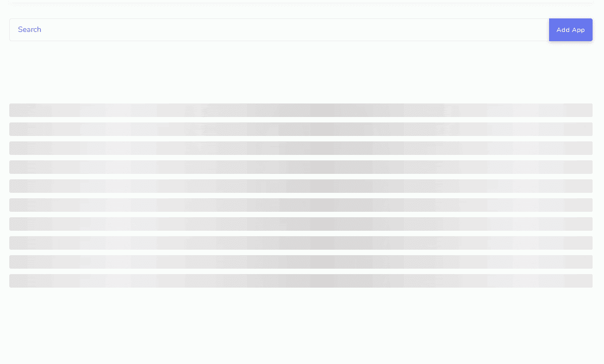
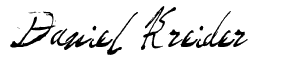

# 如何添加幽灵动画到你的角度表

> 原文：<https://levelup.gitconnected.com/how-to-add-ghost-animations-to-your-angular-table-3d665575a144>

## 构建一个简单的鬼表动画，让你的用户拥挤。

## 鬼动画和角。

那么…如何在你的角度应用中创建和使用鬼影动画呢？

在这篇文章中，我会给你代码，演示，截图和整个 shebang 关于如何创建一个基本的鬼表动画，你可以适应你的 Angular 项目。

[](https://school.danielk.tech/course/unleash-your-angular-testing-skills?utm_source=medium&utm_medium=banner&utm_campaign=unleash_testing_skills)

# 创建幻像表

在 [Angular 的神奇 CLI](https://angular.io/cli) 的帮助下，我们将创建一个名为 ghost-table 的新组件。这是你怎么做的。

```
ng generate component ghost-table
```

给它几秒钟施展魔法。



**重要提示**为了让这篇文章尽可能简单，我选择使用一个有角度的组件。但是，我不建议将这种方法用于任何类型的生产应用程序。你应该使用一个[角度模块](https://angular.io/guide/architecture-modules)来保存鬼表动画，然后将其导入到你的角度应用程序的其他模块中。

现在我们的组件已经创建好了，打开名为 ghost-table.component.html 的新文件，用这个 HTML 替换文件中的所有内容。

```
<div id=”ghost-element”> <div class=”line”></div> <div class=”line”></div> <div class=”line”></div> <div class=”line”></div> <div class=”line”></div> <div class=”line”></div> <div class=”line”></div> <div class=”line”></div> <div class=”line”></div> <div class=”line”></div></div>
```

然后打开 ghost-table.component.css，添加以下样式和动画。

```
@keyframes ghost { from { background-position: 0vw 0; } to { background-position: 100vw 0; }}.line { width: 100%; height: 25px; margin-top: 10px; border-radius: 3px; background: linear-gradient(90deg, #f0f0f0, #d8d6d6, #f0f0f0) 0 0/ 80vh 100% fixed; background-color: rgb(204, 199, 199); animation: ghost 750ms infinite linear;}#ghost-element {padding-top: 80px;}
```

想偷瞄一下吗？确定吗？

好吧。这就是它的样子。



基础？我知道。但这是一个很好的开始。这个代码是**你的**偷，所以调整和发挥你的心满意足。

你可能想知道为什么我们不使用角度动画？因为 Angular 没有一个简单的方法来创建无限的动画，除非你创建一个定时器或其他土包子，农场黑客。

最后，我建议清除 ghost-table.component.ts 文件中的杂物。应该是这样的。

```
import { Component } from ‘@angular/core’;@Component({ selector: ‘app-ghost-table’, templateUrl: ‘./ghost-table.component.html’, styleUrls: [‘./ghost-table.component.css’]})export class GhostTableComponent {}
```

# 使用幻像表

现在我们已经得到了我们的组件，我们如何使用它呢？

我们将转到真实表格组件(**而不是**幽灵表格动画组件)并使用 [ngIf](https://angular.io/api/common/NgIf) 在表格没有数据时显示幽灵动画。这里有一个基本的例子。

```
<app-ghost-table *ngIf=”!rows”></app-ghost-table><table class=”table” *ngIf=”rows”><thead> <tr> <th scope=”col”>#</th> <th scope=”col”>First</th> <th scope=”col”>Last</th> </tr></thead><tbody> <tr *ngFor=”let row of rows”> <td scope=”row”>{{ row.id }}</td> <td>{{ row.first }}</td> <td>{{ row.last }}</td> </tr> </tbody></table>
```

总之，如果我们没有表的行数据，我们使用 ngIf 来显示 Ghost 动画，直到我们收到数据。

# 结论

现在它已经连接好了，下面是它的演示。



这只是一个简单快速的例子，展示了如何构建 ghost 动画并在你的 Angular 应用中使用它们。还有更多的东西可以用它来做，所以去做吧，窃取代码，并享受用身临其境的幽灵动画来构建令人印象深刻的角度应用程序的乐趣。

现在，我的棱角忍者伙伴，如果你喜欢这篇文章，并发现它很有用，请务必点击它👏按钮，关注我，获取更多类似本文的精彩文章。

**关注我:** [GitHub](https://github.com/dkreider) ，[中型](https://dkreider.medium.com/)，[个人博客](https://danielk.tech)

有问题或意见吗？我错过了什么吗？请不要犹豫[联系我](https://danielk.tech/contact)。

[](https://school.danielk.tech/course/unleash-your-angular-testing-skills?utm_source=medium&utm_medium=banner&utm_campaign=unleash_testing_skills)

# 进一步阅读

*   [https://github . com/ThomasBurleson/angular-animated-ghost-elements](https://github.com/ThomasBurleson/angular-animated-ghost-elements)
*   [https://medium . com/angular-in-depth/https-medium-com-thomasbrleson-animated-ghosts-bfc 045 a 51 FBA](https://medium.com/angular-in-depth/https-medium-com-thomasburleson-animated-ghosts-bfc045a51fba)