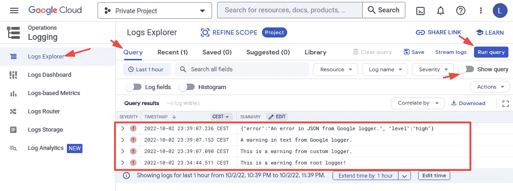
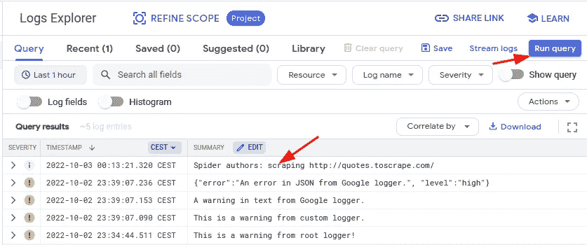

# 如何在 Python 中给 Scrapy 添加 Google Logger

> 原文：<https://levelup.gitconnected.com/how-to-add-google-logger-to-scrapy-in-python-87308156495c>

## 通过谷歌日志，学会更好地利用你的抓取日志


[图片由 Pixabay 的 kreatikar 拍摄](https://pixabay.com/illustrations/cloud-computer-hosting-3406627/)

用日志记录保存抓取项目的记录很重要，这样我们可以知道哪些蜘蛛工作正常，哪些不正常。将日志写到一些文件中并在稍后尝试分析纯文本是很麻烦的。更好的方法是将日志发送到云端，比如 Google Logging。通过这种方式，我们可以集中控制日志，并可以基于日志创建强大的监控指标，然后可以在 Grafana 等可视化应用程序中使用这些指标。

## Python 中的基本日志记录

Python 中的[登录](https://lynn-kwong.medium.com/stop-using-print-in-your-python-code-for-logging-use-the-logging-module-like-a-pro-66fb0427d636)是通过内置的*登录*模块进行的。我们可以直接使用 root logger 用 *logging* 模块来记录日志。但是，建议先创建一个日志程序，然后用它来记录日志。这样，不同应用程序或模块的日志可以通过记录器名称来区分。

关于这个简单的例子，有几点需要注意:

*   使用自定义记录器名称创建记录器，该名称可以是您的应用程序名称，也可以只是模块名称。
*   创建一个流处理程序并将其添加到记录器中。这似乎是多余的，因为默认情况下，日志记录会记录到控制台。然而，默认情况下，日志被发送到 *sys.stderr* 。在本例中，它被更改为 *sys.stdout* ，这在某些情况下可能是首选。
*   我们需要分别为日志记录器和处理程序设置一个级别。特别是，记录器的默认级别是*警告*。它应该设置为与处理程序的相同或更低，以便可以将日志发送到处理程序。

要了解更多关于 Python 中的基本日志记录，请查看[这篇文章](https://lynn-kwong.medium.com/stop-using-print-in-your-python-code-for-logging-use-the-logging-module-like-a-pro-66fb0427d636)。

## 用 Python 写日志到 Google 云日志

除了使用日志模块记录到控制台或文件，我们还可以在 Python 应用程序中[将日志写到 Google Cloud Logging](/how-to-write-logs-to-google-cloud-logging-in-python-46e7b514c60b) 。通过这种方式，我们可以集中控制日志，并基于日志创建强大的监控指标，然后在可视化应用程序中使用，如 [Grafana](https://lynn-kwong.medium.com/how-to-visualize-google-logs-in-grafana-54cb18efe454) 。

用 Python 向 Google Logging 发送日志，需要安装相应的客户端库[*Google-cloud-Logging*](https://pypi.org/project/google-cloud-logging/)。建议在[虚拟环境](https://lynn-kwong.medium.com/how-to-create-virtual-environments-with-venv-and-conda-in-python-31814c0a8ec2)中安装第三方库，这样它们就不会影响系统库:

在我们实际向 Google Logging 发送日志之前，我们应该获得一个服务帐户密钥，它将用于验证上面安装的客户端库。如果需要，请查看[这篇文章](/how-to-set-up-your-local-environment-to-work-with-gcp-4ed0a11421ef)了解如何在本地设置您的 GCP 环境，以及[这篇文章](/how-to-write-logs-to-google-cloud-logging-in-python-46e7b514c60b)了解如何创建服务帐户以及如何获取其密钥。

一旦下载了服务帐户的密钥，我们需要将它的路径设置为神奇的 GCP 环境变量`GOOGLE_APPLICATION_CREDENTIALS`:

现在，我们可以在 Python 应用程序中向 Google Logging 写入日志:

上面代码片段的要点:

*   这里我们不需要验证客户端，因为神奇的 GCP 环境变量`GOOGLE_APPLICATION_CREDENTIALS`被设置为使用服务帐户密钥。
*   使用`setup_logging()`方法，默认的 Stackdriver 日志处理程序被附加到根日志记录器。现在，当我们使用本机日志模块记录任何内容时，无论有没有自定义日志记录器，日志都将被发送到 Google Logging ***以及*** 。请注意，日志也将打印在屏幕上，因为默认的流处理程序不受影响。
*   我们可以创建一个定制的 Google Logger，分别用`log_text()`记录纯文本，用`log_struct()`记录结构化的 JSON 数据。

当上面的代码运行时，我们可以在 GCP 控制台的日志浏览器中检查日志:



请查看[这篇文章](/how-to-write-logs-to-google-cloud-logging-in-python-46e7b514c60b)了解如何更详细地将日志写入谷歌日志，以及[这篇文章](https://lynn-kwong.medium.com/how-to-visualize-google-logs-in-grafana-54cb18efe454)了解如何为谷歌日志创建监控仪表板，以便随时关注您的应用程序。

## 发送零碎日志到谷歌日志

现在我们知道了如何将日志发送到 Google Logging，让我们看看如何将 Scrapy 日志写到 Google Logging，这可能有点挑战性，因为我们需要了解 Scrapy 中的日志是如何工作的。

我们将使用在以下两篇文章中使用的相同的简单 Scrapy 项目:

*   [如何用 Scrapy 和 MongoDB 构建一个抓取项目](/how-to-build-a-scraping-project-with-scrapy-and-mongodb-46e78b6549e3)
*   [如何在你的 Python 程序中运行 Scrapy spider](/how-to-run-scrapy-spiders-in-your-program-7db56792c1f7)

如果你是 Scrapy 新手，建议查看这两个帖子。

通常情况下，我们会在`[<project-folder>/settings.py](https://github.com/lynnkwong/scrapy-google-logger/blob/main/scraping_proj/settings.py)`文件中为一个零散的项目设置一些项目级的设置，比如`LOG_LEVEL`、`LOG_FORMAT`、`LOG_FILE`等。为了访问蜘蛛的这些设置，我们需要使用`from_crawler` [类方法](https://betterprogramming.pub/how-to-use-the-magical-staticmethod-classmethod-and-property-decorators-in-python-e42dd74e51e7)。此外，为了使代码可重用，我们创建了一个新的基础蜘蛛，它可以被其他蜘蛛继承，因此不需要为每个蜘蛛重复设置日志设置。请检查下面的代码和注释。之后会有解释。

上面代码片段的要点:

*   因为我们需要访问`settings.py`中的`LOG_LEVEL`变量。我们需要使用`from_crawler`,因为这是在创建蜘蛛之前访问项目设置的唯一方法。
*   用`from_crawler`创建的蜘蛛是将要运行的最终蜘蛛，我们可以在这里访问项目设置。
*   Google 日志处理程序是以上面演示的相同方式创建的，并被添加到一个自定义日志记录器中，以蜘蛛的名字作为名称。如果你想知道为什么我们可以用这种方式设置蜘蛛记录器，Scrapy 的[源代码](https://github.com/scrapy/scrapy/blob/731f2d30851762443cc288a1dfaf25b431b4b680/scrapy/spiders/__init__.py#L32-L44)会很有帮助。

如果你不清楚`@propery`装饰器是如何工作的，在这里查看[。](https://betterprogramming.pub/how-to-use-the-magical-staticmethod-classmethod-and-property-decorators-in-python-e42dd74e51e7)

通过在`BaseSpider`中正确设置 Google 日志，我们可以将它添加到自定义蜘蛛中，这样它们就可以继承日志设置:

现在，让我们运行蜘蛛并检查谷歌日志浏览器中的日志:

```
$ **scrapy crawl authors**
```

此处提醒！为了确保蜘蛛能够成功运行，并且日志能够成功发送到 Google 日志，您应该确保:

*   环境变量`GOOGLE_APPLICATION_CREDENTIALS`被设置为指向服务帐户密钥文件。
*   该命令在安装了 Scrapy 和 Google 日志客户端库的虚拟环境中运行。

当蜘蛛完成抓取时，我们可以在谷歌日志浏览器中查看日志:



干杯！我们已经成功地设置了我们的蜘蛛来发送日志到谷歌日志。您可以将任何对您的项目有价值的信息发送到 Google Logging。在谷歌日志中有抓取日志有助于分析。您可以对日志进行集中控制，并可以创建日志监控仪表板来密切关注清理作业。

Scrapy 项目的代码可以在[这个 GitHub repo](https://github.com/lynnkwong/scrapy-google-logger) 中找到。

## 相关文章:

*   [如何用 Python 写日志到 Google 云日志](/how-to-write-logs-to-google-cloud-logging-in-python-46e7b514c60b)
*   [如何用 Grafana 可视化谷歌日志](https://lynn-kwong.medium.com/how-to-visualize-google-logs-in-grafana-54cb18efe454)