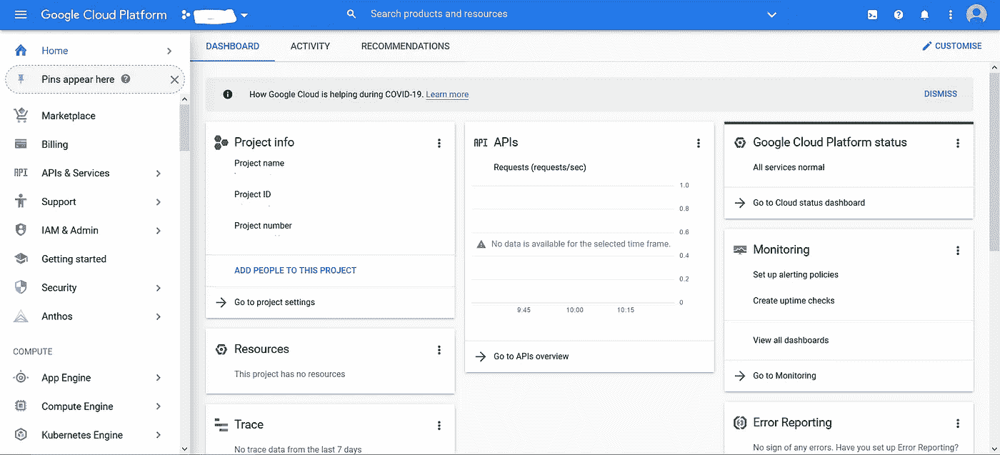
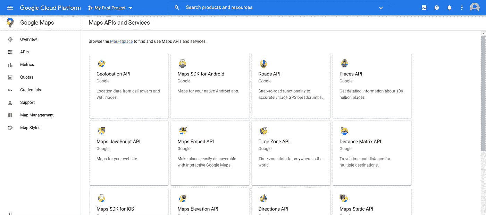
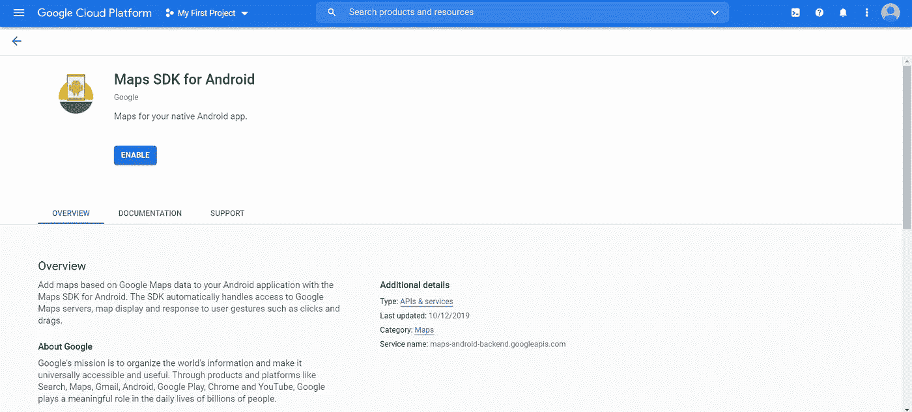
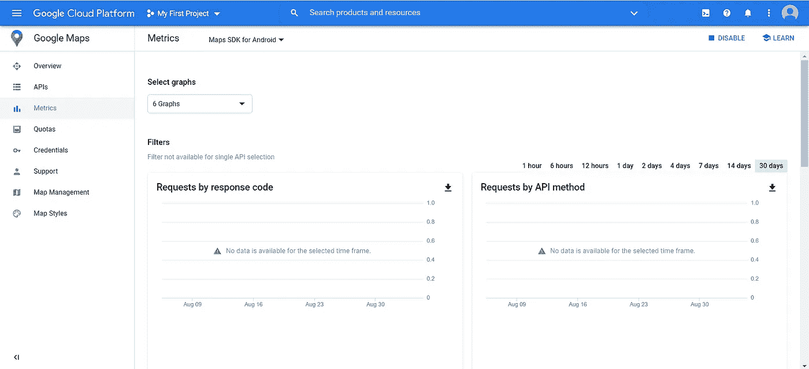
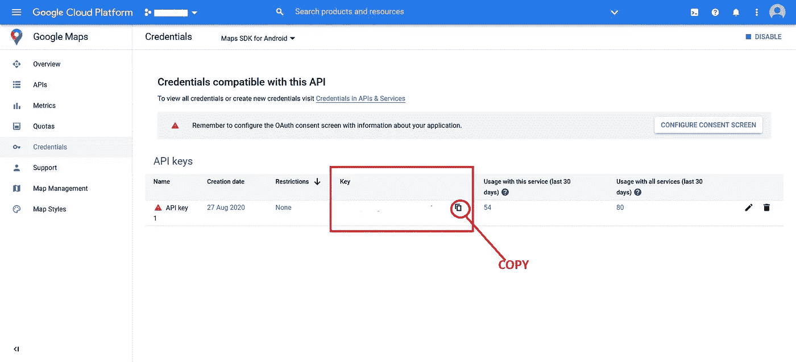
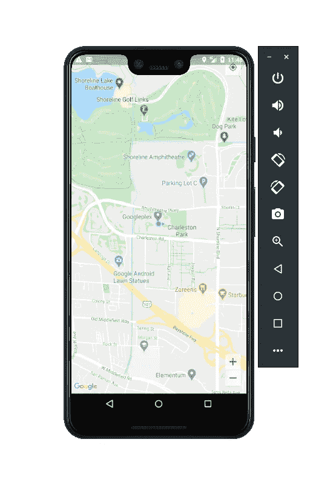

# 如何在一个 flutter app 中添加谷歌地图，动态获取用户当前位置？

> 原文：<https://levelup.gitconnected.com/how-to-add-google-maps-in-a-flutter-app-and-get-the-current-location-of-the-user-dynamically-2172f0be53f6>

## 在你的 flutter 应用中添加谷歌地图功能


来源:searchenginejournal.com

在创建帮助用户导航的应用程序时，向应用程序添加地图功能是必不可少的。因此，在这种情况下，我们应该在我们的 flutter 应用程序中添加谷歌地图支持。我们要做的第一件事是从 console.cloud.google.com[获得一个使用谷歌地图的 API 密匙。](http://console.cloud.google.com)

# **什么是 API 密匙？**

API 密钥是一个不应该与任何人共享的秘密密钥。API 键也可以用于查找是谁发出请求。所以，这些数据可以为谷歌做进一步的参考。

# **入门**

开始这个项目首先我们需要从谷歌云控制台获得一个 API 密钥。会有一些获取 API 密钥的程序。你需要去 console.cloud.google.com。



console.cloud.google.com 主页

登录 console.cloud.google.com 后，您将进入上述页面。移动到它之后，您将被要求创建一个新项目。你应该补充一些他们要求的细节。填写完这些细节后，你就会进入上面的页面。现在，您可以单击左侧导航栏中的 API 和服务。然后你将被带到下一页。进入新页面后，点击 **Map SDK for android。**



您将被带到上面的页面。因此，单击 enable 按钮来启用 Google Map API。启用该选项后，您将进入指标页面的下一页。现在，单击导航栏中的凭据，您可以从该处获取 API。



既然我已经告诉你了，这就像是你不应该和任何人分享的凭证。在下面的页面中，你可以看到你的 API 密匙，你可以用旁边的图标复制它。



拿到钥匙后，第一部分就结束了，现在让我们看看编码和插件部分。我们应该给我们的 flutter 应用添加一些插件，我们还应该添加我们在[console.cloud.google.com](http://console.cloud.google.com)得到的 API 密匙。

# 插件

我们将添加两个依赖项，一个是谷歌地图插件和位置插件。谷歌地图插件用于将谷歌地图功能添加到应用程序中，位置插件用于获取用户的当前位置。

```
dependencies: google_maps_flutter: ^0.5.30 location: ^3.0.2
```

将这些插件添加到您的 pubspec.yaml 文件中并保存它。这里，我们的项目很简单，它将只包含 **main.dart** 文件。好了，让我们继续向我们的应用程序添加 API 键。

*   **打开**打开位于 **android/app/src/main/** 目录下的 **AndroidManifest.xml** 文件。
*   在 AndroidManifest.xml 文件中添加以下行。

```
<manifest <some code here> <uses-permissionandroid:name="android.permission.ACCESS_FINE_LOCATION" /> <uses-permissionandroid:name="android.permission.ACCESS_COARSE_LOCATION" />
```

*   上面的线将被用来许可访问用户的位置
*   将 API 添加到 AndroidManifest.xml 文件中的<application>标记 add below 行内。</application>

```
<meta-data android:name="com.google.android.geo.API_KEY"android:value="YOUR API KEY HERE"/>
```

代替**您的 API 密钥，这里**添加您从 Google 获得的 API 密钥。

添加后，您可以保存并关闭它。现在我们将进入编码部分。

# 让我们编码

因为我说过这个应用程序将会很简单并且有状态，所以唯一要处理的文件是 **main.dart** 文件。将下面的 **main.dart** below 文件添加到项目文件中。

好，我来解释一下代码。我创建了一个有状态的 **MyHomePage** 类，并为它创建了一个状态。此外，我已经删除了应用程序栏。在 **MyHomePageState** 类中，主体由一个脚手架组成，容器具有设备的高度和宽度。在其中，创建了一个堆栈，并向其中添加了一个 Google map 小部件。初始相机位置将指向我已经用**latting**数据类型定义的纬度和经度。我已经将贴图类型设置为正常。您也可以将其更改为地形、卫星和混合类型。地图创建后，它将调用 **_onMapCreated** 函数。我还声明了一个 GoogleMap 控制器。在 **_onMapCreated** 函数中，每当设备的位置改变时，摄像机将移动到新的位置。这使得小部件有状态。用户的位置也会在地图上用蓝点标出。

这是总的应用程序。就在这 100 行代码中，应用程序就完成了。如果你喜欢这个博客，如果你想给我投稿，你现在可以通过给我买杯咖啡来投稿。

[](http://buymeacoff.ee/pavithran)[](https://www.buymeacoff.ee/pavithran) [## Pavithran 是一名软件开发人员

### 嘿，👋我是一名软件开发人员、机器学习爱好者和移动应用程序开发人员。你现在可以给我买杯咖啡了！

www.buymeacoff.ee](https://www.buymeacoff.ee/pavithran) 

# 截屏

我已经添加了最终应用程序的输出



# **结论**

这相当于开发一个带有用户当前位置抖动的谷歌地图。我希望你对这个故事有所了解。你可以从[这里](https://github.com/Pavithran-07/Google-map-in-flutter-with-current-location)下载 GitHub 的代码。您可以根据自己的需要进行定制。编码快乐！:)