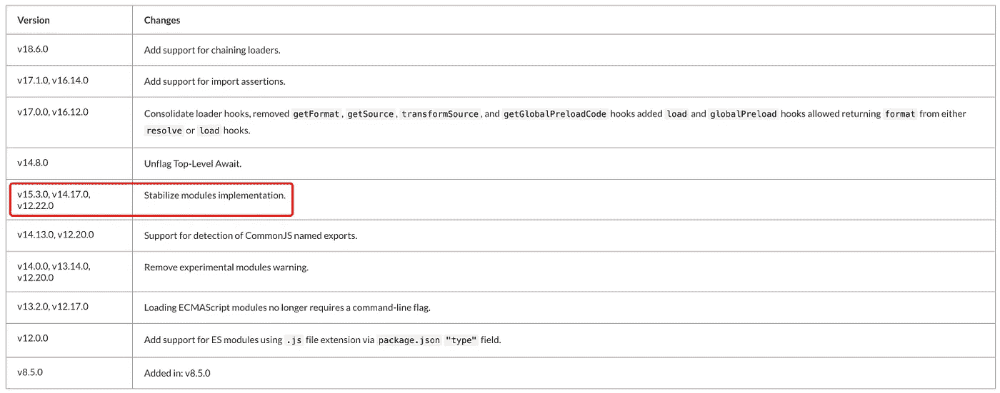
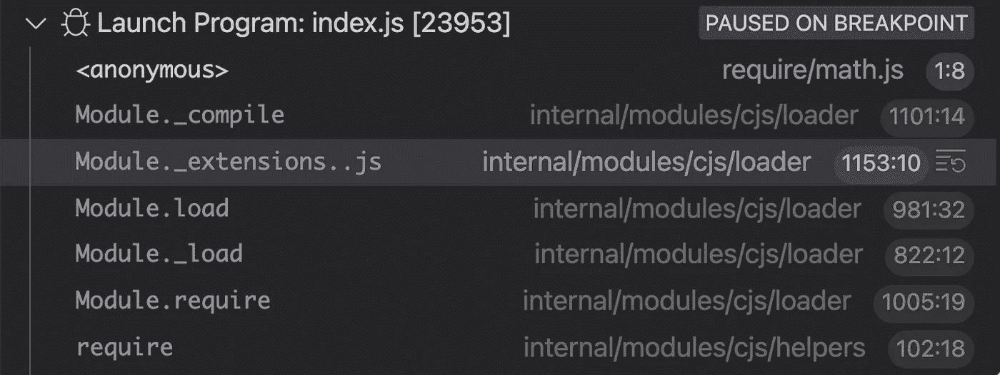

# 如何给 Node.js' Require 函数添加钩子？

> 原文：<https://levelup.gitconnected.com/how-to-add-hooks-to-node-js-require-function-dee7acd12698>


照片由[张克帆·马塞多](https://unsplash.com/@johnathanmphoto?utm_source=medium&utm_medium=referral)在 [Unsplash](https://unsplash.com?utm_source=medium&utm_medium=referral) 上拍摄

Node.js 是一个基于 Chrome V8 引擎的 JavaScript 运行时环境。早期的 Node.js 采用了 **CommonJS** 模块规范， **ECMAScript 模块**功能从 Node v13.2.0 开始就得到官方支持，直到 v15.3.0，ECMAScript 模块功能才稳定下来，并与 NPM 生态系统兼容。



照片经由[https://nodejs.org/api/esm.html](https://nodejs.org/api/esm.html)

本文将介绍 Node.js 中`require`函数的工作流程，如何让 Node.js 直接执行 **ts** 文件，如何正确劫持 Node.js 的`require`函数实现 hook 函数。接下来，我们先介绍一下`require`功能。

# 需要功能

Node.js 应用程序由模块组成，每个文件都是一个模块。对于 CommonJS 模块规范，我们通过`require`函数导入模块。那么当我们使用`require`函数导入一个模块时，函数内部会发生什么呢？这里我们通过调用堆栈来看看`require`的过程:



从上图可以看出，使用`require`函数导入模块时，会调用模块对象的`load`方法来加载模块。该方法的实现如下:

```
// lib/internal/modules/cjs/loader.js
Module.prototype.load = function(filename) {
  this.filename = filename;
  this.paths = Module._nodeModulePaths(path.dirname(filename));const extension = findLongestRegisteredExtension(filename);Module._extensions[extension](this, filename);
  this.loaded = true;
  // omit part of the code
};
```

> 注意:本文引用的 Node.js 源代码版本是 v16.13.1

在上面的代码中，两个重要的步骤是:

*   第一步:根据文件名找到扩展名；
*   第二步:在**模块中找到匹配的加载器。_extensions** 对象。

Node.js 内置了 3 个不同的加载器，用于加载`node`、`json`和`js`文件。

**节点文件加载器**

```
// lib/internal/modules/cjs/loader.js
Module._extensions['.node'] = function(module, filename) {
  return process.dlopen(module, path.toNamespacedPath(filename));
};
```

**json 文件加载器**

```
// lib/internal/modules/cjs/loader.js
Module._extensions['.json'] = function(module, filename) {
 const content = fs.readFileSync(filename, 'utf8');
 try {
    module.exports = JSONParse(stripBOM(content));
 } catch (err) {
   err.message = filename + ': ' + err.message;
   throw err;
 }
};
```

**js 文件加载器**

```
// lib/internal/modules/cjs/loader.js
Module._extensions['.js'] = function(module, filename) {
  // If already analyzed the source, then it will be cached.
  const cached = cjsParseCache.get(module);
  let content;
  if (cached?.source) {
    content = cached.source;
    cached.source = undefined;
  } else {
    content = fs.readFileSync(filename, 'utf8');
  }
  // omit part of the code
  module._compile(content, filename);
};
```

我们来分析一下更重要的 js 文件加载器。通过阅读上面的代码，我们可以知道 js loader 的核心处理流程也可以分为两步:

*   第一步:使用`fs.readFileSync`方法加载 js 文件的内容；
*   第二步:使用`module._compile`方法编译加载的 js 代码。

那么知道了以上知识对我们有什么用呢？其实在了解了`require`函数的工作流程之后，我们就可以扩展 Node.js loader 了。比如启用 Node.js 运行 **ts** 文件。

```
// register.js
const fs = require("fs");
const Module = require("module");
const { transformSync } = require("esbuild");Module._extensions[".ts"] = function (module, filename) {
  const content = fs.readFileSync(filename, "utf8");
  const { code } = transformSync(content, {
    sourcefile: filename,
    sourcemap: "both",
    loader: "ts",
    format: "cjs",
  });
  module._compile(code, filename);
};
```

在上面的代码中，我们导入内置的`module`模块，然后使用`Module._extensions`对象注册我们的自定义 ts 文件加载器。其实加载器的本质就是一个函数。在这个函数内部，我们使用`esbuild`模块提供的`transformSync` API 来实现 **ts - > js** 代码的转换。当代码转换完成后，将调用`module._compile`方法来编译代码。

我们来看看如何让自定义 ts 加载器生效。为了使 Node.js 能够执行 ts 代码，我们需要在执行 ts 代码之前完成定制 ts 加载器的注册。幸运的是，Node.js 为我们提供了模块预加载机制:

```
$ node --help | grep preload
   -r, --require=... module to preload (option can be repeated)
```

使用-r，— require 命令行配置选项，我们可以预加载指定的模块。解决了这个问题，让我们测试一下我们的定制 ts 加载器。首先创建一个 index.ts 文件，并输入以下代码:

**索引. ts**

```
// index.ts
const add = (a: number, b: number) => a + b;console.log("add(a, b) = ", add(3, 5));
```

然后在命令行输入以下命令:

```
$ node -r ./register.js index.ts
```

当上述命令成功运行时，控制台将输出以下结果:

```
add(a, b) =  8
```

显然我们自定义的 ts 文件加载器已经生效了，这个扩展机制还是很值得学习的。另外需要注意的是，在`load`方法中，`findLongestRegisteredExtension`函数会判断文件的扩展名是否已经在`Module._extensions`对象中注册。如果没有，则返回**”。**默认 js。

```
// lib/internal/modules/cjs/loader.js
Module.prototype.load = function(filename) {
  this.filename = filename;
  this.paths = Module._nodeModulePaths(path.dirname(filename));const extension = findLongestRegisteredExtension(filename);Module._extensions[extension](this, filename);
  this.loaded = true;
  // omit part of the code
};
```

这意味着只要文件包含有效的 js 代码，require 函数就会正常加载它。例如下面的 **a.txt** 文件:

```
module.exports = "Hello Bytefer";
```

至此，相信你已经了解了`require`函数如何加载模块，如何自定义 Node.js 文件加载器。那么，Node.js 有没有更优雅更简单的方案来支持加载其他类型的文件比如`ts`、`png`或者`css`？答案是肯定的，我们可以使用第三方库 [**盗版**](https://github.com/danez/pirates) 。

# 什么是海盗

[**pirates**](https://github.com/danez/pirates) 是一个允许我们适当劫持 Node.js 的`require`函数的库。使用这个库，我们可以很容易地扩展 Node.js 加载器的功能。

## 盗版的使用

您可以使用 npm 来安装盗版:

```
$ npm install --save pirates
```

成功安装 [**盗版**](https://github.com/danez/pirates) 库后，可以使用模块提供的`addHook`函数添加钩子。

**register.js**

```
// register.js
const addHook = require("pirates").addHook;const revert = addHook(
  (code, filename) => code.replace("@@foo", "console.log('foo');"),
  { exts: [".js"] }
);
```

需要注意的是，调用`addHook`后，会返回一个 revert 函数，取消对`require`函数的劫持。同样，让我们验证一下 pirates 库是否正常工作，首先创建一个新的 index.js 文件，并输入以下代码:

**index.js**

```
// index.js
console.log("@@foo")
```

然后在命令行输入以下命令:

```
$ node -r ./register.js index.js
```

当上述命令成功运行时，控制台将输出以下结果:

```
console.log('foo');
```

从上面的结果可以看出，我们通过`addHook`函数添加的钩子生效了。你不觉得很神奇吗，我们来分析一下海盗是怎么运作的。

## 海盗是如何运作的

在内部，pirates 使用 Node.js 内置的`module`模块提供的扩展机制来实现 Hook 函数。我们已经介绍过，使用`require`函数加载模块时， **Node.js 会根据文件扩展名**匹配对应的加载器。
其实海贼的源代码并不复杂。让我们重点分析一下`addHook`函数的核心处理逻辑:

```
// src/index.js
export function addHook(hook, opts = {}) {
  let reverted = false;
  const loaders = []; 
  const oldLoaders = []; 
  let exts;const originalJSLoader = Module._extensions['.js']; const matcher = opts.matcher || null;
  const ignoreNodeModules = opts.ignoreNodeModules !== false;
  exts = opts.extensions || opts.exts || opts.extension || opts.ext 
    || ['.js'];
  if (!Array.isArray(exts)) {
    exts = [exts];
  }
  exts.forEach((ext) { 
    // ... 
  }
}
```

为了提高执行效率，`addHook`函数提供了**匹配器**和 **ignoreNodeModules** 配置项来实现文件过滤操作。在获得 exts 扩展列表后，新的加载程序将替换现有的加载程序。

```
exts.forEach((ext) => {
    if (typeof ext !== 'string') {
      throw new TypeError(`Invalid Extension: ${ext}`);
    }
    // Get the registered loader, if not found, 
    // use JS Loader by default
    const oldLoader = Module._extensions[ext] || originalJSLoader;
    oldLoaders[ext] = Module._extensions[ext];loaders[ext] = Module._extensions[ext] = function newLoader(
   mod, filename) {
      let compile;
      if (!reverted) {
        if (shouldCompile(filename, exts, matcher,   
        ignoreNodeModules)) {
          compile = mod._compile;
          mod._compile = function _compile(code) {
     // Here you need to restore the original _compile function, 
     // otherwise there will be an infinite loop
            mod._compile = compile;
     // Execute the user-defined hook function before compiling
            const newCode = hook(code, filename);
            if (typeof newCode !== 'string') {
              throw new Error(HOOK_RETURNED_NOTHING_ERROR_MESSAGE);
            } return mod._compile(newCode, filename);
          };
        }
      } oldLoader(mod, filename);
    };
});
```

从上面的代码可以看出，钩子函数是通过替换`addHook`函数内部的`mode._compile`方法实现的。即在调用原来的`mode._compile`方法进行编译之前，会先调用`hook(code, filename)`函数来执行用户自定义的钩子函数来处理代码。

在实践中，如果希望 Node.js 直接执行 ts 文件，可以使用 [**ts-node**](https://github.com/TypeStrong/ts-node) 或者 [**esbuild-register**](https://github.com/egoist/esbuild-register) 库。[**es build-register**](https://github.com/egoist/esbuild-register)库使用 [**pirates**](https://github.com/danez/pirates) 提供的钩子机制来实现相应的功能。

如果你想学习打字，那么就不要错过**掌握打字**系列。

*   [**TypeScript 泛型中的 K、T、V 是什么？**](https://medium.com/frontend-canteen/what-are-k-t-and-v-in-typescript-generics-9fabe1d0f0f3)
*   [**使用 TypeScript 像 Pro 一样映射类型**](https://javascript.plainenglish.io/using-typescript-mapped-types-like-a-pro-be10aef5511a)
*   [**使用 TypeScript 条件类型像亲**](https://javascript.plainenglish.io/use-typescript-conditional-types-like-a-pro-7baea0ad05c5)
*   [**使用 TypeScript 交集类型像亲**](https://javascript.plainenglish.io/using-typescript-intersection-types-like-a-pro-a55da6a6a5f7)
*   [**使用打字稿推断像亲**](/using-typescript-infer-like-a-pro-f30ab8ab41c7)
*   [**使用 TypeScript 模板字面类型像亲**](https://medium.com/javascript-in-plain-english/how-to-use-typescript-template-literal-types-like-a-pro-2e02a7db0bac)
*   [**打字稿可视化:15 种最常用的实用类型**](https://javascript.plainenglish.io/15-utility-types-that-every-typescript-developer-should-know-6cf121d4047c)
*   [**关于类型脚本类你需要知道的 10 件事**](/10-things-you-need-to-know-about-typescript-classes-f58c57869266)
*   [](https://javascript.plainenglish.io/purpose-of-declare-keyword-in-typescript-8431d9db2b10)**中‘声明’关键字的用途**
*   **[](https://javascript.plainenglish.io/no-more-confusion-about-typescripts-any-and-unknown-98c4b53f8924)**

****

[拜特弗](https://medium.com/@bytefer?source=post_page-----dee7acd12698--------------------------------)**** 

## ****掌握打字稿系列****

****[View list](https://medium.com/@bytefer/list/mastering-typescript-series-688ee7c12807?source=post_page-----dee7acd12698--------------------------------)********46 stories****************************

****在 [Medium](https://medium.com/@bytefer) 或 [Twitter](https://twitter.com/Tbytefer) 上关注我，阅读更多关于 TS 和 JS 的内容！****

# ****分级编码****

****感谢您成为我们社区的一员！在你离开之前:****

*   ****👏为故事鼓掌，跟着作者走👉****
*   ****📰查看[升级编码出版物](https://levelup.gitconnected.com/?utm_source=pub&utm_medium=post)中的更多内容****
*   ****🔔关注我们:[Twitter](https://twitter.com/gitconnected)|[LinkedIn](https://www.linkedin.com/company/gitconnected)|[时事通讯](https://newsletter.levelup.dev)****

****🚀👉 [**加入人才集体，找到一份令人惊喜的工作**](https://jobs.levelup.dev/talent/welcome?referral=true)****