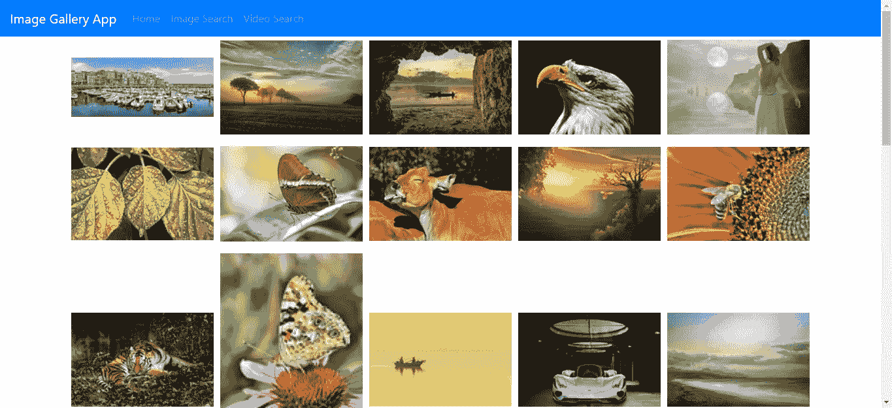
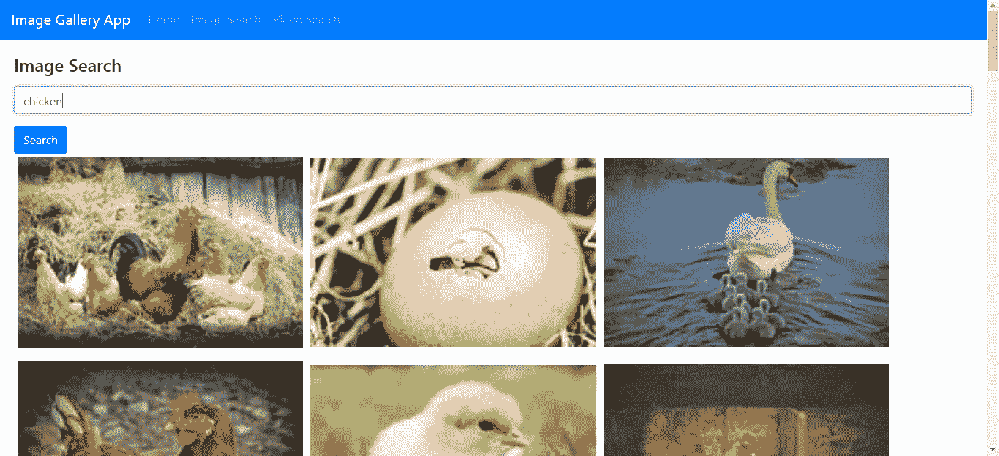
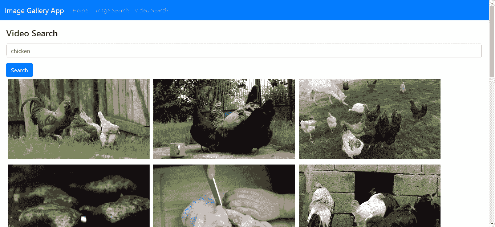

# 如何在 React 应用程序中添加无限滚动

> 原文：<https://levelup.gitconnected.com/how-to-add-infinite-scrolling-to-your-react-app-efe7002123b8>



**现在在**[**http://jauyeung.net/subscribe/**](http://jauyeung.net/subscribe/)**订阅我的邮件列表。**

**在推特上关注我**[**https://twitter.com/AuMayeung**](https://twitter.com/AuMayeung)

无限滚动是指当您向下滚动页面时，页面会不断加载新数据，只有在加载完所有可能的数据后才会停止。通过 React，使用众多库中的一个，向您的应用程序添加无限滚动很容易

为了给应用程序添加无限滚动，我们可以使用像[react-infinite-scroller](https://github.com/CassetteRocks/react-infinite-scroller)这样的库。它提供无限滚动，可以很容易地集成到任何 React 应用程序中。

在这个故事中，我们将建立一个应用程序，从位于[https://pixabay.com/](https://pixabay.com/)的 Pixabay API 获取图像和视频。为了使用 API，我们注册一个 API 密钥，然后我们可以每小时调用 API 5000 次。

为了开始构建我们的应用程序，我们运行`npx create-react-app image-app`。这将创建我们开始构建应用程序所需的项目文件夹和文件。

接下来我们必须添加一些库。我们需要一个 HTTP 客户端来发出请求，需要引导程序来设计我们的应用程序，需要 Formik 和 Yup 来进行表单验证，需要`querystring`包来对来自对象的查询字符串进行编码，需要 react-infinite-scroller 来进行无限滚动，还需要 React Router 来将 URL 路由到我们的页面。我们运行`npm i axios bootstrap formik querystring react-bootstrap react-router-dom yup react-infinite-scroller`来安装库。

现在所有的库都安装好了，我们可以开始写代码了。首先，我们在页面上工作。在`App.js`中，我们将现有代码替换为:

```
import React from 'react';
import { Router, Route } from "react-router-dom";
import HomePage from './HomePage';
import { createBrowserHistory as createHistory } from 'history'
import Navbar from 'react-bootstrap/Navbar';
import Nav from 'react-bootstrap/Nav';
import './App.css';
import ImageSearchPage from './ImageSearchPage';
import VideoSearchPage from './VideoSearchPage';
const history = createHistory();function App() {
  return (
    <div className="App">
      <Router history={history}>
        <Navbar bg="primary" expand="lg" variant="dark" >
          <Navbar.Brand href="/">Image Gallery App</Navbar.Brand>
          <Navbar.Toggle aria-controls="basic-navbar-nav" />
          <Navbar.Collapse id="basic-navbar-nav">
            <Nav className="mr-auto">
              <Nav.Link href="/">Home</Nav.Link>
              <Nav.Link href="/imagesearch">Image Search</Nav.Link>
              <Nav.Link href="/videosearch">Video Search</Nav.Link>
            </Nav>
          </Navbar.Collapse>
        </Navbar>
        <Route path="/" exact component={HomePage} />
        <Route path="/imagesearch" exact component={ImageSearchPage} />
        <Route path="/videosearch" exact component={VideoSearchPage} />
      </Router>
    </div>
  );
}export default App;
```

这将导航栏和路线添加到我们的页面，我们稍后将使用。

然后我们创建`HomePage.js`来构建我们的主页，我们将把它放在`src`文件夹中。在`HomePage.js`中，我们添加了以下内容:

```
import React from 'react';
import { useState, useEffect } from 'react';
import './HomePage.css';
import InfiniteScroll from 'react-infinite-scroller';
import Figure from 'react-bootstrap/Figure'
import { getPhotos } from './requests';
let page = 0;function HomePage() {
    const [items, setItems] = useState([]);
    const [initialized, setInitialized] = useState(false);
    const [totalHits, setTotalHits] = useState(0); const getNewPhotos = async () => {
        page++;
        const response = await getPhotos(page);
        setItems(items.concat(response.data.hits));
        setTotalHits(response.data.totalHits);
        setInitialized(true);
    } useEffect(() => {
        if (!initialized) {
            getNewPhotos();
        }
    }); return (
        <div className="HomePage">
            <InfiniteScroll
                pageStart={page}
                loadMore={getNewPhotos}
                hasMore={totalHits > items.length}
                threshold={100}
            >
                {items.map((i, index) =>
                    <Figure key={index}>
                        <Figure.Image
                            width={window.innerWidth / 3.5}
                            src={i.previewURL}
                        />
                    </Figure>
                )}
            </InfiniteScroll>
        </div>
    );
}export default HomePage;
```

这就是我们使用`react-infinite-scroller`库添加无限滚动的地方。这很简单。我们所做的就是将我们希望无限滚动的项目包装在`InfiniteScroll`组件中，然后我们添加处理程序来加载下一个项目。在这种情况下，我们用`getNewPhotos`函数来完成。注意，在加载新项目并添加到`items`数组之前，我们必须增加页码。`hasMore`道具是一个布尔值，所以为了继续装载物品直到我们一无所有，我们将`totalHits > items.length`作为`hasMore`的表达式。`getNewPhotos`设置`totalHits`和`items`。

在`Homepage.css`的同一个文件夹中，我们添加:

```
.figure {
  margin: 5px !important;
}.HomePage {
  text-align: center;
}
```

这给我们的图像增加了一些空白。

除非另有说明，否则所有文件都在`src`文件夹中。我们为图像搜索页面添加了`ImageSearchPage.js`文件。在那里我们加上:

```
import React from 'react';
import { Formik } from 'formik';
import Form from 'react-bootstrap/Form';
import Col from 'react-bootstrap/Col';
import Button from 'react-bootstrap/Button';
import * as yup from 'yup';
import './ImageSearchPage.css';
import { searchPhotos } from './requests';
import { useState, useEffect } from 'react';
import InfiniteScroll from 'react-infinite-scroller';
import Figure from 'react-bootstrap/Figure'let page = 1;const schema = yup.object({
  query: yup.string().required('Query is required'),
});function ImageSearchPage() {
  const [items, setItems] = useState([]);
  const [totalHits, setTotalHits] = useState(0);
  const [keyword, setKeyword] = useState(''); const handleSubmit = async (evt) => {
    const isValid = await schema.validate(evt);
    if (!isValid) {
      return;
    }
    const data = {
      q: encodeURIComponent(evt.query),
      image_type: 'photo',
      page
    }
    const response = await searchPhotos(data);
    setTotalHits(response.data.totalHits);
    setItems(items.concat(response.data.hits));
    setKeyword(evt.query);
  } const getMorePhotos = async () => {
    page++;
    const data = {
      q: encodeURIComponent(keyword),
      image_type: 'photo',
      page
    }
    const response = await searchPhotos(data);
    setTotalHits(response.data.totalHits);
    setItems(items.concat(response.data.hits));
  } return (
    <div className="ImageSearchPage">
      <Formik
        validationSchema={schema}
        onSubmit={handleSubmit}
      >
        {({
          handleSubmit,
          handleChange,
          handleBlur,
          values,
          touched,
          isInvalid,
          errors,
        }) => (
            <Form noValidate onSubmit={handleSubmit}>
              <Form.Row>
                <Form.Group as={Col} md="12" controlId="firstName">
                  <Form.Label>
                    <h4>Image Search</h4>
                  </Form.Label>
                  <Form.Control
                    type="text"
                    name="query"
                    placeholder="Keyword"
                    value={values.query || ''}
                    onChange={handleChange}
                    isInvalid={touched.description && errors.query}
                  />
                  <Form.Control.Feedback type="invalid">
                    {errors.query}
                  </Form.Control.Feedback>
                </Form.Group>
              </Form.Row>
              <Button type="submit">Search</Button>
            </Form>
          )}
      </Formik>
      <InfiniteScroll
        pageStart={page}
        loadMore={getMorePhotos}
        hasMore={totalHits > items.length}
        threshold={100}
      >
        {items.map((i, index) =>
          <Figure key={index}>
            <Figure.Image
              width={window.innerWidth / 3.5}
              src={i.previewURL}
            />
          </Figure>
        )}
      </InfiniteScroll>
    </div>
  );
}export default ImageSearchPage;
```

在这里，我们添加了按关键字搜索的表单，然后显示图像。我们在这个页面上也有无限滚动。这是使用 Formik 和 Yup 库检查查询是否已经输入的地方。Yup 提供了验证模式，该模式被传递到`Formik`组件并验证该字段。Formik 自动处理表单字段的值更改，因此我们不需要编写任何东西来完成它。

然后我们创建`ImageSearchPage.css`并添加:

```
.ImageSearchPage{
    padding: 20px;
}
```

这会给页面添加填充。

然后我们创建`requests.js`并添加:

```
const APIURL = '[https://pixabay.com/api'](https://pixabay.com/api');
const axios = require('axios');
const querystring = require('querystring');
const APIKEY = 'Pixabay API key';export const getPhotos = (page = 1) => axios.get(`${APIURL}/?key=${APIKEY}&page=${page}`);export const searchPhotos = (data) => {
    data['key'] = APIKEY;
    return axios.get(`${APIURL}/?${querystring.encode(data)}`);
}
export const searchVideos = (data) => {
    data['key'] = APIKEY;
    return axios.get(`${APIURL}/videos/?${querystring.encode(data)}`);
}
```

这有助于我们向 Pixabay API 请求查找照片和视频。将 API 密钥替换为您自己的密钥，您可以在注册时从 Pixabay 获得该密钥。

接下来，我们创建视频搜索页面。我们创建一个名为`VideoSearchPage.js`的文件，并添加:

```
import React from 'react';
import './VideoSearchPage.css';
import { searchVideos } from './requests';
import { Formik } from 'formik';
import Form from 'react-bootstrap/Form';
import Col from 'react-bootstrap/Col';
import Button from 'react-bootstrap/Button';
import * as yup from 'yup';
import './ImageSearchPage.css';
import { useState } from 'react';
import Figure from 'react-bootstrap/Figure'const schema = yup.object({
  query: yup.string().required('Query is required'),
});function VideoSearchPage() {
  const [items, setItems] = useState([]); const handleSubmit = async (evt) => {
    const isValid = await schema.validate(evt);
    if (!isValid) {
      return;
    }
    const data = {
      q: encodeURIComponent(evt.query),
      page: 1
    }
    const response = await searchVideos(data);
    setItems(items.concat(response.data.hits));
  } return (
    <div className="ImageSearchPage">
      <Formik
        validationSchema={schema}
        onSubmit={handleSubmit}
      >
        {({
          handleSubmit,
          handleChange,
          handleBlur,
          values,
          touched,
          isInvalid,
          errors,
        }) => (
            <Form noValidate onSubmit={handleSubmit}>
              <Form.Row>
                <Form.Group as={Col} md="12" controlId="firstName">
                  <Form.Label>
                    <h4>Video Search</h4>
                  </Form.Label>
                  <Form.Control
                    type="text"
                    name="query"
                    placeholder="Keyword"
                    value={values.query || ''}
                    onChange={handleChange}
                    isInvalid={touched.description && errors.query}
                  />
                  <Form.Control.Feedback type="invalid">
                    {errors.query}
                  </Form.Control.Feedback>
                </Form.Group>
              </Form.Row>
              <Button type="submit">Search</Button>
            </Form>
          )}
      </Formik>
      {items.map((i, index) =>
        <Figure key={index}>
          <video
            width={window.innerWidth / 3.5}
          >
            <source src={i.videos.tiny.url} type="video/mp4" />
          </video>
        </Figure>
      )}
    </div>
  );
}export default VideoSearchPage;
```

这类似于图像搜索页面，只是我们没有无限滚动，并且用`video`标签替换了`img`标签。

最后，在`public/index.html`中，我们有:

```
<!DOCTYPE html>
<html lang="en"><head>
  <meta charset="utf-8" />
  <link rel="shortcut icon" href="%PUBLIC_URL%/favicon.ico" />
  <meta name="viewport" content="width=device-width, initial-scale=1" />
  <meta name="theme-color" content="#000000" />
  <meta name="description" content="Web site created using create-react-app" />
  <link rel="apple-touch-icon" href="logo192.png" />
  <!--
      manifest.json provides metadata used when your web app is installed on a
      user's mobile device or desktop. See [https://developers.google.com/web/fundamentals/web-app-manifest/](https://developers.google.com/web/fundamentals/web-app-manifest/)
    -->
  <link rel="manifest" href="%PUBLIC_URL%/manifest.json" />
  <!--
      Notice the use of %PUBLIC_URL% in the tags above.
      It will be replaced with the URL of the `public` folder during the build.
      Only files inside the `public` folder can be referenced from the HTML.Unlike "/favicon.ico" or "favicon.ico", "%PUBLIC_URL%/favicon.ico" will
      work correctly both with client-side routing and a non-root public URL.
      Learn how to configure a non-root public URL by running `npm run build`.
    -->
  <title>Image Gallery App</title>
  <link rel="stylesheet" href="[https://maxcdn.bootstrapcdn.com/bootstrap/4.3.1/css/bootstrap.min.css](https://maxcdn.bootstrapcdn.com/bootstrap/4.3.1/css/bootstrap.min.css)"
    integrity="sha384-ggOyR0iXCbMQv3Xipma34MD+dH/1fQ784/j6cY/iJTQUOhcWr7x9JvoRxT2MZw1T" crossorigin="anonymous" />
</head><body>
  <noscript>You need to enable JavaScript to run this app.</noscript>
  <div id="root"></div>
  <!--
      This HTML file is a template.
      If you open it directly in the browser, you will see an empty page.You can add webfonts, meta tags, or analytics to this file.
      The build step will place the bundled scripts into the <body> tag.To begin the development, run `npm start` or `yarn start`.
      To create a production bundle, use `npm run build` or `yarn build`.
    -->
</body></html>
```

我们补充道:

```
<link rel="stylesheet" href="[https://maxcdn.bootstrapcdn.com/bootstrap/4.3.1/css/bootstrap.min.css](https://maxcdn.bootstrapcdn.com/bootstrap/4.3.1/css/bootstrap.min.css)"
    integrity="sha384-ggOyR0iXCbMQv3Xipma34MD+dH/1fQ784/j6cY/iJTQUOhcWr7x9JvoRxT2MZw1T" crossorigin="anonymous" />
```

这在我们的代码中增加了引导样式。

完成所有这些后，我们有:

