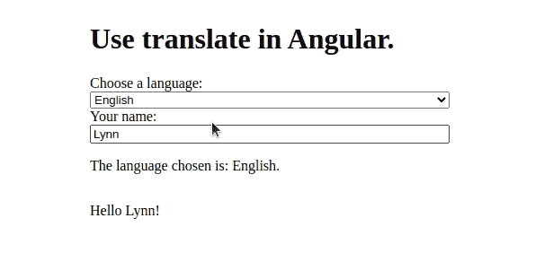
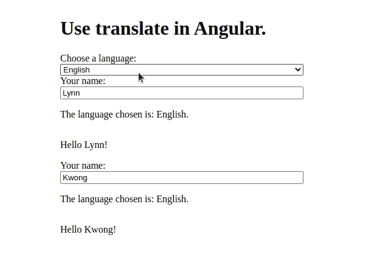

# 如何在 Angular 中添加国际化(翻译)——后端集成和延迟加载模块

> 原文：<https://levelup.gitconnected.com/how-to-add-internationalization-translations-in-angular-backend-integration-and-lazy-loaded-bd394262727>

## 从实践教程中了解翻译服务的更多高级设置


[图片由杰勒特拍摄于 Pixabay](https://pixabay.com/illustrations/globe-world-languages-translate-110775/)

在[之前的一篇文章](https://medium.com/geekculture/how-to-add-internationalization-translations-in-angular-basics-d9fed161d572)中，我们介绍了如何建立 *ngx-translate* 库并在一个简单的 Angular 项目中使用它的基础知识。翻译是从静态 JSON 文件中获得的。然而，在生产中，翻译通常需要从数据库中动态获取。此外，为了获得更好的性能，在更大的项目中会有延迟加载的模块，需要为它们单独设置翻译服务。在本帖中，我们将通过实践教程介绍这两个使用翻译服务的高级主题。

## 设置一个模拟 REST API 服务器

由于这是一个前端教程，这里就不搭建后端服务器了。相反，我们将使用前端开发中常用的模拟服务器。它让我们不依赖于后端开发，尤其是在 web 开发实践的早期阶段。

在本文中，我们将使用 [*json-server*](https://github.com/typicode/json-server#add-custom-routes) 库来启动一个模拟 REST API 服务器，它可以通过以下方式安装:

```
$ npm install --save-dev json-server
```

让我们将`assets/i18n/en.json`和`asses/i18n/sv.json`合并到一个公共的 JSON 文件`translations.json`中，该文件将被放入新的`assets/mock-data`文件夹中。请注意，语言代码是顶级键，相应的翻译是值。正如我们将在后面看到的，顶级键将充当模拟服务器的路由。

assets/mock-data/translations . JSON

现在我们可以启动 JSON 服务器来模拟 REST API 请求:

```
$ npx json-server --watch src/assets/mock-data/translations.json
```

然后我们可以转到 [http://localhost:3000](http://localhost:3000) 来发出 API 请求。注意，JSON 文件的顶层键是默认路由。因此，您可以在[http://localhost:3000/en](http://localhost:3000/en)获得英文翻译，在[http://localhost:3000/SV](http://localhost:3000/sv.)获得瑞典语翻译。

让我们添加一些自定义路线，使它们看起来更类似于我们在实际项目中看到的路线。自定义路线也在 JSON 文件中定义，以*期望的*路线为关键字，以*现有的*路线为值。规则是从上到下评估的，因此您可以在稍后定义的规则中引用以前的自定义路线。

assets/mock-data/routes . JSON

请注意，JSON 服务器使用特殊指示符“`$1`”来指定根路径“/”之后的任何内容。在这种情况下，可以通过在实际路线前添加`/api/translations`来访问`translations.json`中定义的所有现有路线。我们还添加了一个规则来传递语言代码作为查询参数，而不是路径参数。

有了这个定义，我们可以有以下有效的路由:

然后，我们可以使用自定义路由启动 JSON 服务器:

```
$ npx json-server --watch src/assets/mock-data/translations.json \
                  --routes src/assets/mock-data/routes.json
```

在浏览器中打开 [http://localhost:3000/](http://localhost:3000/) 并设置上面演示的路线进行试验。

## 从服务器获取翻译

现在让我们更新我们的 Angular 项目，从这个假的 REST API 服务器获取翻译。

首先，我们需要在`environment.ts`中添加 API 主机，使其在存储库中的任何地方都可以访问:

环境. ts

然后我们需要创建自己的加载器来从外部 API 服务器加载翻译。定制加载器需要实现`TranslateLoader`接口，该接口有一个返回`Observable`的必需方法`getTranslation()`。我们将把自定义加载器类放在一个新文件`translate-loader.ts`中:

translate-loader.ts

最后，我们需要更新`app.module.ts`来使用这个定制的加载器。我们现在不需要创建一个神奇的工厂函数，可以直接使用自定义的 loader 类。但是，注意必须提供对`HttpClient`的依赖，否则，它将无法正常工作，因为我们需要在自定义加载器中注入`HttpClient`:

应用程序模块

现在，当您使用`ng serve`启动服务器并转到 [http://localhost:4200，](http://localhost:4200,)时，您应该会看到与[上一篇文章](https://lynn-kwong.medium.com/how-to-add-internationalization-translations-in-angular-basics-d9fed161d572)中所示相同的效果，其中的翻译是从本地 JSON 文件中获取的。



## 向根模块添加路由

我们需要有一个路由模块，然后才能创建一个惰性加载模块，我们将演示如何配置`TranslateModule`。我们需要为一个延迟加载的模块显式地单独配置`TranslateModule`，否则，翻译服务将无法在其中使用。

因为我们在设置应用程序时没有指定`--routing`选项，所以我们需要手动创建根路由模块文件`app-routing.module.ts`。

在根文件夹中创建`app-routing.module.ts`,并添加以下内容。

它现在没有路由，但是稍后创建延迟加载模块时会有一些新内容。如果你迷路了，你可以查看[这个 GitHub Repo](https://github.com/lynnkwong/angular-translations-advanced) 中这篇文章中创建或更新的所有文件。

## 创建一个延迟加载的模块

现在让我们用这个命令创建一个延迟加载的模块:

```
$ ng generate module lazy --route lazy --module app.module
```

根路由模块`app-routing.module.ts`将自动更新如下:

app-routing.module.ts

注意，我们还需要将`router-outlet`添加到`app.component.html`中，以便可以访问懒惰模块的新路线。

lazy 组件和模板有如下简单的内容，它显示了选择哪种语言并相应地使用翻译:

lazy.component.ts

lazy.component.html

如果不在`lazy.module.ts`中添加`TranslateModule`，你的应用会中断，你会看到`error NG8004: No pipe found with name 'translate'`，这意味着翻译服务在 lazy 模块中不可用。让我们把它放在那里。更新`lazy.module.ts`如下:

lazy.module.ts

注意，使用`extend: true`，懒惰加载模块将从父模块扩展翻译，并且还将使用来自其父模块的翻译。

现在，如果您转到 [http://localhost:4200/lazy，](http://localhost:4200/lazy,)您将看到根组件和 lazy 组件都工作正常:



懒加载的模块还有一些更高级的设置，比如使用不同的自定义加载器或者隔离服务，这些在我看来很少使用。如有需要，您可以查看此处的[了解详情。](https://github.com/ngx-translate/core#lazy-loaded-modules)

在这篇文章中，我们介绍了使用翻译服务的两个高级主题，即从后端服务器获取翻译和为延迟加载的模块设置翻译服务。加上[之前的基础教程](https://lynn-kwong.medium.com/how-to-add-internationalization-translations-in-angular-basics-d9fed161d572)，你现在应该可以在你的项目中自由使用翻译服务了。

相关文章:

*   [如何在 Angular-Basics 中添加国际化(翻译)](https://lynn-kwong.medium.com/how-to-add-internationalization-translations-in-angular-basics-d9fed161d572)