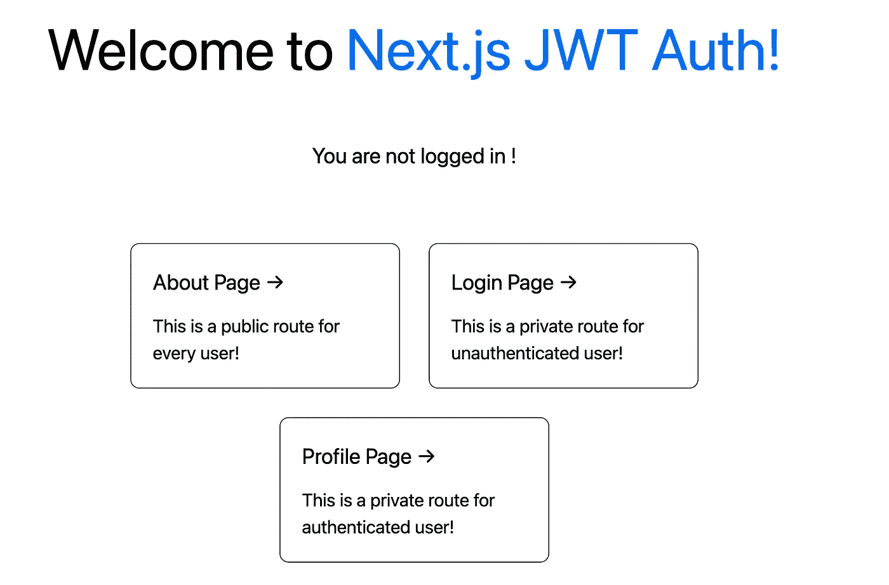
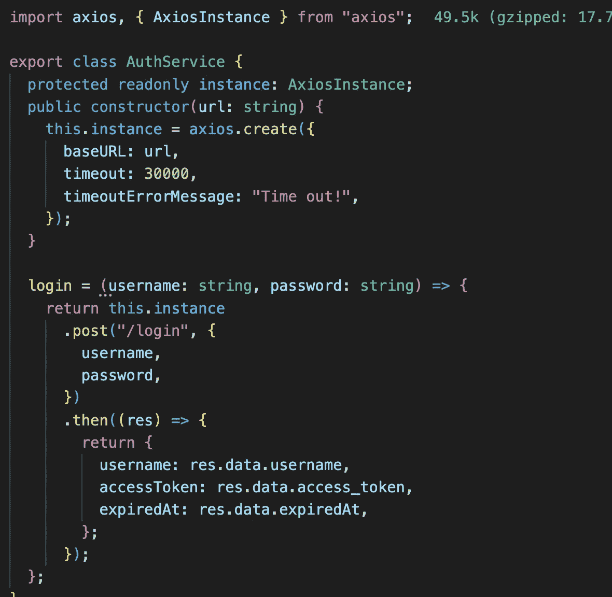
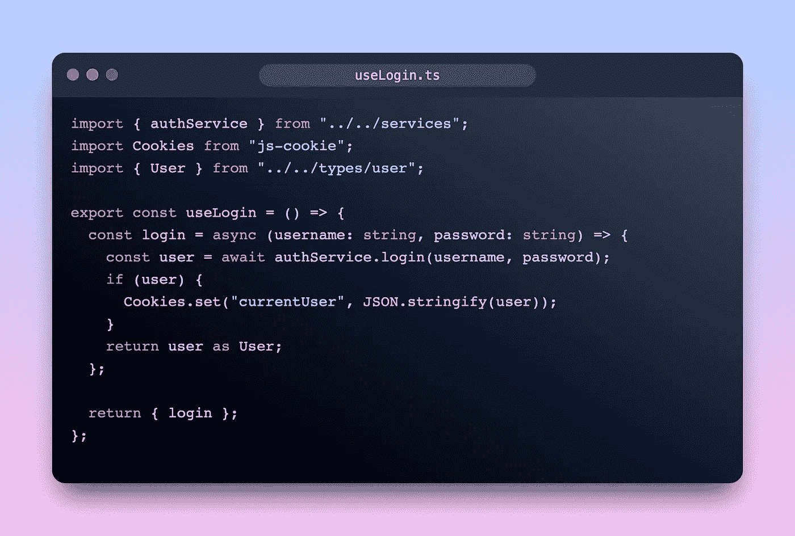
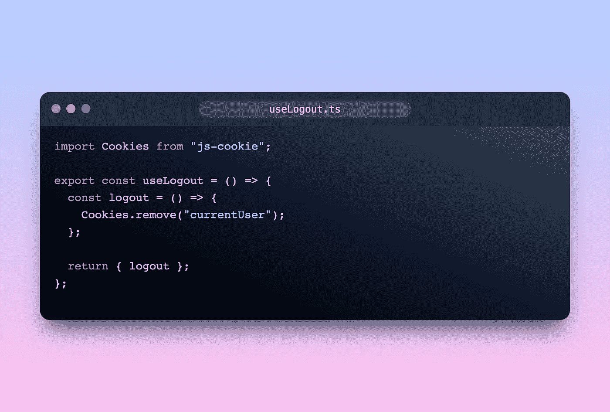
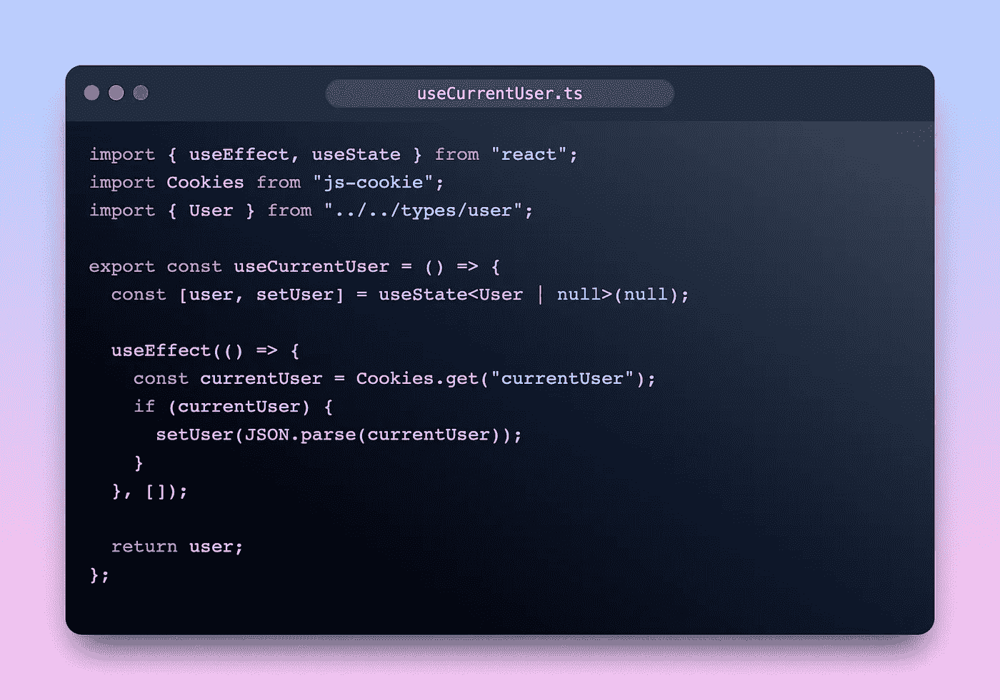
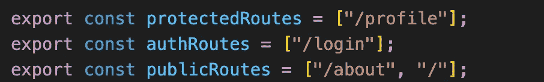
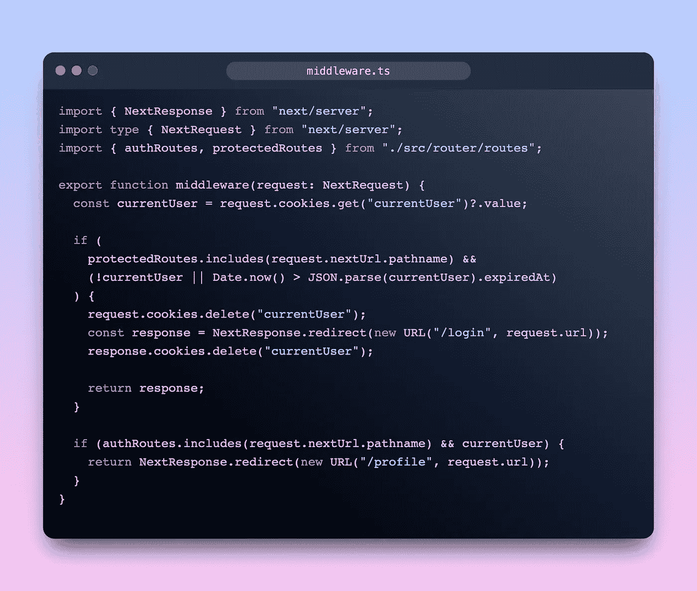

# 如何将 JWT 认证添加到 NextJS 应用程序

> 原文：<https://levelup.gitconnected.com/how-to-add-jwt-authentication-to-nextjs-apps-a0dc83bd257d>

# 介绍

本文是一篇关于如何使用 NextJS 实现身份验证的简单教程，在进入本指南之前，我将演示本指南中将要使用的技术:

*   JWT 或 JSON Web Token 是一种行业标准 [**RFC 7519**](https://tools.ietf.org/html/rfc7519) 方法，用于安全地表示双方之间的声明。
*   NextJS 中间件:中间件允许您在请求完成之前运行代码，然后基于传入的请求，您可以通过重写、重定向、修改请求或响应头或直接响应来修改响应。这将帮助我们处理带身份验证的路由
*   JWT 认证服务:你需要一个支持 JWT 认证的后端服务，你可以查看我的教程[如何用 NestJS](https://blog.bitsrc.io/jwt-authentication-with-nestjs-4f587c5dd649) 创建一个，或者你可以用任何技术自己创建一个

# 布局

我们首先需要一个用户界面，看看这个简单的布局:

你只要看一下布局就能告诉我路线。有 3 种类型的路线:

*   公共路线:任何人都可以进入的路线
*   授权路由:只有未经授权的用户才能访问的路由
*   受保护的路由:只有经过身份验证的用户才能访问的路由

# 授权服务

我们需要调用 API 登录对吗？所以我们需要一个服务来处理认证 API 调用。在这个例子中，我将使用`axios`来处理 API 调用

您可以看到，如果`login`请求成功，我们将拥有`username`、`accessToken`或 JWT，以及到期时间。

# 认证挂钩

我们需要 3 个简单的挂钩:

*   `useCurrentUser`:获取当前登录用户信息的钩子
*   `useLogin`:提供`login`方法的钩子
*   `useLogout`:提供`logout`方法的钩子

我先进入第一个`useLogin`:

你可以看到我用 cookie 登录后保存了用户信息，为什么是 cookie？我稍后会解释

`useLogout`:

要注销，我们只需要清除 cookie

`useCurrentUser`

# 中间件

使用 React only，很难检查每个路由上的身份验证。但是有了 NextJS 中间件，这变得非常容易。

首先，让我们来看看路线:

由于这只是一个简单的指南，所以我会选择这些路线。

重要的部分是中间件。在 NextJS 中，中间件允许您在请求完成之前运行代码，然后基于传入的请求，您可以通过重写、重定向、修改请求或响应头或直接响应来修改响应。

这意味着中间件将为您的项目中的**每条路线调用。**

让我们看看`middleware.ts`文件:

解释:

*   首先，从 cookies 中获取当前用户
*   检查下一个路由是否受保护，然后检查用户是否未经身份验证或令牌是否过期。从 cookies 中删除用户，并重定向至`/login`
*   检查下一个路由是否是授权路由，但用户已登录，将用户重定向到`/profile`

# 结论

这是在 NextJS 中处理认证的简单实现。我希望这篇文章对你有用，如果示例代码晦涩难懂，请点击这里查看源代码

# 遗言

虽然我的内容对每个人都是免费的，但是如果你觉得这篇文章有帮助，[你可以在这里给我买杯咖啡](https://www.buymeacoffee.com/kylele19)