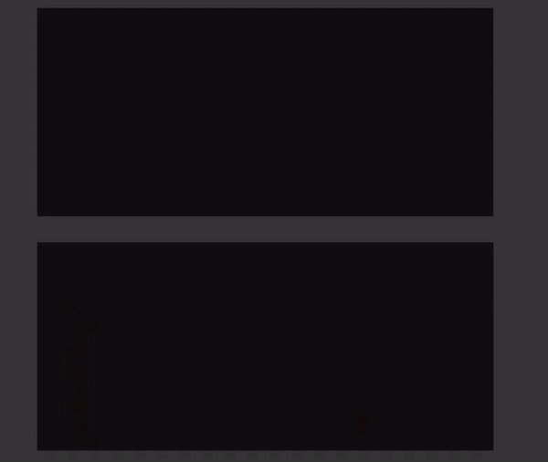

# 如何添加中等文章反应和避免 CORS 错误

> 原文：<https://levelup.gitconnected.com/how-to-add-medium-articles-to-react-and-avoid-cors-errors-25e687a26e63>


目录:

[避免 CORS 错误](#c6e8)
∘ [使用外部 API](#6040)
∘[使用代理](#95fa)
[显示中等帖子](#9b62)
∘ [定义路径](#ebd9)
∘[article card . tsx](#15ac)
∘[article card skeleton . tsx](#e047)
∘[bloglist . tsx](#67d4)
∘[blog . tst](#45af)

我的目标是:

*   在 React 应用程序中显示我的中等帖子
*   避免 CORS 错误

# 避免 CORS 错误

如果您尝试像这样直接从 React 应用程序中获取介质数据:

```
useEffect(() => {
    const fetchStuff = async () => {
      const resp = await fetch("https://medium.com/@fedor.selenskiy");
      console.log(resp);
    }

    fetchStuff();
  });
```

您可能会遇到以下错误:

```
Access to fetch at 'https://medium.com/@fedor.selenskiy' from origin
'http://localhost:3000' has been blocked by CORS policy: 
No 'Access-Control-Allow-Origin' header is present on the requested resource. 
If an opaque response serves your needs, set the request's 
mode to 'no-cors' to fetch the resource with CORS disabled.
```

对于为什么会发生这种情况，互联网上有许多奇妙的解释，比如在 [MDN Web Docs](https://developer.mozilla.org/en-US/docs/Web/HTTP/CORS/Errors/CORSMissingAllowOrigin) 和 [StackOverflow](https://stackoverflow.com/a/20035319) 上。StackOverflow 用户 [MD. Sahib Bin 马布卜](https://stackoverflow.com/users/1426743/md-sahib-bin-mahboob)非常简洁地解释道:

> “…[您的请求]与您的页面所在的域不同。所以浏览器屏蔽了……”

## 使用外部 API

如果你赶时间，不想麻烦手动做事，NoCodeAPI 是一个很好的工具。你也可以使用 [RSS2JSON](https://rss2json.com/) ，就像 Marius Bongarts 在他的文章中解释的那样。然而，我喜欢挑战，我更喜欢构建内部解决方案，而不依赖任何外部 API！

## 使用代理

create-react-app 文档描述了如何[设置代理服务器](https://create-react-app.dev/docs/proxying-api-requests-in-development/)，这正是我们想要的！在这种情况下，我所要做的就是将以下内容添加到`package.json`:

```
"proxy": "https://medium.com",
```

现在，如果我再次运行前面的`useEffect`，它将成功获取数据并将其记录在控制台中:


使用代理成功地从介质中获取数据

# 显示中等帖子

在之前的一篇文章中，我描述了在 React 中获取数据的容器模式是多么有用。在这里，我选择使用它。

## 定义路径

首先，我开始在项目的根目录下定义一个`.env`文件中的路径。**请注意**中的`/feed/`部分，这将为我们获取文档中描述的[给定用户的 RSS 提要。](https://help.medium.com/hc/en-us/articles/214874118-Using-RSS-feeds-of-profiles-publications-and-topics)

```
REACT_APP_MEDIUM_PATH="/feed/@fedor.selenskiy"
```

我这样做的原因是因为路径可能会在未来发生变化，例如，如果我想创建一个不同的媒体博客，而不是当前的博客，或者如果我为它创建一个定制的 URL。

## ArticleCard.tsx

我从定义`ArticleCard.tsx`开始，这是一个用于显示一篇文章的表示组件。

```
//ArticleCard.tsx
import React from 'react';

import Card from "@mui/material/Card";
import CardContent from "@mui/material/CardContent";
import CardMedia from "@mui/material/CardMedia";
import Typography from "@mui/material/Typography";
import { CardActionArea } from "@mui/material";
import { styled } from "@mui/material/styles";

export type Article = {
  imgUrl?: string;
  title: string;
  readMoreUrl: string;
};

export interface ArticleCardProps {
  article: Article;
}

const ResponsiveCard = styled(Card)(({ theme }) => ({
  background: "red",
  [theme.breakpoints.up("sm")]: {
    width: 600,
  },
  [theme.breakpoints.down("sm")]: {
    width: "100%",
    minWidth: 300,
    borderRadius: 0,
  },
}));

const ArticleCard = ({ article }: ArticleCardProps) => (
  <ResponsiveCard>
    <a href={article.readMoreUrl} target="_blank" rel="noreferrer" style={{ textDecoration: "none" }}>
      <CardActionArea style={{ background: "white" }}>
        {article.imgUrl &&
          <CardMedia
            component="img"
            height="160"
            image={article.imgUrl}
            alt="card image"
          />}
        <CardContent>
          <Typography
            gutterBottom
            variant="h5"
            component="div"
            color="black"
            textAlign="center"
            fontWeight="bold"
          >
            {article.title}
          </Typography>
        </CardContent>
      </CardActionArea>
    </a>
  </ResponsiveCard>
);

export default ArticleCard;
```

`Article`类型只包含图片 URL(如果有的话)、标题和文章链接。

`ArticleCard`组件接受一个`Article`对象，并在一个`ResponsiveCard`中显示图像和标题，这是一个响应型`[Card](https://mui.com/joy-ui/react-card/#main-content)`的 [MUI](https://mui.com/) 组件。

为了使整个`Card`可点击，我在指向文章的`Card`中嵌套了一个`a`标签。

## ArticleCardSkeleton.tsx

为了使 UI 看起来平滑，并且在文章加载时不会跳跃，我定义了一个[骨架](https://mui.com/material-ui/react-skeleton/#main-content)组件，当文章在`ArticleCardSkeleton.tsx`中加载时，它将代替文章:

```
//ArticleCardSkeleton.tsx
import { styled } from "@mui/material/styles";

import Skeleton, { SkeletonProps } from "@mui/material/Skeleton";

const ResponsiveCardSkeleton = styled(Skeleton)<SkeletonProps>(({ theme }) => ({
  background: theme.palette.primary.main,
  [theme.breakpoints.up("md")]: {
    height: 320,
    width: 700,
  },
  [theme.breakpoints.down("sm")]: {
    height: 320,
    width: 350,
  },
}));

const ArticleCardSkeleton = () => (
  <ResponsiveCardSkeleton variant="rectangular" />
);

export default ArticleCardSkeleton;
```

## 博客列表

然后我定义了一个组件，该组件将循环遍历一列`Article`组件，并在`BlogList`组件中显示它们:

```
//BlogList.tsx
import React, { FC } from "react";

import { Container } from "@mui/material";
import { styled } from "@mui/material/styles";

import { ArticleCard, ArticleCardSkeleton } from "../../components";
import { Article } from "components/article-card/ArticleCard";

const ArticleColumn = styled("div")({
  width: "100%",
  display: "flex",
  flexDirection: "column",
  alignItems: "center",
  "& > :first-child": {
    marginTop: 80,
  },
  "& > *:not(:last-child)": {
    marginBottom: 40,
  },
});

interface BlogListProps {
  articles: Article[];
}

const BlogList: FC<BlogListProps> = ({ articles }) => {
  return (
    <Container
      sx={{
        display: "flex",
        flexDirection: "column",
        justifyContent: "center",
        width: '100%',
        padding: 0,
      }}
    >
      <ArticleColumn>
        {articles.length === 0 ? (
            <>
              <ArticleCardSkeleton />
              <ArticleCardSkeleton />
              <ArticleCardSkeleton />
              <ArticleCardSkeleton />
            </>
          ) : (
            articles.map((article) => (
              <ArticleCard
                key={article.title}
                article={article}
              />
            ))
          )
        }
      </ArticleColumn>
    </Container>
  );
};

export default BlogList;
```

如果商品数组为空，我们显示 4 个`ArticleCardSkeleton`组件。如果数组不为空，我们遍历数组，显示一个`ArticleCard`组件，并传递给它`Article`对象。

`ArticleColumn` [样式组件](https://emotion.sh/docs/styled)仅仅是为了美观，并不是严格必要的。

## Blog.tsx

最后但同样重要的是，我们有`Blog`组件。所有之前的组件都是表示性组件，仅用于显示数据。这个`Blog`组件是容器组件，用于实际获取数据。

```
//Blog.tsx
import { useEffect, FC, useState } from "react";

import BlogList from "./BlogList";
import { Article } from "components/article-card/ArticleCard";

const Blog: FC = () => {
  const [articles, setArticles] = useState<Article[]>([]);

  const mediumUrl = process.env.REACT_APP_MEDIUM_PATH;

  useEffect(() => {
    const doFetch = async () => {
      if (!mediumUrl) {
        return
      }

      try {
        const res = await fetch(mediumUrl);
        const xml = await res.text();
        var node = new DOMParser().parseFromString(
          xml,
          "text/xml"
        ).documentElement;
        const articles = node.querySelectorAll("item");

        const loadedArticles: Article[] = [];

        for (let i = 0; i < articles.length; i++) {
          const titleElement = articles[i].querySelector("title");
          if (!titleElement || !titleElement.textContent) {
            continue;
          }

          const title = titleElement.textContent;

          const linkElement = articles[i].querySelector("link");
          if (!linkElement || !linkElement.textContent) {
            continue;
          }

          const readMoreUrl = linkElement.textContent;

          const article: Article = {
            title,
            readMoreUrl: readMoreUrl
          };

          loadedArticles.push(article);

          var encodedContent = articles[i].getElementsByTagNameNS(
            "*",
            "encoded"
          );

          if (!encodedContent || !encodedContent.item(0)) {
            continue;
          }

          var content = encodedContent.item(0);
          if (!content || !content.textContent) {
            continue;
          }

          const parser = new DOMParser();
          const parsedContent = parser.parseFromString(
            content.textContent,
            "text/html"
          );

          const img = parsedContent.querySelector("img");
          if (!img) {
            console.log("no img");
            continue;
          }

          const imgUrl = img.getAttribute("src");
          if (!imgUrl) {
            console.log("no src");
            continue;
          }

          article.imgUrl = imgUrl;
        }

        setArticles(loadedArticles);
      } catch (error) { }
    };

    doFetch();
  }, [mediumUrl]);

  return <BlogList articles={articles} />;
};

export default Blog;
```

在`Blog`组件中，我们只是做了一点网页抓取。

首先我们定义`articles`并将其设置为 state。这个变量将保存提取的文章。

接下来，我们通过调用`process.env.REACT_APP_MEDIUM_PATH`从`.env`文件中获取`mediumUrl`。

然后我们定义一个`useEffect`，所有的魔法都在这里发生。async `doFetch`函数检索 RSS 提要，然后我们可以将其解析为 XML(这是因为路径中有前缀`/feed/`，它返回 XML)。文章都在`item`标签中，所以我们可以查询`item`标签并遍历它们。

对于每篇文章，我们可以通过查询`title`和`link`标签来获得标题和链接，或者如果这些标签不存在，则跳过文章(这是必要的，因为在`Article`类型的定义中，`title`和`readMoreUrl`是必需的)。然后我们创建一个新的`Article`，设置它的`title`和`readMoreUrl`，并把它推到名为`loadedArticles`的获取文章列表中。

获取图像有点棘手。我们必须检索编码的内容并将其放入`encodedContent`变量中，获取列表中的第一项，并将其解析为 HTML。

一旦我们得到了`parsedContent`变量，那么就只需要查询`img`标签，并获得它的`src`属性。如果一切顺利，我们就可以更新`article` `imgUrl`属性了。但是，如果没有图像，它将不会被更新。

最后，一旦循环结束，通过调用`setArticles(loadedArticles)`设置`articles`变量，然后传递给`BlogList`组件进行显示。

# 演示

这是最终产品的简短演示。我降低了网速，这样你就可以看到骨架了。



演示

# 结论

在本文中，我描述了一种在 React 项目中集成中型文章的方法，以及如何使用代理来克服 CORS 错误。

我真的很喜欢这个挑战，我真的希望它能在某个时候帮助到一些人！

来源:

**[1]原因:CORS 标头“访问控制允许来源”丢失。**【在线】可从以下网址获得:[https://developer . Mozilla . org/en-US/docs/Web/HTTP/CORS/Errors/CORSMissingAllowOrigin](https://developer.mozilla.org/en-US/docs/Web/HTTP/CORS/Errors/CORSMissingAllowOrigin)

**[2]“不存在‘访问控制允许来源’”标题—由本·马布卜博士回答。StackOverflow。[在线]可在:[https://stackoverflow.com/a/20035319](https://stackoverflow.com/a/20035319)**

**[3]本·马布卜博士。**【在线】见:[https://stack overflow . com/users/1426743/MD-sa Hib-bin-mah boob](https://stackoverflow.com/users/1426743/md-sahib-bin-mahboob)

**【4】用 React 展示你的媒介文章。马里乌斯·邦加茨。[在线]可从以下网址获得:[https://JavaScript . plain English . io/showcase-your-medium-articles-with-react-20a2a 4151091](https://javascript.plainenglish.io/showcase-your-medium-articles-with-react-20a2a4151091)**

**【5】马里乌斯·邦加尔茨。**【在线】可在:[https://medium.com/@mariusbongarts](https://medium.com/@mariusbongarts)

**[6]代理开发中的 API 请求。**【在线】位于:[https://create-react-app . dev/docs/proxy ing-API-requests-in-development/](https://create-react-app.dev/docs/proxying-api-requests-in-development/)

**[7] React useEffect 数据获取模式我希望我能早点知道。**费多尔·塞伦斯基。【在线】可在:[https://level up . git connected . com/react-pattern-I-wish-I-know-faster-7 dbccb 3 A8 b 62](/react-pattern-i-wish-i-knew-sooner-7dbccb3a8b62)

**[8]使用个人资料、出版物和主题的 RSS 源。**中等。[在线]可从以下网址获得:[https://help . medium . com/HC/en-us/articles/214874118-Using-RSS-feeds-of-profiles-publications-and-topics](https://help.medium.com/hc/en-us/articles/214874118-Using-RSS-feeds-of-profiles-publications-and-topics)

**【9】梅姐。**【在线】可在:[https://mui.com/](https://mui.com/)

**【10】MUI 卡文档。**【在线】可在:[https://mui.com/joy-ui/react-card/#main-content](https://mui.com/joy-ui/react-card/#main-content)

**[11] MUI 框架文档。**【在线】可在:[https://mui.com/joy-ui/react-card/#main-content](https://mui.com/material-ui/react-skeleton/#main-content)

**【12】情感。**风格化的组件。[在线]可在:[https://emotion.sh/docs/styled](https://emotion.sh/docs/styled)找到

**【13】RSS 2 JSON。**【在线】可在:[https://rss2json.com/](https://rss2json.com/)

**【14】NoCodeAPI。**【在线】可在:[https://nocodeapi.com/](https://nocodeapi.com/)