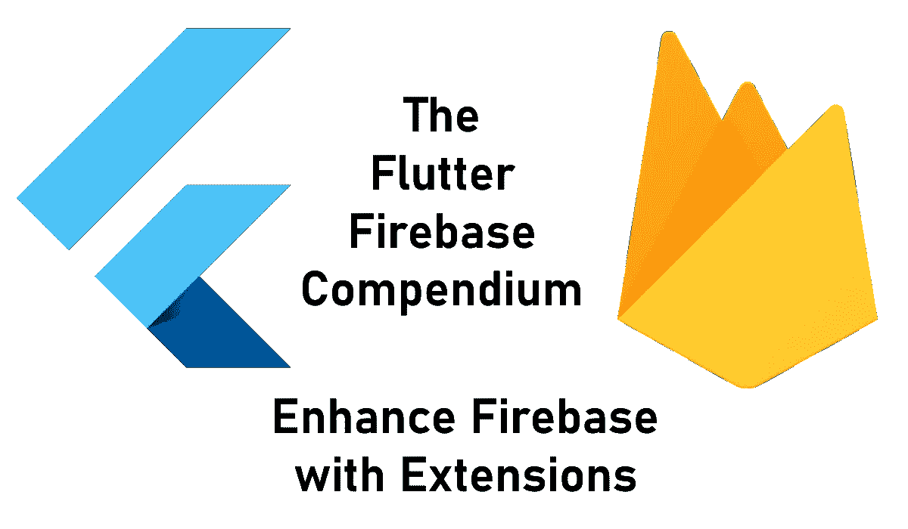
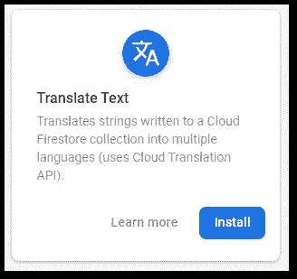
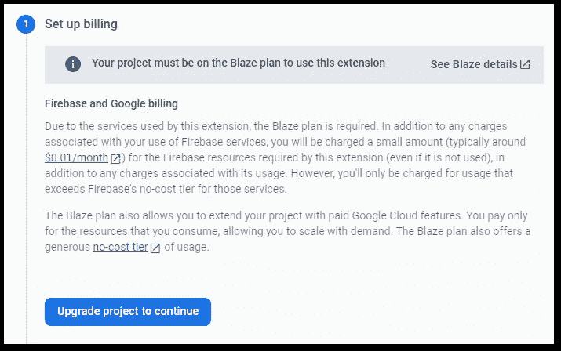
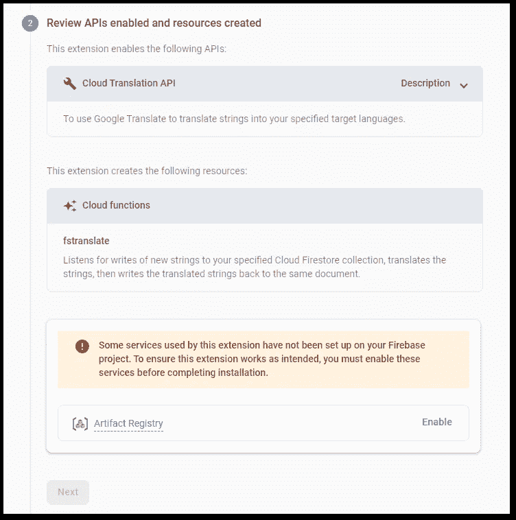
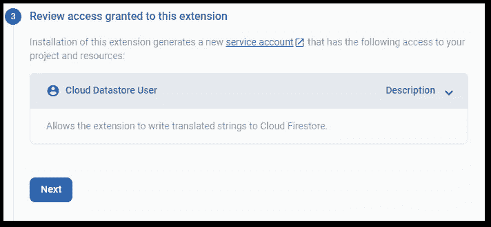
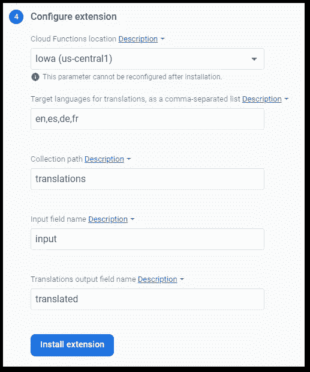
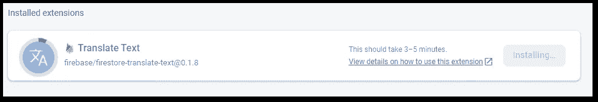

# 如何使用 Firebase 扩展添加新的 Firebase 功能

> 原文：<https://levelup.gitconnected.com/how-to-add-new-firebase-features-with-firebase-extensions-d9bbf8b2279f>

## 更多的功能，更多的东西！

## Firebase 允许安装各种扩展来进一步增加功能。在本文中，我将向您展示如何做到这一点。



Firebase Extensions 是一种简单的方法，可以用额外的功能来增强 Firebase 和您的应用程序，而不必自己实现它们。他们帮助[发送电子邮件](https://extensions.dev/extensions/firebase/firestore-send-email)，[翻译文本](https://extensions.dev/extensions/firebase/firestore-translate-text)，[调整图像大小](https://extensions.dev/extensions/firebase/storage-resize-images)，[付款](https://extensions.dev/extensions/google-pay/make-payment)，以及其他事情。可能性是巨大的，只需要几分钟就可以设置这些扩展。与其投入数小时的开发工作来将第三方集成到你的应用中，不如寻找一个扩展来节省大量时间！

> 👉你想知道所有的细节吗？查看[我的电子书](https://xeladu.gumroad.com/l/ffc)，里面有关于用 Firebase 构建 Flutter 应用程序的深度指南！立即在 [Gumroad](https://xeladu.gumroad.com/) 上购买！

我将指导您完成安装过程，并向您展示一些扩展。它会给你一个什么是可能的印象。

```
💡 Be aware that you might run into some costs. An installed extension costs around 1 cent per month and it normally uses other services in the background which can increase these costs. You will also need to activate the [Blaze plan](https://firebase.google.com/docs/projects/billing/firebase-pricing-plans).
```

## 查找扩展

在 https://extensions.dev/extensions 有一个完整的 Firebase 扩展市场。有针对 Firebase 产品、类别或提供商的过滤器选项。你也可以进行文本搜索。但我建议浏览目录，从各种可能性中获得灵感。

```
🔔 Get a short summary of my Medium content on the 1st of every month to your inbox. Save time and pick what you like to read! 

Click [HERE](http://bit.ly/xeladu-medium) to subscribe for free!
```

## 安装扩展

从目录中选择一个扩展，如**翻译文本**并点击**安装。**



Firebase 扩展的截屏按作者翻译文本

可能会要求您选择所需的 Firebase 项目。之后，向导会引导您完成整个过程。

🔹**设置计费**
分机的基本费用信息。您可能需要升级您的计费计划才能使用扩展。



作者的 Firebase 扩展设置过程的屏幕截图

🔹**查看启用的 API 和创建的资源**
关于扩展还需要哪些服务和资源的信息。在此步骤中，您可能需要启用其他服务。



作者的 Firebase 扩展设置过程的屏幕截图

🔹**查看授予该扩展的访问权限**
关于该扩展所需访问权限的信息。



作者的 Firebase 扩展设置过程的屏幕截图

🔹**配置分机**配置分机所需的设置



作者的 Firebase 扩展设置过程的屏幕截图

安装并准备好扩展需要一些时间。



作者的 Firebase 扩展安装过程的屏幕截图

要查看项目中所有已安装的扩展，请在 Firebase 控制台中进入**构建** → **扩展**。您还可以从该视图管理您的扩展。

## 有趣的扩展

👉[使用 Google Pay 付款](https://extensions.dev/extensions/google-pay/make-payment)

通过一个或多个受支持的支付服务提供商使用 Google Pay 进行支付，并将响应写入 Cloud Firestore。

👉[触发邮件](https://extensions.dev/extensions/firebase/firestore-send-email)

根据写入指定 Cloud Firestore 集合的文档内容撰写并发送电子邮件。

👉[用 Twilio 发送信息](https://extensions.dev/extensions/twilio/send-message)

基于写入指定 Cloud Firestore 集合的文档内容，使用 Twilio API 发送消息。

👉[使用 ShipEngine 验证地址](https://extensions.dev/extensions/shipengine/validate-addresses)

根据写入指定云 Firestore 集合的文档内容验证地址。

👉[用透视 API 分析注释毒性](https://extensions.dev/extensions/jigsaw/firestore-perspective-toxicity)

使用 Perspective API 分析评论文本对对话可能产生的影响。

👉[缩短网址](https://extensions.dev/extensions/firebase/firestore-shorten-urls-bitly)

缩短写入指定云 Firestore 集合的 URL(使用 Bitly)。

👉[翻译文本](https://extensions.dev/extensions/firebase/firestore-translate-text)

将写入云 Firestore 集合的字符串翻译成多种语言(使用云翻译 API)。

👉[调整图像大小](https://extensions.dev/extensions/firebase/storage-resize-images)

将上传到云存储的图像调整到指定的大小，并可以选择保留或删除原始图像。

👉[图像处理 API](https://extensions.dev/extensions/invertase/image-processing-api)

使用这个扩展通过一个强大的 HTTP API 优化和转换图像，它有 30 多种不同的图像操作来增强和操作您的图像。

## 结论

在本文中，您看到了通过安装扩展来增强 Firebase 的新特性是多么容易。

这篇文章是 Flutter Firebase 纲要的一部分，其中有许多教程和操作指南，介绍了 Firebase 与 Flutter 应用程序相结合的可能性。


[塞拉多](https://xeladu.medium.com/?source=post_page-----d9bbf8b2279f--------------------------------)

## 了解 Flutter 和 Firebase 的威力

[View list](https://xeladu.medium.com/list/learn-about-the-power-of-flutter-and-firebase-2ec07e25baba?source=post_page-----d9bbf8b2279f--------------------------------)13 stories

[***通过我的推荐链接加入成千上万的媒体会员，每月只需 5 美元就可以阅读你想阅读的文章！***](https://medium.com/@xeladu/membership)

[](https://medium.com/@xeladu/membership) [## 通过我的推荐链接加入 Medium-xela du

### 只需点击一下，就可以通过会员资格访问数千篇文章！您的会员资格只需 5 美元一张…

medium.com](https://medium.com/@xeladu/membership) 

点击[此处](http://bit.ly/xeladu-medium)每月获取一次我的所有中型文章的摘要🔔浏览[我的 Gumroad 商店](https://xeladu.gumroad.com/)寻找有趣的编程素材🏬


xeladu

## 适合初学者的颤振文章

[View list](https://xeladu.medium.com/list/flutter-articles-for-beginners-a040ea777956?source=post_page-----d9bbf8b2279f--------------------------------)24 stories

xeladu

## 软件工程师的高级颤振文章

[View list](https://xeladu.medium.com/list/advanced-flutter-articles-for-software-engineers-f074879fdef3?source=post_page-----d9bbf8b2279f--------------------------------)9 stories