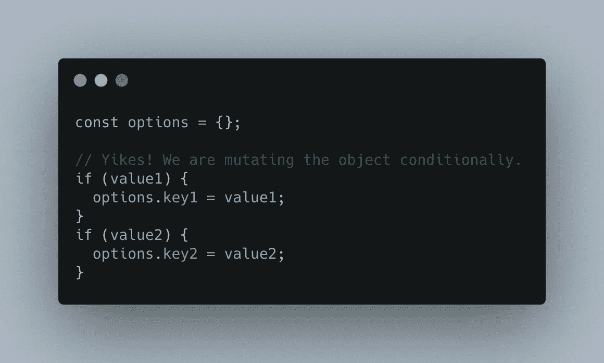
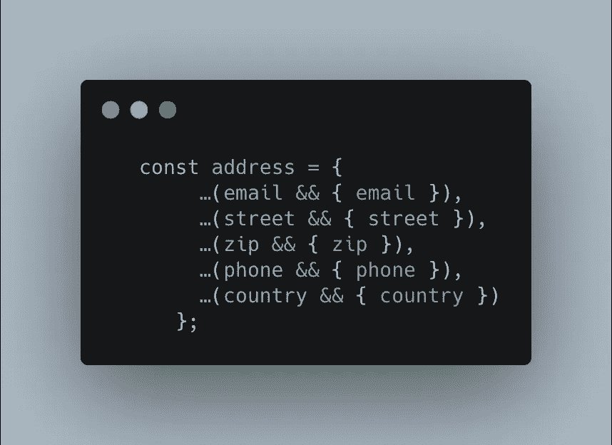

# 如何在 JavaScript 中有条件地添加对象字段

> 原文：<https://levelup.gitconnected.com/how-to-add-object-fields-conditionally-in-javascript-c15374ab2190>

我经常遇到需要用 JavaScript 构造一个对象的情况，我想有条件地为这个对象设置字段。这可能是一个选项对象，我把它作为参数传递给其他函数或 API。我只有一些可用的字段值，只有这些值应该是参数对象的一部分。

为了描述这种情况，让我们看一个使用 *if* 语句的简单语法的例子。



使用 if 语句改变对象

在这里，我有条件地改变对象，为可用的值设置字段。[我不喜欢这种突变](https://anssipiirainen.com/post/fp-tricks-for-simple-code/)，因为它们让代码难以理解。

这里是另一个尝试:

```
**const** options **=** {
    key1**:** value1 **||** **undefined**;
    key2**:** value2 **||** **undefined**;
};
```

这个“解决方案”用具有`undefined`值的字段污染了对象。这些字段将出现在对象中，即使它们的值是`undefined`。对于这种类型的对象，您无法确定当您将它传递给正在构建该对象的外部库时会发生什么:它可能表现良好，或者您可能会遇到错误，或者最糟糕的是，它可能会以某种不可预知的方式工作。

# 方式

下面是我所知道的解决这些问题的最干净的语法:

```
**const** options **=** {
    …(value1 **&&** { key1**:** value1 }),
    …(value2 **&&** { key2**:** value2 })
    };
```

我非常喜欢这一点:看起来很干净，没有向对象添加不必要的字段，并且没有使用难看的 if 语句。

有了 ES6 速记属性语法，它看起来更加简洁:



使用 ES6 对象扩展运算符和布尔&快捷方式求值来构造对象

我在查看我的前合作开发人员制作的一些代码时发现了这个技巧，并且自从我发现它以来已经使用了两次。希望你也觉得有用。

*原载于 2020 年 7 月 9 日*[*https://anssipiirainen.com*](https://anssipiirainen.com/)*。*