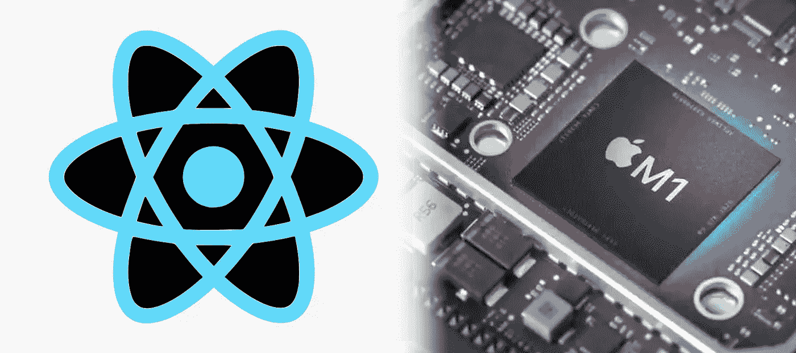

# 如何在 2022 年将 React Native 添加到现有的 iOS 应用程序中

> 原文：<https://levelup.gitconnected.com/how-to-add-react-native-to-an-existing-ios-app-in-2022-97bb7d38cf96>

关于如何在 React 本地站点上执行此操作的文档已经过时



作者声明:David Fekke

*原发布于*[*https://fek . io*](https://fek.io/blog/how-to-add-react-native-to-an-existing-i-os-app-in-2022/)*。*

我已经开始在我维护的现有 iOS 和 Android 应用中使用 [React Native](https://reactnative.dev) 。我在 React Native [文档](https://www.reactnative.dev/docs/integration-with-existing-apps)中发现的一个问题是，他们给出的添加到现有 iOS 应用程序的指南已经过时了。

# 椰子足类

当您向应用程序添加新模块时，React Native 使用 [Cocoapods](https://cocoapods.org/) 来添加 iOS 依赖项。Cocoapods 是 Apple 开发生态系统的依赖管理器。自从 Cocoapods 推出以来，苹果已经添加了他们自己的 Swift 包管理器，但 React Native 是在此之前创建的。Cocoapods 是将 React Native 及其' Native 模块添加到 iOS 项目的唯一方式。

Cocoapods 使用一个名为`Podfile`的配置文件来指示 Cocoapods 依赖管理器将哪些模块添加到 Xcode 项目中。它通过创建一个工作空间文件，然后将项目和任何需要的模块添加到工作空间中来实现这一点。

指南中给出的用于将 React Native 添加到现有 iOS 项目的`Podfile`将不起作用！我重复一遍。他们的`Podfile`不会在现有的 iOS 项目中工作。他们有 Objective-C 和 Swift 的例子，但都不是 React Native 的最新版本。

# 如何从 2022 年起添加 React Native

在这篇文章中，我假设你已经安装了 Xcode。您还需要在[环境设置指南](https://www.reactnative.dev/docs/environment-setup)中为 React Native CLI 快速启动配置您的环境。安装程序将确保您安装了当前版本的 [Homebrew](https://brew.sh/) 、 [Node.js](https://nodejs.org/en/) ，以及`watchman`和`Cocoapods`。我最近写了另一篇关于如何在基于 M1 的 Mac 上运行 React Native [设置](https://fek.io/blog/2022-04-13/how-to-setup-react-native-on-M1-mac-2022.md)的文章。

# 设置目录结构

为您的项目创建新文件夹。这是我们保存 React 本机代码的地方。创建这个文件夹后，将现有的 iOS 项目复制到项目文件夹下的一个名为`ios`的文件夹中。

# 安装节点依赖项

在项目文件夹的根目录中，创建包含以下内容的 package.json 文件:

```
{
  "name": "YourReactNativeApp",
  "version": "1.0.0",
  "private": true,
  "scripts": {
    "start": "yarn react-native start"
  }
}
```

确保您安装了`yarn`软件包管理器。如果尚未安装，可以使用以下命令进行安装:

```
> npm install yarn -g
```

要安装节点依赖项，可以使用以下命令:

```
> yarn add react-native
```

当您运行此命令时，它将在您的终端中显示一条类似如下的消息:

| > [react-native@0.68.1](mailto:react-native@0.68.1) “有未满足的对等依赖” [react@ **17.0.2**](mailto:react@17.0.2) ”。

如果您未满足的依赖项是 react 的特定版本，您将需要为消息中指定的特定版本添加 React:

# 为您的 iOS 应用程序设置 Cocoapods

现在您已经安装了 React 和 React Native，将 cd 放入您的`ios`子目录，并执行以下命令:

```
> pod init
```

这个命令将创建一个`Podfile`，Cocoapods 使用这个配置文件向您的 iOS 应用程序添加依赖项。`Podfile`应该是这样的:

每个 Xcode 项目都应该有一个目标。目标是编译的目标。通常，如果您有多个平台需要支持，即 MacOS、tvOS 和 iOS，那么每个平台都有一个目标。对于本例，我们将只修改 iOS 应用程序的目标。在上面的例子中，我的 iOS 目标叫做`yourreactnativeapp`。

一旦您修改了您的 Podfile 以包含您的目标的`use_react_native!`函数，您现在可以运行下面的命令来添加您的 React 本机依赖项:

```
> pod install
```

在您使用 pod install 命令安装了您的依赖项之后，Cocoapods 将会为您的项目创建一个工作空间(`yourreactnativeapp.xcworkspace`)。它应该与项目文件同名。从现在开始，您将需要使用工作空间文件在 Xcode 中打开您的项目。

你的新工作区会有两个项目，一个是你的 iOS 应用，另一个叫做`Pods`。`Pods`项目将包含在应用中运行 React Native 所需的所有依赖项。

# 将 React 视图添加到 iOS 应用程序

既然我们已经将 React 原生依赖项添加到您的 iOS 应用程序中，我们就有了在您的应用程序中运行 React 原生内容所需的依赖项。让我们继续修改 ViewController 来显示我们的 React 本机应用程序:

现在让我们修改`index.js`文件，如下所示:

为了测试并确保设置正确，我们首先在项目的根目录下运行以下命令来启动 Metro:

```
> yarn start
```

一旦我们启动了 Metro，我们可以再次运行我们的 iOS 应用程序，并导航到包含我们的`RCTRootView`视图的 ViewController。这将创建一个如下所示的屏幕:


# 结论

我希望这解释了如何将 React Native 添加到现有的 iOS 应用程序中。React Native 是 iOS 开发者可以用来构建原生应用的众多工具之一。React Native 的一个好处是它是跨平台的。这使得在 iOS 和 Android 应用程序之间共享代码变得很容易。

[](https://davidfekke.medium.com/how-to-set-up-react-native-on-m1-mac-2022-edition-24a0a5c27d9d) [## 如何在 M1 Mac 2022 版上设置 React Native

### React Native 的文档不包含 M1 苹果硅细节

davidfekke.medium.com](https://davidfekke.medium.com/how-to-set-up-react-native-on-m1-mac-2022-edition-24a0a5c27d9d)