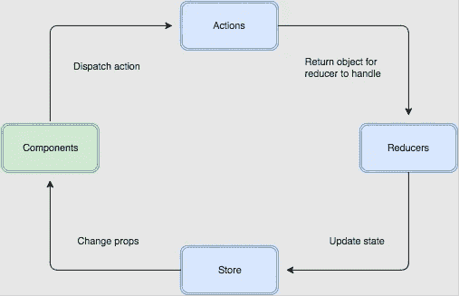
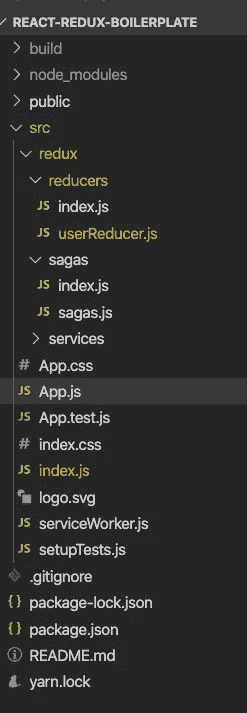

# 如何将 Redux 添加到 create-react-app 中

> 原文：<https://levelup.gitconnected.com/how-to-add-redux-into-create-react-app-a5003c08212>

[Redux](https://react-redux.js.org/introduction/quick-start) 是前端应用最流行的状态容器库。它帮助你以一种可预测和简单的方式管理你的状态。



冗余流量

这篇文章是关于在你新的/现有的 React 应用上设置 Redux。

# **创建 react APP**

我采用了最流行的 React-boilerplate(create-React-app)。

如果你是 React 新手，不知道 create-react-app 是什么，请点击下面的链接。

```
npx create-react-app my-app
cd my-app
npm start
```

[https://reactjs.org/docs/create-a-new-react-app.html](https://reactjs.org/docs/create-a-new-react-app.html)

# **Redux 文档**

你可以在下面的链接中找到 Redux 的官方文档。

[https://redux.js.org/introduction/getting-started](https://redux.js.org/introduction/getting-started)

# **React 里真的需要 Redux 吗？**


来自 [Pexels](https://www.pexels.com/photo/clueless-woman-in-white-dress-shirt-3958872/?utm_content=attributionCopyText&utm_medium=referral&utm_source=pexels) 的[波琳娜·齐默曼](https://www.pexels.com/@polina-zimmerman?utm_content=attributionCopyText&utm_medium=referral&utm_source=pexels)的照片

在实现 Redux 之前，我强烈推荐你去下面这个由 Redux 的创建者( [Dan Abramov](https://twitter.com/dan_abramov) )写的帖子。

```
[https://medium.com/@dan_abramov/you-might-not-need-redux-be46360cf367](https://medium.com/@dan_abramov/you-might-not-need-redux-be46360cf367)
```

现在，如果你确定要使用 Redux than，那就开始吧。

# 先决条件

JavaScript 和 React 的基础知识。
对 create-react-app 的基本了解。

# **设置 CRA(创建-反应-应用)**

安装所需的软件包

redux-基础包
react-Redux-根据 React 使用 Redux 特性的包

**安装 npm 包**

```
npm install redux react-redux redux-saga
```

# **Redux 文件夹结构**

在 src 中创建一个名为 Redux 的文件夹，其中包含以下文件夹

1.  还原剂
2.  冒险故事



APP-Foder 结构

# **导入库**

在 index.js 中，包含以下依赖项

```
// Redux Library Packages
 import { Provider } from “react-redux”;
 import createSagaMiddleware from ‘redux-saga’;
 import { createStore, applyMiddleware, compose } from “redux”;
 import { logger } from ‘redux-logger’; // Custom redux Elements
 import rootReducer from “./redux/reducers/index”;
import rootSaga from “./redux/sagas/index”;
```

## **将提供商连接到应用程序**

```
const userReducer = (state, action) =>{
switch (action.type) {
 case “USER_FETCH_REQUESTED”:
 return { …state, response: null, loading: true }
 case “USER_FETCH_SUCCEEDED”:
 return { …state, response: action.response, loading: false }
 default:
 return {
 response: “No Response”
 };
 }
}
```

## **添加减速器**

```
const globalReducer = createStore(
 rootReducer,
 compose( 
 applyMiddleware(sagaMiddleware, logger)
 ));
```

`<Provider />`使 Redux 存储对任何使用`useSelector`钩子的嵌套组件可用。

```
 <Provider >
   <App />
 </Provider>
```

**将减压器连接到供应器上**

```
<Provider store={globalReducer}>
  <App />
</Provider>
```

**将全局状态输入你的应用**

```
import { useSelector } from “react-redux”;const globalState = useSelector(state => state);
```

**调度事件**的动作

```
const getUserData = () => {
 // Get the Data for the User
 dispatch({ type: “USER_FETCH_REQUESTED”})
}
```

**将 API 调用附加到动作**

```
import { call, put, takeLatest } from ‘redux-saga/effects’

const getRecords = (uid = null) => {
const results = fetch(‘[https://jsonplaceholder.typicode.com/todos/1'](https://jsonplaceholder.typicode.com/todos/1'))
 .then(response => response.json()); 
 return results;
}// worker Saga: will be fired on USER_FETCH_REQUESTED actions
function* fetchUser(action) {
 try {
 const json = yield call(getRecords, 400);
 yield put({type: “USER_FETCH_SUCCEEDED”, response: json});
 } catch (e) {
 yield put({type: “USER_FETCH_FAILED”, message: e.message});
 }
}function* mySaga() {
 yield takeLatest(“USER_FETCH_REQUESTED”, fetchUser);
}export default mySaga;
```

**运行代码并查看操作**

**最终 app.js 文件**

您最终的 app.js 将如下所示。

最终 APP.js 文件

**运行代码并查看操作**

打开

```
localhost:3000/
```

**工作示例**

```
[https://react-redux-example.netlify.app/](https://react-redux-example.netlify.app/)
```

CodeSandBox

```
[https://codesandbox.io/s/github/tarun-nagpal-github/react-redux-boilerplate](https://codesandbox.io/s/github/tarun-nagpal-github/react-redux-boilerplate)
```


**本例中的 GitHub Repo】**

```
[https://github.com/tarun-nagpal-github/react-redux-boilerplate](https://github.com/tarun-nagpal-github/react-redux-boilerplate)
```

# **结论**

在这篇文章中，我们选择了一个新的 React 应用程序，并用一个示例操作实现了 Redux。

我刚刚建立了一个，但是您可以扩展它并在您的项目中使用它。欢迎在评论中寻求帮助。