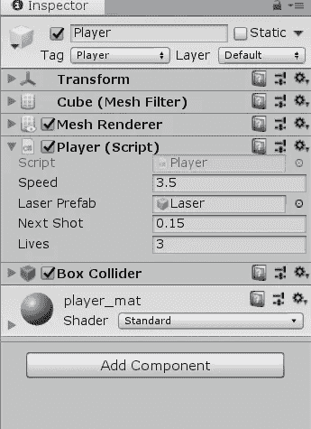
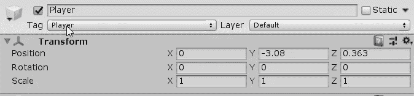
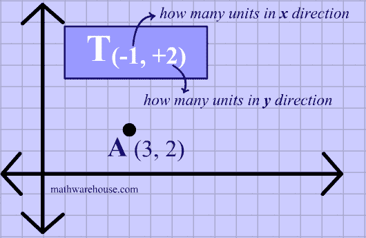
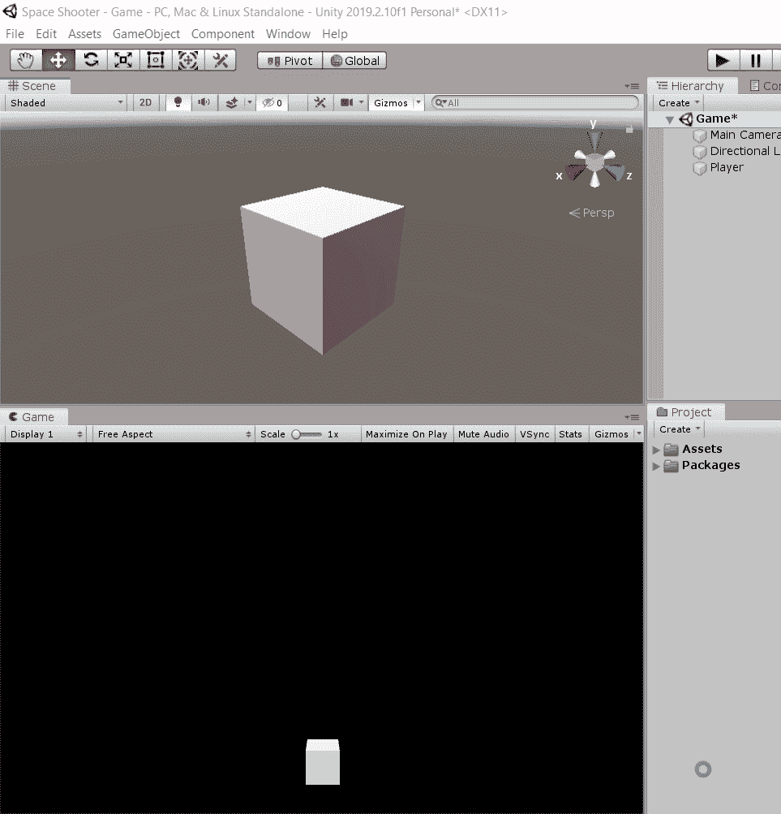
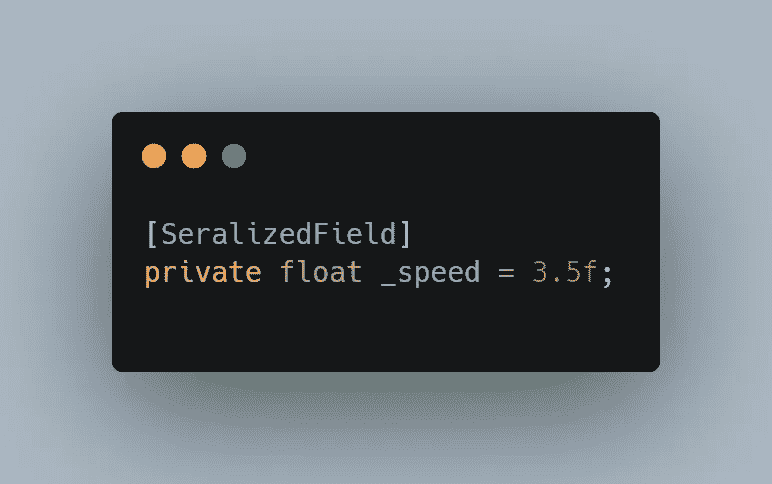
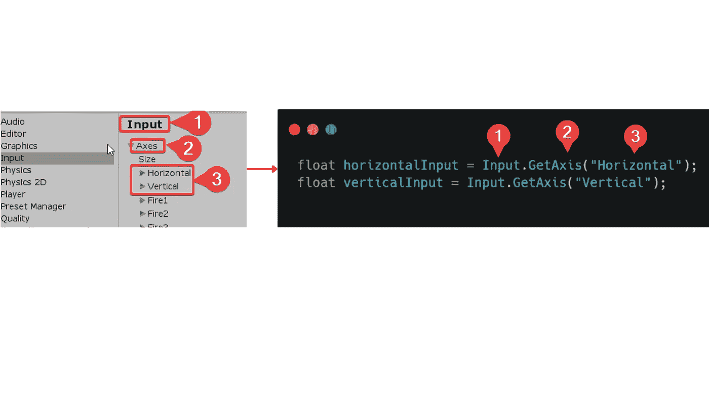
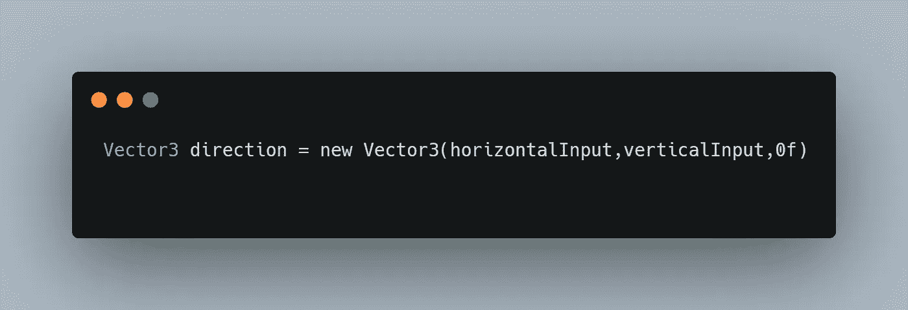
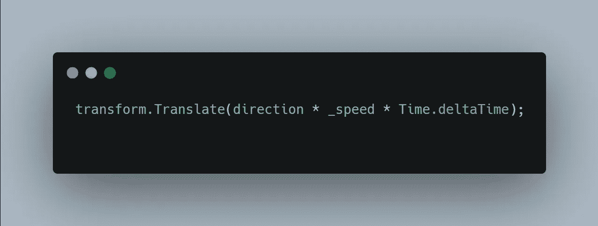
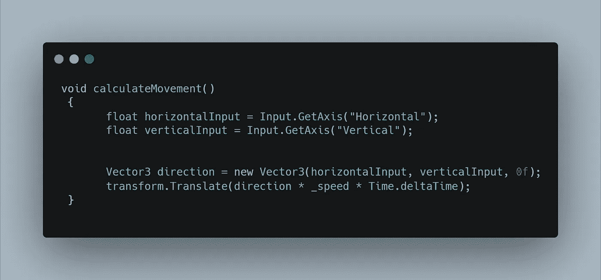

# 如何在 Unity 中添加简单的玩家动作

> 原文：<https://levelup.gitconnected.com/how-to-add-simple-player-movement-in-unity-67ae832529fd>

> 生活是运动；如果你不动，你就不是在生活——闪光

给你的玩家添加动作是给你的游戏带来活力的第一步，这比你想象的要容易和简单得多。让我们看看！

## “玩家”到底是什么？

在 Unity 中，玩家被视为**游戏对象**。游戏对象可以是任何角色、物品，甚至是场景中的元素。然而，它们本身并不十分有用——真正的魔力始于**组件**,这些组件**包含在**对象内**。本质上，游戏对象是组件的容器。**

选择对象后，可以在检查器中查看组件。

让我们来看看球员运动的必要组成部分。

## **变换**

默认情况下，每个对象都有一个变换。这是用于存储和操作对象的位置、旋转和缩放的组件。

正如您在上面看到的，位置坐标存储在一个向量中，并带有各自的轴:X(水平)、Y(垂直)和 Z(前、后)。

## 翻译

Translate 用于在*平移*的方向上移动变换(我们的对象)

[数学仓库](https://www.mathwarehouse.com/animated-gifs/transformations.php)

现在你已经知道了基本组件，是时候了解玩家如何与我们的对象交互了。

## **用户输入**

Input 是一个 UnityEngine 类，它允许程序检测标准的用户输入。在本教程中，您将学习如何使用 WASD 或键盘上的方向键来移动播放器。

您可以通过执行以下操作来验证发动机内标准输入。

*   进入你的编辑→项目设置→输入

## 让玩家移动

1.  创建一个私有的全局速度变量来控制玩家移动的速度。此变量将是一个序列化字段，因为您可能需要在检查器中访问它以进行调整。

2.创建变量来存储方向值。注意，这些变量必须是更新函数的局部变量。每一帧都调用更新，这是让我们的玩家移动的关键。

**注意 Unity 是如何以非常层次化的方式运行的:**实现输入的方式与我们在项目设置中到达轴的顺序相匹配。

3.您可以使用向量来存储方向值，并使它们在下一行计算时更具可读性。

4.现在是时候真正开始行动了。使用[变压器。平移](https://docs.unity3d.com/ScriptReference/Transform.Translate.html)启动运动计算。

**Time.deltaTime** 用于实时移动，而不是逐帧移动。

5.最后，你可以创建一个 void 方法来进一步清理你的代码，这个方法包含了更新中所有关于球员移动的内容，并且必须在更新中调用。

在我的下一篇[文章](https://dennisse-pd.medium.com/how-to-create-a-cooldown-system-in-unity-4156f3a842ae)中，我们将看看如何在 unity 中创建一个冷却系统。