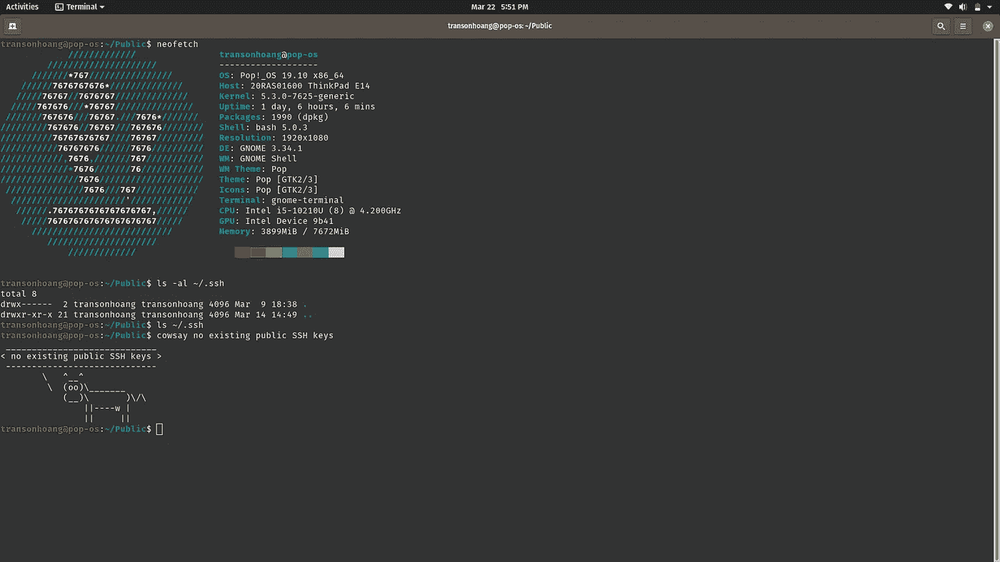
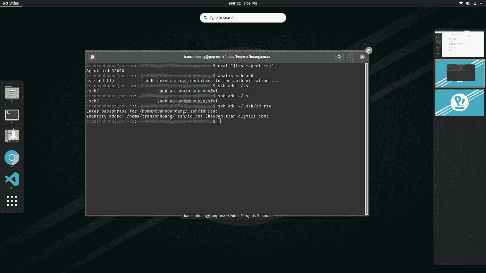
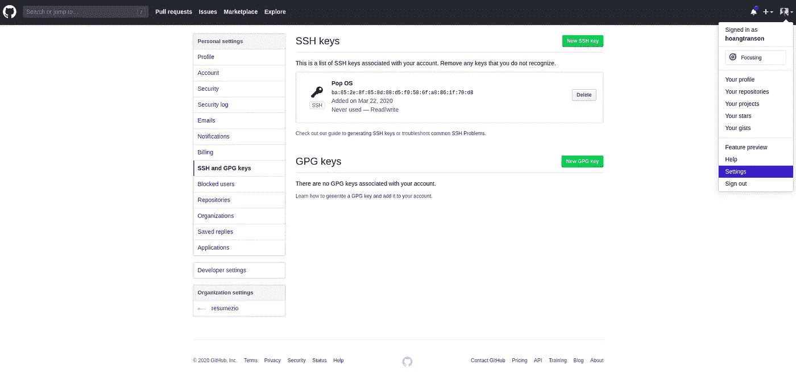

# 如何在 Linux 上给 Github 帐户添加 SSH

> 原文：<https://levelup.gitconnected.com/how-to-add-ssh-to-github-account-on-linux-1c05c71dacc9>

## Git 提示

## 创建 SSH 密钥并将其添加到 GitHub 帐户的简单指南


照片由[刘汉宁·内巴霍](https://unsplash.com/@hannynaibaho?utm_source=unsplash&utm_medium=referral&utm_content=creditCopyText)在 [Unsplash](https://unsplash.com/s/photos/coffee?utm_source=unsplash&utm_medium=referral&utm_content=creditCopyText) 上拍摄

在本文中，我将向您展示如何向 Github 帐户添加 SSH 密钥。

1.  检查现有的 SSH 密钥
2.  生成新的 SSH 密钥
3.  将 SSH 密钥添加到 Github 帐户设置

## 为什么我们需要 SSH 密钥？

你可以理解 SSH 密钥帮助你连接到 GitHub **而不需要**在每次访问时提供你的用户名或密码。

因此，每次向 Github 存储库提交新的更改时，您不需要在终端中键入您的用户名和密码。

*更多类似内容，请查看*[*https://betterfullstack.com*](https://betterfullstack.com/)

# 检查现有的 SSH 密钥

打开终端并键入`ls -al ~/.ssh`或`ls ~/.ssh`来查看任何现有的 SSH 密钥。



是否检查现有的 ssh 密钥

你可以从上面的图片中看到，我没有任何 SSH 密钥，因为这是一台新的笔记本电脑。

# 生成新的 SSH 密钥

键入`ssh-keygen -t rsa -b 4096 -C "*your_email@example.com*"`创建新的 SSH 密钥。该语法将使用您的电子邮件作为标签。

然后，您将输入密钥和安全密码的位置。


创建新的 SSH 密钥

有了 SSH 密钥后，我们键入`$ eval "$(ssh-agent -s)"`在后台启动 ssh-agent，并通过`ssh-add ~/.ssh/id_rsa`添加您的密钥。



在后台启动 ssh-agent

现在我们进行最后一步。

# 将您的 SSH 密钥添加到 Github 帐户设置中

**注**:你可以在 Gitlab、Bitbucket、Github 等任何账号添加这个密钥。不仅仅是 Github。

使用`xclip`复制和粘贴 SSH 密钥。通过`sudo apt-get install xclip`安装。

现在通过`xclip -sel clip < ~/.ssh/id_rsa.pub`复制你的公钥。

然后打开你的账户，进入**设置**，将新的 SSH 密钥粘贴到 **SSH 和 GPG 密钥**部分。



将新的 SSH 密钥粘贴到 github 帐户

搞定了。。

注意:如果你和我一样在用 Linux，有时候你的电脑还是会不停的问用户名和密码。

需要运行这个**配置**让 git 存储你的用户名+密码。

```
git config --global credential.helper store
```

# 结论

我希望这篇文章足够简单，能够帮助一些 git 新手了解如何设置 SSH 密钥并添加到您的 Github 帐户。

我希望这篇文章对你有用！你可以在[媒体](https://medium.com/@transonhoang?source=post_page---------------------------)上关注我。我也在[推特](https://twitter.com/transonhoang)上。欢迎在下面的评论中留下任何问题。我很乐意帮忙！

您可以通过下面的链接了解更多信息:

 [## 用 SSH 连接到 GitHub

### 您可以使用 SSH 连接到 GitHub。使用 SSH 协议，您可以连接到远程服务器并进行身份验证，并且…

help.github.com](https://help.github.com/en/github/authenticating-to-github/connecting-to-github-with-ssh) [](https://betterfullstack.com/stories/) [## 故事-更好的全栈

### 关于 JavaScript、Python 和 Wordpress 的有用文章，有助于开发人员减少开发时间并提高…

betterfullstack.com](https://betterfullstack.com/stories/)