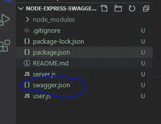
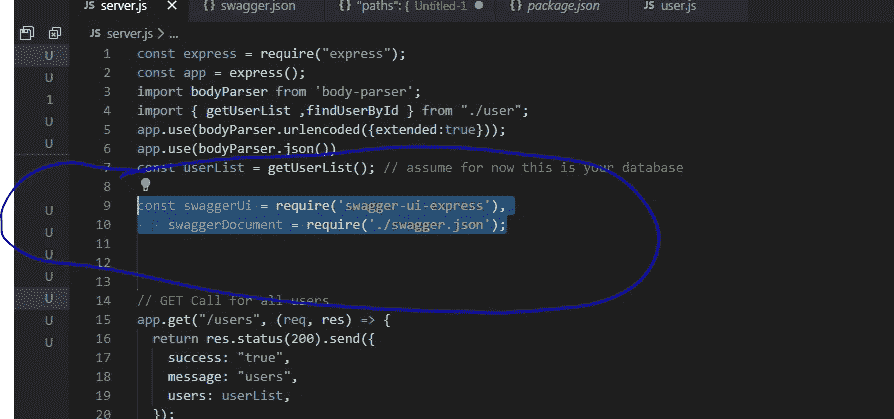
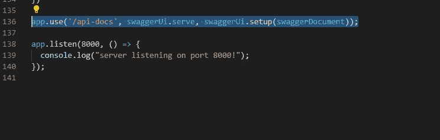
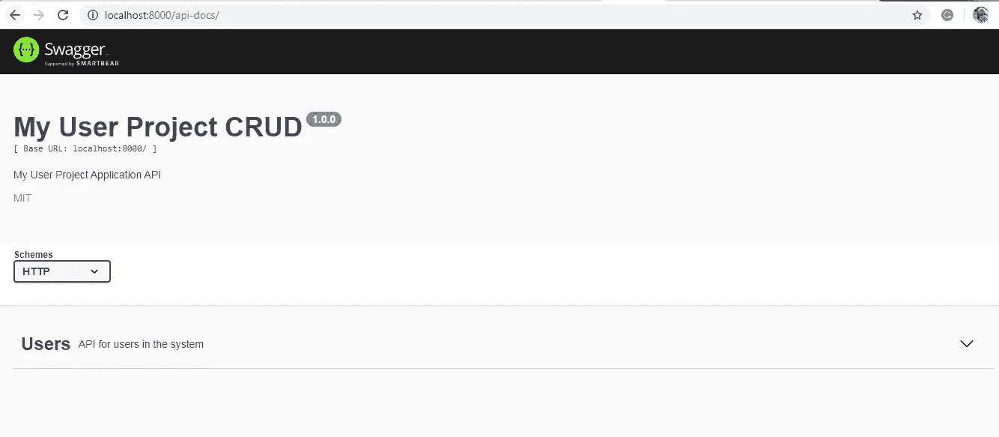
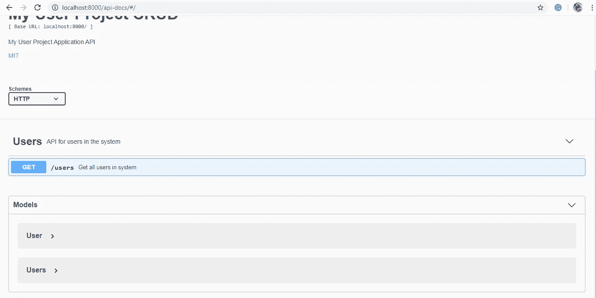
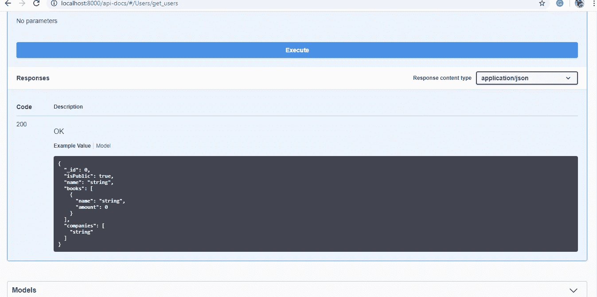
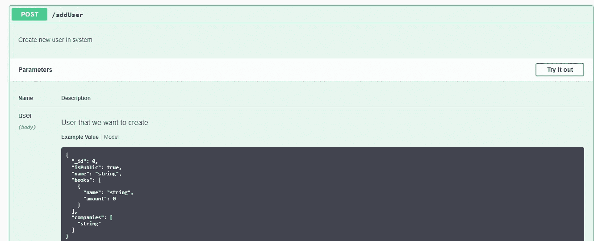
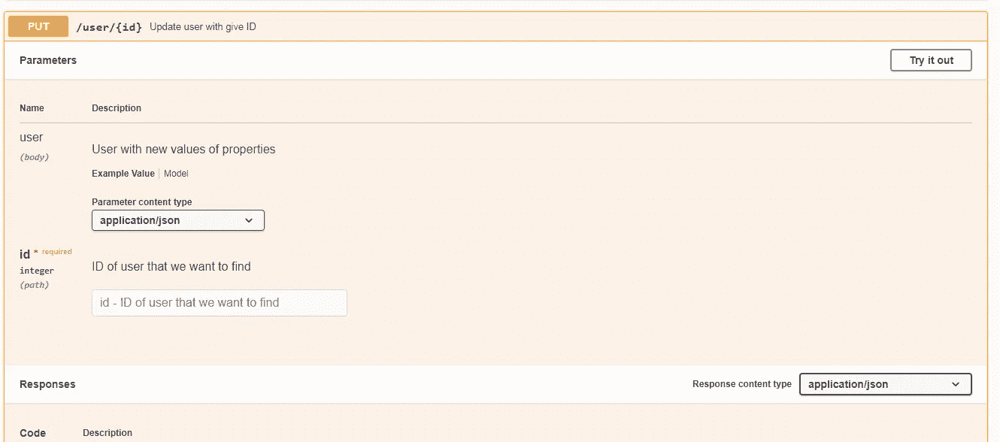

# 如何将 Swagger UI 添加到现有 Node.js 和 Express.js 项目中

> 原文：<https://levelup.gitconnected.com/how-to-add-swagger-ui-to-existing-node-js-and-express-js-project-2c8bad9364ce>

在本教程中，我们将学习如何将 swagger 添加到现有的 Node 和 Express.js 中。正如我们已经在[第 1 部分——如何用 Express.js 和 Node.js 创建 REST API](https://medium.com/@kirtikau/how-to-create-a-rest-api-with-express-js-and-node-js-3de5c5f9691c)([源代码第 1 部分](https://github.com/kirti/restful-api-node-express-crud))中所学的，现在我们将在这个项目中添加 swagger。

[](https://skilled.dev) [## 编写面试问题+获得开发工作

### 跳到内容走进你的编码面试，感觉你拥有这个房间。感觉自己有能力获得梦想中的工作…

技术开发](https://skilled.dev) 

**在我们开始之前，请找出以下重要定义:**

1.  Swagger 是一个开源软件框架，由一个大型工具生态系统支持，帮助开发人员设计、构建、记录和使用 RESTful web 服务
2.  Swagger 为设计 API 和改进 web 服务提供了一套很棒的工具

a)[**Swagger Editor**](https://swagger.io/tools/swagger-editor/)—**Swagger Editor**是一款开源的**编辑器**，用于设计、定义和记录 **Swagger** 规范中的 RESTful APIs。

b)[**Swagger Codegen**](https://swagger.io/tools/swagger-codegen/)—**Swagger Codegen**是一个开源项目，它允许根据 OpenAPI 规范自动生成 API 客户端库(SDK 生成)、服务器存根和文档。

c)[**Swagger UI**](https://swagger.io/tools/swagger-ui/)—**Swagger UI**允许开发团队在没有任何实现逻辑的情况下可视化 API 资源并与之交互。API 的呈现对用户友好且易于理解，所有的逻辑复杂性都隐藏在屏幕后面。

d)[**Swagger Inspector**](https://swagger.io/tools/swagger-inspector/)—用于测试和自动生成任何 API 的 OpenAPI 文档的工具。Swagger Inspector 允许您轻松验证和测试 API，对您测试的内容没有任何限制。通过简单的访问，测试被自动保存在云中。

3.OpenAPI 规范，最初被称为 **Swagger 规范，**是用于描述、生成、消费和可视化 RESTful web 服务的机器可读接口文件的规范。

在这个项目中，由于我们已经有了一个现有的 RESTful API ( [第 1 部分教程](https://medium.com/@kirtikau/how-to-create-a-rest-api-with-express-js-and-node-js-3de5c5f9691c))，现在 Swagger UI 将仅用于记录现有的 API。

**入门**

1.  下载[第一部分源代码](https://github.com/kirti/restful-api-node-express-crud)并打开您想要保存程序的终端
2.  使用以下命令运行终端

```
npm installnpm run startopen browser and run below url[http://localhost:8000/](http://localhost:8000/)
```

3.现在，**真正的魔术将开始招摇:**

**为 swagger 安装依赖项**

```
npm i swagger-ui-express -S
```

4.在根目录下创建一个新文件 swagger.json



5.**在我们开始编码之前，请参考** r 到 [**的定义和链接，以获得对 Swagger API 定义的更多理解。**](https://github.com/OAI/OpenAPI-Specification/blob/master/versions/3.0.3.md)

**基本结构**

我们将在 [JSON](https://en.wikipedia.org/wiki/JSON) 中编写 OpenAPI 定义。如果您不熟悉 Swagger 规范，这是用于创建 Swagger API 定义的一组规则。[请点击此链接了解以下定义](https://swagger.io/docs/specification/basic-structure/)。我们将引导基本结构和移动方式来创建复杂结构。

**这里我们将学习基本结构和 CRUD 路线。你会注意到下面的标签**

a)`**info**`部分包含 API 信息:`title`、`description`(可选)、`version`:

b) **路径:**`paths`该部分定义了 API 和 HTTP 方法中的各个端点(路径)

c) **参数:**操作可以通过 URL 路径(`/users/{userId}`)、查询字符串(`/users?`传递参数

d) **请求体:**如果一个操作发送一个请求体，使用`requestBody`关键字描述请求体内容和媒体类型。

e) **响应:**对于每个操作，您可以定义可能的状态代码，如 200 OK 或 404 Not Found，以及响应主体`schema`。

**让我们开始编码**

5.打开 swagger.json 文件并添加以下代码

```
{
  "swagger": "2.0",
  "info": {
    "version": "1.0.0", //version of the OpenAPI Specification
    "title": "My User Project CRUD",
    "description": "My User Project Application API",
    "license": {
      "name": "MIT",
      "url": "[https://opensource.org/licenses/MIT](https://opensource.org/licenses/MIT)"
    }
  },
  "host": "localhost:8000",
  "basePath": "/",
  "tags": [
    {
      "name": "Users",
      "description": "API for users in the system"
    }
  ],
  "schemes": ["http"],
  "consumes": ["application/json"],
  "produces": ["application/json"]
}
```

6.打开 **server.js 文件**并添加以下代码用于 swagger 集成

```
const swaggerUi = require(‘swagger-ui-express’),swaggerDocument = require(‘./swagger.json’);
```



另外，在 a **pp.listen 代码之前添加以下代码。**

```
app.use(
  '/api-docs',
  swaggerUi.serve, 
  swaggerUi.setup(swaggerDocument)
);
```



## 7.现在用[打开浏览器 http://localhost:8000/API-docs/](http://localhost:8000/api-docs/)

您将能够看到用于文档的 swagger UI。



现在我们需要为现有的 API 创建文档。正如我们所知，我们有四个 API 的 CRUD(创建(POST)、读取(GET)、更新(PUT)和删除(delete)。

> 因此，我们将在 swagger.json 文件中添加路径和定义。如果你不熟悉[路径和它的定义](https://github.com/OAI/OpenAPI-Specification/blob/master/versions/3.0.3.md)，那么[请参考这个链接了解更多细节。](https://github.com/OAI/OpenAPI-Specification/blob/master/versions/3.0.3.md)

**8。我们需要添加一条路由，在这条路由上我们将托管 Swagger UI**

a) **获取**

打开 swagger.json 文件，添加下面的 API 文档代码([http://localhost:8000/users](http://localhost:8000/users))

swagger.json 的引用:

```
{
  "paths": {
    "/users": {
      "get": {
        "tags": ["Users"],
        "summary": "Get all users in system",
        "responses": {
          "200": {
            "description": "OK",
            "schema": {
              "$ref": "#/definitions/Users"
            }
          }
        }
      }
    }
  },
  "definitions": {
    "User": {
      "required": ["name", "_id", "companies"],
      "properties": {
        "_id": {
          "type": "integer",
          "uniqueItems": true
        },
        "isPublic": {
          "type": "boolean"
        },
        "name": {
          "type": "string"
        },
        "books": {
          "type": "array",
          "items": {
            "type": "object",
            "properties": {
              "name": {
                "type": "string"
              },
              "amount": {
                "type": "number"
              }
            }
          }
        },
        "companies": {
          "type": "array",
          "items": {
            "type": "string"
          }
        }
      }
    },
    "Users": {
      "type": "array",
      "$ref": "#/definitions/User"
    }
  }
}
```

9.现在用[**打开浏览器 http://localhost:8000/API-docs/**](http://localhost:8000/api-docs/)

您将能够看到基于定义和路径的获取路线文档:



10。帖子

打开 swagger.json 文件，添加下面的 API 文档代码([http://localhost:8000/a](http://localhost:8000/users)DD user)

这里我们将只多一条路径，因为定义已经定义好了

```
{
  "paths": {
    "/users": {
      "get": {
        "tags": ["Users"],
        "summary": "Get all users in system",
        "responses": {
          "200": {
            "description": "OK",
            "schema": {
              "$ref": "#/definitions/Users"
            }
          }
        }
      }
    },
    "/addUser": {
      "post": {
        "tags": ["Users"],
        "description": "Create new user in system",
        "parameters": [
          {
            "name": "user",
            "in": "body",
            "description": "User that we want to create",
            "schema": {
              "$ref": "#/definitions/User"
            }
          }
        ],
        "produces": ["application/json"],
        "responses": {
          "200": {
            "description": "New user is created",
            "schema": {
              "$ref": "#/definitions/User"
            }
          }
        }
      }
    }
  }
}
```



**11。放**

打开 swagger.json 文件，添加以下 API 文档代码([http://localhost:8000/](http://localhost:8000/users)user/1)(即 is 1 是动态值)，还将修改 server.js 中的路由

在这里，我们将为更新路由添加一个新的路径和定义。

**在路径下添加一个对象，如下图所示，用于放置**

```
 "/user/{id}": {
    "parameters": [
      {
        "name": "id",
        "in": "path",
        "required": true,
        "description": "ID of user that we want to find",
        "type": "integer"
      }
    ],
    "put": {
      "summary": "Update user with give ID",
      "tags": ["Users"],
      "parameters": [
        {
          "name": "user",
          "in": "body",
          "description": "User with new values of properties",
          "schema": {
            "$ref": "#/definitions/updateUser"
          }
        }
      ],
      "responses": {
        "200": {
          "description": "User is updated",
          "schema": {
            "$ref": "#/definitions/User"
          }
        }
      }
    }
  }
```

**更新定义**

```
 "updateUser": {
    "required": ["name", "companies"],
    "properties": {
      "isPublic": {
        "type": "boolean"
      },
      "name": {
        "type": "string"
      },
      "books": {
        "type": "array",
        "items": {
          "type": "object",
          "properties": {
            "name": {
              "type": "string"
            },
            "amount": {
              "type": "number"
            }
          }
        }
      },
      "companies": {
        "type": "array",
        "items": {
          "type": "string"
        }
      }
    }
  }
```

**12。现在打开**浏览器用**[**http://localhost:8000/API-docs/**](http://localhost:8000/api-docs/)**

**您将能够看到基于定义和路径的 PUT Route 文档**

****

****13。删除路径** —打开 swagger.json 文件并添加以下 API 文档代码([http://localhost:8000/](http://localhost:8000/users)user/1)，我们还将更新 server.js 中的路由**

```
 "delete": {
    "summary": "Delete user with given ID",
    "tags": ["Users"],
    "responses": {
      "200": {
        "description": "User is deleted",
        "schema": {
          "$ref": "#/definitions/User"
        }
      }
    }
  }
```

**[完整的源代码可以在这里找到](https://github.com/kirti/node-express-swagger-crud/)。**

**我希望你能以简单的方式理解这个流程，现在你可以用最新的 ES6 代码修改它，并表达 js MVC 增强结构。**

**试着把代码转换成 MVC Express js 和 ES6，你一定会喜欢的:)**

# **结论:**

**这是如何在现有的 Node js 和 Express.js 项目中添加 Swagger UI 的说明性中间故事**如果您有任何疑问，请在 kirtikau@gmail.com 上给我发邮件****

**请随时提供反馈，因为我也在学习很多东西，不分享知识就不可能做到完美:)**

**保持安全和愉快的学习:)**

# **分级编码**

**感谢您成为我们社区的一员！升级正在改变技术招聘。 [**在最好的公司**找到你的完美工作](https://jobs.levelup.dev/talent) **。****

**[](https://jobs.levelup.dev/talent) [## 提升——改变招聘流程

### 🔥让软件工程师找到他们热爱的完美角色🧠寻找人才是最痛苦的部分…

作业. levelup.dev](https://jobs.levelup.dev/talent)**