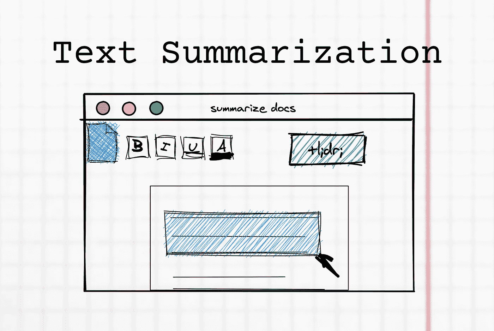
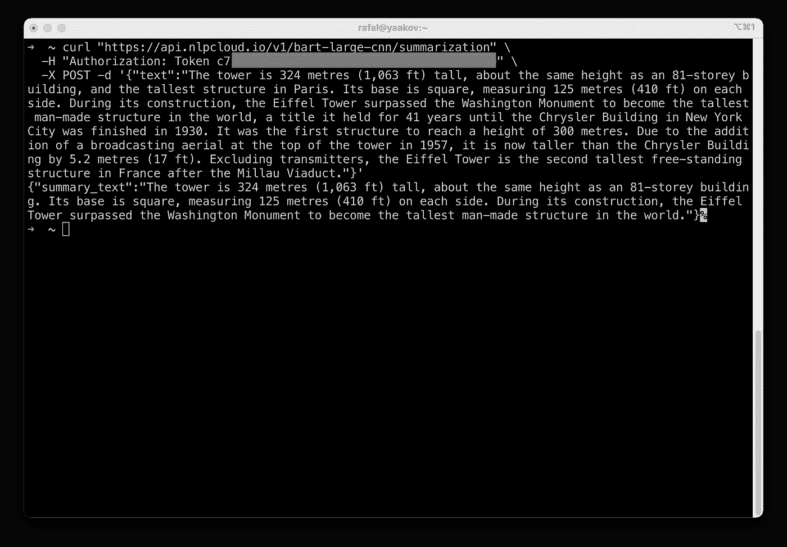
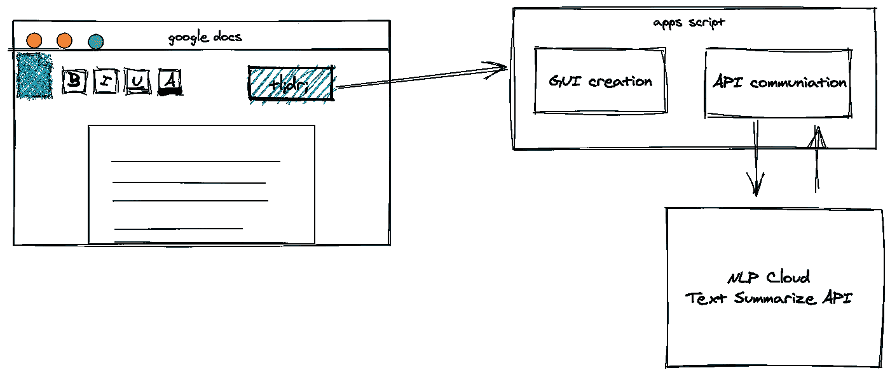
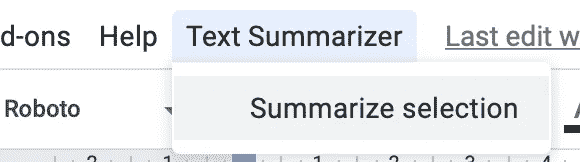
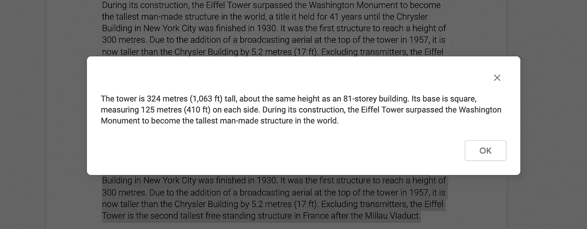

# 如何使用文本摘要 API 将文本摘要添加到 Google 文档中

> 原文：<https://levelup.gitconnected.com/how-to-add-text-summarizer-to-google-docs-using-text-summarization-api-22a81e780f06>

## 添加一个 TL；谷歌文档的博士按钮

无论你是一名作家、数据科学家，还是只是为了完成一项工作而浏览资料，阅读较长的文本来提取信息碎片都是相当累人的。将工作中的这些元素自动化可以让你专注于事物的创造性方面。

除非另有说明，文中所有图片均为作者。

# 文本摘要

文本摘要是从大量文本中提取关键信息元素的技术。手动文本摘要是一项困难且耗时的任务，因此 NLP 和机器学习算法开始流行来自动化它。

市场上有现成的解决方案，无论是以库的形式还是以面向最终用户的现成工具的形式。

在本文中，我们将准备我们自己的定制解决方案，同时不需要数据科学的高级知识。

[🔔想要更多这样的文章？在这里签名。](https://fischerbach.medium.com/membership)

# NLP 云

[NLP Cloud](https://nlpcloud.io/) 是使用机器学习模型进行文本处理的多个 API 的提供商。其中之一是文本摘要器，从简单实现的角度来看，它很有前途。

NLP Cloud 提供的摘要器是*提取*，意思是不生成新的句子，但是去除了低信噪比的部分。

让我们看一个例子:

我们传递一个文本块，模型返回一个摘要。但是在控制台中操作不是很方便。所以，我们让 Google Docs 这样总结选中的文本片段。

# 扩展 Google 文档

我们的目标是创建一个方便的菜单，使文本摘要自动发生在谷歌文档。

这就是我们项目的结构。使用 Apps 脚本，我们将使用一个按钮来扩展 GUI，该按钮将触发与 NLP 云 API 通信的函数，然后插入下面的结果。

我们将从准备菜单附件开始。

# 制作菜单

使用 Google Apps 脚本向 Google Docs 添加自定义功能相当容易。您可以使用新的菜单、对话框和边栏来自定义用户界面。要创建脚本，打开谷歌文档后，选择工具->脚本编辑器。

*注意:你可以从我的其他文章中了解更多关于创建 Apps 脚本项目的信息:*

 [## 如何使用 SurveyJS 和 Google Sheets 免费创建在线调查

### 作为 web 应用程序数据库的电子表格

netlabe.com](https://netlabe.com/how-to-create-online-survey-for-free-with-surveyjs-and-google-sheets-d9a782d0f458) 

所有界面元素都应添加到`onOpen`功能中。它在打开文档后运行，允许我们添加菜单。

保存脚本并刷新文档后，您应该会发现新的菜单元素“文本摘要器”。

在我们实现`summarizeSelection`函数之前，我们必须获得选中的文本。

# 获取选择

棘手的部分是获取当前选中的文本并将其传递给函数。得益于`getSelection`功能，这是可能的:

但是，这个函数不仅返回文档中突出显示的部分，还返回选择内容所在的整个段落。这就是为什么我们创建更复杂的`getSelectedText`函数:

该函数只需将整个段落裁剪成选中的片段。它还返回段落的索引，以便您知道在哪里插入摘要。

现在，让我们将文本发送给 API 并解析结果。

# 外部 API

我们将使用` UrlFetch 服务直接发出 API 请求。文本摘要 API 请求需要通过令牌进行授权。要获得它，在 nlpcloud.io 注册(免费计划就可以了)。

被请求的 API 返回请求的原始 JSON 响应。

**记住，这个脚本处理的所有文本都被发送到外部 API。**

要测试功能，只需在文档中选择一个文本片段，然后从文档菜单中选择`Text Summarization -> Summarize selection`。

经过一段时间的处理后，您应该会看到一个带有结果的弹出窗口，您甚至可以复制它。

# 撰写对文档的回复

最后，我们可以将 API 生成的摘要直接插入到文档中。为了便于区分，将摘要文本加粗。这就是为什么`getSelectedText`函数还会返回所选文本的段落索引。

通过这种方式，我们确切地知道在哪里告诉应用程序脚本插入新的文本。

让我们测试最终版本:

# 外卖食品

构建一个基于外部 API 扩展 Google Docs 功能的应用程序，是构建大型系统来自动化不方便的工作步骤的有趣替代方案。此外，根据需要和具体技能，可以更换单个组件。例如，我们的解决方案可以扩展为情感检测或文本分类(在 NLP Cloud 中也可用)。您也可以直接在 Apps 脚本中准备自己的 API 或简单函数。

# 参考

[https://jeffreyeverhart . com/2018/10/05/translate-text-Google-doc-using-Google-apps-script/](https://jeffreyeverhart.com/2018/10/05/translate-text-google-doc-using-google-apps-script/)

[https://developers . Google . com/Google-ads/scripts/docs/features/第三方 API](https://developers.google.com/google-ads/scripts/docs/features/third-party-apis)

[https://netlabe . com/real-time-context-targeting-using-NLP-baceb 4324 fc 4](https://netlabe.com/real-time-context-targeting-using-nlp-baceb4324fc4)