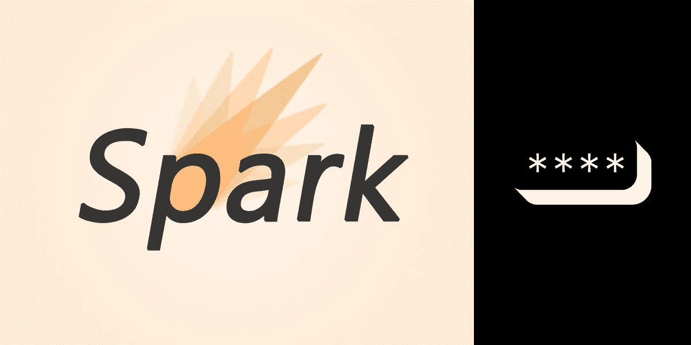
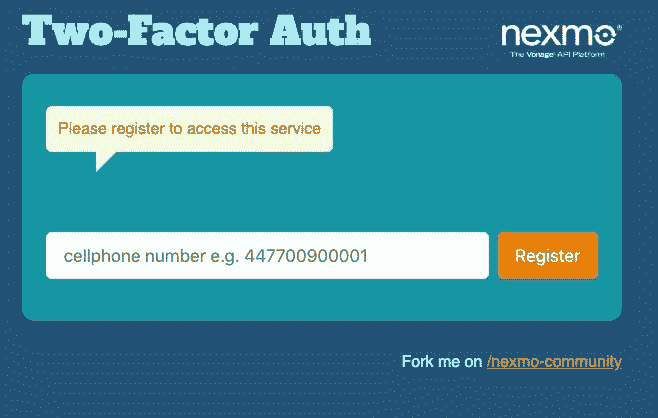
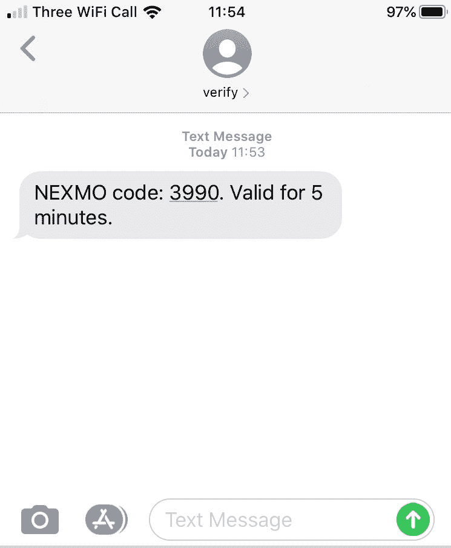
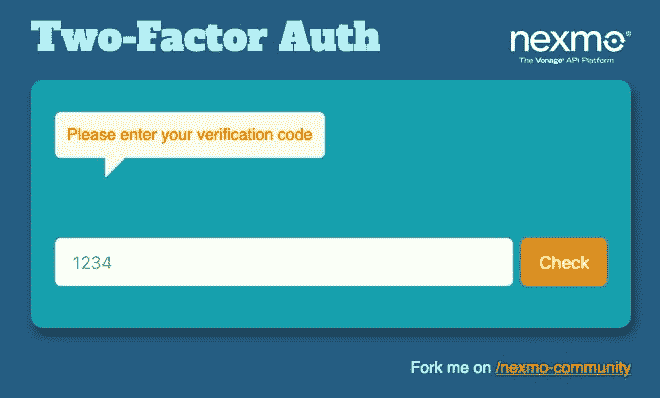
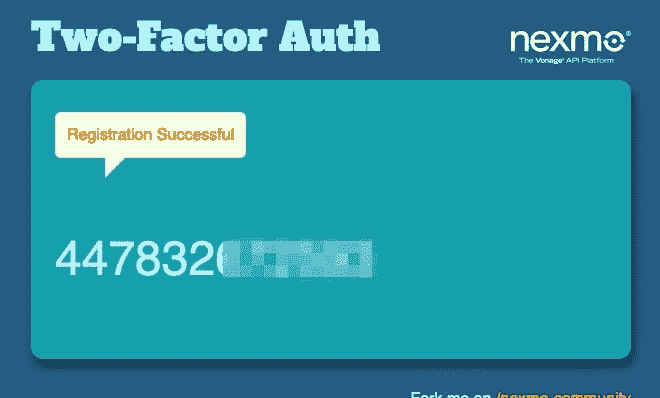

# 如何使用 Java 和 Spark 添加双因素认证(2FA)

> 原文：<https://levelup.gitconnected.com/how-to-add-two-factor-authentication-2fa-using-java-and-spark-6389409159b8>

双因素认证(2FA)是一种越来越流行的防止欺诈注册的方法。它通过添加额外的安全层来工作，不仅需要传统的用户名和密码，还需要用户拥有的东西。那是典型的他们的手机。

在本教程中，您将学习如何为您的 web 应用程序和服务实现 2FA。为此，我们将创建一个简单的网页，要求用户使用他们的手机号码注册。我们将使用[验证 API](https://developer.nexmo.com/verify/overview) 生成一个确认码，并通过短信发送到该号码。

如果用户可以访问他们注册时使用的号码，他们将会收到代码。然后，我们的应用程序会提示他们输入信息以完成注册过程。

# 先决条件

我们将使用 Java 和 [Spark web 框架](http://sparkjava.com/)构建这个应用程序，并使用[手柄模板引擎](https://handlebarsjs.com/)为 UI 元素创建一些简单的视图。

您将需要以下内容:

*   JDK 或其开源等价物 [OpenJDK](https://openjdk.java.net/install/) 。本教程是用 OpenJDK 11 编写的，但版本 8 或以上都可以。
*   [Gradle](https://gradle.org/install/)(3.4 或更高版本)来构建你的项目并管理它的依赖项。

你可以在 GitHub 上找到这个教程[的源代码。](https://github.com/nexmo-community/two-factor-auth)

# Vonage API 帐户

要完成本教程，您将需要一个 [Vonage API 帐户](http://developer.nexmo.com/ed?c=blog_text&ct=2020-08-18-how-to-add-two-factor-authentication-using-java-and-spark)。如果你还没有，你可以今天就[注册](http://developer.nexmo.com/ed?c=blog_text&ct=2020-08-18-how-to-add-two-factor-authentication-using-java-and-spark)并开始用免费信用点数进行构建。一旦你有了一个帐户，你可以在 [Vonage API 仪表板](http://developer.nexmo.com/ed?c=blog_text&ct=2020-08-18-how-to-add-two-factor-authentication-using-java-and-spark)的顶部找到你的 API 密匙和 API 秘密。

# 创建您的项目

为您的项目创建一个名为`two-factor-auth`的目录，切换到该目录，然后使用`gradle`来初始化项目:

接受所有默认值，然后在 IDE 中打开生成的项目。

# 初始化相关性

找到`build.gradle`文件，并用以下内容替换`dependencies`部分:

在这个例子中我们不会写任何单元测试，但是你可以暂时把`JUnit`留在那里。然而，为了防止它以后抱怨缺少问候方法，在`src/test/java/two/factor/auth/AppTest.java`中注释掉测试，如下所示:

# 创建 Spark Web 应用程序

`gradle`在`src/main/java/two/factor/auth/App.java`文件夹中创建了`App`类。

在 IDE 中打开`App.java`。移除`gradle`为您创建的`getGreeting()`方法，并为`spark`包添加必要的`import`语句。

然后，调用 Spark 的`port`方法来指示您的应用程序正在侦听端口 3000 上的请求。

你的`App.java`应该是这样的:

# 初始化 Java 客户端库

要访问 Verify API，您需要使用用于 Java 的 [REST API 客户端库](https://github.com/nexmo/nexmo-java)。

如下所示实例化它，用您的 API 密钥和来自[开发者仪表板](https://dashboard.nexmo.com)的秘密替换`YOUR_API_KEY`和`YOUR_API_SECRET`。确保包含使用 Verify API 所需的必要的`import`语句:

# 创建视图

你的申请将有三页:

*   初始**注册页面**，您的用户将通过输入他们的手机号码注册您的服务。
*   一个**确认页面**，将要求他们输入由 Verify API 发送给他们的移动设备的确认码。
*   一个**结果页面**，应用程序会显示他们已经注册成功(如果他们输入了正确的确认码)或者注册失败(如果他们没有)。

Spark 支持许多不同的模板引擎，这使得你可以动态地将内容插入到你的 HTML 页面中，并且重用 HTML 块。在本教程中，我们将使用[手柄](https://handlebarsjs.com/)。

因为我们想在这里重点教你如何使用 Verify API，所以我们不会在这篇文章中描述它们是如何工作的，而是要求你从[我们的 GitHub repo](https://github.com/nexmo-community/two-factor-auth) 下载你需要的内容。

首先，在您的`App.java`文件中包含以下导入，这将使您能够使用车把:

然后，创建`src/main/resources/public`和`src/main/resources/templates`目录。

将 [styles.css](https://github.com/nexmo-community/two-factor-auth/blob/master/src/main/resources/public/styles.css) 文件的内容复制到`src/main/resources/public/styles.css`中。

然后将 GitHub 上 [resources 文件夹中的`*.hbs`模板文件复制到`src/main/resources/templates`中。](https://github.com/nexmo-community/two-factor-auth/tree/master/src/main/resources/templates)

通过在`App.java`中的`main`方法中指定其父文件夹(`public`)的位置，确保您的应用程序知道`styles.css`静态 CSS 文件:

# 显示初始注册页面

当您的用户第一次访问您的站点时，您希望显示注册页面。通过使用`spark`定义默认路线(`/`，并渲染`register.hbs`模板，如下所示:

通过执行`gradle run`然后在浏览器中访问`http://localhost:3000`来测试您的应用。如果您已经正确设置了所有内容，您将看到以下页面:

# 提交验证请求

用户必须在注册页面的文本框中输入手机号码，然后点击**注册**开始验证过程。

Verify API 希望该号码包含国际拨号代码，但忽略任何前导零。比如英国数字`07700 900001`就应该用`447700900001`来表示。

在生产应用程序中，您可能希望以编程方式确定正确的区域设置和国家代码，我们有一个 API 来实现这一点！查看[数字洞察 API](https://developer.nexmo.com/number-insight/code-snippets/number-insight-basic) 。不过现在，让我们保持简单。

当用户点击 **Register** 时，我们希望获取他们输入的数字并提交验证请求。

每个验证请求都与一个验证 ID 相关联。我们也需要保存一份记录，这样我们就可以用它来检查用户是否输入了正确的确认码。

所以添加两个类级别的变量来存储这些信息，放在您之前填充的`API_KEY`和`API_SECRET`变量下面:

我们将从`/register`路线提交验证请求，因此将路线定义如下:

这段代码触发验证请求，首先检索一个`VerifyClient`的实例，然后调用它的`verify`方法，传入我们想要验证的数字和一个用于在 SMS 消息正文中标识发送者的字母数字字符串。

它返回一个`VerifyResponse`对象，我们可以用它来检查请求是否成功发出。如果是这样，我们检索验证请求 ID，并在下一步中使用它来检查发送给用户的特定验证尝试的代码。

一旦我们提交了验证请求，用户将通过短信收到一个验证码:

我们呈现`verify.hbs`视图，允许他们输入收到的代码:

默认情况下，发送 SMS 后，Verify API 会等待 125 秒的代码。如果在这段时间内没有收到，它会进行两次文本到语音转换电话呼叫，最终放弃验证尝试并失败。您可以通过[阅读文档](https://developer.nexmo.com/verify/guides/workflows-and-events)了解更多关于默认工作流程以及如何启用不同工作流程的信息。

# 检查确认码

我们现在需要提供必要的逻辑来验证他们输入的代码。为此创建`/check`路线:

这段代码使用了`VerifyClient.check`方法，向它传递我们在验证请求步骤中存储的请求 ID 和用户在`verify.hbs`视图中输入的代码。

`check`方法返回一个`CheckResponse`对象。我们使用它的`getStatus`方法来确定用户是否输入了正确的代码，并在`result.hbs`视图中显示适当的响应。如果用户正确输入了代码，我们会收到以下消息:

# 试试吧！

1.  在您的终端中执行`gradle run`。
2.  在浏览器中访问`http://localhost:3000`。
3.  输入您的手机号码，点击**注册**。过一会儿，你会收到一条包含验证码的短信。
4.  输入验证码，点击**检查**。
5.  如果您成功输入了代码，您将收到一条“注册成功”的消息。

# 结论

这是使用 Verify API 在 Java web 应用程序中实现双因素身份验证的基础。要了解更多信息，请参阅下面提供的文档链接。

# 进一步阅读

*   [关于验证 API 的一般信息](https://www.nexmo.com/products/verify)
*   [验证 API 文件](https://developer.nexmo.com/verify/overview)
*   [验证 API 参考](https://developer.nexmo.com/api/verify)
*   [数字洞察 API](https://developer.nexmo.com/number-insight/overview)

*原载于*[*https://www . NEX mo . com/blog/2020/08/18/how-to-add-two-factor-authentic ation-using-Java-and-spark*](https://www.nexmo.com/blog/2020/08/18/how-to-add-two-factor-authentication-using-java-and-spark)