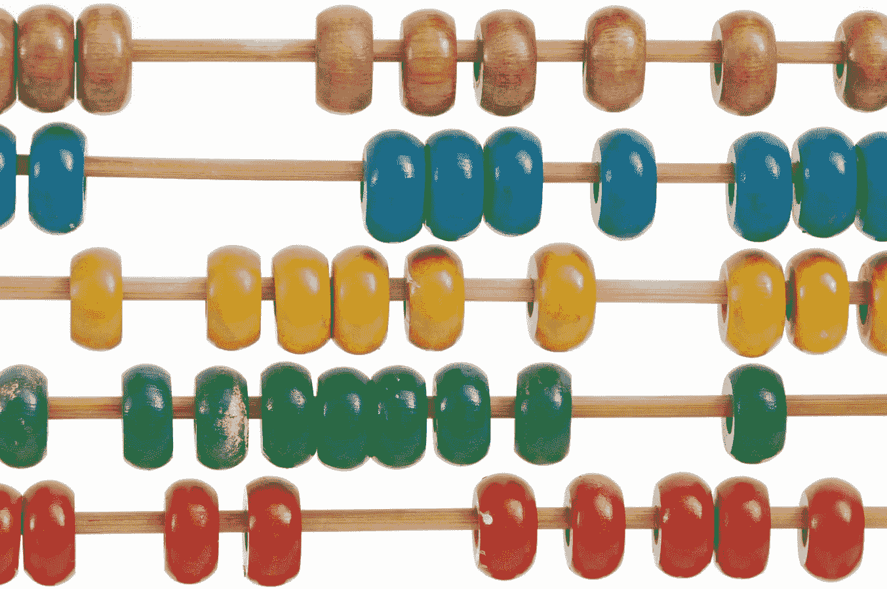
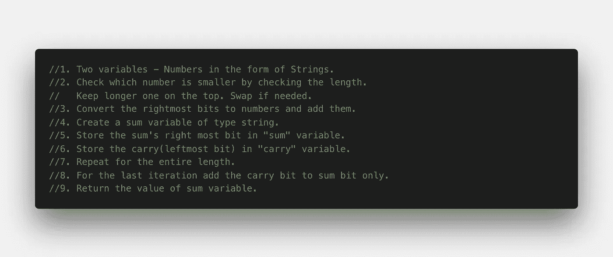

# 如何用 Javascript 将两个非常大的数字相加？

> 原文：<https://levelup.gitconnected.com/how-to-add-two-very-large-numbers-in-javascript-6305ed8c5fad>

图片来源: **Unsplash**

L et us 剖析了一个非常流行的**算法挑战**，*在 Javascript 中计算两个非常大的数的和*。

传统上，Javascript 数字使用 53 位是安全的。如果你真的想知道更多细节，你可以查看我的[上一篇文章](https://medium.com/better-programming/why-is-0-1-0-2-not-equal-to-0-3-in-most-programming-languages-99432310d476)，它讨论了 Javascript 中浮点数的概念。

# **手头的问题**

> *创建一个算法，该算法包含一个函数，该函数接受任意两个数字，但采用字符串形式，并将总和作为字符串返回。*
> 
> *该函数将用于在 Javascript 中添加非常大的数字。之所以需要这个程序，是因为在纯 javascript 中不能存储超过 53 位的数字。*
> 
> *为了对较大的数字进行运算，我们把它们转换成字符串，然后对它们进行运算。*

# **逐步解决方案**

问题的伪代码是这样的:

伪代码

让我们一步一步地分解这个—

# 初始化两个非常大的数字

比方说:第一=“893427328497983427893248932498034289324”第二=“2348592348793428978934274”。

# 计算两个变量的长度

较长的数字应该是作为参数传递给函数调用的第一个数字，因为在加法过程中，较大的数字应该在最上面。为了防止第一个数字变小，我在函数调用中交换了参数。

# 将最右边的位转换成数字并相加

在这里， **diff** 代表两个变量长度的不同。我们用它来引用正确的第 I 个元素并将它们相加。变量 **temp** 是通过转换第 I 个位置的字符，做模 10 得到余数来计算的。我们将第一个和第二个变量中的**和**这两个元素相加，并添加**进位**变量(如果有)。****

# 创建字符串类型的 sum 变量

**var sum = " "；**

这个变量， **sum** 将为我们存储求和的结果。

# 将总和的最右位存储在“总和”变量中

在执行求和时，我们将把最右边的位存储在 **sum** 变量中，把最左边的位存储在 **carry** 变量中，就像我们通常做的那样。

# 运行整个长度的循环

我们不断添加最正确的位。将它们存储在临时变量中。如果它大于等于 10，我们取 10 的模，并将结果存储在 sum 中。我们将商保留在进位中。

# 对于最后一次迭代，只将进位加到和上

最后，我们返回 **sum** 变量，它现在保存这两位数字的合计值。

感谢阅读！