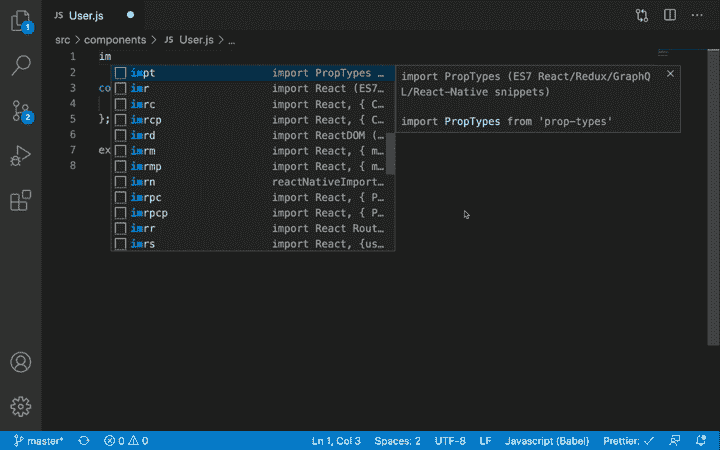
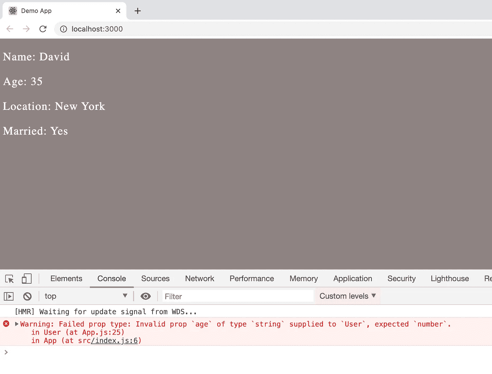
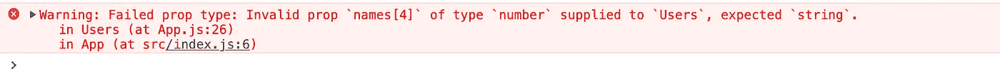
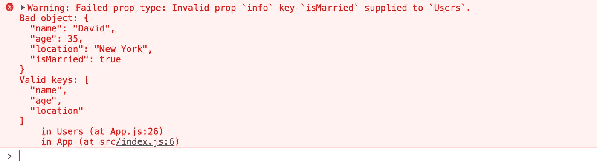
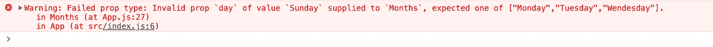
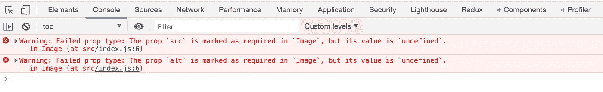

# 如何在 React 中添加类型检查

> 原文：<https://levelup.gitconnected.com/how-to-add-type-checking-in-react-a6a9c258abad>

避免由于类型不匹配错误导致的产品代码中的错误的简单方法


[Artem Sapegin](https://unsplash.com/@sapegin?utm_source=medium&utm_medium=referral) 在 [Unsplash](https://unsplash.com?utm_source=medium&utm_medium=referral) 上拍照

`React`是一个 Javascript 库，而`Javascript`是一个松散类型的语言，所以默认情况下，它不提供任何类型检查，因此当我们传递错误类型的数据时，很容易在你的应用程序中产生错误，这将很容易使你的应用程序崩溃。

在更大的应用程序中有各种静态类型的检查器，如`Flow`或`Typescript`，它们有助于在编译时捕捉错误。

但是如果你想在你的`React`应用程序中执行一些简单的类型检查，并且不想像`Flow`提供的那样在每一层添加注释，那么`PropTypes`是首选方式。

`PropTypes`最初是`React`核心模块本身的一部分，但从`React`版本`15.5`开始，它被移到`prop-types`库，以保持`React`库的轻便和小巧。

你会发现`prop-types`在很多流行的库中用于类型检查。

## 装置

要安装`prop-types`库，在终端执行以下命令

```
yarn add prop-typesORnpm install prop-types
```

## 使用

这个库提供了一个默认的导出，所以我们可以随意命名它，但是它通常是作为

```
import PropTypes from 'prop-types'
```

如果你已经在你的 IDE 中安装了`React`的代码片段插件，正如我之前的文章[中所描述的，那么你只需要输入`impt`文本来为它添加导入](/most-popular-visual-studio-code-extension-when-working-with-react-997d04691cc7)



属性类型导入快捷方式

假设我们有一个显示用户详细信息的`User`组件

```
const User = ({ name, age, location, isMarried }) => {
  return (
    <div className="user">
      <p>Name: {name}</p>
      <p>Age: {age}</p> 
      <p>Location: {location}</p>
      <p>Married: {isMarried ? 'Yes' : 'No'}</p>
    </div>
  );
};
```

然后，我们可以添加类型检查来检查传递给组件的每个`prop`的类型是否正确，如下所示

```
User.propTypes = {
 name: PropTypes.string,
 age: PropTypes.number,
 location: PropTypes.string,
 isMarried: PropTypes.bool
};
```

**注意:** `p`在`User.propTypes`中是小写的，在定义类型时，和`PropTypes.string`一样是大写的

这里，我们对功能组件使用了`PropTypes`,但是对类组件也是一样。

现在，假设我们将`age`作为字符串传递给`User`组件

```
const user = {
  name: 'David',
  age: '35',
  location: 'New York',
  isMarried: true
};ReactDOM.render(<User {...user} />,document.getElementById("root"));
```

然后，当您运行应用程序时，您将在控制台中得到一个警告



PropType 警告

因此，使用`PropTypes`可以让我们在应用程序投入生产之前，轻松地找到并修复可能由于无效类型而导致的问题。

除了`number`、`string`和`bool`，`PropTypes`支持各种其他类型，如

*   `PropTypes.func:`
    指定要成为函数的类型
*   `PropTypes.array:` 指定数组的类型
*   `PropTypes.arrayOf:` 指定类型为特定类型的数组，如字符串数组

```
const names = ['David', 'Jack', 'Mike', 'Tim', 9];...<Users names={names} />...Users.propTypes = {
  names: PropTypes.arrayOf(PropTypes.string)
};
```

在这种情况下，您会收到一条警告，因为数组中的值`9`不是字符串类型。



数组的 PropType 错误

*   `PropTypes.object:` 指定对象的类型
*   `PropTypes.symbol:` 指定符号的类型
*   `PropTypes.node:` 指定类型为`node`，这意味着`React`可以渲染的任何东西，如`numbers`、`strings`、`elements`、`DOM elements`或`array`，但**不能渲染**、`boolean`或`objects`，因为`React`在 JSX 不打印布尔值，对于对象，`React`在 JSX 使用时会抛出错误
*   `PropTypes.element:` 指定类型为`React`元素

```
User.propTypes = {
 info: PropTypes.element
}...<User info={<Info />} />
```

*   `PropTypes.any:` 指定类型为任意值，如`string`、`number`、`boolean`、`object`
*   `PropTypes.exact:` 指定精确形状的类型

```
User.propTypes = {
  info: PropTypes.exact({
    name: PropTypes.string,
    age: PropTypes.number,
    location: PropTypes.string
  })
};...const user = {
 name: 'David',
 age: 35,
 location: 'New York'
};<User info={user} />
```

如果您传递的属性不同于`PropType`中提到的属性，那么您将会得到一个错误



PropTypes.exact

*   `PropTypes.shape:` 指定某种形状的类型。它和`exact`很相似，除了你可以包括更少或更多的道具

```
User.propTypes = {
  info: PropTypes.shape({
    name: PropTypes.string,
    age: PropTypes.number,
    location: PropTypes.string
  })
};
```

*   `PropTypes.instanceOf:` 指定类型为某事物的`instance`

```
User.propTypes = {
 date: PropTypes.instanceOf(Date)
};...const today_date = new Date();<User date={today_date} />
```

*   `PropTypes.oneOf:` 指定类型为提到的值之一

```
Months.propTypes = {
 day: PropTypes.oneOf(['Monday', 'Tuesday', 'Wendesday'])
};...<Months day="Monday" />
```

如果你传递了错误的值，那么你会得到这样的错误



PropTypes.oneOf

> 默认情况下，每个道具都是可选的。要根据需要制作任何道具，我们可以在道具类型中添加`.required`

```
Image.propTypes = {
 src: PropTypes.string.isRequired
};
```

假设我们有一个`Image`组件

```
const Image = (props) => {
  const { src, alt } = props; return (
    <div className="image">
      
    </div>
  );
};Image.propTypes = {
  src: PropTypes.string**.isRequired**,
  alt: PropTypes.string**.isRequired**
};
```

然后我们可以将`Image`显示为

```
ReactDOM.render(<Image />, document.getElementById("root"));
```

如你所见，我们刚刚使用了`<Image />`，我们没有通过`src`和`alt`道具，所以你会在控制台看到一个警告



必需的 prop 类型

但是，如果我们像这样传递所需的值

```
<Image src="http://unsplash.it/200/200?random" alt="Random image" />
```

那么您将不会在控制台中收到警告消息

> 我们可以将`.required`添加到上面看到的所有`PropTypes`中

**注意:PropType 检查仅在开发模式下进行。当应用程序在生产模式下运行时，React 不会执行 PropType 检查。**

今天到此为止。我希望你学到了新东西。

**别忘了订阅我的每周简讯，里面有惊人的技巧、诀窍和文章，直接在这里的收件箱** [**订阅。**](https://yogeshchavan.dev/)

[](https://skilled.dev) [## 编写面试问题

### 掌握编码面试的过程

技术开发](https://skilled.dev)