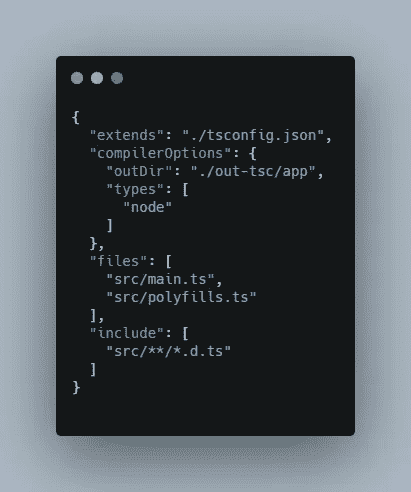
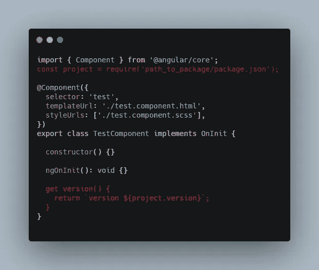

# 如何给 Angular 应用程序添加版本

> 原文：<https://levelup.gitconnected.com/how-to-add-version-to-angular-application-610c47201c7f>

## 有角的

## 向 Angular 应用程序的界面添加版本的简单指南。

照片由[阿达兰·哈迈达尼](https://unsplash.com/@ardalan_h?utm_source=unsplash&utm_medium=referral&utm_content=creditCopyText)在 [Unsplash](https://unsplash.com/s/photos/coffee-cup?utm_source=unsplash&utm_medium=referral&utm_content=creditCopyText) 上拍摄

在本文中，我将分享一个将 package.json 文件导入 Angular 应用程序的简单配置。

1.  导入@类型/节点
2.  将配置添加到 tsconfig.app.json
3.  将 package.json 导入角度组件

这样做的目的很简单。有时，我们希望将 package.json 导入到 Angular 组件中，以获取版本号并显示在模板中。

我是这样做的。

## 导入@类型/节点

这个包包含 Node.js 的类型定义。它将帮助你识别节点语法。

这里可以安装[。](https://www.npmjs.com/package/@types/node)

## 将配置添加到 tsconfig.app.json

您需要 tsconfig.app.json 中的`node`类型，如下所示。

将节点添加到 tsconfig.app.json

## 将 Package.json 导入角度组件

我在这里添加`@type/node`的原因是我想使用`require()`语法将 package.json 导入到我的 Angular 组件中。

我试过用`import`。但是，它对于角度应用并不成功。

将包 json 导入角度组件

现在我们可以把版本放入 html 模板并使用它。

我希望这篇文章对你有用！可以跟着我上[媒](https://medium.com/@transonhoang?source=post_page---------------------------)。我也在推特上。欢迎在下面的评论中留下任何问题。我很乐意帮忙！