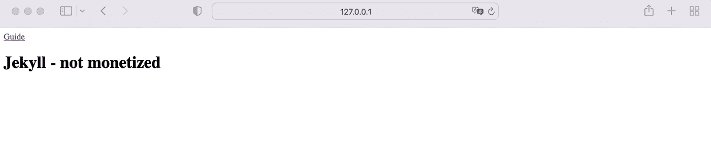
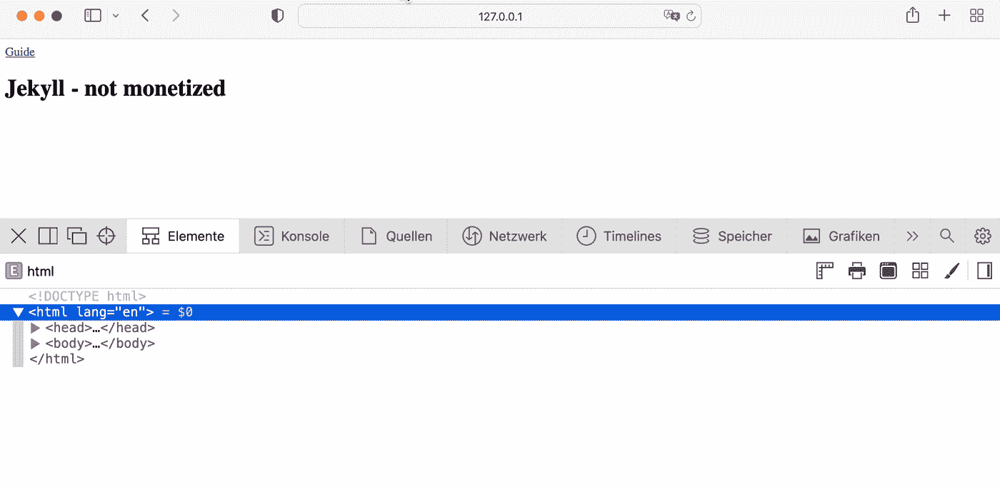
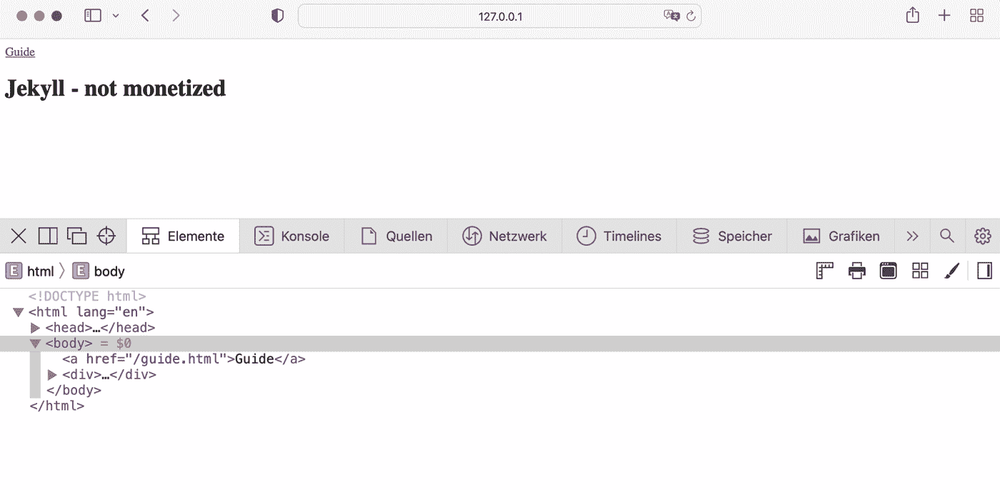

# 如何用两种简单的方法将网络货币化添加到 Jekyll

> 原文：<https://levelup.gitconnected.com/how-to-add-web-monetization-to-jekyll-in-two-easy-ways-c96bc8cd3643>


# **简介**

几十年来，订阅、广告或附属链接等技术一直被用来赚钱网站或博客。然而，它们都有一个共同的缺点:它们破坏了网站的外观和用户体验。一种相当新的网站货币化方法是利用[网络货币化](https://webmonetization.org) JavaScript API，网站的创建者在访问者浏览网站时从他们那里接收支付流。如果你用静态网站生成器 [Jekyll](https://jekyllrb.com) 建立你的网站或博客，增加网络货币化是相当容易的，可以用两种不同的方式来完成。

# **在本指南中**

在简单介绍了什么是网络货币化，它如何工作以及如何获得所需的支付指针后，一个新的 Jekyll 项目就建立了。随后，Web 货币化以两种不同的方式添加到 Jekyll 中。首先，利用[Jekyll-web _ monetary](https://github.com/philnash/jekyll-web_monetization)插件。第二，在没有任何附加插件的情况下实现网络货币化。

# **先决条件**

*   Ruby 版本 3.0.0 或更高版本
*   Jekyll 和 bundler 宝石安装在您的机器上
*   支持 Interledger 协议的数字钱包的支付指针

# **网络货币化简介**

**简要概述**

*Web 货币化*是一个提议的 JavaScript 浏览器 API。它利用[Interledger protocol(ILP)](https://interledger.org/news/how-the-interledger-protocol-ilp-powers-web-monetization/)从浏览器向网站所有者发送小额支付流，同时网站访问者正在消费网站内容，无需访问者注册订阅或使用传统广告。

网站的访问者需要一个由*网络货币化提供商*如 [coil](https://coil.com/) 和*网络货币化代理*提供的账户——一个合适的浏览器或浏览器插件，以认证和启动来自网络货币化提供商的支付。网站所有者反过来需要一个带有支付指针的合适的钱包，该钱包支持 ILP 代表访问者的浏览器接收支付。

**支付指针**

支付指针是来自网站所有者的数字钱包的 ID。要获得支付指针，您必须注册一个支持 ILP 的数字钱包帐户。完成注册和验证过程后，您可以创建一个钱包。一般来说，支付指针可以在钱包概览页面或设置区域找到。

目前唯一可用的钱包是[支持](https://wallet.uphold.com/signup)和 [GateHub](https://gatehub.net/) 。Coil 详细描述了如何为两者获取支付指针，[维护](https://help.coil.com/docs/monetize/wallets/uphold)和 [GateHub](https://help.coil.com/docs/monetize/wallets/gatehub) 。

# **工作原理**

网站所有者必须在每个页面的头部放置一个带有支付指针的`<meta>`元素，以便货币化。要素的`name`必须是*货币化*并且`content`必须是支付指针。访问者的浏览器解析支付指针，并且只要访问者消费网站的内容，就经由网络货币化 API 从网络货币化提供者发起支付流。

在网络货币化网站上，你可以找到[详细的解释](https://webmonetization.org/docs/explainer)和[网络货币化提供商和网站所有者合适钱包的列表](https://webmonetization.org/)。

# **清理杰基尔设置**

Jekyll 网站将包含两个页面来说明即将实现的结果。一个标准页面和一个将被货币化的页面。

**初始化新项目**

在所需的工作目录下打开终端，用

```
bundle init
```

然后用下面的命令将所需的 Jekyll 和 WEBrick gems 添加到 Gemfile 中，一个新的 Jekyll 项目就初始化了。

```
bundle add jekyll webrick
```

**布局**

由于 Web 货币化是通过添加一个带有指向 HTML 文档 head 部分的付款指针的`<meta>`元素来实现的，我们将创建两个布局。一个将包含带有支付指针的`<meta>`元素，另一个不会。

因此，在您的项目根目录中创建一个新文件夹`_layouts`。在`_layouts/`中创建一个新文件`default.html`，内容如下:

这个非常基本的 HTML 布局将用于不打算货币化的页面。在`_layouts/`中创建第二个文件`monetized.html`，内容如下:

这种布局将在以后修改，以便为打算货币化的页面提供支付指针。

**页面**

在您的项目根目录下创建两个页面:

`index.html`

`guide.html`

`index.html`将是一个标准的网页，而`guide.html`旨在货币化。除了使用 HTML 文件，你还可以使用 Markdown 文件。

**基础设置**

Jekyll 项目现在具有以下结构:

```
/
 _layouts/
   default.html
   monetized.html
 Gemfile
 guide.html
 index.html
```

使用构建项目

```
bundle exec jekyll serve
```

并浏览 [http://127.0.0.1:4000](http://127.0.0.1:4000`) 。



这个非常基本的网站包含两个不同布局的两个页面。目前，这两种布局仍然包含相同的 HTML 元素。

**源代码**

GitHub: [Jekyll 基础设置](https://github.com/robinkloeckner/jekyll_web_monetization/tree/master/00_base)

# **选项 1:网络货币化插件**

**安装**

给 Jekyll 增加网络货币化的一个方法是利用[Jekyll-Web _ monetary 插件](https://github.com/philnash/jekyll-web_monetization)。因此将*jekyll-web _ monetization*gem 作为 Jekyll 插件添加到项目的`Gemfile`

然后跑

```
bundle install
```

安装宝石。

接下来，在您的项目根目录中创建一个`_config.yml`配置文件。在文件中启用插件下的`plugins`关键字:

**用法**

支付指针可以在`_config.yml`文件中全局设置，也可以在你想赚钱的页面或博客文章的首页设置。后者让你有机会为你博客的不同作者使用不同的付费指针。如果在页面的`_config.yml`和封面中设置付款指针，则使用封面的付款指针。

以下列形式添加付款指针

```
payment_pointer: $wallet.example/someId
```

到`_config.yml`文件

或者到`guide.html`页的首页:

要链接布局文件和插件，添加``液体标签到`monetized.html`布局文件的头部分:

在构建过程之后，呈现到这个布局文件中的每个页面或博客文章将在其头部有一个货币化`<meta>`元素。

**结果**

使用构建项目

```
bundle exec jekyll serve
```

并浏览 [http://127.0.0.1:4000](http://127.0.0.1:4000`) 。



如您所见，Web 货币化`<meta>`元素被添加到`guide.html`的头部分，并包含在`_config.yml`文件中设置的支付指针。

**源代码**

GitHub: [Jekyll 与网络货币化——选项 1](https://github.com/robinkloeckner/jekyll_web_monetization/tree/master/01_plugin)

# **选项 2:不带插件**

或者，您可以不使用插件，只需将货币化`<meta>`元素手动链接到项目配置文件中的支付指针，即可添加 Web 货币化。

**实施**

恢复前一部分的可能更改或下载[基本设置](https://github.com/robinkloeckner/jekyll_web_monetization/tree/master/00_base)。

在你的项目根目录下用你的个人支付指针创建一个`_config.yml`配置文件:

然后在您的`monetized.html`布局文件中，在结束`<head>`元素之前添加一个货币化`<meta>`元素，如下所示:

付款指针通过一个液体标签与`_config.yml`中的`payment_pointer`变量相链接，而`site`变量可让您访问 Jekyll 的配置设置。

如果您想要为不同的页面或博客文章添加不同的支付指针，请将`payment_pointer`变量放在相应页面或博客文章的封面中，并将 liquid 标签中的`site`变量替换为`page`变量，以访问页面的封面。

**结果**

使用重新生成项目

```
bundle exec jekyll serve
```

并浏览 [http://127.0.0.1:4000](http://127.0.0.1:4000`) 。



正如你所看到的，Web 货币化`<meta>`元素被添加到了`guide.html`页面的 head 部分，并且包含了在`_config.yml`文件中设置的支付指针。

**源代码**

GitHub: [Jekyll 与网络货币化——选项 2](https://github.com/robinkloeckner/jekyll_web_monetization/tree/master/02_manual)

# 限制

这是 Web 货币化 API 的一个非常基本的实现。如果一个访问者没有通过网络赚钱，你的网站内容仍然是可见的。此外，为了收到付款，你的访问者必须注册一个像 coil 这样的网络货币化提供商。

# **总结**

Web 货币化是一种提议的浏览器 API，允许您将您的网站或博客货币化，而无需用户注册订阅、添加广告或其他中断用户体验的元素。为了将你的网站货币化，HTML 文档必须包含一个带有支付指针的货币化`<meta>`元素。在 Jekyll 中，这可以通过使用[Jekyll-web _ monetization](https://github.com/philnash/jekyll-web_monetization)插件或者手动添加`<meta>`元素来完成。

# 放弃

本指南是根据我的知识和信念编写的。但是，由于本指南包含在撰写本文时尚未成为 web 标准的技术信息，以及可能发生变化的金融交易信息，因此我对其正确性、完整性和当前状态不承担任何责任。在使用本指南中介绍的技术之前，请访问相应的网站！

我不使用本指南中的附属链接，我也不会因为陈述任何公司而获得报酬！

感谢您的阅读:)请在评论中告诉我您对网络货币化的想法和体验。

# 分级编码

```
Thanks for being a part of our community! More content in the [Level Up Coding publication](https://levelup.gitconnected.com/).
Follow: [Twitter](https://twitter.com/gitconnected), [LinkedIn](https://www.linkedin.com/company/gitconnected), [Newsletter](https://newsletter.levelup.dev/)Level Up is transforming tech recruiting👉[**Join our talent collective**](https://jobs.levelup.dev/talent/welcome?referral=true)
```