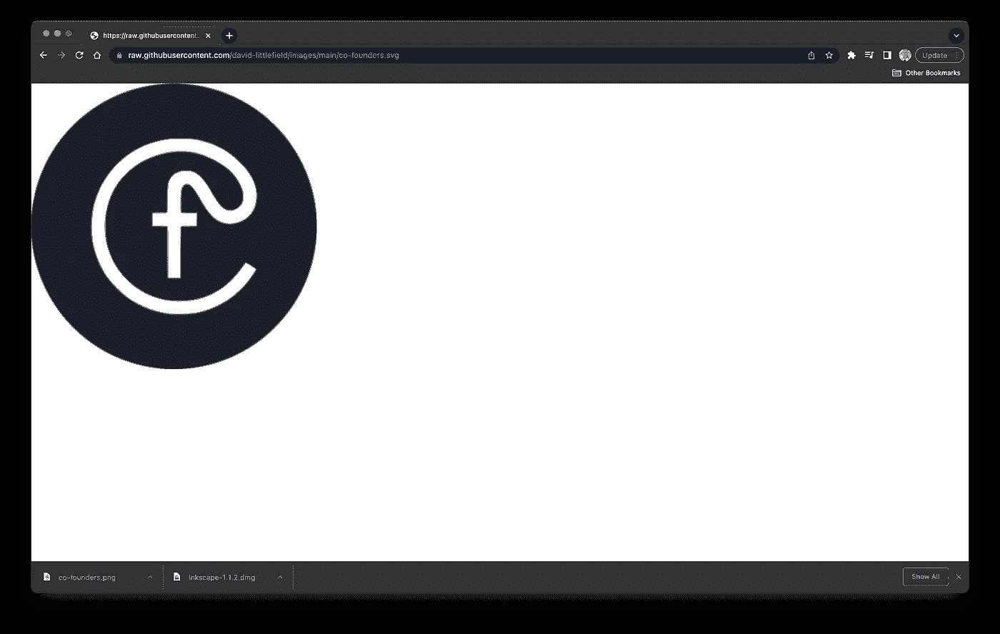
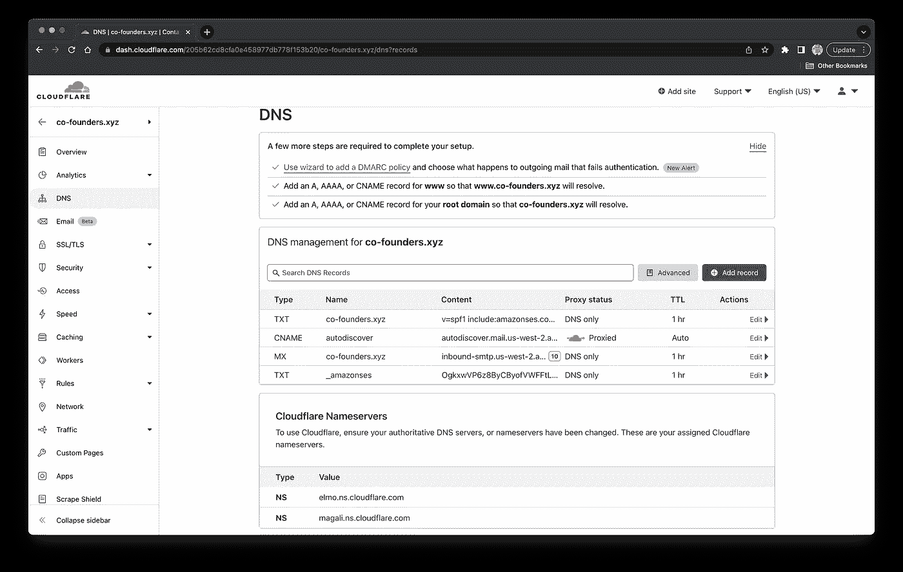

# 如何为收件箱中的电子邮件添加徽标

> 原文：<https://levelup.gitconnected.com/how-to-add-your-logo-to-your-email-messages-in-the-inbox-with-bimi-77d713cb9e45>

## 课程:非技术型创业者的创业

## 使用 BIMI 规范、谷歌账户和必应页面


## 什么是 BIMI 规范？

消息识别品牌标志(BIMI)是一种电子邮件规范，它在支持电子邮件服务提供商的收件箱中的电子邮件旁边显示一个徽标。它帮助人们避免欺诈性的电子邮件信息，并允许公司将他们的品牌展现在客户面前。它需要 SVG 格式的方形徽标、MX 记录、SPF 记录、DMARC 记录和 BIMI 记录。然而，每个电子邮件服务提供商可能有额外的要求。

恶意电子邮件活动的头号指标是新域名缺乏历史记录。可以说，并非所有的恶意邮件都来自新域名，但几乎所有的恶意邮件都来自没有历史记录的域名。这就是某些电子邮件服务提供商引入以下附加要求的原因:

*   电子邮件地址中的电子邮件前缀必须是部门名称。
*   该电子邮件地址必须向大量收件人发送过电子邮件。
*   该电子邮件地址一定没有被许多用户标记为垃圾邮件。

> "威瑞森媒体集团的一项研究发现，BIMI 将电子邮件的打开率提高了 10% . "

## 目录:

1.  [安装图形编辑器](#3055)
2.  [下载 Logo](#a646)
3.  [将 Logo 从 PNG 转换为 SVG 格式](#1cb4)
4.  [将 SVG 文件转换为 SVG-Tiny-PS 格式](#8129)
5.  [上传转换后的徽标](#9332)
6.  [更改域名服务器](#d545)
7.  [添加 Mx 和 SPF 记录](#bf2b)
8.  [添加 DMARC 记录](#3344)
9.  [添加 BIMI 记录](#9784)
10.  [检查 BIMI 记录](#efd8)
11.  [将徽标添加到收件箱(Gmail)](#06ce)
12.  [将徽标添加到收件箱(Outlook)](#9bf9)

## 安装图形编辑器:

Inscape 应用程序是一个图形编辑器，用于创建 SVG 格式的矢量图像。它可以导入和导出不同的文件格式，呈现原始形状和文本，用颜色、图案和渐变填充对象，以及嵌入、跟踪和转换图像。它也非常适合创建徽标、图标、web 图形、用户界面元素、字体、海报、传单、图表、名片和模型。在本节中，我们将下载并安装图形编辑器。

> “Inscape 应用程序是跨平台和免费的，但任何带有图像跟踪的图形编辑器都应该可以工作。”

1.  [Mac](#d854)
2.  [Windows 10](#5495)
3.  [Linux](#d0dd)

## 在 Mac 上安装图形编辑器:

Apple 磁盘映像(DMG)文件是一个可装载的磁盘映像，用于将软件分发到 macOS 操作系统。它支持压缩、文件跨越、加密和密码保护。当文件打开时，它作为一个驱动器挂载，并且可以从该驱动器访问或安装其内容。在本节中，我们将下载并安装带有 DMG 文件的图形编辑器。

> 图形编辑器将徽标从 PNG、JPG 和 JPEG 格式转换为所需的 SVG 格式

```
**# download "inkscape" application**
1\. open "download" page on [inkscape](https://inkscape.org/release)
2\. click "macos" tab
3\. download "dmg" file**# install "inkscape" application** 1\. open "dmg" file
2\. drag "inkscape" icon to "applications" directory
```


## 在 Windows 10 上安装图形编辑器:

可执行(EXE)文件是一个用于向 Windows 操作系统分发软件的程序。它通常包含打开文件时设备运行的程序、应用程序或应用程序安装程序。它还可能包含感染设备并窃取信息的病毒或恶意软件。在本节中，我们将下载并安装带有 EXE 文件的图形编辑器。

> 图形编辑器将徽标从 PNG、JPG 和 JPEG 格式转换为所需的 SVG 格式

```
**# download "inkscape" application**
1\. open "download" page on [inkscape](https://inkscape.org/release)
2\. click "windows" tab
3\. click "64-bit architecture" tab
4\. click "exe" tab
5\. download "exe" file**# install "inkscape" application** 1\. open "exe" file
2\. click "yes" button
3\. click "next" button
4\. click "i agree" button
5\. click "next" button
6\. click "next" button
7\. click "next" button
8\. click "install" button
9\. click "finish" button
```

## 在 Linux 上安装图形编辑器:

Debian (DEB)包是一个压缩文件存档，用于向某些基于 Linux 的操作系统分发软件。它包含二进制可执行文件、配置文件和依赖项列表，这些依赖项指定了程序正确运行所需的其他包和包版本。在本节中，我们将下载并安装带有 DEB 包的图形编辑器。

> 图形编辑器将徽标从 PNG、JPG 和 JPEG 格式转换为所需的 SVG 格式

```
**# open "terminal" application**
1\. press “⊞ windows” or "⌘ command" key
2\. enter “terminal” into search bar
3\. click "terminal" search result
4\. paste commands into "terminal" application**# add "inkscape" repository to "apt" package manager** sudo add-apt-repository ppa:inkscape.dev/stable**# update package information**
sudo apt update**# install "inkscape" package** sudo apt install inkscape
```

## 下载徽标:

可移植网络图形(PNG)格式是一种用于在互联网上渲染光栅图像的图像格式。它使用无损压缩将图像存储为固定数量的彩色像素。它可以保存非常高质量的图像，重复编辑和保存图像而不损失图像质量，并使用透明和半透明的背景。它也最适用于具有高细节和对比度的图像，如屏幕截图、徽标、web 图形、图表、图形、绘图、插图、漫画、照片或文本扫描以及图像备份。在本节中，我们将从存储库中下载 PNG 文件。

> 本课程提供 PNG 格式的徽标，但您可以随意使用自己的徽标来完成本课程

```
**# download "co-founders.png" file**
1\. open "co-founders.png" file in [github](https://github.com/david-littlefield/co-founders/blob/main/assets/images/co-founders.png)
2\. click "download" button
3\. right-click image
4\. click "save image as" menu item
5\. click "save" button
```


## 将徽标从 PNG 格式转换为 SVG 格式:

可缩放矢量图形(SVG)格式是一种用于在互联网上渲染二维图形的图像格式。它使用基于数学公式的点、线、曲线和形状将图像存储为矢量。它可以在不损失质量的情况下缩放大小，与 HTML、CSS 和 JavaScript 交互，并且需要更少的空间来存储图像。它也最适用于细节少于照片的图像，如图标、徽标、插图、用户界面元素、动画、信息图和数据可视化。在本节中，我们将在图形编辑器中手动将“PNG”文件转换为“SVG”格式。

> "它必须有一个正方形的长宽比，居中的图像，文件大小小于 32 KB，纯色背景."

```
**# create new document** 1\. open "inkscape" applicaton
2\. click "other" option in side navigation panel
3\. click "icon 512 x 512" option**# import logo** 1\. click "file" menu
2\. click "import" menu item
3\. open "co-founders.png" file
4\. select "embed" radio button
5\. select "default import resolution" radio button
6\. select "smooth" radio button
7\. click "ok" button**# center logo on page** 1\. click "object" menu
2\. click "align and distribute" menu item
3\. click "relative to" dropdown menu
4\. click "page" menu item
5\. click logo
6\. hover over options in "align section"
7\. click "center on vertical axis" button
8\. click "center on horizontal axis" button**# configure "trace bitmap" tool** 1\. click "path" menu
2\. click "trace bitmap" menu item
3\. click "multiple scans" tab
4\. click "brightness steps" dropdown menu
5\. click "colors" menu item
6\. check "smooth" checkbox
7\. check "stack" checkbox 
8\. click "update" button**# trace logo**
1\. click logo
2\. click "apply" button in "trace bitmap" tool
3\. click logo
4\. drag logo to side
5\. right-click logo behind logo
6\. click "delete" menu item**# center traced logo on page**
1\. click "align and distribute" tab
2\. click traced logo
3\. click "center on vertical axis" button
4\. click "center on horizontal axis" button**# save traced logo** 1\. click "file" menu
2\. click "save as" menu item
3\. enter "co-founders.svg" into "name" text field
4\. click "desktop" option in side navigation panel
5\. click "inkscape svg" dropdown menu
6\. click "optimized svg" menu item
7\. click "save" button
8\. click "ok" button
```


## 将 SVG 文件转换为 SVG-Tiny-PS 格式:

SVG Tiny Portable/Secure profile 是一种 SVG 格式，它提供了比设置了当前互联网标准的 SVG profiles 更好的可移植性和安全性。它包括渲染为独立文件所需的一切。它包含由 SVG Tiny 1.2 概要定义的元素的子集。它还只允许呈现非动画矢量图形所需的元素。在本节中，我们将在文本编辑器中手动转换 SVG 文件。

> 外部链接和引用、脚本、动画和交互元素是 Tiny P/S 规范所禁止的，必须从 SVG 文件中删除，但是我们可以跳过这一步，因为我们的 SVG 文件没有这些东西。

> “这个手动过程适用于所有操作系统，但在 [Windows 10](https://github.com/authindicators/svg-ps-converters/tree/master/gui-win10) 和 [macOS](https://github.com/authindicators/svg-ps-converters/tree/master/gui-macos) 上有一个转换器。”

```
**# open "co-founders.svg" file in "visual studio code" application** code $HOME/desktop/co-founders.svg**# convert "svg" file to "svg-tiny-ps" format**
1\. add "baseProfile" attribute to "svg" element
2\. set "baseProfile" attribute to "tiny-ps" within "svg" element
3\. set "version" to "1.2" within "svg" element
4\. remove "x" attribute and value within "svg" element
5\. remove "y" attribute and value within "svg" element
6\. add "title" element after "svg" element
7\. set title to "co-founders" within title element**# save converted "svg" file**
1\. click "file" menu
2\. click "save" menu item
```


点击图像放大

## 上传转换后的徽标:

转换后的标识符合 BIMI 规范的所有要求。SVG 文件遵循 SVG Tiny P/S profile，长宽比为正方形，图像居中，文件大小小于 32 千字节，背景为纯色。SVG 文件通常存储在受 TLS / SSL 证书保护的 web 服务器上，但是我们将 SVG 文件存储在文件托管服务上。在这一部分，我们将把转换后的 logo 上传到一个公共的 GitHub 库。

> "转换后的标志必须可以使用 HTTPS，因为这是 BIMI 支持的唯一交通工具."

```
**# create "github" repository** 1\. create an account on [github](https://github.com/signup)
2\. verify email address
3\. open the "dashboard" page on [github](https://github.com/)
4\. click "new" button
5\. enter "images" into "repository name" text field
6\. select "public" radio button
7\. click "create repository" button**# upload logo to "github" repository** 1\. click "upload an existing file" link
2\. click "choose your files" link
3\. select "co-founders.svg" file
3\. click "commit changes" button**# get url to logo** 1\. click "co-founders.svg" link
2\. click "raw" tab
3\. write down url in web browser
```



## 更改域名服务器:

域名服务器(DNS)是使网络浏览器能够使用域名而不是 ip 地址来加载互联网资源的服务器。它将人类可读的域名翻译成包含 web、应用程序或邮件服务器的虚拟机或物理机的 ip 地址。它在记录中存储该信息和关于域的各种其他信息。这些记录为网络浏览器提供了加载互联网资源的指令。在本节中，我们将更改我们的域注册商的域名服务器。

> “为了简化课程，我将 DNS 管理器更改为 CloudFlare，但是您可以使用您喜欢的任何 DNS 管理器”

1.  [蓝主机](#5789)
2.  Domain.com
3.  [梦幻主持人](#b028)
4.  [GoDaddy](#8771)
5.  [谷歌域名](#3b0c)
6.  [名称便宜](#9200)

## 更改 Bluehost 上的域名服务器:

域名注册商是出租域名的企业。它出售由域名注册机构拥有的带有域名扩展名的域名。它提供域名服务器，将流量从你的域名重定向到你的网站。它还提供了在域名注册中心的中央数据库中更新域名信息的工具。在本节中，我们将更改您的域名注册商的域名服务器。

> “我们只使用域名注册商来注册我们的域名，所以价格是差异化因素。”

```
**# add domain name to cloudflare**
1\. create an account on [cloudflare](https://dash.cloudflare.com/sign-up)
2\. enter your domain name into "enter your site" text field
3\. click "add site" button
4\. click "free $0" card
5\. click "continue" button
6\. click "continue" button**# open "dns" page on bluehost** 
1\. open "control panel" page on [bluehost](https://my.bluehost.com/cgi-bin/cplogin)
2\. click "domains" option in side navigation panel
3\. click "my domains" option in side navigation panel
4\. find your domain name
5\. click "▼" icon next to "manage" dropdown menu
6\. click "dns" menu item**# replace name servers on bluehost** 1\. click "edit" button in "name servers" section
2\. click "custom" radio button
3\. click "confirm changes" button 
4\. enter "elmo.ns.cloudflare.com" into "name server 1" text field
5\. enter "magali.ns.cloudflare.com" into "name server 2" text field
6\. click "save" button**# complete setup on cloudflare**
1\. click "done, check nameservers" button
```


## 更改 Domain.com 上的域名服务器:

域名注册商是出租域名的企业。它出售由域名注册机构拥有的带有域名扩展名的域名。它提供域名服务器，将流量从你的域名重定向到你的网站。它还提供了在域名注册中心的中央数据库中更新域名信息的工具。在本节中，我们将更改您的域名注册商的域名服务器。

> “我们只使用域名注册商来注册我们的域名，所以它们都差不多。

```
**# add domain name to cloudflare**
1\. create an account on [cloudflare](https://dash.cloudflare.com/sign-up)
2\. enter your domain name into "enter your site" text field
3\. click "add site" button
4\. click "free $0" card
5\. click "continue" button
6\. click "continue" button**# open "dns" page on domain.com** 
1\. open "dashboard" page on [domain.com](https://www1.domain.com/controlpanel/foundation/)
2\. find your domain name
3\. click "manage" button
4\. click "dns and nameservers" option in side navigation panel**# replace first nameserver on domain.com** 1\. click three-dots menu next to "nameserver 1" text field
2\. click "edit" menu item
3\. enter "elmo.ns.cloudflare.com" into "nameserver 1" text field
4\. click "save your changes" button**# replace second nameserver on domain.com** 1\. click three-dots menu next to "nameserver 1" text field
2\. click "edit" menu item
3\. enter "magali.ns.cloudflare.com" into "nameserver 2" text field
4\. click "save your changes" button**# complete setup on cloudflare**
1\. click "done, check nameservers" button
```


## 更改 Dreamhost 上的域名服务器:

域名注册商是出租域名的企业。它出售由域名注册机构拥有的带有域名扩展名的域名。它提供域名服务器，将流量从你的域名重定向到你的网站。它还提供了在域名注册中心的中央数据库中更新域名信息的工具。在本节中，我们将更改您的域名注册商的域名服务器。

> “我们只使用域名注册商来注册我们的域名，所以它们都差不多。

```
**# add domain name to cloudflare**
1\. create an account on [cloudflare](https://dash.cloudflare.com/sign-up)
2\. enter your domain name into "enter your site" text field
3\. click "add site" button
4\. click "free $0" card
5\. click "continue" button
6\. click "continue" button**# open "dns" page on dreamhost** 
1\. open "manage domains" page on [dreamhost](https://panel.dreamhost.com/index.cgi?tree=domain.manage)
2\. find your domain name
3\. click "dns" link**# replace nameservers on dreamhost** 1\. click "change" button in "nameservers" section
2\. click "i'll use my own nameservers" radio button
3\. enter "elmo.ns.cloudflare.com" into "nameserver 1" text field
4\. enter "magali.ns.cloudflare.com" into "nameserver 2" text field
5\. click trash icon next to "nameserver 3" text field
6\. click "save" button**# complete setup on cloudflare**
1\. click "done, check nameservers" button
```


## 更改 GoDaddy 上的域名服务器:

域名注册商是出租域名的企业。它出售由域名注册机构拥有的带有域名扩展名的域名。它提供域名服务器，将流量从你的域名重定向到你的网站。它还提供了在域名注册中心的中央数据库中更新域名信息的工具。在本节中，我们将更改您的域名注册商的域名服务器。

> “我们只使用域名注册商来注册我们的域名，所以它们都差不多。

```
**# add domain name to cloudflare**
1\. create an account on [cloudflare](https://dash.cloudflare.com/sign-up)
2\. enter your domain name into "enter your site" text field
3\. click "add site" button
4\. click "free $0" card
5\. click "continue" button
6\. click "continue" button**# open "dns" page on google domains**
1\. open "products" page on [GoDaddy](https://account.godaddy.com/products)
2\. scroll to "all products and services" section
3\. click "dns" in "domains" section4\. scroll to "nameservers" section
5\. click "change" button
6\. click "enter my own nameservers" link**# replace nameservers on google domains** 1\. enter "elmo.ns.cloudflare.com" into "nameserver 1" text field
2\. enter "magali.ns.cloudflare.com" into "nameserver 2" text field
3\. click "save" button
4\. check "yes, i consent to update nameservers" checkbox
5\. click "continue" button
6\. enter verification code
7\. click "verify code" button**# complete setup on cloudflare** 
1\. click "done, check nameservers" button
```


## 更改 Google 域上的域名服务器:

域名注册商是出租域名的企业。它出售由域名注册机构拥有的带有域名扩展名的域名。它提供域名服务器，将流量从你的域名重定向到你的网站。它还提供了在域名注册中心的中央数据库中更新域名信息的工具。在本节中，我们将更改您的域名注册商的域名服务器。

> “我们只使用域名注册商来注册我们的域名，所以它们都差不多。

```
**# add domain name to cloudflare**
1\. create an account on [cloudflare](https://dash.cloudflare.com/sign-up)
2\. enter your domain name into "enter your site" text field
3\. click "add site" button
4\. click "free $0" card
5\. click "continue" button
6\. click "continue" button**# open "dns" page on google domains** 
1\. open "registrar" page on [google domains](https://domains.google.com/registrar/)
2\. click your domain name
3\. click "dns" option in side navigation panel
4\. click "custom name servers" tab**# replace nameservers on google domains** 1\. enter "elmo.ns.cloudflare.com" into "nameserver 1" text field
2\. enter "magali.ns.cloudflare.com" into "nameserver 2" text field
3\. click "save" button
4\. click "switch to these settings" link**# complete setup on cloudflare**
1\. click "done, check nameservers" button
```


## 在 Namecheap 上更改域名服务器:

域名注册商是出租域名的企业。它出售由域名注册机构拥有的带有域名扩展名的域名。它提供域名服务器，将流量从你的域名重定向到你的网站。它还提供了在域名注册中心的中央数据库中更新域名信息的工具。在本节中，我们将更改您的域名注册商的域名服务器。

> “我们只使用域名注册商来注册我们的域名，所以它们都差不多。

```
**# add domain name to cloudflare**
1\. create an account on [cloudflare](https://dash.cloudflare.com/sign-up)
2\. enter your domain name into "enter your site" text field
3\. click "add site" button
4\. click "free $0" card
5\. click "continue" button
6\. click "continue" button**# open "dns" page on namecheap**
1\. open "dashboard" page on [namecheap](https://ap.www.namecheap.com/dashboard)
2\. click "domain list" option in side panel
3\. find your domain name
4\. click "manage" button**# replace name servers on namecheap** 1\. scroll down to "nameservers" section
2\. click "namecheap basicdns" dropdown menu
3\. click "custom dns" menu item
4\. enter "elmo.ns.cloudflare.com" into "name server 1" text field
5\. enter "magali.ns.cloudflare.com" into "name server 2" text field
6\. click "**✓**" button**# complete setup on cloudflare**
1\. click "done, check nameservers" button
```


## 添加 Mx 和 SPF 记录:

邮件交换(MX)记录是帮助将电子邮件路由到邮件服务器的 DNS 记录。它存储了我们的电子邮件地址的域名、我们的邮件服务器的主机名、存储记录的时间长度以及记录的优先级。当同一主机名存在多个 MX 记录时，具有最低优先级编号的 MX 记录将用作默认邮件服务器。在本节中，我们将向 DNS 添加 MX 记录和关联的 DNS 记录。

> “MX 记录将域名从我们的电子邮件地址转换为邮件服务器的主机名。”

发件人策略框架(SPF)记录是帮助处理电子邮件授权的 DNS 记录。它包含 SPF 版本号、允许发送电子邮件的域名以及请求采取的操作过程。它可以请求邮件服务器允许电子邮件，将它们标记为可疑，或者拒绝它们。在本节中，我们将把 SPF 记录添加到 DNS 中。

> " SPF 记录告诉其他邮件服务器如何处理无法正确认证的邮件."

1.  [添加 ProtonMail 的 MX 和 SPF 记录](#2789)
2.  [添加 Microsoft Office 365 的 MX 和 SPF 记录](#da58)
3.  [添加谷歌工作区的 MX 和 SPF 记录](#a340)
4.  [添加亚马逊工作邮件的 MX 和 SPF 记录](#4e8b)
5.  [添加 Zoho 邮件的 MX 和 SPF 记录](#a510)

## 为 ProtonMail 添加 MX 和 SPF 记录:

ProtonMail 是一家电子邮件服务提供商，提供具有高级安全功能和网络应用程序的高级电子邮件服务。它提供了一个加密的日历和云存储 web 应用程序，针对美国传票的数据保护，带有密码保护和自毁定时器的电子邮件，以及对微软 Outlook 和苹果邮件应用程序的加密支持。它有一个免费计划和几个付费计划，有不同的功能和功能限制。在本节中，我们将向 CloudFlare 添加 ProtonMail 的 MX 记录和相关 DNS 记录。

> “ProtonMail 以平均价格提供最好的隐私和基于安全的功能和网络应用。”

```
**# copy "content" value** 1\. open “domain names” page on [protonmail](https://account.protonmail.com/u/0/mail/domain-names)
2\. find your domain name
3\. click "review" 
4\. click "verify" tab
5\. click copy button in "value / data / points to" column**# open "dns" page on cloudflare**
1\. open "dashboard" page on [cloudflare](https://dash.cloudflare.com/)
2\. click "websites" option in side navigation panel
3\. click your domain name
4\. click "dns" option in side navigation panel**# create "verify" record** 1\. click "add record" button
2\. click "type" dropdown menu
3\. click "txt" menu item
4\. enter "@" into "name" text field
5\. paste value into "content" text field
6\. click "save" button**# copy first "mail server" value** 1\. reopen "domain names" page on protonmail
2\. click "mx" tab
3\. copy first value from "value / data / points to" column**# create first "mx" record** 1\. reopen "dns" page on cloudflare
2\. click "add record" button
3\. click "type" dropdown menu
4\. click "mx" menu item
5\. enter "@" into "name" text field
6\. paste value into "mail server" text field
7\. enter "10" into "priority" text field
8\. click "save" button**# copy second "mail server" value** 1\. reopen “domain names” page on protonmail
2\. copy second value from "value / data / points to" column**# create second "mx" record** 1\. reopen "dns" page on cloudflare2\. click "add record" button
3\. click "type" dropdown menu
4\. click "mx" menu item
5\. enter "@" into "name" text field
6\. paste value into "mail server" text field
7\. enter "20" into "priority" text field
8\. click "save" button**# copy "content" value**
1\. reopen "domain names" page on protonmail
2\. click "spf" tab
3\. click copy button in "value / data / points to" column**# create "spf" record** 1\. reopen "dns" page on cloudflare2\. click "add record" button
3\. click "type" dropdown menu
4\. click "txt" menu item
5\. enter "@" into "name" text field
6\. paste value into "content" text field
7\. click "save" button
```


## 添加 Microsoft Office 365 的 MX 和 SPF 记录:

Microsoft 365 是一家电子邮件服务提供商，提供带有生产力 web 和桌面应用程序的高级电子邮件服务。它提供了大量的云存储空间、文字处理器、电子表格、演示文稿、云存储、网站构建器、聊天、视频会议、数据库管理和图形设计 web 应用程序，以及桌面版本的 web 应用程序。它有几个付费计划，有不同的网络和桌面应用程序。在本节中，我们将向 CloudFlare 添加 Office 365 的 MX 记录和相关 DNS 记录。

> “Office 365 以高于平均水平的价格提供了各种基于生产力的 web 和桌面应用程序。”

```
**# open "add dns record" page** 1\. open “domains” page on [microsoft](https://admin.microsoft.com/AdminPortal/Home?#/Domains)
2\. click your domain name
3\. click "dns records" tab
4\. click "manage dns" tab
5\. click "more options" link
6\. select "add your own dns records" radio button
7\. click "continue" button**# copy "mail server" value** 1\. scroll down to "mx records (1)" section
2\. click "›" icon next to "mx records (1)" label
3\. copy value in "points to address or value" column**# open "dns" page on cloudflare**
1\. open "dashboard" page on [cloudflare](https://dash.cloudflare.com/)
2\. click "websites" option in side navigation panel
3\. click your domain name
4\. click "dns" option in side navigation panel**# create "mx" record**
1\. click "add record" button
2\. click "type" dropdown menu
3\. click "mx" menu item
4\. enter "@" into "name" text field
5\. paste value into "mail server" text field
6\. enter "0" into "priority" text field
7\. click "save" button**# copy "target" value** 1\. reopen "add dns records" page on microsoft
2\. click "›" icon next to "cname records (1)" label
3\. copy value in "points to address or value" column**# create "cname" record**
1\. click "add record" button
2\. click "type" dropdown menu
3\. click "cname" menu item
4\. enter "autodiscover" into "name" text field
5\. paste value into "target" text field
6\. click "save" button**# copy "content" value** 1\. reopen "add dns records" page on microsoft
2\. click "›" icon next to "txt records (1)" label
3\. copy value in "txt value" column**# create "spf" record**
1\. click "add record" button
2\. click "type" dropdown menu
3\. click "txt" menu item
4\. enter "@" into "name" text field
5\. paste value into "content" text field
6\. click "save" button
```


## 为 Google Workspace 添加 MX 和 SPF 记录:

Google Workspace 是一家电子邮件服务提供商，通过基于生产力的 web 应用程序提供高级电子邮件服务。它集成了文字处理器、演示文稿、电子表格、日历、云存储、调查、聊天、视频会议、网站构建器、白板、任务、笔记、提醒、云搜索、网络应用构建器、备份应用。它有几个付费计划，具有不同的功能、功能限制和 web 应用程序。在本节中，我们将把工作区的 MX 记录和相关 DNS 记录添加到 CloudFlare。

> “Workspace 以高于平均水平的价格提供了集成程度最高的基于生产力的 web 应用程序。”

```
**# copy first "mail server" value** 1\. open "google admin" page on [google](https://admin.google.com/u/3/ac/home)
2\. click "apps" option in side navigation panel
3\. click "google workspace" option in side navigation panel
4\. click "gmail" option in side navigation panel
5\. click "setup" card
6\. reopen "setup" page on google7\. copy first value in "points to" column**# open "dns" page on cloudflare**
1\. open "dashboard" page on [cloudflare](https://dash.cloudflare.com/)
2\. click "websites" option in side navigation panel
3\. click your domain name
4\. click "dns" option in side navigation panel**# create first "mx" record** 1\. click "add record" button
2\. click "type" dropdown menu
3\. click "mx" menu item
4\. enter "@" into "name" text field
5\. paste value into "mail server" text field
6\. enter "1" into "priority" text field
7\. click "save" button**# copy second "mail server" value** 1\. reopen "setup" page on google2\. copy second value in "points to" column**# create second "mx" record** 1\. reopen "dns" page on cloudflare2\. click "add record" button
3\. click "type" dropdown menu
4\. click "mx" menu item
5\. enter "@" into "name" text field
6\. paste value into "mail server" text field
7\. enter "5" into "priority" text field
8\. click "save" button**# copy third "mail server" value** 1\. reopen "setup" page on google2\. copy third value in "points to" column**# create third "mx" record** 1\. reopen "dns" page on cloudflare2\. click "add record" button
3\. click "type" dropdown menu
4\. click "mx" menu item
5\. enter "@" into "name" text field
6\. paste value into "mail server" text field
7\. enter "5" into "priority" text field
8\. click "save" button**# copy fourth "mail server" value** 1\. reopen "setup" page on google2\. copy fourth value in "points to" column**# create fourth "mx" record** 1\. reopen "dns" page on cloudflare2\. click "add record" button
3\. click "type" dropdown menu
4\. click "mx" menu item
5\. enter "@" into "name" text field
6\. paste value into "mail server" text field
7\. enter "10" into "priority" text field
8\. click "save" button**# copy fifth "mail server" value** 1\. reopen "setup" page on google2\. copy fifth value in "points to" column**# create fifth "mx" record** 1\. reopen "dns" page on cloudflare2\. click "add record" button
3\. click "type" dropdown menu
4\. click "mx" menu item
5\. enter "@" into "name" text field
6\. paste value into "mail server" text field
7\. enter "10" into "priority" text field
8\. click "save" button**# create "spf" record**
1\. click "add record" button
2\. click "type" dropdown menu
3\. click "txt" menu item
4\. enter "@" into "name" text field
5\. copy value from below this section
6\. paste value into "content" text field
7\. click "save" button
```


## 为 Amazon 工作邮件添加 MX 和 SPF 记录:

亚马逊工作邮件是一家电子邮件服务提供商，提供标准的电子邮件服务和网络应用。它有一个日历和任务应用程序，微软活动目录集成，并支持微软 Outlook 和苹果邮件应用程序。它有一个有单一功能限制的计划。在本节中，我们将向 CloudFlare 添加工作邮件的 MX 记录和关联的 DNS 记录。

> “工作邮件以平均价格提供有限的功能和基于生产力的网络应用。”

```
**# copy "name" value** 1\. open "workmail" page on [amazon](https://us-west-2.console.aws.amazon.com/workmail/v2/home)
2\. click "organizations" option in side navigation panel
3\. click your organization name
4\. click "domains" option in side navigation pannel
5\. click your domain name link
6\. find "domain ownership" section
7\. copy value in "record name" column**# open "dns" page on cloudflare**
1\. open "dashboard" page on [cloudflare](https://dash.cloudflare.com/)
2\. click "websites" option in side navigation panel
3\. click your domain name
4\. click "dns" option in side navigation panel**# create "txt" record**
1\. click "add record" button
2\. click "type" dropdown menu
3\. click "txt" menu item
4\. paste value from earlier into "name" text field**# copy "content" value** 1\. reopen "domain" page on amazon2\. copy value in "value" column**# complete "txt" record**
1\. reopen "dns" page on cloudflare
2\. paste value into "content" text field
3\. click "save" button**# copy "name" value** 1\. reopen "domain" page on amazon
2\. find "workmail configuration" section
3\. copy value in "record name" column on first row**# create "mx" record** 1\. reopen "dns" page on cloudflare
2\. click "add record" button
3\. click "type" dropdown menu
4\. click "mx" menu item
5\. paste value into "name" text field**# copy "mail server" value** 1\. reopen "domain" page on amazon
2\. copy value in "value" column on first row**# complete "mx" record**
1\. reopen "dns" page on cloudflare
2\. paste value into "mail server" text field
3\. remove "10 " from content in "mail server" text field
4\. enter "10" into "priority" text field
5\. click "save" button**# copy "name" value** 1\. reopen "domain" page on amazon
2\. find "workmail configuration" section
3\. copy value in "record name" column on second row**# create "cname" record** 1\. reopen "dns" page on cloudflare
2\. click "add record" button
3\. click "type" dropdown menu
4\. click "cname" menu item
5\. paste value into "name" text field**# copy "target" value** 1\. reopen "domain" page on amazon
2\. copy value in "value" column on second row**# complete "cname" record**
1\. reopen "dns" page on cloudflare
2\. paste value into "target" text field
3\. click "save" button**# copy "name" value**
1\. reopen "domain" page on amazon
2\. find "improved security" section
3\. copy value in "record name" column on fourth row**# create "spf" record** 1\. reopen "dns" page on cloudflare
2\. click "add record" button
3\. click "type" dropdown menu
4\. click "txt" menu item
5\. paste value into "name" text field**# copy "content" value** 1\. reopen "domain" page on amazon
2\. copy value in "value" column on fourth row**# complete "cname" record**
1\. reopen "dns" page on cloudflare
2\. paste value into "content" text field
3\. click "save" button
```



## 为 Zoho 邮件添加 MX 和 SPF 记录:

Zoho Mail 是一家电子邮件服务提供商，提供基于生产力的 web 应用程序的高级电子邮件服务。它有一个文字处理器，电子表格，演示，聊天，视频会议，社交网络，日历，任务，笔记和书签应用程序，以及备份和恢复。它有一个免费计划，有一个自定义域名的电子邮件地址，还有几个付费计划，有不同的功能，功能限制和网络应用程序。在本节中，我们将向 CloudFlare 添加邮件的 MX 记录和关联的 DNS 记录。

> “Mail 以低于平均水平的价格提供了各种基于生产力的功能和 web 应用程序。”

```
**# copy "mail server" value** 
1\. open "domains" page on [zoho](https://mailadmin.zoho.com/cpanel/home.do#domains/list)
2\. click your domain name link
3\. click "email configuration" option in side navigation panel
4\. click "mx" option in side navigation panel
5\. copy value in "address" column on first row**# open "dns" page on cloudflare**
1\. open "dashboard" page on [cloudflare](https://dash.cloudflare.com/)
2\. click "websites" option in side navigation panel
3\. click your domain name
4\. click "dns" option in side navigation panel**# create first "mx" record**
1\. click "add record" button
2\. click "type" dropdown menu
3\. click "mx" menu item
4\. enter "@" into "name" text field
5\. paste value into "mail server" text field**# copy first "priority" value** 1\. reopen "mail exchanger (mx) records" page on zoho
2\. copy value in "priority" column on first row**# complete first "mx" record**
1\. reopen "dns" page on cloudflare
2\. paste value into "priority" text field
3\. click "save" button**# copy second "mail server" value** 
1\. reopen "mail exchanger (mx) records" page on zoho
2\. copy value in "address" column on second row**# create second "mx" record** 1\. reopen "dns" page on cloudflare
2\. click "add record" button
3\. click "type" dropdown menu
4\. click "mx" menu item
5\. enter "@" into "name" text field
6\. paste value into "mail server" text field**# copy second "priority" value** 1\. reopen "mail exchanger (mx) records" page on zoho
2\. copy value in "priority" column on second row**# complete second "mx" record**
1\. reopen "dns" page on cloudflare
2\. paste value into "priority" text field
3\. click "save" button**# copy third "mail server" value** 
1\. reopen "mail exchanger (mx) records" page on zoho
2\. copy value in "address" column on third row**# create third "mx" record** 1\. reopen "dns" page on cloudflare
2\. click "add record" button
3\. click "type" dropdown menu
4\. click "mx" menu item
5\. enter "@" into "name" text field
6\. paste value "mail server" text field**# copy third "priority" value** 1\. reopen "mail exchanger (mx) records" page on zoho
2\. copy value in "priority" column on third row**# complete third "mx" record**
1\. reopen "dns" page on cloudflare
2\. paste value into "priority" text field
3\. click "save" button**# copy "content" value**
1\. reopen "mail exchanger (mx) records" page on zoho
2\. click "spf" option in side navigation panel
3\. copy value in "txt value / points to / destination" column**# create "spf" record** 1\. reopen "dns" page on cloudflare
2\. click "add record" button
3\. click "type" dropdown menu
4\. click "txt" menu item
5\. enter "@" into "name" text field
6\. paste value into "mail server" text field
7\. click "save" button
```


## 添加 DMARC 记录:

基于域的邮件身份验证、报告和一致性(DMARC)记录是一种 DNS 记录，有助于处理未经授权的电子邮件。它包含 DMARC 版本号、要采取的措施以及接收相关 DMARC 报告的电子邮件地址。它可以监控电子邮件，将它们放入垃圾文件夹，或者阻止它们被发送。在本节中，我们将把 DMARC 记录添加到 DNS 中。

> “DMARC 记录告诉我们的邮件服务器如何处理无法正确认证的电子邮件。”

```
**# create txt file** 1\. click "add record" button
2\. click "type" dropdown menu
3\. click "txt" menu item**# save txt file** 1\. enter "_dmarc" into "name" text field
2\. copy value from below this section
3\. paste value from earlier into "content" text field
4\. change "placeholder" to email with your domain name
5\. click "save" button
```


## 添加 BIMI 记录:

邮件标识品牌指示器(BIMI)记录是一个 DNS 记录，有助于在收件箱的电子邮件旁边显示一个徽标。它包含 BIMI 版本号、徽标文件的 URL 以及认证标志证书(VMC)文件的 URL。在本节中，我们将把 BIMI 记录添加到 DNS 中。

> “BIMI 记录告诉邮件服务器，在我们的电子邮件地址被认证后，在哪里可以找到我们的标志。”

```
**# reopen dns page on cloudflare**
1\. open "dashboard" page on [cloudflare](https://dash.cloudflare.com/)
2\. click "websites" option in side navigation panel
3\. click your domain name
4\. click "dns" option in side navigation panel**# create bimi record**
1\. click "add record" button
2\. enter "default._bimi" into "name" text field 
3\. copy value from below this section
4\. paste value into "content" text field
5\. change "placeholder" to written down url from earlier
6\. click "save" button
```


## 检查 BIMI 记录:

BIMI 检查员是一个工具，检查 BIMI 合规的域名。它验证 MX 记录、SPF 记录、DMARC 记录、BIMI 记录和 SVG 文件的存在和内容。它还生成新的 BIMI 记录，将徽标显示为普通形状，并在移动设备的收件箱中显示徽标预览。在这一部分，我们将检查 BIMI 合规性的状态。

> “这使我们能够检查我们的 DNS 记录是否正常工作，以及我们的徽标是否具有正确的格式。

```
**# check compliance with bimi specifications** 1\. open the "bimi inspector" page on [bimigroup](https://bimigroup.org/bimi-generator/) 
2\. enter domain name into "domain name" text field
3\. click "check bimi" button
4\. review "bimi audit report" section
5\. check "mx record" section for "✓" symbol
6\. check "spf record" section for "✓" symbol
7\. check "dmarc record" section for "✓" symbol
8\. check "bimi record" section for "✓" symbol
9\. check "bimi svg image" section for "✓" symbol
```


## 将徽标添加到收件箱(Gmail):

Gmail 的 BIMI 规范要求发件人拥有经过验证的标志证书(VMC ),以便在收件箱中显示标志。这意味着他们必须将他们的标志作为商标向认可的商标管理机构注册，并从商标认证机构(MVA)购买 VMC。该标志的商标费用约为 660 美元，外加律师费，VMC 每年的费用为 1499 美元。在本节中，我们将使用不同的方法在收件箱中显示徽标。

> “这种方法是免费的，通常需要 24 到 48 小时才能在收件箱中看到徽标。”

```
**# create google account**
1\. open "sign up" page on [google](https://accounts.google.com/signup)
2\. click "use my current email address instead" link
3\. enter account details
4\. create google account
5\. verify email address**# upload logo**
1\. open "personal info" page on [google](https://myaccount.google.com/personal-info)
2\. click profile image in "basic info" section
3\. click "add profile photo" button
4\. click "from computer" tab
5\. click "upload from computer" button
6\. select "co-founders.png" file
7\. click "open" button
8\. click "save as profile picture" button
9\. click "got it" button
```


## 将徽标添加到收件箱(Outlook):

Bing Pages 计划允许用户在微软产品上管理自己的品牌，如 Bing 和 Outlook。它突出显示联系信息，聚合社交媒体帐户，并在相关的 Bing 搜索结果中推广社交媒体帖子。它还可以用 Bing 搜索结果中显示的最新联系信息、图片和内容来自定义 Outlook 个人资料。这实现了与 BIMI 相同的目标，而不需要 DNS。在本节中，我们将创建阿炳网页帐户，以在收件箱中显示徽标。

> Bing 页面对个人和企业都是免费的。它需要一个 Twitter 账户，外加一个 Instagram、脸书、YouTube、Pinterest、Twitch 或 TickTock 账户，拥有 100 多名粉丝，在过去 30 天内至少发布了一条帖子。

> 这种方法可能需要 3 个工作日才能获得批准，但未批准的用户不会收到任何回复。

```
**# create twitter account**
1\. open "sign up" page on [twitter](https://twitter.com/i/flow/signup)
2\. click "use email instead" link
3\. enter account details
4\. create google account
5\. verify email address**# set profile image to logo** 1\. open "home" page on [twitter](https://twitter.com/home)
2\. click "profile" option in side navigation panel
3\. click "edit profile" button
4\. click profile image
5\. select "co-founders.png" file
6\. click "open" button
7\. click "apply" button
8\. click "save" button**# create bing pages account**
1\. open "sign up" page on [bingpages](https://www.bing.com/bp/signup)
2\. enter url to social media account
3\. click "are you a" dropdown menu
4\. click "business" menu item
5\. click "submit" button**# authenticate with twitter**
1\. click "twitter" button
2\. sign into twitter account
3\. click "authorize" button
```

