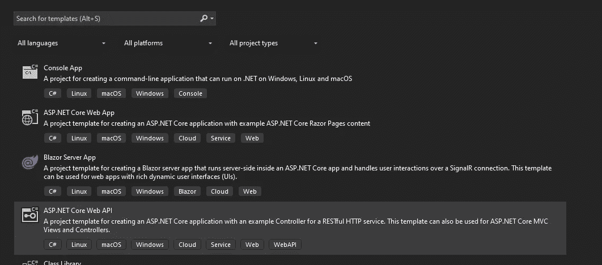

# 如何在 C#中将 PostgreSQL 连接添加到 ServiceCollection？网

> 原文：<https://levelup.gitconnected.com/how-to-add-your-postgresql-connection-to-the-servicecollection-in-c-net-106f3c1cc24d>

## 并避免在数据层编写不必要的代码

托拜厄斯·菲舍尔在 Unsplash[拍摄的照片](https://unsplash.com/photos/PkbZahEG2Ng)

我在帮助一个朋友，他最近开始学习 C#和整体编码，他在抽象 PostgeSQL 数据库连接时遇到了一些困难，这让我想起当我第一次开始编码时，这对我也是一种痛苦。

因此，我决定带领大家创建一个. NET API 项目并实现一个数据库连接，然后我们可以将它添加到 ServiceCollection 中，并通过我们的应用程序重用它。

1.  **创建新的。NET 项目**

首先，我们需要创建一个. NET 项目。

我们可以创建一个空文件夹并打开终端，然后输入以下命令:

`dotnet new webapi -n <name>`

或者，我们可以打开 Visual Studio，单击“创建新项目”并选择“Web API”。

**2。添加数据库连接类**

在这个例子中，我们将忽略文件夹结构，因为我们只是想看看如何创建一个数据库类。为此，我们首先需要创建一个"***IPostgreSQLConnection***"接口和一个继承该接口的"***PostgrSQLConnection***"类。

在类中我们要粘贴下面的代码:

这个类的作用是让构造函数接受"***【connectionString "***"，然后使用该字符串创建一个到数据库的新连接。

“***ExecuteSqlCommand***”方法接收命令，打开连接，执行查询，然后关闭连接。这里没什么特别的，因为这是你在与数据库通信时要做的标准事情，但是我们只是把它抽象成了这个类。

“***IPostgreSQLConnection***”看起来会是这样的:

**3。更新 Startup.cs 和 Program.cs**

开箱后，应用程序将只附带“ ***Program.cs*** ”，因此我希望您创建一个名为“ ***Startup.cs*** ”的新文件，并将代码更改为如下所示:

还有“***program . cs***”——

最后，打开应该已经存在的 appsettings.json 文件，并将其更新为如下所示:

让我们回退一点，解释一下我们做了哪些更改。

在 appsettings.json 中，我们所做的只是添加了“***connection strings***”并在其中放置了 PostgreSQL 连接字符串，因此，如果数据库、密码或任何其他内容与您不同，请务必更新您的值。

然后，我们将逻辑从" ***Program.cs*** "移到 Startup.cs，并留下" ***WebHostBuilder*** "这是一个静态类，帮助我们将功能添加到我们的。NET 应用程序。它为我们提供了一种创建实例的简单方法。

然后在 Startup.cs 中的大部分代码来自于初始的" ***Program.cs*** "我们在创建应用程序后，使用了"***icon configuration***"接口，这样我们就可以从"***appsettings . JSON***"文件中访问"***PostgreSQLConnectionString***"并使用它成功连接到数据库

**4。在你的应用中使用**

最后，我们只需要将它注入我们的数据访问层。为了举例，我把它放在了我的控制器中，向你展示如何使用它。

这里所发生的是我们在第 11 行创建变量，并把我们用构造函数创建的"***PostgreSQLConnection***"赋给它。

然后，在方法本身中，我们只需编写一个查询，并使用前面的“***ExecuteSqlCommand***”来为我们完成这项工作。

## 结论

我真的希望，如果你在旅程的早期还在与抽象作斗争，你会发现这很方便。我也在考虑是否应该使用 Linq2db 或 EntityFramework，但决定不把这篇文章写得太长，但如果您想使用这两者中的任何一个来看这篇文章，我很乐意写另一篇文章。

如果你喜欢这篇文章，并且想加入 Medium，请随意使用我下面的推荐链接。

 [## 通过我的推荐链接加入 Medium-Ivan Stoev

### 你好，如果你对软件开发有热情，那你来对地方了！您的会员资格将直接…

medium.com](https://medium.com/@ivan.zstoev/membership)