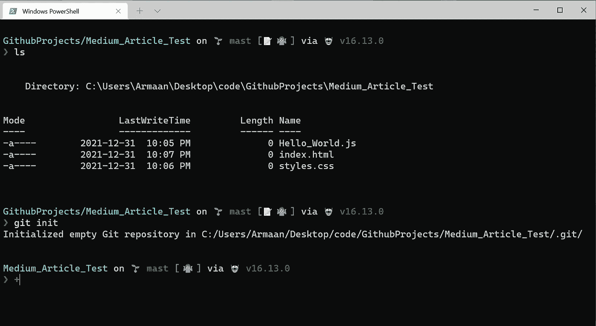

# 如何将你的项目添加到 GitHub？

> 原文：<https://levelup.gitconnected.com/how-to-add-your-project-to-github-a491c6edc4e4>

图片来自 [GitHub](https://github.com/)

首先什么是 GitHub，你为什么要使用它？

**GitHub 是一个供开发人员协作开发代码的网站。**然而，对于刚刚起步的人来说，简单地将你的编码项目存储在那里就足够了。然后，以后你可以向未来的雇主炫耀或与他人分享。我建议将几乎所有完成的项目都存储在 GitHub 上，以帮助自己创建一个在线开发人员的形象。

添加已完成或仍在进行中的现有项目似乎是一项艰巨的任务，但实际上，在做了很多次之后，这并没有那么糟糕。我会告诉你我实际上是怎么做的，而且不会出错。

1.  安装 Git。

*   Git 不同于 GitHub，因为它位于您的本地计算机上，您可以将它视为用于保存您的进度的存储卡。同样的，你可以在电子游戏中保存你的进度。
*   首先，要检查 Git 是否已经安装在您的计算机上，请打开您的终端。这将是命令提示符或 PowerShell (Windows)或终端(Mac ),键入`git --version`,您应该会看到类似如下的内容:

Windows PowerShell Git 版本

Mac 终端 Git 版本

*   然而，如果没有安装，请转到 [*这里*](https://gitforwindows.org/) 在 Windows 上安装 Git，下载后按照步骤安装。对于 Mac，您应该已经安装了 git，但是如果没有，请转到 [*这里*](https://sourceforge.net/projects/git-osx-installer/files/git-2.23.0-intel-universal-mavericks.dmg/download?use_mirror=autoselect) 来安装 Git，然后按照下载后的步骤进行安装。

2.[在这里设置一个 GitHub 账号](https://github.com/)。我建议把你的用户名作为你的真实姓名。

3.登录后，在右侧顶部找到加号(+)按钮，然后单击它。这将打开下拉菜单，然后单击“新建存储库”。

4.单击 new repository 后，您应该会看到与下图非常相似的内容。继续为您的存储库命名，以描述您正在创建的项目。

我建议现在不要勾选其他选项，保持你的库是公开的，除非你知道你想要它是私有的。您可以随时在以后更改隐私，添加一个自述文件。gitignore 文件和一个许可证文件。

*在最底部你可以看到* ***主*** *而不是* ***主*** *作为默认分支。我知道这是 GitHub 最近做的新改变，没有什么不同。因此，每当我写* ***主*** *你就会写* ***主。***

一旦你对你的库名满意了，点击底部的绿色按钮“创建库”。

5.然后，您将看到这样一个页面:

快速入门指南，您可以按照它将您的项目推送到 GitHub。

6.打开 Windows PowerShell 或 Mac 终端，导航到项目文件夹。然后，我们将按照标题为“…或在命令行上创建一个新的存储库”的第一个灰色框中的步骤进行操作

*   一旦你进入你的项目文件夹，输入 **git init** 。
*   要知道你是否在你的项目文件夹中，像我下面做的那样键入 **ls** ，你将能够看到你的项目文件被列出。如果你不知道如何将 cd 放入一个文件夹，请参考我之前关于初学者使用命令行的帖子。

git 初始化

*   接下来键入 **git add。**将项目文件夹中的所有文件添加到 Git

git 添加

*   下一个类型**git Commit-m " My First Commit "**在项目历史中的特定时间创建当前存储库的快照。如果你想回去弄清楚你过去做了什么，这是很重要的。

git 提交

*   接下来，键入 **git branch -M master** (或者在一些新的情况下，它可能是 **main** 而不是 **master** 。请参考 GitHub 命令行设置中的第一个灰色框，以获得准确的分支名称。

git 分支

*   接下来键入**git remote add origin**[**https://github . com/YourGitHubUserName/Your _ Repository _ name . git**](https://github.com/YourName/Your_Repository_Name.git)这将把你电脑上的项目文件夹链接到 GitHub。

git 远程添加原点

*   最后，键入 **git push -u origin master** 将您的项目文件夹从您的计算机推送到 GitHub。注意，如果上面有**主**，那么用主替换**主**，否则保留主**主**。****

git push -u 原始主机

*   要检查它是否工作，回到你的 GitHub 账户，点击你的 GitHub 用户名旁边的库名，查看你推送的更改。

成功了，成功了！我们可以看到我电脑里的文件现在被推送到我的 GitHub 账户

万岁，你成功地将你的第一个项目推送到 GitHub！现在，如果我们想对项目中的文件进行一些更改，并让 GitHub 根据这些新的更改进行更新，该怎么办？

要做到这一点，我们需要三个命令: **git add，git commit，**和 **git push** 。

下面是我如何将一个包含图片的媒体文件夹添加到 GitHub，这样其他人就可以看到我使用的图片并下载它们。

1.  在你的命令行和项目文件夹中，你输入了之前所有的命令，比如 git init，输入 **git add。**将您的所有文件保存到 Git。
2.  在我们将项目保存到 Git 之后，我们想用描述性文本将它们提交给 Git。这看起来像是 git commit -m“创建的图像文件夹，包含 html 和 css 文件中使用的图像。”
3.  现在我们已经发布了 commit，我们想把它推送到 GitHub，这样其他人就可以看到它了。这是通过 **git 推送完成的。**
4.  ***奖金*** :输入 **git log** 查看你保存的修改。

如果你对我刚才所做的感到困惑，这里有一个视频，展示了我将媒体文件夹添加到 Git，然后将其推送到 GitHub 的确切工作流程:

git 添加、git 提交、git 推送工作流，用于向 GitHub 添加新文件和/或文件夹

成功了！这是最终的结果。

# 结论:

好了，你已经完美地将你的第一个项目推向了 GitHub！您现在还可以更新您的项目代码，然后将这些更新添加到 GitHub 中。在 GitHub 上工作并熟悉 Git 将打开一个充满可能性的世界。一如既往地感谢你阅读这篇文章，我希望我能帮助你学到一些新的东西，请分享并点击下面的按钮。