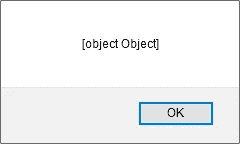
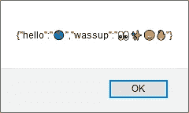
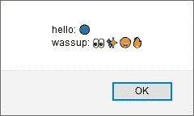

# 如何使用 Alert()警告 JavaScript 对象

> 原文：<https://levelup.gitconnected.com/how-to-alert-a-javascript-object-using-alert-6edb4c15e665>

## 下面是如何使用 JavaScript 中内置的`alert()`、`confirm()`或`prompt()`函数输出对象的内容。

照片由[格雷格·罗森克](https://unsplash.com/@greg_rosenke?utm_source=medium&utm_medium=referral)在 [Unsplash](https://unsplash.com?utm_source=medium&utm_medium=referral) 上拍摄

> "方法显示一个警告对话框，带有可选的指定内容和一个 OK 按钮."— [MDN 文档](https://developer.mozilla.org/en-US/docs/Web/API/Window/alert)

我记得`[window.alert()](https://developer.mozilla.org/en-US/docs/Web/API/Window/alert)`曾是一个受欢迎的网站功能——尽管我从未见过`[window.confirm()](https://developer.mozilla.org/en-US/docs/Web/API/Window/confirm)`或`[window.prompt()](https://developer.mozilla.org/en-US/docs/Web/API/Window/prompt)`被广泛使用。

当然，`[window.alert()](https://www.freecodecamp.org/news/how-to-build-a-javascript-alert-box-or-popup-window/)`创建了一个带有 OK 按钮的 JavaScript 弹出窗口(技术上来说[是一个“模态”窗口](https://medium.com/@nerdplusdog/a-how-to-guide-for-modal-boxes-with-javascript-html-and-css-6a49d063987e)，与[弹出广告](https://medium.com/@info_15031/the-death-of-pop-ups-do-they-still-work-for-mobile-and-desktop-92cee2c68861)形成对比)。

这可以用来提醒用户一些信息，当在 [vanilla JS](https://snipcart.com/blog/learn-vanilla-javascript-before-using-js-frameworks) 中快速工作时，它有时对快速调试很有用。

类似地，`window.confirm()`创建了相同的模态，但是带有 OK 和 cancel 按钮。同时，`window.prompt()`提示用户输入，作为函数的返回值返回给程序。

顺便说一句，创建弹出窗口的一种更现代的方式是像[sweet alert 2](https://sweetalert2.github.io/)([GitHub](https://github.com/sweetalert2/sweetalert2)，npm)这样没有依赖关系的库:

 [## SweetAlert2

### 正常警报显示正常警报显示成功消息 SweetAlert2 (@limonte)的作者正在寻找短期的…

sweetalert2.github.io](https://sweetalert2.github.io/) 

但是，假设您有一个想要在 JavaScript 警告中输出的对象，您会怎么做呢？

正如我在关于[如何将一个对象记录到 JavaScript 控制台](/5-ways-to-log-an-object-to-the-console-in-javascript-7b995c56af5a)的文章中所讨论的，调用`alert(object)`会导致一个`[object Object]`警告:

`alert({hello: “🌎”, wassup: “👀✨😍🔥”})`的结果

(注意`window.alert()`和`alert()`在你的网络浏览器中是可以互换的，就像`[console.log()](https://developer.mozilla.org/en-US/docs/Web/API/Console/log)`和`[window.console.log()](https://developer.mozilla.org/en-US/docs/Web/API/Window/console)`一样。)

> 在默认的浏览器 JavaScript 环境中，`window`是一个引用全局对象的全局对象，它也是窗口对象— [JSON.stringify()](https://medium.com/u/93b18d6cf36e#Description)警告该对象是非常容易的:
> 
> 
> 
> `alert(JSON.stringify({hello: “🌎”, wassup: “👀✨😍🔥”}))`的结果
> 
> 使用`[JSON.stringify()](https://medium.com/javascript-in-plain-english/how-to-use-stringify-and-parse-in-javascript-6b637b571a32)`也适用于`confirm()`和`prompt()`。
> 
> 另一个选项是使用 [ES6 函数](https://caniuse.com/#feat=object-entries) `[Object.entries()](https://developer.mozilla.org/en-US/docs/Web/JavaScript/Reference/Global_Objects/Object/entries)`以您喜欢的方式处理对象，然后警告结果:
> 
> 
> 
> `alert(resultString)`的结果
> 
> 使用`Object.entries()`排除继承的属性，功能上等同于[使用](https://developer.mozilla.org/en-US/docs/Web/JavaScript/Reference/Global_Objects/Object/hasOwnProperty#Iterating_over_the_properties_of_an_object) `[for...in](https://developer.mozilla.org/en-US/docs/Web/JavaScript/Reference/Global_Objects/Object/hasOwnProperty#Iterating_over_the_properties_of_an_object)` [循环](https://developer.mozilla.org/en-US/docs/Web/JavaScript/Reference/Global_Objects/Object/hasOwnProperty#Iterating_over_the_properties_of_an_object)和`[Object.getOwnPropertyNames()](https://developer.mozilla.org/en-US/docs/Web/JavaScript/Reference/Global_Objects/Object/getOwnPropertyNames)`或`[Object.prototype.hasOwnProperty()](https://developer.mozilla.org/en-US/docs/Web/JavaScript/Reference/Global_Objects/Object/hasOwnProperty)`检查:
> 
> 使用`[Object.getOwnPropertyNames()](https://developer.mozilla.org/en-US/docs/Web/JavaScript/Reference/Global_Objects/Object/getOwnPropertyNames)`基本等同于`Object.keys()`——除了`Object.keys()` [只返回可枚举属性](https://stackoverflow.com/a/22658584)。

# 结论

由于`alert()`、`confirm()`和`prompt()`需要一个字符串，所以向这些方法输出对象需要将对象转换成字符串。

`JSON.stringify(object)`是最直接的方法，但是使用`Object.entries(object)`手动创建一个字符串可以给你更多的控制。

如果你正在用`alert()`调试一个 JavaScript 对象，备选方案包括`Console.table()`(这里讨论的)，或者使用`[debugger](https://developer.mozilla.org/en-US/docs/Web/JavaScript/Reference/Statements/debugger)`设置一个[断点](https://developer.mozilla.org/en-US/docs/Tools/Debugger/How_to/Set_a_breakpoint)。

但是如果你需要使用内置的`alert()`、`confirm()`或`prompt()`函数输出一个对象的内容，我希望这篇文章能有所帮助！

编码快乐！😄💻💯

德里克·奥斯汀博士是《职业规划:如何在 6 个月内成为成功的 6 位数程序员》一书的作者，该书现已在亚马逊上出售。