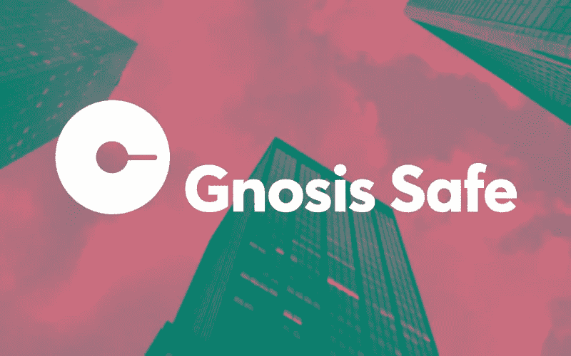
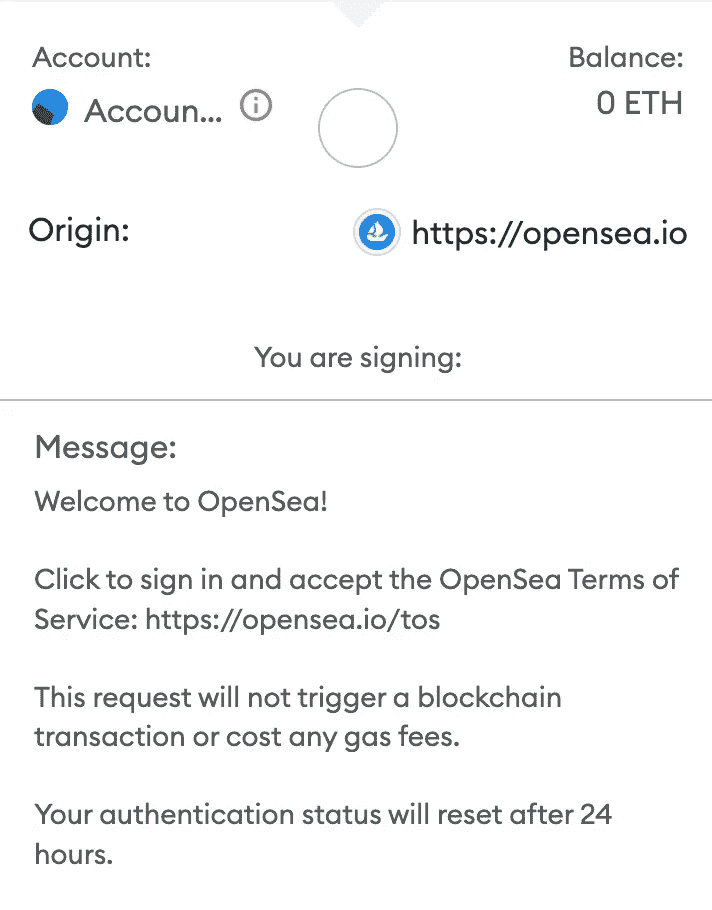
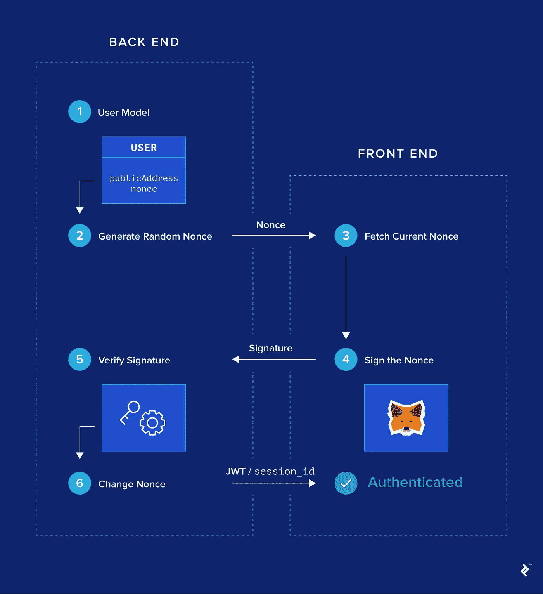
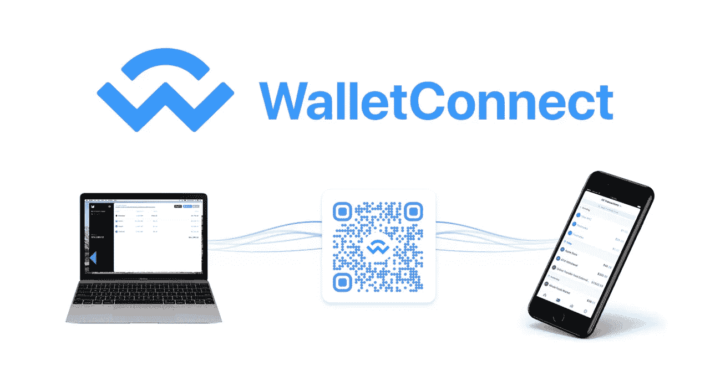

# 如何允许 multisig 钱包使用 ERC-1271 对您的 Dapp 进行认证。

> 原文：<https://levelup.gitconnected.com/how-to-allow-multi-sig-wallets-to-authenticate-with-your-dapp-8f8a74e145ea>

[EIP-1271](https://eips.ethereum.org/EIPS/eip-1271) 定义了一种通过智能合同验证签名的方法，这些通常是多签名(multisig)钱包，如 [Gnosis](https://medium.com/u/e7281ad70ea?source=post_page-----8f8a74e145ea--------------------------------) [Safe](https://gnosis-safe.io/) ，不幸的是，一些网站，如 [OpenSea](https://medium.com/u/f0501554b76a?source=post_page-----8f8a74e145ea--------------------------------) 不喜欢 multisig 钱包，或不想允许 multisig 钱包登录，即使它简单而安全。



[https://www . cryptotimes . io/gnosis-safe-is-rebranded-to-safe-with-100m-fund raise/](https://www.cryptotimes.io/gnosis-safe-is-rebranded-to-safe-with-100m-fundraise/)

所以在这篇文章中，我将解释 multisig 钱包是如何工作的，为什么它们对 web3 团队或 DAO 来说很棒，以及如何让他们轻松地登录到您的网站。

## 契约如何“签署”消息？

在某些应用程序中，当您希望连接一个钱包时，您可能必须签署一条消息，这条消息向应用程序的后端证明您就是您所说的那个人，签名需要一个私钥，当使用恢复算法进行检查时，验证方将知道是谁签署了这条消息。



问题是，multisig 钱包是一个智能合约，智能合约没有私钥，不能签署消息，但是，由于有了 [EIP-1271](https://eips.ethereum.org/EIPS/eip-1271) ，它们可以验证消息，这允许它们将签名委托给一个或多个外部拥有的帐户(像 Metamask 这样的普通钱包)。

这是 ERC1271 契约的样子，它实现了在 [EIP-1271](https://eips.ethereum.org/EIPS/eip-1271) 中定义的“ **isValidSignature** ”功能，这是主要的东西，但是它还需要 3 个签名才能将签名的消息视为有效，纯粹作为一个实现，这是一个有缺陷且未经测试的实现，但它看起来可能是这样的:

## 钱包验证通常如何工作

让我们来看看这个图表，它解释了一个常见的 web3 身份验证流程是如何工作的:

1.  服务器生成一个 nonce，一个供用户签名的随机文本。
2.  用户用他们的钱包签署了 nonce。
3.  服务器使用 errcover 验证签名，以确认它是用正确的钱包签名的。
4.  服务器给出一个令牌(通常是 JWT)，用于与网站和服务进行交互。



[https://www . top tal . com/ether eum/one-click-log in-flows-a-meta mask-tutorial](https://www.toptal.com/ethereum/one-click-login-flows-a-metamask-tutorial)

这很简单，对大多数 web3 开发者来说可能是常识，但并不完整。
很容易理解为什么合同钱包通不过这一关，因为他们不能签名，后台永远不会验证他们的签名。

## 如何才能让智能合约的钱包验证发挥作用？

很简单，看上图中的第(5)步，我们应该向合同提出请求，并检查签名是否得到它的批准。

下面是一个使用 ethers 的 javascript 示例:

1.  我们检查签名者是钱包还是合同。
2.  对于合同，我们通过将合同称为 ERC1271 来验证签名。
3.  对于 EOA，我们通常验证签名。

## 钱包方面的东西呢？

幸运的是，我们有一个统一的钱包认证解决方案，它是免费的，简单的，开源的，支持几乎任何开箱即用的钱包，包括[智能合约钱包](https://docs.walletconnect.com/smart-wallets)，所以只要你的网站支持[钱包连接](https://walletconnect.com/)，你就基本上完成了这方面的工作。



[https://stee MIT . com/utopia-io/@ divine-sound/wallet connect-open-protocol-for-connecting-wallet-to-dapps](https://steemit.com/utopian-io/@divine-sound/walletconnect-open-protocol-for-connecting-wallets-to-dapps)

为智能合约创建 WalletConnect 客户端非常简单，我将在以后的文章中介绍，但是大多数合约钱包都有自己的客户端，例如， [gnosis safe](https://help.gnosis-safe.io/en/articles/4356253-walletconnect-safe-app) 。

# 下一步怎么样

实际上，我写这篇文章是因为我想使用 gnosis safe，但我对 [OpenSea](https://medium.com/u/f0501554b76a?source=post_page-----8f8a74e145ea--------------------------------) 不支持 EIP-1271 契约作为钱包感到非常失望，正如你所见，这非常简单，它支持区块链上进一步的去中心化和匿名，同时允许团队和 DAO 在 web3 项目上安全地协作。

Gnosis 试图让它在 2021 年发生[在 Twitter 上](https://twitter.com/gnosissafe/status/1443943899194593281)。
8 个月前，围绕它的 [OpenSea](https://medium.com/u/f0501554b76a?source=post_page-----8f8a74e145ea--------------------------------) 社区上有一个 [Reddit 帖子](https://www.reddit.com/r/opensea/comments/t4ax9h/opensea_and_gnosis_safe_via_wallet_connect/)，他们给了一些用户这样的一般回复:

```
***Multisig wallets is not currently an option offered on the OpenSea platform. However, we are constantly upgrading and adding features to improve user experience. In this case, I'll send this feedback to our product team.***
```