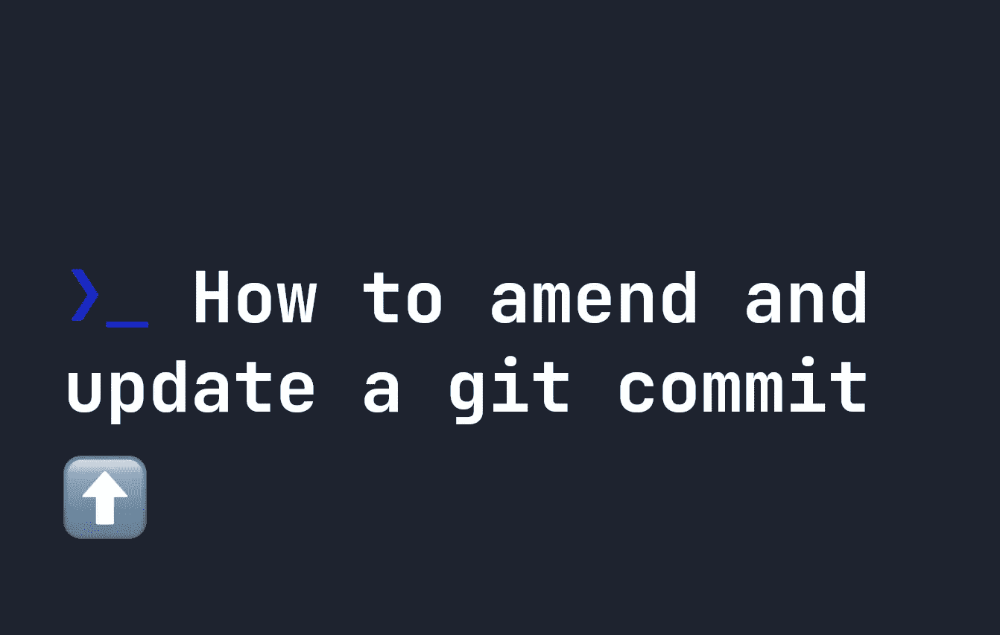

# 如何修改和更新 git 提交

> 原文：<https://levelup.gitconnected.com/how-to-amend-and-update-a-git-commit-d85d63252306>



你有没有这样跟`git commit`发`commit`消息的经历？

```
git commit -m "Fixed CSS"
```

只是为了记住你读过的数百篇关于编写“真正的”提交消息的文章，并立即后悔你的决定？如果你曾经这样做过，你可以撤销你的提交，但是更新你的 git 消息的一个更简单的方法是使用`--amend`:

```
git commit --amend -m "feat-new-ui: Updated margins by 0.25rem"
```

现在，只需将`--amend`添加到 git 命令中，就可以轻松地更新提交消息。

# git 提交的其他用途—修改

`git commit --amend`不仅可以用来修改 git 消息，还可以用来向已经提交的修改添加文件。例如，假设您忘记将文件`style.css`添加到您的提交中，但是您希望它在同一个提交中存在。

你所要做的就是使用`git add`添加文件，然后使用`git commit --amend --no-edit`将文件添加到你现有的`git commit`中。简单！

```
git add style.css
git commit --amend --no-edit
```

现在您已经提交的提交将包含文件`style.css`，并且提交的消息将保持不变。