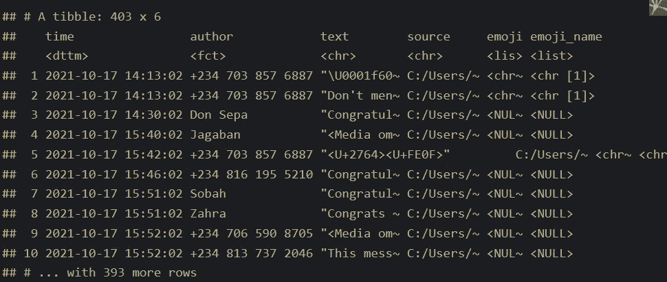
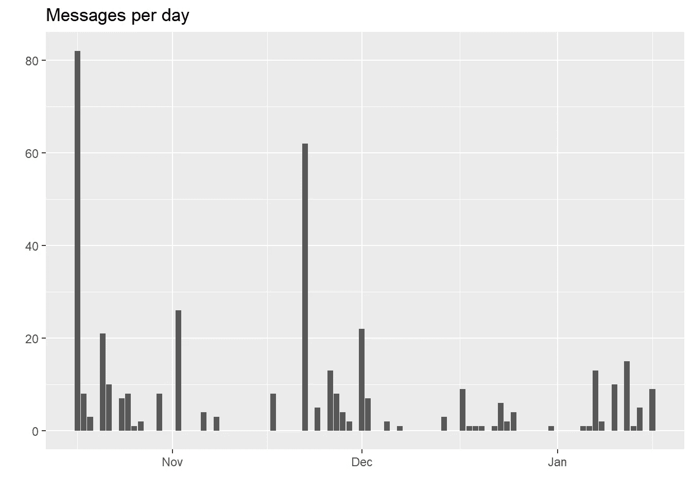
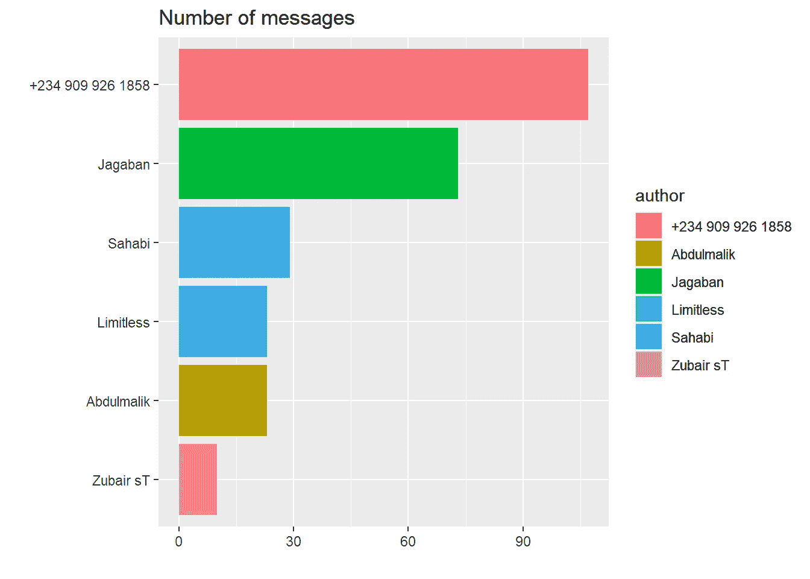
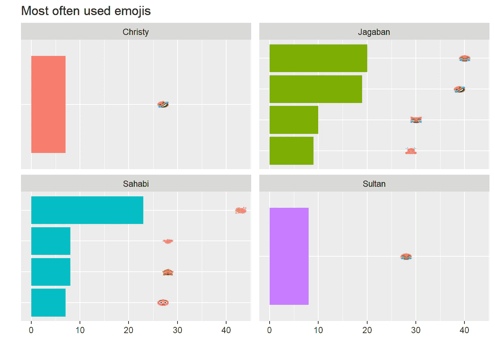
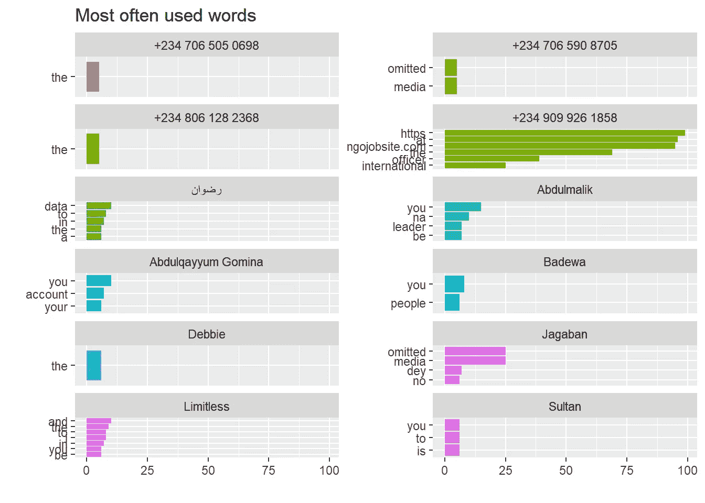
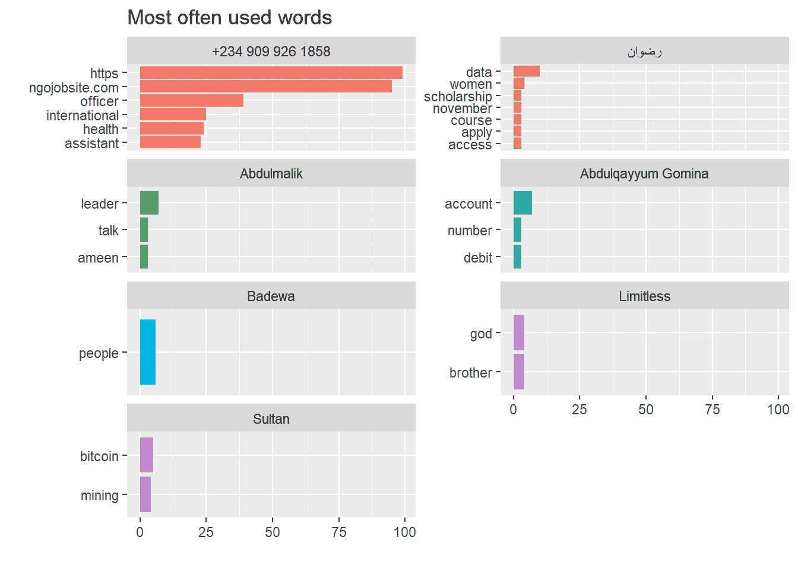
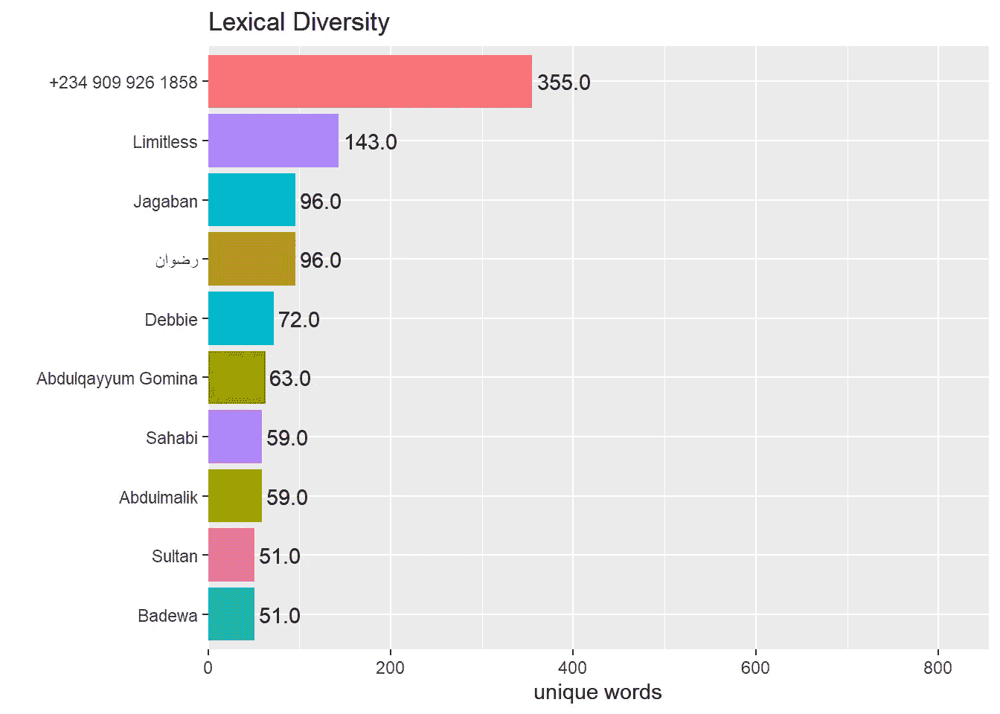
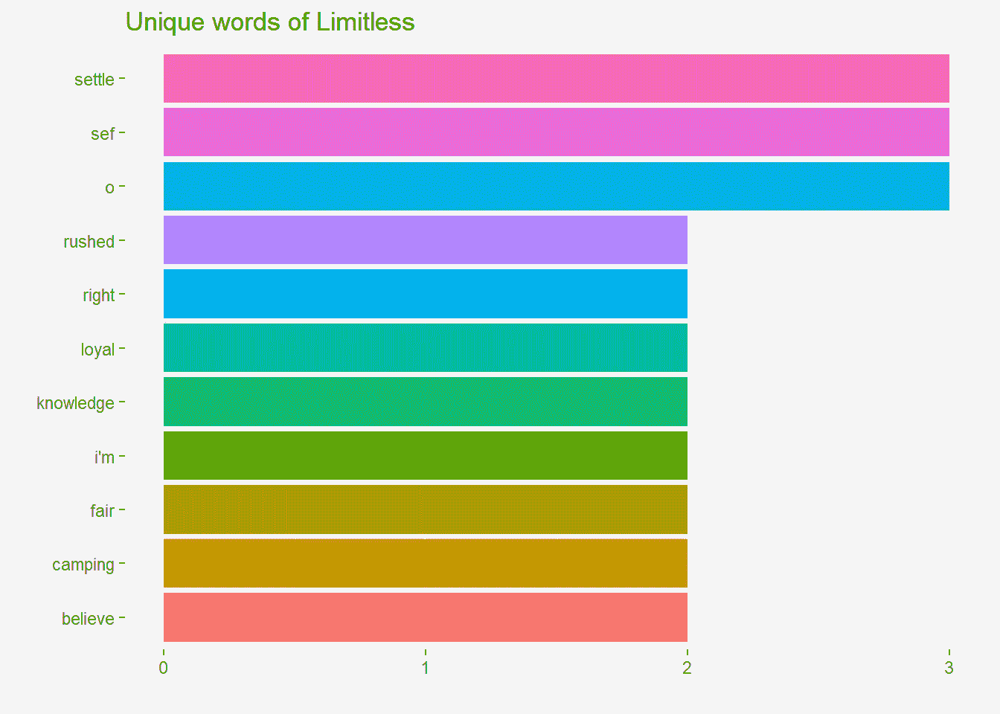

# 如何用 R 编程分析你的 Whats App 数据？

> 原文：<https://levelup.gitconnected.com/how-to-analyze-your-whatsapp-data-with-r-programming-dd6a42c1a0e0>


照片由[马頔·索洛明](https://unsplash.com/@solomin_d?utm_source=medium&utm_medium=referral)在 [Unsplash](https://unsplash.com?utm_source=medium&utm_medium=referral) 拍摄

在本帖中，我要分析一下我的部门 Whats app 聊天群*2019*统计类。多亏了一个名为`rwhatsapp`的特殊包，这允许我们在 r 中处理 Whatsapp 文本数据。我们还将使用`tidytext`包执行一些文本挖掘。

```
#load libraries library(rwhatsapp) library(tidyverse) #load data chat <- rwa_read("C:/Users/Adejumo/Downloads/whatsapp.txt") %>% #remove messages without author 
filter(!is.na(author)) chat
```



作者图片

我丢失了一些消息，这些消息实际上不止这些。我们这里只有 403 条信息。

让我们看看每天发送的消息数量。

```
chat %>% 
mutate(day = lubridate::date(time)) %>% 
count(day) %>% 
ggplot(aes(x = day, y = n)) + 
geom_bar(stat = "identity") + 
ylab("") + 
xlab("") + 
ggtitle("Messages per day")
```



最近这个团体不像以前那样活跃了。

每天发送的消息数量已经下降。

截至去年 12 月，每天发送的最大消息数不超过 20 条。似乎每个人都忙于生活(lol！).让我们看看活跃的成员。

```
chat %>% 
mutate(day = lubridate::date(time)) %>% 
count(author) %>% 
arrange(desc(n)) %>% 
head() %>% 
ggplot(aes(x = reorder(author, n), y = n, fill = author)) + geom_bar(stat = "identity") + 
ylab("") + 
xlab("") + 
coord_flip() + 
ggtitle("Number of messages")
```



一个未知号码已经发送了 90 多条信息。

Jagaban 是组管理员，正如他所期望的那样，他经常很活跃。

让我们进入有趣的部分，让我们看看这个群体中最常用的表情符号。

```
library("ggimage") emoji_data <- 
rwhatsapp::emojis %>% # data built into package mutate(hex_runes1 = gsub("\\s.*", "", hex_runes)) %>% # ignore combined emojis mutate(emoji_url = paste0("https://abs.twimg.com/emoji/v2/72x72/", tolower(hex_runes1), ".png")) chat %>% 
unnest(emoji) %>% 
count(author, emoji, sort = TRUE) %>% 
arrange(desc(n)) %>% head(10) %>% 
group_by(author) %>% 
left_join(emoji_data, by = "emoji") %>% 
ggplot(aes(x = reorder(emoji, n), y = n, fill = author)) + geom_col(show.legend = FALSE) + 
ylab("") + xlab("") + 
coord_flip() + 
geom_image(aes(y = n + 20, image = emoji_url)) + 
facet_wrap(~author, ncol = 2, scales = "free_y") + 
ggtitle("Most often used emojis") + 
theme(axis.text.y = element_blank(), axis.ticks.y = element_blank())
```



看起来最受欢迎的表情符号是`face with tears of joy`。群组管理员`Jagaban`也是发送表情符号最多的成员。来对比一下喜欢的词。

```
library(tidytext) 
chat %>% 
unnest_tokens(input = text, output = word) %>% 
count(author, word, sort = TRUE) %>% 
head(80) %>% 
group_by(author) %>% 
top_n(n = 6, n) %>% 
ggplot(aes(x = reorder_within(word, n, author), y = n, fill = author)) + 
geom_col(show.legend = FALSE) + 
ylab("") + 
xlab("") + 
coord_flip() + 
facet_wrap(~author, ncol = 2, scales = "free_y") + scale_x_reordered() + 
ggtitle("Most often used words")
```



首先，我们要做的是删除“媒体”和“省略”这两个词，这是 app 放入日志文件的占位符，而不是图片或视频。

还有一些看起来不是特别有用的词，这些词被称为停用词:没有实质意义的词，例如，and、or 等等。还有一些*洋泾浜语*也需要删除，比如 *dey* 、 *na* 等等。

洋泾浜语是尼日利亚使用的俚语，如果你以前去过尼日利亚，你就会知道我在说什么。

```
library("stopwords") to_remove <- c(stopwords(language = "en"), "media","omitted","na","2","s","u","ahni","irc","dey","3","au","mak","u","don","naa","4","6","una","b","oo","2021","go","sir") chat %>% unnest_tokens(input = text, output = word) %>% 
filter(!word %in% to_remove) %>% 
count(author, word, sort = TRUE) %>% 
head(90) %>% group_by(author) %>% 
top_n(n = 6, n) %>% 
ggplot(aes(x = reorder_within(word, n, author), y = n, fill = author)) + 
geom_col(show.legend = FALSE) + ylab("") + 
xlab("") + 
coord_flip() + 
facet_wrap(~author, ncol = 2, scales = "free_y") + scale_x_reordered() + ggtitle("Most often used words")
```



未知号码在群聊中发送更多链接，大多是来自链接名称`ngojobsite.com`的工作链接。

我们可以做的另一个文本挖掘技术是计算词汇多样性。这让我们可以看到一个作者使用了多少独特的词。

```
chat %>% 
unnest_tokens(input = text, output = word) %>% 
filter(!word %in% to_remove) %>% 
count(author, word, sort = TRUE) %>% 
group_by(author) %>% 
summarise(lex_diversity = n_distinct(word)) %>% arrange(desc(lex_diversity)) %>% 
head(10) %>% 
ggplot(aes(x = reorder(author, lex_diversity), y = lex_diversity, fill = author)) + 
geom_col(show.legend = FALSE) + 
scale_y_continuous(expand = (mult = c(0, 0, 0, 500))) + geom_text(aes(label = scales::comma(lex_diversity)), hjust = -0.1) + ylab("unique words") + 
xlab("") + 
ggtitle("Lexical Diversity") + 
coord_flip()
```



从之前的剧情中我们知道，未知号大多是分享网站链接的。

让我们看看第二位上榜的**无限**用了什么独特的词。

```
o_words <- chat %>% 
unnest_tokens(input = text, output = word) %>% 
filter(author != "Limitless") %>% 
count(word, sort = TRUE) chat %>% 
unnest_tokens(input = text, output = word) %>% 
filter(author == "Limitless") %>% 
count(word, sort = TRUE) %>% 
filter(!word %in% o_words$word) %>% # only select words nobody else uses top_n(n = 6, n) %>% 
ggplot(aes(x = reorder(word, n), y = n, fill = word)) + geom_col(show.legend = FALSE) + 
ylab("") + 
xlab("") + 
coord_flip() + 
ggtitle("Unique words of Limitless")
```



从上面可以看出，这些都是**无限**独有的词汇。

您可以对您的数据执行类似的分析，甚至做得更好。

*原载于 2022 年 1 月 16 日*[*【https://www.adejumoridwan.com】*](https://www.adejumoridwan.com/blog/analysing-whatsapp-group-chat-data/)*。*

# 分级编码

感谢您成为我们社区的一员！在你离开之前:

*   👏为故事鼓掌，跟着作者走👉
*   📰查看[升级编码出版物](https://levelup.gitconnected.com/?utm_source=pub&utm_medium=post)中的更多内容
*   🔔关注我们:[Twitter](https://twitter.com/gitconnected)|[LinkedIn](https://www.linkedin.com/company/gitconnected)|[时事通讯](https://newsletter.levelup.dev)

🚀👉 [**加入升级人才集体，找到一份神奇的工作**](https://jobs.levelup.dev/talent/welcome?referral=true)