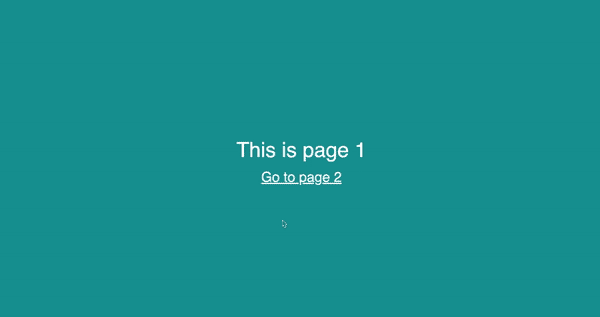

# 如何制作 React 应用程序的动画

> 原文：<https://levelup.gitconnected.com/how-to-animate-react-application-3088ae31c3e4>

读完这篇文章后，你会明白 React 中的动画是如何工作的。了解我们所拥有的所有可用工具和库，但最重要的是，您将能够开始制作自己的 React 应用程序动画。🤘

我们将回顾现实生活中的例子，并展示如何使用不同的工具和方法来制作动画。最后，你可以选择最贴近你内心的那个。❤️‍🔥

所以事不宜迟，让我们开始吧！👨‍💻

https://giphy.com[GIF](https://giphy.com/)

# 1.普通 CSS

想象我们有一个侧边栏。我们希望它打开时能顺利滑入。并且当关闭时滑出。它看起来会像这样。👇

现在，让我们来分解一下如何实现这一点。对于这个简单的例子，我们不必担心导入任何外部库。我们所需要的就是 [CSS 过渡](https://developer.mozilla.org/en-US/docs/Web/CSS/CSS_Transitions/Using_CSS_transitions)。正如 MDN 的好人会说的！🤲

> ***CSS 转场*** *提供了一种改变 CSS 属性时控制动画速度的方法。*

CSS 过渡是一个非常强大的工具，可以制作许多 CSS 属性的动画，但是`opacity`和`transform` 的效果最好。为了达到最大的平滑度，我们应该只过渡它们。

现在，让我们回到我们的例子。可以使用以下方式在 React 中实现侧栏组件。👇

还有 CSS

这种方法非常简单，实际上对于大多数情况来说已经足够了。最大的优点是它不依赖于任何外部包，使我们的最终包非常小。📦

但是更复杂的例子呢？怎么才能解决呢？我们可以使用什么工具来使我们的生活变得更容易？好吧，让我们来看看！

GIF 作者[https://giphy.com](https://giphy.com/)

# 2.反应过渡基团

假设我们有一个项目列表。每次添加新项目时，我们都希望它平滑地淡入。当它被删除时，淡出。

这样我们就不用依赖一个人的想象力了。这是它应该看起来的样子。👇

我知道你迫不及待地想看到它是如何完成的，所以我甚至懒得拖延。让我们把它分解成几块。第一部分是反应本身。在这里，我们使用了名为 [react-transition-group](https://reactcommunity.org/react-transition-group/) 的令人敬畏的库，它取自《创造者之书》。🦸

> *React 转换组公开了用于定义进入和退出转换的简单组件。它公开了过渡阶段，管理类和组元素，并以有用的方式操纵 DOM，使得实际的可视过渡的实现更加容易。*

换句话说，我们只需包装我们的 React 组件，库处理 DOM 中的项目管理。我们的 React 代码将如下所示。👇

在 CSS 中，我们只需要 t 来指定各个阶段之间的转换。注意`item-enter` `item-enter-active`和其他`item-enter-*`类的使用。它们都是由[反应-过渡-基团](https://reactcommunity.org/react-transition-group/)添加的。我认为创作者应该得到一个大大的感谢！🙏

我想说我们开始有一些乐趣，所以让我们踢它一个档次，并试图解决一个更大的动画挑战。使用另一个库，这是事情开始变得真正严重的地方。🕵️

GIF 由[https://giphy.com](https://giphy.com/)

# 3.反作用弹簧

让我们继续使用上一个例子中的列表。但是现在，我们想增强它。我们想改变一下项目的顺序。当然，我们想做得有格调。🤘

那么如何才能做到这一点呢？在名为 [react-spring](https://react-spring.io/) 的库的一点点……或者很多帮助下。

> react-spring 是一个基于 spring 物理学的动画库，应该可以满足你大部分 UI 相关的动画需求。它给你足够灵活的工具来自信地将你的想法投射到移动界面中。

这个库附带了一组实用函数，可以让我们的用户界面前所未有的活跃。你想听最精彩的部分吗？它使用声明性的方法来处理动画，这恰好是构建 UI 界面的反应方式。👍

但是够了，喋喋不休！让我们看看如何实现这个可拖动列表。这一次，我们将处理 React 中的所有内容，并使用 CSS 来提供额外的样式。✏️

最重要的是`bind`功能。当拖动一个项目时调用它，计算项目的新顺序。另一个重要部分是`fn`。返回项目样式的函数。根据它是否被拖动，所有剩余的魔法都由[反应弹簧](https://react-spring.io/)自己处理。

如你所见，CSS 本身没有提到动画。👇

这就是这个图书馆的魅力所在。正如我之前提到的，它包含许多有用的函数，涵盖所有这些函数超出了本文的范围。我强烈建议你去探索它们。或者你想让我帮你做这件事。请在评论中告诉我。💬

我感觉你已经厌倦了列举的例子。是时候进入下一页了。当我们这样做的时候，让我们在不同的动画页面之间进行转换。🎉

GIF 作者[https://giphy.com](https://giphy.com/)

# 4.框架运动

不知道你怎么想，但我真的很喜欢当网站真的想好了他们的转变。一切都是那么的流畅，那么的契合。它只是让我整天都想在页面之间转换。🤭

好的一面是，我们不必太疯狂，花几个小时试图弄清楚淡入淡出的效果。仅仅一个简单的不透明度的改变就能立刻让你的网站焕然一新。上面的例子是使用名为 [framer-motion](https://www.framer.com/motion/) 的库实现的。

> *Framer Motion 是一个面向所有创意开发人员的开源、生产就绪型库。*

那么我们如何使用它来使我们的页面左右弹跳呢？让我们来了解一下！第一件事就是用`AnimatePresence`把我们的`Router`包起来。这将使整个过渡效果成为可能。

最后，定义我们希望页面如何过渡。我们只是通过指定不同的阶段在`motion`组件中实现它。在下面的例子中，我们定义了`initial` `animate`和`exit`状态。瞧，我们的页面转换成功了。⚙️

我知道你可能会问——我们能更进一步吗？当然了。让我们看看如何制作 SVG 动画。或者换句话说……将图像带入生活。

GIF 作者[https://giphy.com](https://giphy.com/)

# 5.动画 SVG

我很确定我们都听说过 SVG，并且都使用过它。它们很容易扩展。它们看起来棒极了。但是你知道吗，我们也可以让它们变成动画？好吧，让我们试试吧！🤓

图片由 [Undraw](https://undraw.co/) 提供

有人看这幅画，看到一只猫在看树叶。冷静沉着。我看到的是向量的集合。再加上一点编辑和创造性思维。我们可以让他们反弹。🕺

让我们再一次分解它。SVG 的特点是它们只是 DOM 元素。因此，我们可以把它们做成动画。我们也可以使用`g`标签将它们分组。这使我们能够将树叶和猫分成不同的组。并分别制作动画。

利用 [Animate.css](https://animate.style/) ，我们可以快速的让整个图像按照我们想要的那样。通过简单地添加类名。

> Animate.css 是一个随时可用的跨浏览器动画库，可以在您的 web 项目中使用。非常适合强调、主页、滑块和引导注意力的提示。

为了给你一个更好的想法，通过简单地添加类`animate__animated`和`animate__shakeX`到一个`g`元素，我们可以让所有的叶子沿着 X 轴摇动。

这种方法不需要依赖任何外部工具和库。当然，我们在这个例子中使用了 Animate.css，但是你可以简单地定义你自己的动画。这需要时间和努力，但两者兼而有之。你可以取得非常惊人的成果。😎

# 🏁结论

有很多工具和库可以用来制作用户界面动画。在这篇文章中，我选择了我个人使用的。我选择了和 React 一样操作 DOM 的方法。⚛️

你从这里去哪里完全取决于你自己。你可以选择一个你最喜欢的。您可以同时结合使用多种方法。或者您可以继续研究其他工具和库。🔎

# 🙏感谢阅读

我希望你喜欢这篇文章。所有带示例的代码库都可以在 [Github](https://github.com/codewithbernard/react-animations) 获得。如果你想保持联系或者阅读类似的帖子。确保跟随我在[媒体](https://medium.com/@bernardbad)上。

# 👏喜欢，分享，评论

如果你有任何问题或顾虑。请在下面的评论中告诉我。👇