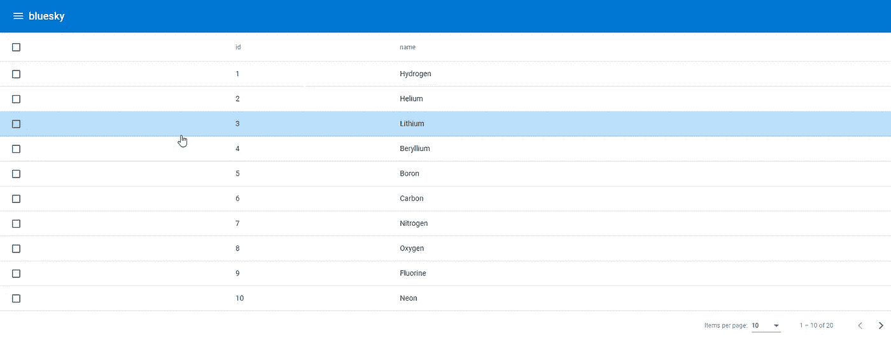

# 如何为角度组件应用材质主题颜色

> 原文：<https://levelup.gitconnected.com/how-to-apply-material-theme-colors-for-your-angular-component-eda2aeb057be>



**TLDR；**创建一个@mixin 来接收`$theme`作为参数，这样您就可以从`$theme`中获得您需要的颜色，并将其应用到您的 css 选择器中。然后将 mixin 包含到您的`styles.scss`中。

当你使用有角度的材质组件时，颜色通常是为你选择的或者像 [MatToolbar](https://material.angular.io/components/toolbar/api) 一样，有一个`color`属性供你方便地从你的主题中获得调色板。然而，有时你可能需要从你的主题调色板中添加一种颜色，但这并不容易做到。例如，当鼠标悬停在表格行上时，向表格行添加背景色。

```
.full-width-table {
  width: 100%;
}.mat-row {
  cursor: pointer;
}.mat-row:hover {
  background-color: beige;
}
```

虽然我们可以很容易地在组件的 css 中添加`.mat-row:hover` css 选择器，但是我们并不能真正从主题中获得我们想要的颜色。这个`beige`颜色可能适合你当前的主题，但是如果你的模板中有一个深色主题选择器，你可能想要一个基于用户选择的主题的不同颜色。这使得上述简单的方法并不真正有效。

为了动态地从主题中获取颜色，我们需要将 css 合并到一个`@mixin`中。一个 [Mixin](https://sass-lang.com/documentation/at-rules/mixin) 本质上是一个返回 css 样式的函数，你可以通过`@include`在你的 scss 中直接使用它。它可以接受参数，所以可以用不同的参数值动态生成 css 样式。所以我们在 scss 文件中创建了一个新的`color` @mixin 来返回`.mat-row:hover`的 css，接受一个`$theme`作为参数，我们稍后可以使用它。

```
@mixin color($theme){
  .mat-row:hover {
    background-color: beige;
  }
}.full-width-table {
  width: 100%;
}.mat-row {
  cursor: pointer;
}
```

我们可以通过 angular material 提供的`get-color-config($theme)`函数得到主题颜色配置。这个函数将返回一个 sass 地图，在这里你可以得到主题中的`primary`、`accent`、`warn`调色板。要了解更多关于角度素材中的主题，请查看我之前的帖子 [*在角度素材中定义你自己的主题*](/defining-your-own-theme-in-angular-material-8a4a6ffad400) *。sass map 就像其他编程语言中的地图或字典一样。要获得 sass 映射中的键值，我们可以使用`map.get($map, $key)`方法。因为我们使用 sass 贴图和角度材质，所以我们需要将它们包含在@use 语句中。*

```
@use 'sass:map';
@use '@angular/material' as mat;@mixin color($theme){
  // Get the color config from the theme.
  $color-config: mat.get-color-config($theme); // Get the primary color palette from the color-config.
  $primary-palette: map.get($color-config, 'primary'); .mat-row:hover {
    background-color: mat.get-color-from-palette($primary-palette, 100);
  }
}.full-width-table {
  width: 100%;
}.mat-row {
  cursor: pointer;
}
```

然而，由于`.mat-row:hover`在`@mixin`中，它不会被实现，因为`@mixin`就像一个函数，如果它没有被调用，它就不会执行，所以我们必须将它包含在我们的`styles.scss`中。但在此之前，让我们将组件 css 模块化，以分离出函数调用。

我们的组件样式最初只是`table.component.scss`，我们应该将@mixin 代码提取到一个 [partial sass 文件](https://sass-lang.com/guide#topic-4)，这样 styles.scss 中就不会再生成其余的非 mixin 代码，按照惯例，文件名应该以`-theme`为后缀，基于 partial sass 文件惯例，应该以下划线`_`为前缀。我们应该以 2 个 scss 文件结束- `_table.component-theme.scss`，

```
@use 'sass:map';
@use '@angular/material' as mat;@mixin color($theme){
  // Get the color config from the theme.
  $color-config: mat.get-color-config($theme); // Get the primary color palette from the color-config.
  $primary-palette: map.get($color-config, 'primary'); .mat-row:hover {
    background-color: mat.get-color-from-palette($primary-palette, 100);
  }
}
```

和`table.component.scss`。

```
.full-width-table {
  width: 100%;
}.mat-row {
  cursor: pointer;
}
```

最后，我们需要将新的部分 sass 文件包含到我们的`styles.scss`中。注意，我们应该省略前面的下划线`_`以及扩展名`.scss`。下面的行将导入我们的 sass 部分文件，并将其命名为`table`。

```
@use "./app/table/table.component-theme" as table;
```

然后，在`html, body` css 选择器之前的`styles.scss`中添加下面一行。

```
@include table.color($bluesky-theme);
```

> 我们使用`@use`来导入 sass 文件，使用`@include`来包含 mixin。

`table`引用 sass 部分文件，`color`是我们声明的@mixin，$bluesky-theme 是我们在`styles.scss`中作为参数传递给@mixin 的主题。

就是这样。

本文原载于[https://the coding analyst . github . io/knowledge base/How-to-apply-theme-colors-for-your-angular-component/](https://thecodinganalyst.github.io/knowledgebase/How-to-apply-theme-colors-for-your-angular-component/)。

# 分级编码

感谢您成为我们社区的一员！在你离开之前:

*   👏为故事鼓掌，跟着作者走👉
*   📰查看[升级编码出版物](https://levelup.gitconnected.com/?utm_source=pub&utm_medium=post)中的更多内容
*   🔔关注我们:[Twitter](https://twitter.com/gitconnected)|[LinkedIn](https://www.linkedin.com/company/gitconnected)|[时事通讯](https://newsletter.levelup.dev)

🚀👉 [**加入升级人才集体，找到一份神奇的工作**](https://jobs.levelup.dev/talent/welcome?referral=true)